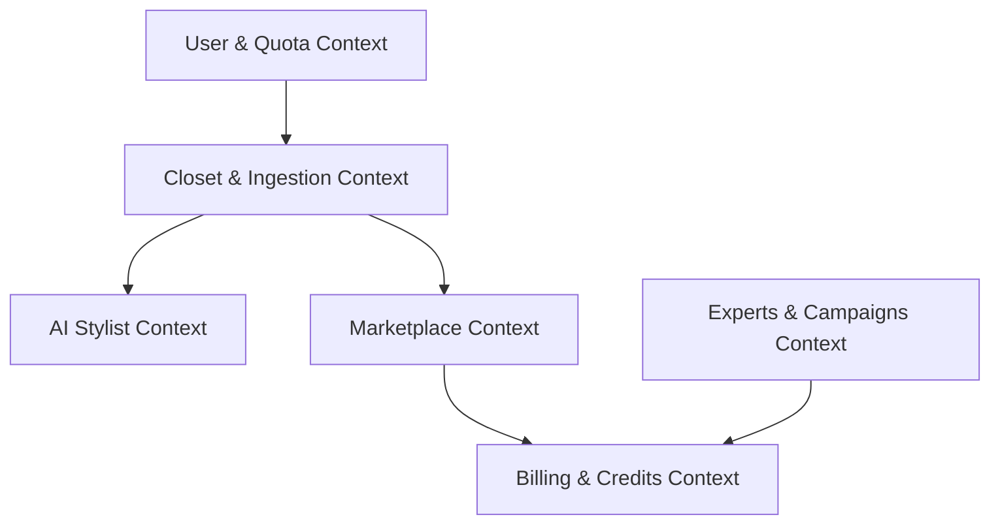

# DressApp Domain Context

This document defines the core domains, bounded contexts, and glossary of terminology for the DressApp repository, ensuring consistent naming conventions across the backend services and React frontend stores.

---

## Bounded Contexts

DressApp is structured into five distinct domain boundaries:

### 1. User & Quota Context
* **Responsibility:** User profiles, preferences (e.g., physical sizing), and subscription tier limits (150 garments ceiling for free tier, custom invite referral tracking).
* **Key Components:** [`schemas.py:User`](backend/app/models/schemas.py), [`quota_manager.py`](backend/app/services/quota_manager.py).

### 2. Closet & Ingestion Context
* **Responsibility:** Adding garments, background matting (`rembg`), clothing category segmentation (`SegFormer`), DPP QR parsing, conversational re-analysis (The Eyes), and generative inpainting/editing via Nano Banana (`gemini-3.1-flash-lite-image`).
* **Key Components:** [`clothing_parser.py`](backend/app/services/clothing_parser.py), [`background_matting.py`](backend/app/services/background_matting.py), [`dpp_parser.py`](backend/app/services/dpp_parser.py), [`gemini_image_service.py`](backend/app/services/gemini_image_service.py).

### 3. AI Stylist & Audio Context
* **Responsibility:** Outfit generation, conversational text/voice interfaces (Deepgram STT/TTS, local Piper), weather-based rules, and Google Calendar event integration.
* **Key Components:** [`gemini_stylist.py`](backend/app/services/gemini_stylist.py), [`outfit_composer.py`](backend/app/services/outfit_composer.py), [`calendar_service.py`](backend/app/services/calendar_service.py).

### 4. Marketplace Context
* **Responsibility:** Swap & sell listings, geo-fenced search queries, item listings, and secure transaction workflows.
* **Key Components:** [`listings.py`](backend/app/api/v1/listings.py), [`marketplace_search.py`](backend/app/services/marketplace_search.py).

### 5. Experts & Advertising Campaigns Context
* **Responsibility:** Directory of vetted tailors/stylists, self-serve promo campaign management, performance reports, and daily $1.00 USD ad ticker placement.
* **Key Components:** [`campaign_service.py`](backend/app/services/campaign_service.py), [`professional_matcher.py`](backend/app/services/professional_matcher.py).

### 6. Billing, Credits & Payments Context
* **Responsibility:** Processing transactions, PayPal integration, credit balance ledger, and invoice management.
* **Key Components:** [`paypal_client.py`](backend/app/services/paypal_client.py), [`pricing.py`](backend/app/services/pricing.py).

---

## Glossary of Terms

| Term | Domain | Definition |
| --- | --- | --- |
| **Garment / Closet Item** | Closet | A unique article of clothing owned by a user, cataloged with 20+ attributes (season, material, fit, color, etc.) and a background-removed image cutout. |
| **Ingestion Pipeline** | Closet | The automated pipeline that segments multiple clothes from a photo, applies matting, and auto-attributes them via Gemini. |
| **The Eyes** | Closet / Vision | The multimodal vision assistant that analyzes garment photos, clarifies user editing intent, and guides re-analysis. |
| **Nano Banana** | Vision / Inpainting | Generative image editing service powered by `gemini-3.1-flash-lite-image` for object removal, hole completion, and catalog reconstruction. |
| **DPP (Digital Product Passport)**| Closet | Standard-compliant product metadata (fabric composition, brand traceability, care instructions) parsed from QR codes. |
| **Stylist Session** | Stylist | An active chat session (text or voice) where outfit recommendations are tailored to the user's local weather and calendar events. |
| **Listing** | Marketplace | A closet item designated by a user for sale, trade, or donation on the community feed. |
| **Ad Campaign** | Experts | A self-serve advertisement set up by an expert stylist or business, billing daily via PayPal for home feed ad placement. |
| **Credits** | Billing | Pre-purchased virtual currency used to pay for premium stylist actions (such as high-quality outfit generation or Nano Banana image inpainting). |
| **GarmentVisuals** | Closet / Visuals | The deep module (`garment_visuals.py`) managing decoding, matting, fallback recovery, compression, and thumbnailing. |
| **Cutout / Clean Image** | Closet / Visuals | An isolated, transparent PNG asset (`clean_image_url`) guaranteed to have zero background for seamless layering on avatars and canvases. |
| **Transparency Invariant** | Closet / Visuals | Architectural rule enforcing that all inpainting and clean assets store transparent PNGs without background bonding boxes. |
| **StylingContext** | Stylist | The deep module (`styling_context.py`) synthesizing multi-modal grounding (wardrobe, sizing, weather, calendar, i18next) for all styling workflows. |
| **MobileClosetRepository** | Mobile / Store | The deep module (`closetRepository.ts`) managing offline AsyncStorage hydration, SWR background revalidation, optimistic mutations, and instant slot summaries. |
