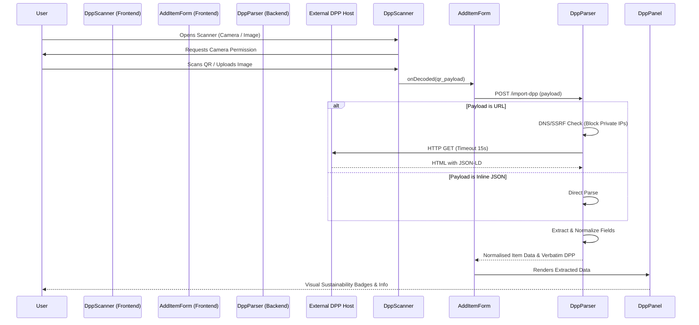

# DressApp Digital Product Passport (DPP) Integration

## 1. Executive Summary & Value Proposition

### High-Level Overview
The DressApp Digital Product Passport (DPP) ecosystem is a robust, end-to-end pipeline designed to seamlessly ingest, parse, and display EU-compliant digital product provenance. Engineered as part of the Phase V6 rollout, the architecture spans a resilient React-based frontend scanner (`DppScanner.jsx`), a highly secure Python backend parser (`dpp_parser.py`), and an elegant, fault-tolerant display panel (`DppPanel.jsx`). It is built to interpret modern pilot DPP implementations—predominantly JSON-LD `Product` schemas embedded within HTML—as well as direct JSON payloads, ensuring maximum compatibility with emerging sustainability standards.

### Architectural Flow

### User Value Proposition
- **Frictionless Onboarding**: Users can add items to their digital closet instantly by scanning a QR code, bypassing manual data entry for materials, care instructions, and brand details.
- **Sustainability Transparency**: Direct access to EU-standard sustainability metrics, including carbon footprints, country of origin, and eco-certifications, empowering mindful consumption.
- **Graceful Degradation**: Built to never fail abruptly. If a QR code is unreadable or the external server times out, the system defaults to standard manual entry without crashing the app.
- **Accessibility & Localization**: Full RTL and multi-language support out of the box, ensuring the scanner and display panels are inclusive for a global user base.

---

## 2. Comprehensive User Manual

### Visual Interface Topology

The DPP integration surfaces across two primary interface components:

1. **The Scanner Modal (`DppScanner`)**
   - **Header**: Iconography and clear titles instructing the user.
   - **Mode Toggle (Tabs)**:
     - `Camera`: Live viewfinder using the device's rear-facing camera.
     - `File`: A drag-and-drop / tap-to-upload target for scanning saved images.
   - **Footer**: A non-intrusive cancel action.

2. **The Intelligence Panel (`DppPanel`)**
   - **Header**: A stylized QrCode icon denoting "Verified DPP Data".
   - **Key/Value Grid**: Two-column layout for atomic data (GTIN, Origin, Carbon Footprint).
   - **Badge Clusters**: Wrap-around visual badges for Materials (with percentages) and Certifications.
   - **Instruction Lists**: Bulleted guides for Care and Repair.
   - **Source Link**: Deep-link to the original manufacturer's passport.

### Mode & Workflow Walkthroughs

- **Camera Mode (Default)**: Upon activation, the scanner prioritizes the environment (rear) camera. It continuously samples frames at 10 FPS. Once a QR code is detected, the camera automatically shuts down to preserve battery, and the payload is dispatched for parsing.
- **File Upload Mode**: If the user lacks camera permissions or is scanning from a screenshot, they can switch to the File tab. Tapping the dropzone opens the native OS file picker. The image is processed locally using `html5-qrcode` without being uploaded to the server, ensuring privacy and speed.

### Error Handling & Feedback
- **Camera Permissions**: If access is denied, a clear, localized `X` error state appears, gracefully offering a button to switch to File Upload mode.
- **Empty or Invalid QR**: The scanner triggers a transient error toast (via `sonner`) advising the user that no valid code was found in the image.
- **Parser Failures**: If the backend encounters a malformed payload or a network error, it returns an "empty" analysis rather than an HTTP 500. The frontend quietly ignores the missing data, allowing the user to proceed with manual entry.

---

## 3. Technology Stack & Capability Deep-Dive

### Core Orchestration & AI/Logic
The backend `dpp_parser.py` is the intelligence hub of the feature. It operates under a "best-effort, defensive parsing" philosophy:
- **Heuristic JSON-LD Discovery**: Uses `BeautifulSoup` to scrape HTML responses for `<script type="application/ld+json">` tags, recursively walking the graph to identify nodes typing as `Product`, `GarmentProduct`, or `DigitalProductPassport`.
- **Fuzzy Alias Resolution**: Maps dozens of Schema.org aliases to internal keys. For example, `materials` aggregates from `composition`, `fiberContent`, or `textileComposition`.
- **Regex-Powered Normalization**: Parses complex string definitions like `"80% cotton, 20% elastane"` into structured JSON arrays: `[{"name": "cotton", "pct": 80}, ...]`.

### Data & Context Pipelines
- **SSRF Protection (Server-Side Request Forgery)**: Before making any HTTP requests to URLs found in QR codes, the parser resolves the hostname and explicitly blocks loopback, link-local, and private network IPs using Python's `ipaddress` module.
- **Resource Constraints**: Network requests are strictly capped:
  - 15-second absolute timeout.
  - 2 MB payload ceiling for HTML documents.
  - 6 MB ceiling for importing linked product images.
- **Preservation of Verbatim Data**: While normalising data for the DressApp schema, the raw DPP graph is preserved entirely within a `dpp_data.raw` MongoDB sub-document for future-proofing and auditing.

### Frontend & Client Architecture
- **Hardware Abstraction**: `DppScanner.jsx` wraps `html5-qrcode`. It actively manages the camera lifecycle within `useEffect`, ensuring hardware locks are released instantly upon unmount or successful scans to prevent memory leaks and battery drain.
- **Defensive Rendering**: `DppPanel.jsx` employs aggressive null-checking. It evaluates whether the incoming `dppData` contains any meaningful keys. If the parser returned an error (`parse_error`), or if all fields are null, the component returns `null` and occupies zero DOM space.
- **Design System Integration**: Leverages Tailwind CSS with custom CSS variables (e.g., `hsl(var(--accent))`) to maintain dark-mode compatibility and a highly premium "glassmorphism" aesthetic without hardcoding hex values. Micro-interactions include hover states on certification badges and smooth tab transitions.
