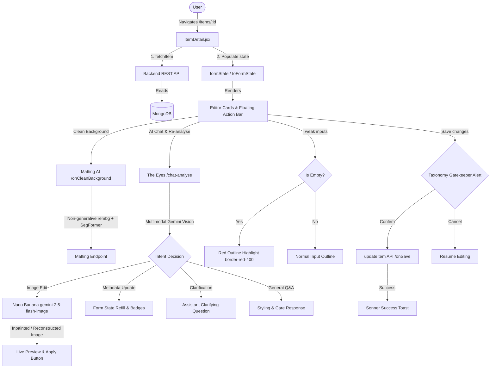

# Item Details Architecture & User Guide

This document provides a comprehensive technical overview and operational guide for the **Item Details** page (`ItemDetail.jsx`) within DressApp. It covers the user experience structure, API communication flows, AI processing utilities, Nano Banana image editing pipeline, validation schemas, and internationalization details.

---

## 1. Executive Summary & Value Proposition

### High-Level Overview
The **Item Details** panel is the central command center for managing individual garments within a user's digital wardrobe. It bridges raw visual media (photos) with semantic metadata (category, fabric composition, color weights, brand, formality level, and notes). It enables users to refine automated AI-ingestion outputs, trigger non-generative background removal (matting), run conversational vision re-analyses, execute generative inpainting and object removal with **Nano Banana** (`gemini-2.5-flash-image`), and configure circular marketplace listing options.

### Architectural Flow



### User Value Proposition
* **Interactive AI Garment Editor**: Users can prompt **The Eyes** in natural language to modify photos (*"Remove the shoes"*, *"Complete the hole where the hand was"*, *"Remove metal studs"*).
* **Studio-Grade Generative Inpainting**: **Nano Banana** repairs occluded or cropped fabrics, preserving texture, silhouette, and pattern fidelity without whole-image hallucinations.
* **Smart Clarification Dialogues**: The Eyes asks focused questions when instructions are ambiguous, avoiding unnecessary credit usage.
* **Precision Wardrobe Refining**: Simple, structured cards group attributes logically, preventing input fatigue.
* **Non-Generative Alpha Matting**: Clean background matting isolates the garment faithfully with zero generative distortions.
* **Universal 13-Locale Localization**: Seamless RTL direction mirroring and fully translated labels/hints powered by `i18next`.

---

## 2. Comprehensive User Manual

### Visual Interface Topology
The Item Details page utilizes an asymmetrical two-column layout tailored for desktop and mobile viewports:

```
+--------------------------------------------------------------------------+
|  <- (Back)                                         (Undo) (Save) (Up)    |
+------------------------------------+-------------------------------------+
| LEFT COLUMN (Visual & AI Actions)  | RIGHT COLUMN (Metadata Editor)      |
|                                    |                                     |
| +--------------------------------+ | +---------------------------------+ |
| |        GARMENT PHOTO           | | | IDENTITY CARD                   | |
| |  [Replace Photo] [Camera Slot] | | | - Title (Required)             | |
| +--------------------------------+ | | - Friendly Name                 | |
|                                    | | - Brand / Caption               | |
| +--------------------------------+ | +---------------------------------+ |
| | CLEAN BACKGROUND CARD          | |                                     |
| | - Matting AI Trigger Button    | | +---------------------------------+ |
| | - Progress Bar (Faithful Cut)  | | | TAXONOMY CARD                   | |
| +--------------------------------+ | | - Category / Sub-category        | |
|                                    | | - Item Type / Gender             | |
| +--------------------------------+ | | - Dress Code                     | |
| | RE-ANALYSE & AI EYES CHAT CARD | | | - Season Multi-Select           | |
| | - Message Thread & Preview     | | | - Tradition (with Dictation)    | |
| | - Quick Prompt Starters (Chips)| | +---------------------------------+ |
| | - Natural Language Prompt Box  | |                                     |
| | - Speech-to-Text Mic Button    | | +---------------------------------+ |
| | - 1-Click Full Re-analyse Btn  | | | COMPOSITION CARD                | |
| +--------------------------------+ | | - Size / Main Color / Pattern   | |
|                                    | | - Weighted Colors list          | |
| +--------------------------------+ | | - Weighted Fabrics list         | |
| | DPP PROVENANCE PANEL           | | +---------------------------------+ |
| | - Digital Product Passport Data| |                                     |
| +--------------------------------+ | +---------------------------------+ |
|                                    | | QUALITY & WEAR CARD             | |
|                                    | | - State / Condition / Tier      | |
|                                    | | - Repair Advice Notes           | |
|                                    | +---------------------------------+ |
|                                    |                                     |
|                                    | +---------------------------------+ |
|                                    | | PRICING & INTENT CARD           | |
|                                    | | - Price / Currency / Intent     | |
|                                    | +---------------------------------+ |
|                                    |                                     |
|                                    | +---------------------------------+ |
|                                    | | ORGANIZATION CARD               | |
|                                    | | - Formality / Tags / Notes      | |
|                                    | +---------------------------------+ |
+------------------------------------+-------------------------------------+
| [ List For Sale ]                                           [ Delete ]   |
+--------------------------------------------------------------------------+
```

### Mode & Workflow Walkthroughs

#### 1. Photo Replacement & Camera Capture
* Users can replace the garment photo using the `memberPhotoInputRef` slot. 
* Clicking **Replace Photo** opens the native file selector. Clicking **Take Photo** accesses mobile devices' cameras directly via `capture="environment"`.

#### 2. Clean Background (Non-Generative Alpha Matting)
* Non-generative matting runs in the background. A progress bar updates in real time.
* If a matting session was run previously, the action button text changes to **Clean again** (fully localized) so users can retry the background separation.

#### 3. Re-analyse Photo & AI Eyes Conversational Assistant
* **Natural Language Prompting**: Type or dictate prompts directly into the prompt box:
  * *"Remove the shoes"*
  * *"Complete the hole where the hand was"*
  * *"Remove the metal studs from the jacket's front"*
  * *"Refine fabric composition to 100% cashmere"*
* **Quick Prompt Starters**: Instant chips allow 1-tap requests (🪄 *Remove shoes*, ✂️ *Complete hole*, 💎 *Remove studs*, 🔍 *Refine fabric*).
* **Nano Banana Inpainting**: Generative requests invoke `gemini-2.5-flash-image`, rendering an in-chat preview card with an **"Apply as garment photo"** button.
* **Attribute Synchronization**: When metadata updates are requested, The Eyes automatically refreshes form fields with visual confirmation badges.
* **1-Click Full Re-analyse**: A dedicated button at the bottom of the card runs a classic 1-click auto-analysis fallback.

#### 4. Taxonomy & Composition Editor
* Weighted Lists allow users to specify percentages for color palettes (e.g., Black 100%) and materials (e.g., Polyester 80%, Rayon 20%).
* Form inputs dynamically display a red border (`border-red-400 dark:border-red-900`) if they are left empty, providing clear feedback on missing attributes.

#### 5. Speech-To-Text Dictation
* Prompt box and metadata fields (like **Tradition**) support voice dictation. Clicking the microphone icon activates the Web Speech API browser listener with localized language detection (`user.preferred_language`).

---

## 3. Modals & Dialogs

### 1. Closet Item Picker Dialog (`addOpen`)
* **Purpose**: Allows users to associate other wardrobe garments with this item (e.g., matching suits, inner linings, or sets).
* **Structure**: A scrollable list of other closet items with checkboxes.
* **Layout**: Displays inside a glassmorphic container (`glassmorphic border-white/20`) configured to scale on mobile screens (`max-h-[90dvh]`).

### 2. Taxonomy Gatekeeper Warning Dialog (`gatekeeperOpen`)
* **Purpose**: Prevents unintended layout misclassifications. Triggers if the user changes the garment's root Category (e.g., Top to Bottom) or changes the item Type to something mismatching the parent category.
* **User Options**:
  * **Confirm**: Proceeds with the category change and adapts metadata fields.
  * **Cancel**: Aborts change and restores original category state.

### 3. Delete Confirmation Alert Dialog (`AlertDialog`)
* **Purpose**: Prevents accidental garment deletion.
* **Actions**:
  * **Cancel**: Dismisses dialog.
  * **Delete**: Removes the item using an optimistic UI update, instantly navigating the user back to the Closet while the delete request is processed in the background.

---

## 4. Technology Stack & Capability Deep-Dive

### Microservice & AI Orchestration
* **Multimodal Decision Pipeline (`POST /api/v1/closet/{item_id}/chat-analyse`)**:
  - Uses `GeminiClient` (`Interactions API`) to evaluate image bytes, metadata context, and conversation history.
  - Automatically routes to `image_edit`, `clarification`, `metadata_update`, or `answered`.
* **Nano Banana Inpainting Engine (`GeminiImageService.edit`)**:
  - Employs `gemini-2.5-flash-image` with visual conditioning from original/segmented pixels.
  - Deducts 1 AI credit via `deduct_user_credits` on image generation calls.
* **Form & State Management**:
  - Handled via local React state (`form` object). Changes trigger `setField(key, value)`.
  - Preview images remain in-memory until the user explicitly clicks the **Save** button to persist to MongoDB.
* **Universal 13-Locale Synchronization**:
  - Complete JSON coverage across `en`, `he`, `ar`, `de`, `fr`, `es`, `it`, `nl`, `pt`, `ru`, `hi`, `ja`, and `zh`.
  - Full RTL direction mirroring with Tailwind logical spacing (`ms-auto`, `me-1.5`, `start/end`).
