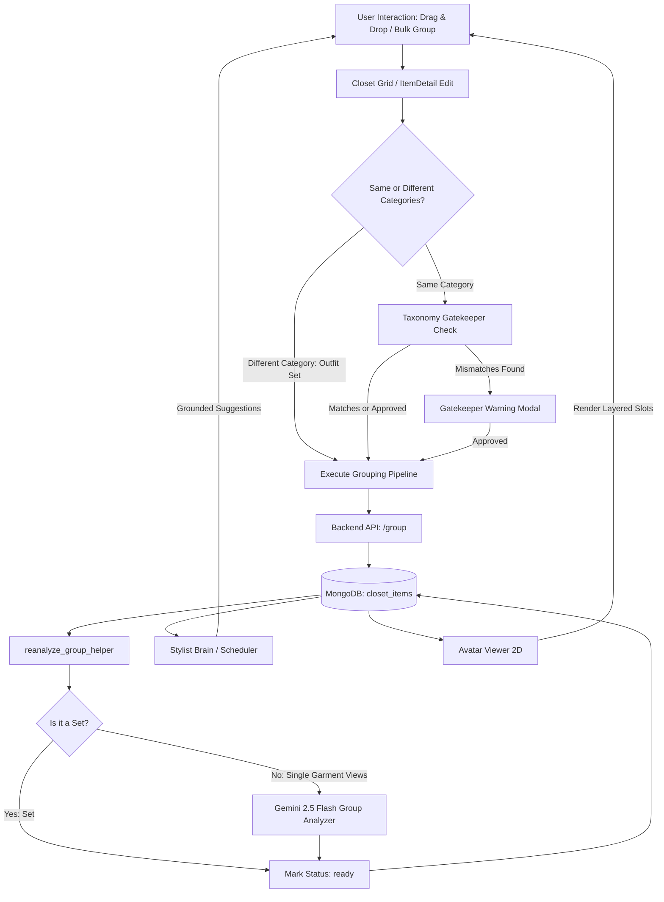

# Item Grouping & Outfit Sets Feature Summary

The **Item Grouping** feature in DressApp allows users to bundle multiple photographs of garments into a single logical unit. This feature handles two distinct use cases based on garment categories:
1. **Single Garment Views:** Bundling different views of the same physical garment (e.g., front view, back view, profile view, and details).
2. **Outfit Sets (Ensembles):** Bundling different physical garments of different categories (e.g., a three-piece suit comprising a blazer, trousers, and vest) to form a full-body ensemble.

---

## 1. Executive Summary & Value Proposition

### High-Level Overview
Item Grouping optimizes the user's digital wardrobe by minimizing clutter in the closet grid while maximizing the detail and context available to the avatar rendering engine and the Stylist Brain. By distinguishing between **Single Garment Views** (homogenous category) and **Outfit Sets** (heterogenous categories), the system provides seamless grouping with zero-overhead configuration.

### Architectural Flow



### User Value Proposition
* **Clean Closet Grid:** Only the primary/cover card (the host) of any group or set is visible in the closet, keeping the wardrobe grid organized and easy to scan.
* **Auto-Recognition:** Dragging items of different categories together automatically forms an Outfit Set, bypassing standard taxonomy warnings and gatekeeper dialogs.
* **Automatic Avatar Dressing:** Adding an Outfit Set to the avatar instantly dresses the mannequin in all constituent garments (e.g. blazer in outerwear slot, trousers in bottoms slot).
* **Flexible Planning:** Outfit Sets can be divided into individual garments when planning or constructing outfits, allowing users to customize their rotation.

---

## 2. Comprehensive User Manual

### Visual Interface Topology

```
+-----------------------------------------------------------------+
|                        CLOSET GRID                              |
|                                                                 |
|  +-----------------------+     +-----------------------+        |
|  | [Image: Blazer Cover] |     | [Image: Single Shirt] |        |
|  |                       |     |                       |        |
|  | Title: Tuxedo Suit    |     | Title: Linen Shirt    |        |
|  | [Outfit set]          |     |                       |        |
|  | Outerwear·Bottom·Top  |     | Top · White           |        |
|  +-----------------------+     +-----------------------+        |
|                                                                 |
+-----------------------------------------------------------------+
|                  OUTFIT COMPLETION SHEET                        |
|                                                                 |
|  Anchors:                                                       |
|  +-----------------------+     +-----------------------+        |
|  | (1) [Blazer Cover]  X |     | (2) [Linen Shirt]   X |        |
|  |                       |     |                       |        |
|  |    [Divide Set]       |     |                       |        |
|  +-----------------------+     +-----------------------+        |
|                                                                 |
+-----------------------------------------------------------------+
```

### Mode & Workflow Walkthroughs
1. **Creating a Single Garment Group:**
   - Drag an item onto another item of the same category (e.g. front view of T-shirt onto back view of T-shirt).
   - The **Taxonomy Gatekeeper** checks for metadata conflicts. If attributes differ, a warning is shown.
   - Upon completion, a background task sends the images to the vision model to consolidate tags.
2. **Creating an Outfit Set:**
   - Drag an item onto another item of a different category (e.g. blazer onto trousers).
   - The system recognizes the different categories, skips the gatekeeper, and immediately groups them as an **Outfit Set**.
   - The card in the closet displays an `Outfit set` badge and lists all constituent categories (e.g., "Outerwear · Bottom · Top").
3. **Constructing Outfits with Sets:**
   - Select the Outfit Set in the closet and click "Complete outfit".
   - The Outfit Set appears as a single anchor in the completion sheet.
   - Click **"Divide Set"** to replace the set cover with its individual garments.
   - Use the **"X"** button on any of the divided garments to remove components from the planning list.

---

## 3. Technology Stack & Capability Deep-Dive

### Core Orchestration & AI/Logic
* **Category Normalization:** The system normalizes categories before comparison to ensure robust matching:
  ```javascript
  const normCategory = (cat) => {
    const s = String(cat || '').trim().toLowerCase().replace(/\s+/g, '_');
    if (s === 'top' || s === 'tops') return 'top';
    if (s === 'bottom' || s === 'bottoms') return 'bottom';
    if (s === 'footwear' || s === 'shoes') return 'footwear';
    if (s === 'accessory' || s === 'accessories') return 'accessories';
    return s;
  };
  ```
* **Bypassing Set Re-analysis:** For Outfit Sets, running unified group analysis (which unifies metadata as if they were views of a single garment) would corrupt individual item taxonomies. The backend detects this and directly completes analysis:
  ```python
  categories = {norm_category(r.get("category")) for r in group_items if r.get("category")}
  if len(categories) > 1:
      # It's a set! Directly set status to "ready" to preserve independent tags
      await db.closet_items.update_many(
          {"id": {"$in": item_ids}},
          {"$set": {"group_analysis_status": "ready"}}
      )
      return
  ```

### Data & Context Pipelines
* **Grounding Context Hydration:** To ensure the Stylist Brain can suggest set items together or separately, `closet_summary_for` in `stylist_memory.py` hydrates and embeds member items of any loaded Outfit Sets, decorating them with `group_id`, `group_role`, and `is_set` properties.
* **Scheduler Rotation:** `get_prioritized_closet` in `stylist_scheduler_brain.py` and the complete-outfit endpoint in `stylist.py` similarly hydrate set member garments, enabling the recommendation engine to rotation-schedule set pieces.

### Frontend & Client Architecture
* **Mannequin Assembly:** `AvatarViewer2D.jsx` resolves Outfit Set members from the store snapshot and maps each item to its corresponding visual layer (`top`, `bottom`, `outerwear`, `shoes`, `accessory`, `dress`, `bag`, `headwear`).
* **Anchor Splitting:** `OutfitCompletionSheet.jsx` splices the constituent items into the `orderedAnchors` state array while filtering out duplicates.

---

## 4. Key Bug Fixes

### 1. Taxonomy Mismatch False Positives
* **Problem**: Grouping items could trigger a taxonomy warning even if they were the same type of garment, due to category/subcategory string differences (e.g., comparing `'top'` vs `'tops'`, or comparing English `'shirt'` with translated Hebrew `'חולצה'`).
* **Fix**: Refactored the taxonomy comparator helper in `taxonomy.js` to normalize categories and utilize the `canonicalSubCategoryKey` translation index to resolve equivalent terms across different languages.

### 2. Season Array Spread Bug
* **Problem**: The season attribute could be stored either as an array (e.g., `['all']`) or a string (e.g., `'all'`). The normalization helper `normSeason` had a bug that spread string variables, treating `'all'` as `['a', 'l', 'l']` and causing incorrect season mismatch warnings.
* **Fix**: Upgraded `normSeason` in `taxonomy.js` to verify variable types explicitly, ensuring string values are wrapped in an array instead of being spread.

### 3. Arabic Unicode Bleed in Hebrew Locale
* **Problem**: The word "Cancel" (`ביטול`) and "Profile" (`פרופיל`) in the Hebrew translation file `he.json` contained Arabic letters (Waw `ו`, Lam `ل`, Yeh `ي`) instead of Hebrew equivalents (Vav `ו`, Lamed `ל`, Yod `י`), resulting in distorted styling and rendering.
* **Fix**: Cleaned up the Hebrew translation values recursively to replace all instances of Arabic Unicode characters with their correct Hebrew equivalents.

### 4. Case-Sensitive Language Preference Sync
* **Problem**: Users with `preferred_language = "He"` (capitalized) in the database had their language preference ignored, falling back to English because the i18next synchronization code looked for exact matches against lowercase supported codes (like `"he"`).
* **Fix**: Normalized language code checks to lowercase across all frontend components (including initialization, background sync, profile forms, text-to-speech, and speech-to-text configurations) to ensure case-insensitivity.
