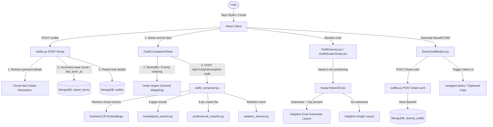

# Saved Outfits & Visual Composer Architecture

This document provides an in-depth architectural analysis and user guide for the saved outfits, stylist proposals, avatar canvas rendering, and outfit completion sheet subsystems within DressApp.

---

## 1. Executive Summary & Value Proposition

### High-Level Overview
The DressApp **Outfit Ecosystem** is a high-fidelity styling framework that translates individual closet items into coordinated head-to-toe looks. By combining visual canvas representations, semantic CLIP similarity matching, automated AI proposals (scheduler/event-driven), and social sharing endpoints, the subsystem offers a frictionless journey from clothing ingestion to outfit coordination.

### Architectural Flow



### User Value Proposition
* **Adaptive Visual Modeling**: Automatically splits into dual canvases to showcase outerwear and underlying tops concurrently, preventing hidden layers.
* **Semantic Anchor Coordination**: Outfit Completion allows users to pick anchor garments and priority-weight them to query the wardrobe for matching, context-aware additions.
* **Frictionless set splitting**: Instantly breaks grouped sets (e.g., matching suits or twin-piece sets) back into individual item anchors for custom styling.
* **Wear Tracking & Analytics**: Saving an outfit automatically increments item wear counts and sets `last_worn_at` dates for smarter wardrobe rotation metrics.
* **Contextual Compatibility Ratings**: Computes weather, location (modesty guidelines), pattern harmony, event style, body fit, and color compatibility.

---

## 2. Comprehensive User Manual

### Visual Interface Topology

#### 1. The Outfit Canvas (Compact vs. Full Layout)
The `OutfitCanvas` manages both inline preview summaries and comprehensive detail modules:

```
COMPACT (In-Chat Feed Card)
+-------------------------------------------------------------------+
|  [Top Thumbnail] [Bottom Thumbnail] [Shoes] ...  [View Full Look] |
+-------------------------------------------------------------------+

FULL VIEW (Detailed Analysis Modal)
+-------------------------------------------------------------------+
| [Name / Dynamic Title]  [Edit Title Icon]         (Share) (Close) |
| [Description / Rationales]                                        |
+--------------------+----------------------------------------------+
| ADAPTIVE AVATAR    | METRICS & GARMENTS PANE                      |
|                    | +------------------------------------------+ |
| +----------------+ | | Tab: Pieces         | Tab: Metrics       | |
| |  With Outerwear| | +------------------------------------------+ |
| |  [Headwear]    | | Overall Matching Grade: [  89%  ]          | |
| |  [Jacket]      | |                                            | |
| |  [Bottoms]     | | Compatibility Progress Bars:               | |
| |  [Shoes]       | | - Color Harmony   [=================]  92% | |
| +----------------+ | | - Modesty Location [=============== ]  80% | |
| | No Outerwear   | | - Weather Suit    [===========      ]  55% | |
| |  [Top/Dress]   | | - Event Fit       [=================]  90% | |
| |  [Bottoms]     | | - Body Fitting    [================ ]  85% | |
| +----------------+ | | - Pattern Match   [=================]  95% | |
+--------------------+----------------------------------------------+
```

#### 2. Outfit Completion Sheet
The outfit complement panel slides up from the bottom/right overlaying the closet screen:

```
+-------------------------------------------------------------------+
|  (Sparkles) Complete Your Look                                (X) |
+-------------------------------------------------------------------+
| SELECTED ANCHORS (Drag or Up/Down buttons to reorder priority)    |
| +-------------+   +-------------+   +-------------+               |
| |  [1] Item   |   |  [2] Item   |   |  [3] ItemSet |              |
| | (Up) (Down) |   | (Up) (Down) |   | [Divide Set]|              |
| |    [X]      |   |    [X]      |   |    [X]      |              |
| +-------------+   +-------------+   +-------------+               |
|                                                                   |
| [X] Include Marketplace Matches                                   |
| [ Occasion / Event Prompt (e.g. Wedding, Business Casual)       ] |
| [                       GENERATE RECOMMENDATIONS                  ] |
|                                                                   |
| RECOMMENDATIONS RESULTS                                           |
| (Weather Aware Badge: Cloudy, 18°C)                               |
| +---------------------------------------------------------------+ |
| | Stylist Rationale: "A tailored look with light textures..."   | |
| | (Speak Audio Button)                                          | |
| +---------------------------------------------------------------+ |
|                                                                   |
| FROM YOUR CLOSET                     FROM THE MARKETPLACE         |
| +-------------+  +-------------+     +-------------+              |
| | Item [90%]  |  | Item [84%]  |     | Listing [88%|              |
| +-------------+  +-------------+     +-------------+              |
+-------------------------------------------------------------------+
```

### Mode & Workflow Walkthroughs

#### 1. Building and Customizing Looks
* **Anchor Priority**: Drag or tap the **Arrow Up** / **Arrow Down** buttons on anchors. The first anchor is assigned the highest weight during vector matching.
* **Dividing Sets**: If a grouped garment set is selected, the sheet renders a **Divide Set** button. Tapping it replaces the set card with its constituent garments as individual editable anchors.
* **Speech-to-Text & TTS Rationales**:
  * Users can type or speak their styling constraints in the occasion input.
  * Tapping the **Volume Speaker Icon** reads the generated Stylist rationale aloud using the browser's TTS system.

#### 2. Reading Compatibility Metrics (Metrics Tab)
* The **Metrics** tab translates 6 scores into dynamic, color-coded progress bars:
  * **Green (>= 80%)**: Excellent compatibility.
  * **Amber (50% - 79%)**: Acceptable compatibility.
  * **Rose (< 50%)**: Potential mismatch.
* **Match to Location**: Checks for modesty regulations or specific cultural constraints (such as restricted government sites, temples, or military bases).

---

## 3. Technology Stack & Capability Deep-Dive

### Service Logic (`outfit_composer.py`)
1. **Parallel Vision Analysis**: Uploads run concurrently through `garment_vision_service` (bounded by a Semaphore of 3 to limit RAM spikes).
2. **Twin Deduplication**: Runs signature hashing followed by a perceptual fallback to prevent identical or near-identical garments from cluttering recommendations.
3. **LLM Score Mapping**: Prompts evaluate matching compatibility (brief, color palette, formality, season, location, and fitting).
4. **Closet and Marketplace Gap Filling**: Scans for vacant slots (e.g. missing shoes or outerwear) and automatically populates gaps from the closet or queries active marketplace listings.

### API Router Operations (`outfits.py`)
* **Usage Stats Hook**: Saving an outfit automatically increments the `wear_count` and updates `last_worn_at` for all associated item IDs inside the `closet_items` collection.
* **Rescheduling Hooks**: Rescheduling an outfit to a new date increments `use_count` on the outfit document.
* **Inline Edits**: Supports PATCH updates to change outfit names and description strings directly.
* **Base64 share-cards**: Generates Base64 encoded snapshot images stored in `shared_outfits` to enable universal sharing via `navigator.share` or clipboard copy URLs.
