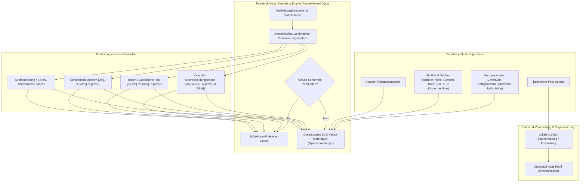

# DressApp — Architektur des 2D-Avatar- & Anprobedienst-Positionierungssystems (`Avatar.md`)

> **Dokumentversion:** 2.0  
> **Ziel-Subsystem:** Frontend 2D-Mannequin, Echtdaten-Freisteller & Bekleidungs-Overlay-Engine  
> **Kerndateien:** `AvatarViewer2D.jsx`, `DynamicAvatar.jsx`, `OutfitCanvas.jsx`, `Profile.jsx`  
> **Status:** Produktion ausgeliefert & kalibriert  

---

## 1. Executive Summary & Wertversprechen

### 1.1 Überblick auf hoher Ebene
Das **DressApp 2D-Avatar- & Anprobedienst-Positionierungssystem** bietet eine adaptive Echtzeit-Visualisierungsumgebung. Es ermöglicht Benutzern, digitalisierte Kleidungsstücke nahtlos über einem **segmentierten Foto des eigenen Körpers** oder einem **dynamisch morphenden 2D-Bezier-Vektor-SVG-Mannequin** anzuprobieren.

Um eine hohe visuelle Genauigkeit über verschiedene Kleidungsstile (Kompressionsshirts, Polokragen, Rundhalsausschnitte, Low-Rise-Jeans, Cargo-Shorts und formelle Kleider) zu gewährleisten, nutzt die Engine eine anatomische Landmarken-Kalibrierung, proportionale Verhältnisskalierung und verzerrungsfreie Bild-Overlay-Container.



### 1.2 Mehrwert für Benutzer
* **Präzision der anatomischen Ausrichtung**: Passt Hemdkragen bündig an die Ausschnittlinie des Avatars (`top-[14.5%]`) und Hosen-/Shorts-Bünde bündig an die natürliche Taillenlinie (`top-[36.5%]`) an, wodurch Gesichtsüberlappungen und unschöne Lücken vermieden werden.
* **Flexibilität durch dualen Avatar**: Wechseln Sie augenblicklich zwischen einem persönlichen segmentierten Ganzkörperfoto und einem dynamischen 2D-Vektor-SVG-Mannequin, das exakt nach anthropometrischen Maßen erstellt wird.
* **Erhaltung des proportionalen Seitenverhältnisses**: Wendet Skalierungen der Brust- und Hüftbreite ($scaleX$) an, während das ursprüngliche Seitenverhältnis der Bilddateien beibehalten wird (`object-fit: contain`), um unerwünschtes Verzerrung oder Stauchen zu verhindern.
* **Interaktive Ebenenhierarchie**: Stapelt Oberbekleidung über Hemden und Kleidern und ermöglicht gleichzeitig das direkte Tippen/Klicken auf einzelne Bekleidungsebenen, um Produktdetails zu öffnen.

---

## 2. Umfassendes Benutzerhandbuch & Schnittstellentopologie

### 2.1 Topologie der visuellen Benutzeroberfläche

```
┌──────────────────────────────────────────────────────────────────┐
│                      2D Avatar Try-On Canvas                     │
├──────────────────────────────────────────────────────────────────┤
│                                                                  │
│                        [ Kopfbedeckung (top: 1%) ]               │
│                        [ Brille        (top: 11%) ]              │
│                        [ Ausschnitt    (top: 14.5%) ] ◄─ Kragen  │
│                     ┌──────────────────────────┐                 │
│                     │  Oberteile / Jacken      │                 │
│                     │       (height: 38%)      │                 │
│                     └──────────────────────────┘                 │
│                        [ Taillenlinie  (top: 36.5%) ] ◄─ Hosenbund│
│                     ┌──────────────────────────┐                 │
│                     │     Hosen / Shorts       │                 │
│                     │       (height: 50%)      │                 │
│                     │                          │                 │
│                     └──────────────────────────┘                 │
│                        [ Füße   (bottom: 2%) ] ◄─── Schuhe       │
│                        [ Schuhe   (height: 12%) ]                │
│                                                                  │
├──────────────────────────────────────────────────────────────────┤
│ [ Modus wechseln ]    [ Hautton währen ]    [ Körpermaße anpassen ]│
└──────────────────────────────────────────────────────────────────┘
```

### 2.2 Modi & Schritt-für-Schritt-Anleitungen

#### Modus 1: Echtkörper-Foto-Freisteller-Ebene
1. Öffnen Sie die **Profileinstellungen** (`/me`).
2. Laden Sie ein Ganzkörperfoto hoch. Das Backend führt eine Hintergrundsegmentierung über `rembg` (U2-Net) durch, um störende Hintergründe zu entfernen.
3. Die verarbeitete Freisteller-URL (`body_photo_url`) aktualisiert das Benutzerprofil in MongoDB und wird im `AvatarViewer2D`-Container gerendert.
4. Um zum Vektor-Mannequin zurückzukehren, klicken Sie auf der Profilseite auf **Foto entfernen**. Die Benutzeroberfläche aktualisiert sich sofort ohne Neuladen der Seite.

#### Modus 2: Dynamisches Vektor-SVG-Mannequin
1. Wenn kein Körperfoto vorhanden ist, rendert `AvatarViewer2D` die Komponente `DynamicAvatar.jsx`.
2. Das Mannequin erzeugt kontinuierliche kubische Bezier-Kurven ($C$- und $S$-Befehle) in einer festen SVG-ViewBox `0 0 200 450`.
3. Das Anpassen der Körperparameter (Größe, Gewicht, Taille, Brust, Schultern, Hüfte) oder das Auswählen eines Hauttons verändert die Silhouette des Mannequins dynamisch in Echtzeit.

---

## 3. Technologie-Stack & Tiefe Funktionsanalyse

### 3.1 Anatomischer Ellipsen-Divisor & Bezier-Mannequin-Generator

`DynamicAvatar.jsx` berechnet 2D-Projektionsbreiten aus 3D-Anatomieumfängen mithilfe eines **Anatomischen Ellipsen-Divisors** ($\text{DIVISOR} = 2.65$):

$$\begin{aligned}
w_{\text{shoulders}} &= (\text{shoulders} \times 1.1) \times (1.05 \text{ if male else } 0.95) \\
w_{\text{chest}} &= \left(\frac{\text{chest}}{2.65} \times 1.05\right) \times (1.02 \text{ if male else } 1.0) \\
w_{\text{waist}} &= \left(\frac{\text{waist}}{2.65} \times 1.0\right) \times (0.98 \text{ if male else } 0.90) \\
w_{\text{hip}} &= \left(\frac{\text{hip}}{2.65} \times 1.05\right) \times (0.93 \text{ if male else } 1.05)
\end{aligned}$$

Die Körpersilhouette wird über SVG-Pfadbefehle konstruiert, die kubische Bezier-Kontrollpunkte abbilden:

```javascript
// Bezier contour snippet from DynamicAvatar.jsx
const bodyPath = [
  `M ${pNeckR}`,
  `C ${X0 + wNeck + (wShoulders - wNeck) * 0.6},${yChin + neckHeight * 0.7} ${X0 + wShoulders * 0.9},${yShoulders - 2} ${pShoulderR}`,
  `C ${X0 + wShoulders * 0.95},${yShoulders + (yChest - yShoulders) * 0.6} ${X0 + wChest + 2},${yChest - 5} ${pChestR}`,
  `C ${X0 + wChest - 1},${yChest + (yWaist - yChest) * 0.5} ${X0 + wWaist + (isMale ? 1 : -2)},${yWaist - 8} ${pWaistR}`,
  `C ${X0 + wWaist + (isMale ? 2 : 5)},${yWaist + (yHip - yWaist) * 0.4} ${X0 + wHip + 1},${yHip - 8} ${pHipR}`,
  ...
].join(' ');
```

### 3.2 Kalibrierte Landmarken-Positionierung & Container-CSS-Verhältnisse

Um zu garantieren, dass Kleidungsstücke bündig sitzen, ohne Gesichtszüge zu verdecken oder Lücken am Körper zu hinterlassen, sind Overlay-Container in `AvatarViewer2D.jsx` an präzise CSS-Positionierungsverhältnisse gebunden:

| Bekleidungskategorie | CSS-Positionsklasse | z-Index | Ausrichtungs-Landmarke |
| --- | --- | --- | --- |
| **Kopfbedeckung** | `top-[1%] left-1/2 w-[34%] aspect-square` | `z-30` | Scheitelpunkt |
| **Brille** | `top-[11%] left-1/2 w-[18%] h-[4.5%]` | `z-28` | Augenlinie |
| **Accessoire / Kette** | `top-[14.5%] left-1/2 w-[30%] aspect-square` | `z-25` | Halsansatz |
| **Oberteil (Top)** | `top-[14.5%] left-1/2 w-[82%] h-[38%]` | `z-20` | Kragen zu Ausschnittlinie |
| **Oberbekleidung** | `top-[14.5%] left-1/2 w-[86%] h-[42%]` | `z-22` | Mantel-Layering über Schultern |
| **Kleid** | `top-[14.5%] left-1/2 w-[82%] h-[68%]` | `z-20` | Gesamtlänge von Schulter bis Knie |
| **Gürtel** | `top-[36.5%] left-1/2 w-[62%] h-[5%]` | `z-21` | Taillengürtelschlaufe |
| **Unterteil (Hosen/Shorts)** | `top-[36.5%] left-1/2 w-[62%] h-[50%]` | `z-10` | Hosenbund zur Taillenlinie |
| **Schuhe / Fußbekleidung** | `bottom-[2%] left-1/2 w-[46%] h-[12%]` | `z-15` | Knöchel- zu Fußebene |
| **Handtasche** | `top-[40%] right-[-5%] w-[40%] h-[30%]` | `z-25` | Armhöhe |

### 3.3 Proportionale Breitenskalierung von Kleidungsstücken

Zusätzlich zur Positionierung werden Kleidungsstücke basierend auf den vom Benutzer gewählten Körperparametern (brustreich, kräftig, schlank, breite Taille, breite Hüften) dynamisch horizontal ($scaleX$) skalierte:

```javascript
// Derivation of garment container scale factors in AvatarViewer2D.jsx
const scales = useMemo(() => {
  const heightFactor = 1 + (params.tall * 0.08) - (params.short * 0.08);
  const widthFactor = 1 + (params.heavy * 0.12) - (params.thin * 0.12);
  const chestFactor = 1 + (params.busty * 0.1);
  const waistFactor = 1 + (params.waist_thick * 0.12) - (params.waist_thin * 0.08);
  const hipsFactor = 1 + (params.hips_wide * 0.12) - (params.hips_narrow * 0.08);

  return { height: heightFactor, width: widthFactor, chest: chestFactor, waist: waistFactor, hips: hipsFactor };
}, [params]);

// Passed to Framer Motion animate prop for Top and Bottom:
// Top: scaleX = scales.chest / scales.width
// Bottom: scaleX = scales.hips / scales.width
```

---

## 4. Zusammenfassende Matrix der Positions- & Proportionskorrekturen

| Identifiziertes Problem | Ursache | Angewandte Korrektur | Ergebnis |
| --- | --- | --- | --- |
| **Hemdkragen verdeckt das Gesicht** | Container-Offset zu hoch positioniert (`top-[8.3%]` oder `top-[12.8%]`) | Oberer Container-Offset auf `top-[14.5%]` gesetzt | Hemdkragen liegt bündig an der Ausschnittlinie des Avatars an. |
| **Hosen/Shorts zu tief oder überlappen Saum** | Container-Offset zu tief positioniert (`top-[38.5%]`) | Unterer Container-Offset auf `top-[36.5%]` gesetzt | Hosenbund sitzt bündig an der natürlichen Taillenlinie des Avatars. |
| **Verzerrte Seitenverhältnisse der Kleidung** | Unbegrenzte Container-Stauchung/-Dehnung | `object-fit: contain` mit proportionaler `scaleX`-Anpassung angewendet | Behält das originale Seitenverhältnis der Kleidungsbilder ohne horizontale Verzerrung bei. |
| **Verzögerung beim Entfernen des Fotos** | Erneutes Abrufen des Seitenstatus erforderlich | Sofortige lokale Benutzerstatus-Synchronisation in `Profile.jsx` implementiert | Entfernen des Fotos wird ohne Benutzeroberflächen-Verzögerung oder fehlerhaften Status angezeigt. |

---

*Document compiled automatically by Narrator for DressApp.*
