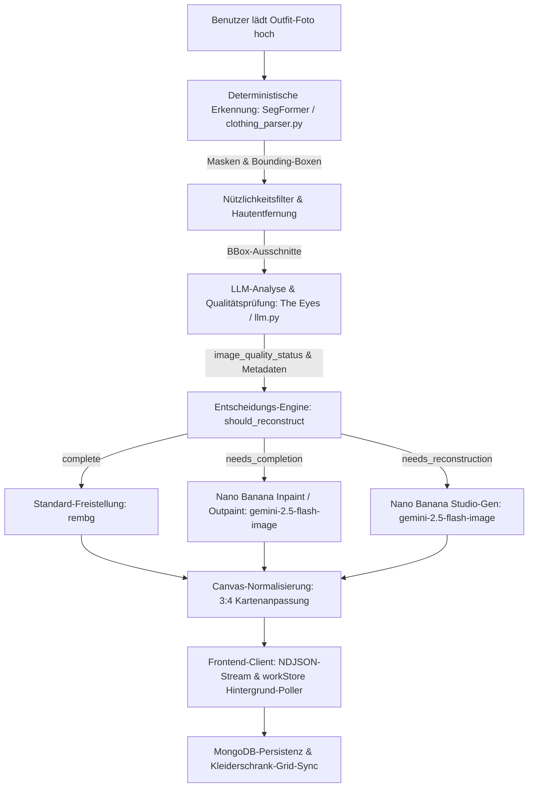

# GarmentVision — Die DressApp Eyes & Rekonstruktions-Pipeline

> **Modul:** `backend/app/services/vision/` & `backend/app/services/reconstruction.py`  
> **Status:** Produktion (live auf VPS + `dressapp-eyes` Self-Host).  
> **Verantwortliche Rolle:** Verwandelt jedes Benutzerfoto (Spiegelselfie, Outfit-Schnappschuss oder Flat-Lay) in makellose, einzeln segmentierte, getaggte und KI-rekonstruierte Garderobenelemente.

---

## 1. Zusammenfassung & Wertversprechen

### Überblick
GarmentVision ist das optische Intelligenzzentrum von DressApp. Es ist eine durchgängige, mehrstufige Vision-Pipeline, die uneingeschränkte Benutzerfotos aufnimmt und saubere, freigestellte, fotorealistische Garderobenartikel erzeugt. Verankert in einer hybriden KI-Architektur verbindet sie hochpräzise deterministische Segmentierung (SegFormer `b3_clothes`) und Hintergrundfreistellung (`u2netp` / rembg) mit tiefem multimodalen Denken (Gemini) und generativer Bildreparatur (Nano Banana / `gemini-2.5-flash-image`).

Wenn Kleidungsstücke auf Benutzerfotos durch Haare, Taschen oder Arme verdeckt sind oder durch den Kamerarahmen abgeschnitten wurden, diagnostiziert der **KI-Qualitätsprüfer** von GarmentVision den Defekt und löst automatisch eine **Bildvervollständigung** (Inpainting/Outpainting fehlender Säume, Ärmel und Kragen) oder eine **Vollständige Studio-Rekonstruktion** aus (Neugenerierung abgetrennter oder unvollständiger Artikel in makellose, eigenständige E-Commerce-Katalogfotos).

### Architekturablauf



### Wertversprechen für Benutzer
- **Mühelose Multi-Item-Aufnahme:** Laden Sie ein einzelnes Ganzkörperselfie hoch und isolieren Sie jede Jacke, jedes Oberteil, jeden Rock, jede Hose, jedes Paar Schuhe und jedes Accessoire automatisch in Sekundenschnelle.
- **Makellose Studioqualität-Präsentation:** Durch Gliedmaßen oder Taschen verdeckte Kleidungsstücke werden automatisch vervollständigt; abgeschnittene Artikel (wie unvollständiges Schuhwerk oder Teilmäntel) werden vollständig in makellose Studio-Flat-Lays rekonstruiert.
- **Intelligente visuelle Qualitätsprüfung:** The Eyes bewertet jeden Ausschnitt automatisch auf Kantenanschnitte, Verdeckungen und fehlende Konturen, wodurch manuelle Fotobearbeitung überflüssig wird.
- **Asynchrone Hot-Path-Optimierung:** Rechenintensive generative Rekonstruktionen laufen nahtlos in Hintergrundaufgaben, sodass die anfängliche Fotoaufnahme schnell unter 5 Sekunden bleibt.

---

## 2. Umfassendes Benutzerhandbuch

### Topologie der Benutzeroberfläche
```text
┌────────────────────────────────────────────────────────────────────────┐
│  [ Kleidung hinzufügen — Kamera & Upload ]                              │
│  ┌──────────────────────────────────────────────────────────────────┐  │
│  │  [Live-Kamera / Datei-Dropzone]                                  │  │
│  │  "Ganzkörperfotos, Flat-Lays oder Quittungen aufnehmen/hochladen"│  │
│  └──────────────────────────────────────────────────────────────────┘  │
│                                                                        │
│  [ Verarbeitungs-Stream: Erkennung & Qualitätsprüfung ]                │
│  ┌─────────────────┐  ┌─────────────────┐  ┌─────────────────┐         │
│  │ Oberbekleidung  │  │ Unterbekleidung │  │ Schuhe-Ausschnitt│        │
│  │ [Needs Inpaint] │  │ [Needs Outpaint]│  │ [Reconstruct]   │         │
│  │ "Bikerjacke"    │  │ "Tüllrock"      │  │ "Pantoletten"    │         │
│  └─────────────────┘  └─────────────────┘  └─────────────────┘         │
│                                                                        │
│  [ Gespeicherter Kleiderschrank: Echtzeit-Aktualisierung via workStore]│
│  ┌─────────────────┐  ┌─────────────────┐  ┌─────────────────┐         │
│  │ Komplette Jacke │  │ Wiederherg. Rock│  │ Studio-Schuhe   │         │
│  │ (Volle Ärmel)   │  │ (Voller Saum)   │  │ (Paar m. Absatz)│         │
│  └─────────────────┘  └─────────────────┘  └─────────────────┘         │
└────────────────────────────────────────────────────────────────────────┘
```

### Modi & Workflow-Anleitungen
1. **Interaktive Momentaufnahme & Stapelaufnahme:**
   - Tippen Sie auf **Artikel hinzufügen** &rarr; nehmen Sie ein Foto auf oder laden Sie ein Foto mit einem oder mehreren Kleidungsstücken hoch.
   - Das System führt Pre-Flight-Duplikatsprüfungen in Echtzeit durch (`crypto.subtle` SHA-256 und perzeptives Hashing), um doppelte Uploads sofort zu erkennen.
2. **KI-Qualitätsbewertung:**
   - Während SegFormer die Segmente zuschneidet, prüft der Gemini-Qualitätsprüfer jedes Kleidungsstück:
     - `complete`: Das Kleidungsstück ist vollständig sichtbar, unverdeckt und zentriert. Wird unverändert übernommen.
     - `needs_completion`: Das Kleidungsstück weist verdeckte Bereiche, fehlende Kanten, beschnittene Kragen oder unvollständige Säume auf. Eingereiht für KI-Inpainting/Outpainting.
     - `needs_reconstruction`: Das Element ist stark abgeschnitten (z. B. nur Schuhspitzen sichtbar). Eingereiht für vollständige Studio-Generierung.
3. **Nahtlose Hintergrund-Vervollständigung:**
   - Beim Klicken auf **Speichern** erscheinen Kleidungsstücke sofort im Kleiderschrank-Grid.
   - Hintergrundaufgaben führen die generative Bildvervollständigung aus, ohne die Benutzeroberfläche zu blockieren. Nach Abschluss aktualisiert `workStore` die Karte in Echtzeit.

---

## 3. Technologie-Stack & Tiefeneinblick

### Kern-Orchestrierung & KI/Logik
- **Segmentierungs-Engine (`clothing_parser.py`):** Nutzt SegFormer, feinabgestimmt auf ATR- / LIP-Modedatensätzen, um bis zu 18 Klassen zu identifizieren, inklusive Hautmasken-Subtraktion und morphologischer Trägerüberbrückung.
- **Qualitätsprüfer-Prompting (`llm.py`):** Strukturiertes JSON-Ausgabeschema für `image_quality_status`, `image_quality_reason` und `reconstruction_prompt`.
- **Entscheidungs-Engine (`reconstruction.py`):** Wertet den LLM-Status zusammen mit einem geometrischen Randkontakt-Sicherheitsfilter (`_EDGE_TOUCH_MARGIN = 40`) aus, um sicherzustellen, dass durch den Fotorand abgeschnittene Artikel niemals fälschlicherweise als vollständig eingestuft werden.
- **Generative Reparatur-Engine (`gemini_image_service.py`):**
  - **Inpaint / Outpaint (`edit`):** Übergibt die zugeschnittenen Bytes und strukturierte Prompts an `gemini-2.5-flash-image`, um Textur, Muster und Farbe des Stoffs zu erhalten, während fehlende Geometrie ergänzt wird.
  - **Studio-Generierung (`generate`):** Fordert `gemini-2.5-flash-image` mit vollständigen deskriptiven Metadaten (Kleidungsstücktyp, Material, Farbe, Beschläge, Ausschnitt) auf, um ein makelloses Katalogstück auf gebrochen weißem Hintergrund zu rendern.

### Frontend-Synchronisation (`workStore.js` & `itemImage.js`)
- **Zentrale Bildauflösung (`itemImage.js`):** `bestImageUrl()` priorisiert `reconstructed_image_url` mit höchster Priorität, sodass KI-reparierte Bilder temporäre Rohzuschnitt-Thumbnails sofort ersetzen.
- **Seitenübergreifendes Polling (`workStore.js`):** Verfolgt laufende Hintergrund-Rekonstruktionsaufgaben global über alle Seitenwechsel hinweg und aktualisiert Dokumente automatisch in `closetStore`.
