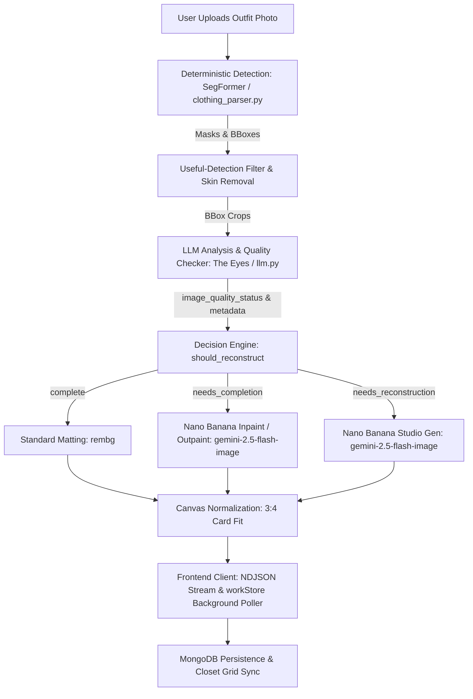

# GarmentVision — The DressApp Eyes & Reconstruction Pipeline

> **Module:** `backend/app/services/vision/` & `backend/app/services/reconstruction.py`  
> **Status:** Production (live on VPS + `dressapp-eyes` self-host).  
> **Owner role:** Transforms any user photo (mirror selfie, outfit snap, or flat-lay) into pristine, individually segmented, tagged, and AI-reconstructed closet items.

---

## 1. Executive Summary & Value Proposition

### High-Level Overview
GarmentVision is the optical intelligence core of DressApp. It is an end-to-end, multi-stage vision pipeline that ingests unconstrained user photos and produces clean, isolated, photorealistic wardrobe items. Anchored in a hybrid AI architecture, it couples high-speed deterministic segmentation (SegFormer `b3_clothes`) and background matting (`u2netp` / rembg) with deep multi-modal reasoning (Gemini) and generative image repair (Nano Banana / `gemini-2.5-flash-image`).

When clothes in user photos are occluded by hair, bags, arms, or cropped out by the camera frame, GarmentVision's **AI Quality Checker** diagnoses the defect and automatically triggers **Image Completion** (inpainting/outpainting missing hems, sleeves, and collars) or **Full Studio Reconstruction** (regenerating severed or amputated items into pristine standalone e-commerce catalog photos).

### Architectural Flow



### User Value Proposition
- **Frictionless Multi-Item Ingestion:** Upload a single full-body selfie and automatically isolate every jacket, top, skirt, pants, shoes, and accessory in seconds.
- **Flawless Studio-Quality Presentation:** Clothes occluded by limbs or bags are automatically completed; severed items (like cropped footwear or partial coats) are fully reconstructed into pristine studio flat-lays.
- **Intelligent Visual Quality Checker:** The Eyes automatically evaluate every crop for cutoffs, occlusions, and missing edges, eliminating manual photo editing.
- **Asynchronous Hot-Path Optimization:** High-cost generative reconstructions run seamlessly in background tasks, keeping initial photo ingestion snappy under 5 seconds.

---

## 2. Comprehensive User Manual

### Visual Interface Topology
```text
┌────────────────────────────────────────────────────────────────────────┐
│  [ Add Clothes — Camera & Upload ]                                      │
│  ┌──────────────────────────────────────────────────────────────────┐  │
│  │  [Live Camera / File Dropzone]                                   │  │
│  │  "Snap or upload full-body photos, flat lays, or receipts"       │  │
│  └──────────────────────────────────────────────────────────────────┘  │
│                                                                        │
│  [ Processing Stream: Detection & Quality Check ]                      │
│  ┌─────────────────┐  ┌─────────────────┐  ┌─────────────────┐         │
│  │ Outerwear Crop  │  │ Bottom Crop     │  │ Footwear Crop   │         │
│  │ [Needs Inpaint] │  │ [Needs Outpaint]│  │ [Reconstruct]   │         │
│  │ "Biker Jacket"  │  │ "Tulle Skirt"   │  │ "Heeled Mules"  │         │
│  └─────────────────┘  └─────────────────┘  └─────────────────┘         │
│                                                                        │
│  [ Saved Closet Grid: Real-Time Auto-Refresh via workStore ]           │
│  ┌─────────────────┐  ┌─────────────────┐  ┌─────────────────┐         │
│  │ Complete Jacket │  │ Restored Skirt  │  │ Studio Footwear │         │
│  │ (Full sleeves)  │  │ (Full hem/sides)│  │ (Pair with heels│         │
│  └─────────────────┘  └─────────────────┘  └─────────────────┘         │
└────────────────────────────────────────────────────────────────────────┘
```

### Modes & Workflow Walkthroughs
1. **Interactive Snapshot & Batch Ingestion:**
   - Tap **Add Item** &rarr; snap or upload a photo containing one or more garments.
   - The system performs real-time duplicate pre-flight checks (`crypto.subtle` SHA-256 and average perceptual hashing) to catch duplicate uploads instantly.
2. **AI Quality Assessment:**
   - As SegFormer segments the crops, Gemini's Quality Checker inspects each garment:
     - `complete`: Garment is fully visible, unoccluded, and centered. Kept as-is.
     - `needs_completion`: Garment has occluded panels, missing edges, clipped collars, or sliced hems. Queued for AI inpainting/outpainting.
     - `needs_reconstruction`: Item is heavily severed (e.g. only shoe tips visible). Queued for full studio generation.
3. **Seamless Background Completion:**
   - On clicking **Save**, garments immediately appear in the Closet grid.
   - Background tasks run generative image completion without freezing the UI. Once finished, `workStore` updates the card in real-time.

---

## 3. Technology Stack & Capability Deep-Dive

### Core Orchestration & AI/Logic
- **Segmentation Engine (`clothing_parser.py`):** Uses SegFormer fine-tuned on ATR / LIP fashion datasets to identify up to 18 classes, applying skin-mask subtraction and morphological strap bridging.
- **Quality Checker Prompting (`llm.py`):** Structured JSON output schema enforcing `image_quality_status`, `image_quality_reason`, and `reconstruction_prompt`.
- **Decision Engine (`reconstruction.py`):** Evaluates LLM status with a geometric edge-touch safety guard (`_EDGE_TOUCH_MARGIN = 40`) to ensure items cut off by the photo boundary are never falsely treated as complete.
- **Generative Repair Engine (`gemini_image_service.py`):**
  - **Inpaint / Outpaint (`edit`):** Passes the cropped bytes and structured prompt to `gemini-2.5-flash-image` to preserve fabric texture, pattern, and color while expanding missing geometry.
  - **Studio Generation (`generate`):** Prompts `gemini-2.5-flash-image` with complete descriptive metadata (garment type, material, color, hardware, neckline) to render a pristine catalog piece on an off-white background.

### Frontend Synchronization (`workStore.js` & `itemImage.js`)
- **Centralized Resolution (`itemImage.js`):** `bestImageUrl()` prioritizes `reconstructed_image_url` at top precedence, ensuring AI-repaired images immediately supersede temporary raw crop thumbnails.
- **Cross-Page Polling (`workStore.js`):** Tracks in-flight background reconstruction tasks globally across client page navigation, automatically pushing updated documents into `closetStore`.
