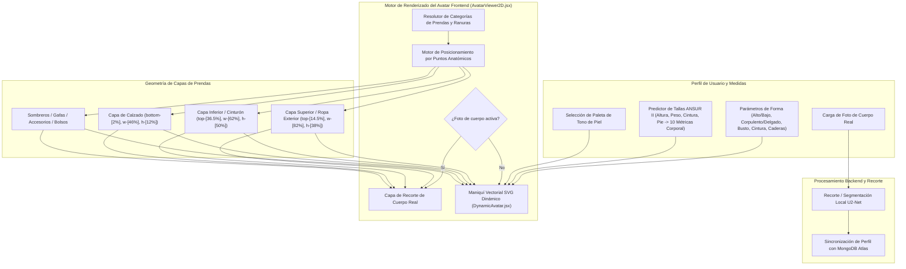

# DressApp — Arquitectura del Sistema de Avatar 2D y Posicionamiento de Prueba (`Avatar.md`)

> **Versión del Documento:** 2.0  
> **Subsistema Objetivo:** Maniquí 2D Frontend, Recortes de Fotos del Cuerpo Real y Motor de Superposición de Prendas  
> **Archivos Principales:** `AvatarViewer2D.jsx`, `DynamicAvatar.jsx`, `OutfitCanvas.jsx`, `Profile.jsx`  
> **Estado:** Desplegado en Producción y Calibrado  

---

## 1. Resumen Ejecutivo y Propuesta de Valor

### 1.1 Visión General de Alto Nivel
El **Sistema de Avatar 2D y Posicionamiento de Prueba de DressApp** ofrece un entorno visual adaptativo de prueba en tiempo real. Permite a los usuarios previsualizar prendas digitalizadas de su armario superpuestas a la perfección sobre una **fotografía segmentada del cuerpo real** o sobre un **maniquí vectorial SVG 2D con curvas Bézier dinámicas**.

Para ofrecer una alta precisión visual en diversos estilos de prendas (camisetas de compresión, polos, cuellos redondos, vaqueros de tiro bajo, bermudas cargo y vestidos de gala), el motor utiliza calibración por puntos de referencia anatómicos, escalado de proporciones y contenedores de superposición de imágenes sin distorsión.



### 1.2 Propuesta de Valor para el Usuario
* **Precisión de Alineación Anatómica**: Ajusta los cuellos de las camisas a la línea del cuello del avatar (`top-[14.5%]`) y las cinturillas de pantalones/shorts a la cintura natural del avatar (`top-[36.5%]`), eliminando la oclusión del rostro o huecos desalineados.
* **Flexibilidad de Avatar Doble**: Cambie instantáneamente entre una foto personal segmentada de cuerpo entero y un maniquí vectorial SVG 2D dinámico ajustado a medidas antropométricas exactas.
* **Preservación Proporcional de Aspecto**: Aplica escalado de ancho de pecho y cadera ($scaleX$) manteniendo la relación de aspecto original de las imágenes de prendas (`object-fit: contain`), evitando estiramientos o deformaciones indebidas.
* **Jerarquía de Capas Interactiva**: Superponga prendas de abrigo sobre camisetas interiores y vestidos, permitiendo al mismo tiempo hacer clic/tocar directamente en las capas de prendas individuales para ver detalles.

---

## 2. Manual de Usuario Detallado y Topología de Interfaz

### 2.1 Topología Visual de la Interfaz

```
┌──────────────────────────────────────────────────────────────────┐
│                   Lienzo de Prueba 2D de Avatar                  │
├──────────────────────────────────────────────────────────────────┤
│                                                                  │
│                        [ Sombreros (top: 1%) ]                   │
│                        [ Gafas     (top: 11%) ]                  │
│                        [ Escote    (top: 14.5%) ] ◄─ Cuello      │
│                     ┌──────────────────────────┐                 │
│                     │   Parte Superior / Abrigo│                 │
│                     │       (height: 38%)      │                 │
│                     └──────────────────────────┘                 │
│                        [ Cintura   (top: 36.5%) ] ◄─ Pretina     │
│                     ┌──────────────────────────┐                 │
│                     │  Parte Inferior / Shorts │                 │
│                     │       (height: 50%)      │                 │
│                     │                          │                 │
│                     └──────────────────────────┘                 │
│                        [ Pies    (bottom: 2%) ] ◄─── Calzado     │
│                        [ Zapatos   (height: 12%) ]               │
│                                                                  │
├──────────────────────────────────────────────────────────────────┤
│ [ Cambiar Avatar ]  [ Selector de Tono de Piel ]  [ Editar Medidas ] │
└──────────────────────────────────────────────────────────────────┘
```

### 2.2 Guías de Modo y Flujos de Trabajo

#### Modo 1: Capa de Recorte de Foto de Cuerpo Real
1. Abra los **Ajustes de Perfil** (`/me`).
2. Suba una fotografía de cuerpo entero. El backend ejecuta la segmentación de fondo mediante `rembg` (U2-Net) para eliminar elementos innecesarios.
3. La URL de la imagen recortada (`body_photo_url`) actualiza el perfil del usuario en MongoDB y se renderiza dentro del contenedor `AvatarViewer2D`.
4. Para volver al maniquí vectorial, haga clic en **Eliminar Foto** en la página de perfil. La interfaz se actualiza al instante sin recargar la página.

#### Modo 2: Maniquí Vectorial SVG Dinámico
1. Cuando no hay foto de cuerpo disponible, `AvatarViewer2D` renderiza `DynamicAvatar.jsx`.
2. El maniquí genera curvas Bézier cúbicas continuas (comandos $C$ y $S$) dentro de un `viewBox` SVG fijo de `0 0 200 450`.
3. Al ajustar los parámetros corporales (altura, peso, cintura, pecho, hombros, caderas) o seleccionar un tono de piel, la silueta del maniquí cambia dinámicamente en tiempo real.

---

## 3. Arquitectura Tecnológica y Análisis en Profundidad

### 3.1 Divisor de Elipse Anatómica y Generador de Maniquí Bézier

`DynamicAvatar.jsx` calcula los anchos de proyección planar 2D a partir de circunferencias anatómicas 3D utilizando un **Divisor de Elipse Anatómica** ($\text{DIVISOR} = 2.65$):

$$\begin{aligned}
w_{\text{shoulders}} &= (\text{shoulders} \times 1.1) \times (1.05 \text{ if male else } 0.95) \\
w_{\text{chest}} &= \left(\frac{\text{chest}}{2.65} \times 1.05\right) \times (1.02 \text{ if male else } 1.0) \\
w_{\text{waist}} &= \left(\frac{\text{waist}}{2.65} \times 1.0\right) \times (0.98 \text{ if male else } 0.90) \\
w_{\text{hip}} &= \left(\frac{\text{hip}}{2.65} \times 1.05\right) \times (0.93 \text{ if male else } 1.05)
\end{aligned}$$

La silueta del cuerpo se construye mediante comandos de ruta SVG que mapean puntos de control de Bézier cúbicos:

```javascript
// Bezier contour snippet from DynamicAvatar.jsx
const bodyPath = [
  `M ${pNeckR}`,
  `C ${X0 + wNeck + (wShoulders - wNeck) * 0.6},${yChin + neckHeight * 0.7} ${X0 + wShoulders * 0.9},${yShoulders - 2} ${pShoulderR}`,
  `C ${X0 + wShoulders * 0.95},${yShoulders + (yChest - yShoulders) * 0.6} ${X0 + wChest + 2},${yChest - 5} ${pChestR}`,
  `C ${X0 + wChest - 1},${yChest + (yWaist - yChest) * 0.5} ${X0 + wWaist + (isMale ? 1 : -2)},${yWaist - 8} ${pWaistR}`,
  `C ${X0 + wWaist + (isMale ? 2 : 5)},${yWaist + (yHip - yWaist) * 0.4} ${X0 + wHip + 1},${yHip - 8} ${pHipR}`,
  ...
].join(' ');
```

### 3.2 Posicionamiento Calibrado de Puntos de Referencia y Ratios CSS

Para garantizar que las prendas se asienten perfectamente sin solapar rasgos faciales ni dejar espacios corporales, los contenedores de superposición en `AvatarViewer2D.jsx` están vinculados a proporciones posicionales CSS precisas:

| Categoría de Prenda | Clase de Posición CSS | z-Index | Punto Anatómico de Alineación |
| --- | --- | --- | --- |
| **Sombreros / Gorros** | `top-[1%] left-1/2 w-[34%] aspect-square` | `z-30` | Coronilla de la cabeza |
| **Gafas** | `top-[11%] left-1/2 w-[18%] h-[4.5%]` | `z-28` | Plano de los ojos |
| **Accesorios / Collares** | `top-[14.5%] left-1/2 w-[30%] aspect-square` | `z-25` | Base del cuello |
| **Parte Superior (Top)** | `top-[14.5%] left-1/2 w-[82%] h-[38%]` | `z-20` | Cuello a línea del escote |
| **Abrigos / Chaquetas** | `top-[14.5%] left-1/2 w-[86%] h-[42%]` | `z-22` | Capa sobre hombros |
| **Vestidos** | `top-[14.5%] left-1/2 w-[82%] h-[68%]` | `z-20` | Largo completo de escote a rodilla |
| **Cinturón** | `top-[36.5%] left-1/2 w-[62%] h-[5%]` | `z-21` | Trabilla de cintura |
| **Parte Inferior (Pantalones/Shorts)** | `top-[36.5%] left-1/2 w-[62%] h-[50%]` | `z-10` | Cinturilla a línea de cintura |
| **Calzado / Zapatos** | `bottom-[2%] left-1/2 w-[46%] h-[12%]` | `z-15` | Tobillo a plano del pie |
| **Bolso de Mano** | `top-[40%] right-[-5%] w-[40%] h-[30%]` | `z-25` | Caída del brazo |

### 3.3 Escalado Proporcional del Ancho de las Prendas

Además del posicionamiento espacial, las prendas se escalan horizontalmente ($scaleX$) de forma dinámica según los parámetros del cuerpo del usuario (pecho pronunciado, corpulento, delgado, cintura ancha, caderas anchas):

```javascript
// Derivation of garment container scale factors in AvatarViewer2D.jsx
const scales = useMemo(() => {
  const heightFactor = 1 + (params.tall * 0.08) - (params.short * 0.08);
  const widthFactor = 1 + (params.heavy * 0.12) - (params.thin * 0.12);
  const chestFactor = 1 + (params.busty * 0.1);
  const waistFactor = 1 + (params.waist_thick * 0.12) - (params.waist_thin * 0.08);
  const hipsFactor = 1 + (params.hips_wide * 0.12) - (params.hips_narrow * 0.08);

  return { height: heightFactor, width: widthFactor, chest: chestFactor, waist: waistFactor, hips: hipsFactor };
}, [params]);

// Passed to Framer Motion animate prop for Top and Bottom:
// Top: scaleX = scales.chest / scales.width
// Bottom: scaleX = scales.hips / scales.width
```

---

## 4. Matriz de Resumen de Correcciones de Posición y Proporción

| Problema Identificado | Causa | Corrección Aplicada | Resultado |
| --- | --- | --- | --- |
| **Cuello de Camisa Solapa la Cara** | Desplazamiento posicionado demasiado alto (`top-[8.3%]` o `top-[12.8%]`) | Ajustado el desplazamiento superior a `top-[14.5%]` | El cuello de la camisa descansa justo en la línea del cuello del avatar. |
| **Pantalones/Shorts Bajos o Solapando Dobladillo** | Desplazamiento posicionado demasiado bajo (`top-[38.5%]`) | Ajustado el desplazamiento inferior a `top-[36.5%]` | La pretina del pantalón descansa alineada con la cintura natural. |
| **Relación de Aspecto de Prendas Deformada** | Estiramiento sin restricciones del contenedor | Aplicado `object-fit: contain` con ajuste proporcional de `scaleX` | Conserva la relación de aspecto original de la imagen sin deformaciones. |
| **Retraso al Eliminar Foto** | Recuperación necesaria del estado de la página | Sincronización instantánea de estado local en `Profile.jsx` | La foto se elimina al instante sin retrasos ni inconsistencias en la interfaz. |

---

*Document compiled automatically by Narrator for DressApp.*
