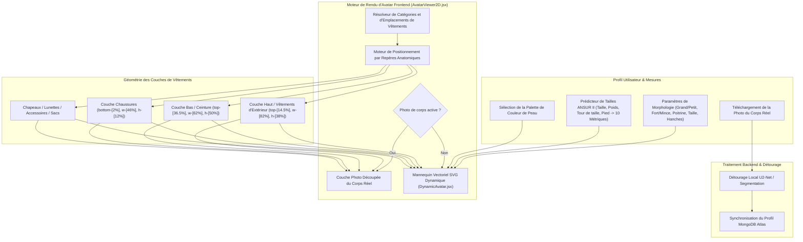

# DressApp — Architecture du Système d'Essayage 2D et de Positionnement d'Avatar (`Avatar.md`)

> **Version du Document :** 2.0  
> **Sous-système Cible :** Mannequin 2D Frontend, Découpage Photo du Corps Réel & Moteur de Superposition de Vêtements  
> **Fichiers Principaux :** `AvatarViewer2D.jsx`, `DynamicAvatar.jsx`, `OutfitCanvas.jsx`, `Profile.jsx`  
> **Statut :** Déployé en Production & Calibré  

---

## 1. Résumé Exécutif & Proposition de Valeur

### 1.1 Présentation Générale
Le **Système d'Essayage 2D et de Positionnement d'Avatar DressApp** offre un environnement visuel d'essayage adaptatif en temps réel. Il permet aux utilisateurs de prévisualiser des vêtements numérisés superposés de manière fluide soit sur une **photographie détourée du corps réel**, soit sur un **mannequin vectoriel SVG 2D généré par courbes de Bézier**.

Afin d'assurer une grande précision visuelle sur divers styles de vêtements (t-shirts de compression, polos, cols ras du cou, jeans taille basse, shorts cargo et robes de soirée), le moteur s'appuie sur le calibrage de repères anatomiques, la mise à l'échelle proportionnelle des ratios et des conteneurs d'images sans distorsion.



### 1.2 Proposition de Valeur Utilisateur
* **Précision de l'Alignement Anatomique** : Aligne les cols de chemise parfaitement avec l'encolure de l'avatar (`top-[14.5%]`) et la ceinture des pantalons/shorts avec la taille naturelle (`top-[36.5%]`), éliminant tout chevauchement sur le visage ou espace inesthétique.
* **Flexibilité du Double Avatar** : Basculez instantanément entre une photo personnelle complète détourée et un mannequin vectoriel SVG 2D dynamique adapté à des mesures anthropométriques précises.
* **Préservation Proportionnelle des Ratios** : Applique un redimensionnement de la largeur du buste et des hanches ($scaleX$) tout en conservant le ratio d'aspect d'origine des vêtements (`object-fit: contain`), évitant tout étirement ou écrasement.
* **Hiérarchie Interactive des Couches** : Superposez les manteaux sur les haut intérieurs et les robes tout en permettant de cliquer/taper directement sur chaque couche de vêtement pour en ouvrir les détails.

---

## 2. Manuel Utilisateur Complet & Topologie de l'Interface

### 2.1 Topologie Visuelle de l'Interface

```
┌──────────────────────────────────────────────────────────────────┐
│                   Canevas d'Essayage 2D d'Avatar                 │
├──────────────────────────────────────────────────────────────────┤
│                                                                  │
│                        [ Chapeaux  (top: 1%) ]                   │
│                        [ Lunettes  (top: 11%) ]                  │
│                        [ Encolure  (top: 14.5%) ] ◄─ Col Chemise │
│                     ┌──────────────────────────┐                 │
│                     │   Hauts / Vêtements Ext. │                 │
│                     │       (height: 38%)      │                 │
│                     └──────────────────────────┘                 │
│                        [ Tour Taille (top: 36.5%) ] ◄─ Ceinture  │
│                     ┌──────────────────────────┐                 │
│                     │       Bas / Shorts       │                 │
│                     │       (height: 50%)      │                 │
│                     │                          │                 │
│                     └──────────────────────────┘                 │
│                        [ Pieds   (bottom: 2%) ] ◄─── Chaussures  │
│                        [ Chaussures (height: 12%) ]              │
│                                                                  │
├──────────────────────────────────────────────────────────────────┤
│ [ Changer le Mode ] [ Sélecteur Couleur Peau ] [ Modifier Mesures]│
└──────────────────────────────────────────────────────────────────┘
```

### 2.2 Modes & Déroulement des Utilisations

#### Mode 1 : Couche Photo Découpée du Corps Réel
1. Ouvrez les **Paramètres du Profil** (`/me`).
2. Téléchargez une photo plein pied. Le backend effectue une segmentation d'arrière-plan via `rembg` (U2-Net) pour supprimer l'arrière-plan.
3. L'URL de l'image détourée (`body_photo_url`) met à jour le profil utilisateur dans MongoDB et s'affiche dans le conteneur `AvatarViewer2D`.
4. Pour revenir au mannequin vectoriel, cliquez sur **Supprimer la photo** sur la page de profil. L'interface se met à jour immédiatement sans rechargement de la page.

#### Mode 2 : Mannequin Vectoriel SVG Dynamique
1. En l'absence de photo de corps, `AvatarViewer2D` affiche le composant `DynamicAvatar.jsx`.
2. Le mannequin génère des courbes de Bézier cubiques continues (commandes $C$ et $S$) dans une viewBox SVG fixe de `0 0 200 450`.
3. L'ajustement des paramètres corporels (taille, poids, tour de taille, poitrine, épaules, hanches) ou le choix de la couleur de peau modifie dynamiquement la silhouette en temps réel.

---

## 3. Architecture Technique & Analyse Approfondie

### 3.1 Diviseur d'Ellipse Anatomique & Générateur de Mannequin Bézier

`DynamicAvatar.jsx` calcule les largeurs de projection plane 2D à partir des circonférences anatomiques 3D en utilisant un **Diviseur d'Ellipse Anatomique** ($\text{DIVISOR} = 2.65$) :

$$\begin{aligned}
w_{\text{shoulders}} &= (\text{shoulders} \times 1.1) \times (1.05 \text{ if male else } 0.95) \\
w_{\text{chest}} &= \left(\frac{\text{chest}}{2.65} \times 1.05\right) \times (1.02 \text{ if male else } 1.0) \\
w_{\text{waist}} &= \left(\frac{\text{waist}}{2.65} \times 1.0\right) \times (0.98 \text{ if male else } 0.90) \\
w_{\text{hip}} &= \left(\frac{\text{hip}}{2.65} \times 1.05\right) \times (0.93 \text{ if male else } 1.05)
\end{aligned}$$

La silhouette du corps est construite à l'aide de commandes de tracé SVG qui définissent les points de contrôle Bézier cubiques :

```javascript
// Bezier contour snippet from DynamicAvatar.jsx
const bodyPath = [
  `M ${pNeckR}`,
  `C ${X0 + wNeck + (wShoulders - wNeck) * 0.6},${yChin + neckHeight * 0.7} ${X0 + wShoulders * 0.9},${yShoulders - 2} ${pShoulderR}`,
  `C ${X0 + wShoulders * 0.95},${yShoulders + (yChest - yShoulders) * 0.6} ${X0 + wChest + 2},${yChest - 5} ${pChestR}`,
  `C ${X0 + wChest - 1},${yChest + (yWaist - yChest) * 0.5} ${X0 + wWaist + (isMale ? 1 : -2)},${yWaist - 8} ${pWaistR}`,
  `C ${X0 + wWaist + (isMale ? 2 : 5)},${yWaist + (yHip - yWaist) * 0.4} ${X0 + wHip + 1},${yHip - 8} ${pHipR}`,
  ...
].join(' ');
```

### 3.2 Positionnement Calibré des Repères & Ratios CSS du Conteneur

Pour garantir que les vêtements se placent parfaitement sans recouvrir le visage ni créer de décalage, les conteneurs dans `AvatarViewer2D.jsx` sont liés à des ratios de positionnement CSS très précis :

| Catégorie de Vêtement | Classe de Position CSS | z-Index | Repère Anatomique d'Alignement |
| --- | --- | --- | --- |
| **Chapeaux / Coiffures** | `top-[1%] left-1/2 w-[34%] aspect-square` | `z-30` | Sommet de la tête |
| **Lunettes** | `top-[11%] left-1/2 w-[18%] h-[4.5%]` | `z-28` | Ligne des yeux |
| **Accessoires / Colliers** | `top-[14.5%] left-1/2 w-[30%] aspect-square` | `z-25` | Base du cou |
| **Haut (Top)** | `top-[14.5%] left-1/2 w-[82%] h-[38%]` | `z-20` | Col vers l'encolure |
| **Vêtements d'Extérieur** | `top-[14.5%] left-1/2 w-[86%] h-[42%]` | `z-22` | Manteau superposé sur l'épaule |
| **Robes** | `top-[14.5%] left-1/2 w-[82%] h-[68%]` | `z-20` | Longueur complète de l'encolure au genou |
| **Ceinture** | `top-[36.5%] left-1/2 w-[62%] h-[5%]` | `z-21` | Passant de ceinture à la taille |
| **Bas (Pantalons/Shorts)** | `top-[36.5%] left-1/2 w-[62%] h-[50%]` | `z-10` | Ceinture du pantalon à la taille |
| **Chaussures** | `bottom-[2%] left-1/2 w-[46%] h-[12%]` | `z-15` | Cheville vers le plan des pieds |
| **Sac à main** | `top-[40%] right-[-5%] w-[40%] h-[30%]` | `z-25` | Niveau de la main tombante |

### 3.3 Redimensionnement Proportionnel en Largeur

En plus du positionnement, les vêtements s'ajustent horizontalement ($scaleX$) en fonction des métriques de l'utilisateur (poitrine forte, fort, mince, taille large, hanches larges) :

```javascript
// Derivation of garment container scale factors in AvatarViewer2D.jsx
const scales = useMemo(() => {
  const heightFactor = 1 + (params.tall * 0.08) - (params.short * 0.08);
  const widthFactor = 1 + (params.heavy * 0.12) - (params.thin * 0.12);
  const chestFactor = 1 + (params.busty * 0.1);
  const waistFactor = 1 + (params.waist_thick * 0.12) - (params.waist_thin * 0.08);
  const hipsFactor = 1 + (params.hips_wide * 0.12) - (params.hips_narrow * 0.08);

  return { height: heightFactor, width: widthFactor, chest: chestFactor, waist: waistFactor, hips: hipsFactor };
}, [params]);

// Passed to Framer Motion animate prop for Top and Bottom:
// Top: scaleX = scales.chest / scales.width
// Bottom: scaleX = scales.hips / scales.width
```

---

## 4. Matrice de Synthèse des Correctifs de Position et Proportion

| Problème Identifié | Cause | Correctif Appliqué | Résultat |
| --- | --- | --- | --- |
| **Col de chemise chevauchant le visage** | Décalage placé trop haut (`top-[8.3%]` ou `top-[12.8%]`) | Décalage du conteneur supérieur réglé sur `top-[14.5%]` | Le col repose parfaitement sur l'encolure de l'avatar. |
| **Pantalon/Short trop bas ou chevauchant le bas** | Décalage placé trop bas (`top-[38.5%]`) | Décalage du conteneur inférieur réglé sur `top-[36.5%]` | La ceinture s'aligne exactement sur la taille naturelle de l'avatar. |
| **Ratios d'aspect déformés** | Étirement non contraint du conteneur | Utilisation de `object-fit: contain` avec ajustement de `scaleX` | Préserve le ratio d'aspect d'origine des images sans déformation. |
| **Lenteur lors de la suppression de photo** | Rechargement inutile de l'état de la page | Synchronisation instantanée de l'état local dans `Profile.jsx` | Suppression instantanée sans latence d'affichage. |

---

*Document compiled automatically by Narrator for DressApp.*
