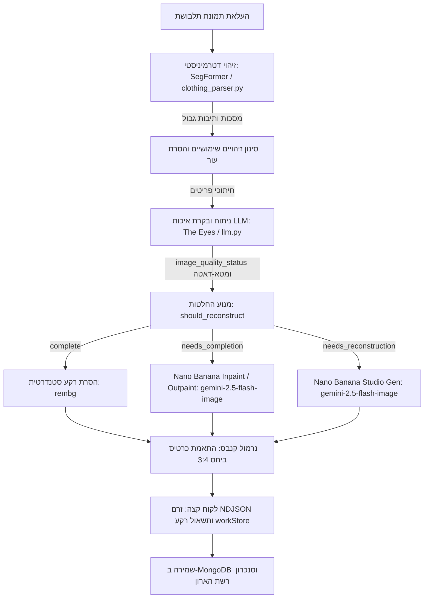

# GarmentVision — מנוע הראייה הממוחשבת וצינור השחזור של DressApp

> **מודול:** `backend/app/services/vision/` ו-`backend/app/services/reconstruction.py`  
> **סטטוס:** סביבת ייצור (פעיל ב-VPS + אירוח עצמי `dressapp-eyes`).  
> **תפקיד:** הפיכת כל תמונת משתמש (סלפי מראה, צילום תלבושת מלא או תצוגה שטוחה - Flat Lay) לפריטי ארון מבודדים, מתויגים, ללא רקע ומשוחזרים ברמת סטודיו באמצעות בינה מלאכותית.

---

## 1. תמצית מנהלים והצעת ערך

### סקירה כללית
GarmentVision מהווה את ליבת הראייה והאינטליגנציה האופטית של DressApp. זהו צינור עיבוד רב-שלבי מקצה לקצה הקולט תמונות משתמש בלתי מוגבלות ומפיק פריטי מלתחה חתוכים, נקיים ופוטו-ריאליסטיים. המערכת מבוססת על ארכיטקטורת AI היברידית, המשלבת סגמנטציה דטרמיניסטית מהירה (SegFormer `b3_clothes`) והסרת רקע מתקדמת (`u2netp` / rembg) יחד עם הסקת מסקנות מולטי-מודאלית עמוקה (Gemini) ושחזור תמונה גנרטיבי (Nano Banana / `gemini-2.5-flash-image`).

כאשר בגדים בתמונות מוסתרים על ידי שיער, תיקים, ידיים או נחתכים על ידי מסגרת המצלמה, **בודק האיכות של ה-AI** מאבחן את הפגם ומפעיל באופן אוטומטי **השלמת תמונה** (Inpainting/Outpainting של שוליים, שרוולים וצווארונים חסרים) או **שחזור סטודיו מלא** (יצירה מחדש של פריטים קטועים לתמונות קטלוג מסחר אלקטרוני עצמאיות ומושלמות).

### תרשים ארכיטקטורה



### הצעת ערך למשתמשים
- **קליטת פריטים מרובים ללא מאמץ:** העלאת תמונת סלפי אחת באורך מלא מאפשרת בידוד אוטומטי של כל ג'קט, חולצה, חצאית, מכנסיים, נעליים ואביזר בתוך שניות.
- **הצגה מושלמת באיכות סטודיו:** פריטי לבוש המוסתרים על ידי גפיים או תיקים מושלמים אוטומטית; פריטים חתוכים (כגון נעליים קטועות או מעילים חלקיים) משוחזרים במלואם לצילום סטודיו שטוח ומקצועי.
- **בקר איכות חזותי חכם:** מערכת Eyes בוחנת אוטומטית כל חיתוך לאיתור קצוות חתוכים, חסימות וקווי מתאר חסרים, וחוסכת עריכת תמונות ידנית.
- **אופטימיזציה אסינכרונית:** שחזורים גנרטיביים מתבצעים ברקע, מה שמבטיח קליטת תמונה ראשונית מהירה תוך פחות מ-5 שניות.

---

## 2. מדריך למשתמש

### טופולוגיית ממשק חזותי
```text
┌────────────────────────────────────────────────────────────────────────┐
│  [ הוספת בגדים — מצלמה והעלאה ]                                       │
│  ┌──────────────────────────────────────────────────────────────────┐  │
│  │  [מצלמה חיה / אזור גרירת קבצים]                                 │  │
│  │  "צילום או העלאה של תמונות גוף מלא, צילום שטוח או קבלות"        │  │
│  └──────────────────────────────────────────────────────────────────┘  │
│                                                                        │
│  [ זרם עיבוד: זיהוי ובקרת איכות ]                                    │
│  ┌─────────────────┐  ┌─────────────────┐  ┌─────────────────┐         │
│  │ חיתוך עליונית   │  │ חיתוך חלק תחתון │  │ חיתוך הנעלה     │         │
│  │ [Needs Inpaint] │  │ [Needs Outpaint]│  │ [Reconstruct]   │         │
│  │ "ג'קט אופנוענים"│  │ "חצאית טול"     │  │ "נעלי מיולז"    │         │
│  └─────────────────┘  └─────────────────┘  └─────────────────┘         │
│                                                                        │
│  [ רשת ארון שמורה: רענון אוטומטי בזמן אמת דרך workStore ]             │
│  ┌─────────────────┐  ┌─────────────────┐  ┌─────────────────┐         │
│  │ ג'קט שלם        │  │ חצאית משוחזרת   │  │ הנעלת סטודיו    │         │
│  │ (שרוולים מלאים) │  │ (שוליים מלאים)  │  │ (זוג נעלי עקב)  │         │
│  └─────────────────┘  └─────────────────┘  └─────────────────┘         │
└────────────────────────────────────────────────────────────────────────┘
```

### מצבי עבודה ושלבים
1. **צילום אינטראקטיבי וקליטה באצווה:**
   - לחיצה על **הוספת פריט** &rarr; צילום או העלאת תמונה המכילה בגד אחד או יותר.
   - המערכת מבצעת בדיקת כפילויות מקדימה בזמן אמת (SHA-256 באמצעות `crypto.subtle` ו-Perceptual Hashing) לזיהוי מיידי של תמונות שהועלו בעבר.
2. **הערכת איכות באמצעות AI:**
   - בעת חיתוך המקטעים על ידי SegFormer, בודק האיכות של Gemini בוחן כל פריט:
     - `complete`: הפריט גלוי במלואו, אינו מוסתר וממורכז. נשמר כפי שהוא.
     - `needs_completion`: לפריט יש אזורים מוסתרים, קצוות חסרים, צווארון חתוך או שוליים קטועים. נכנס לתור להשלמת Inpainting/Outpainting מבוסס AI.
     - `needs_reconstruction`: הפריט קטוע באופן משמעותי (למשל, רק קצות הנעליים נראים). נכנס לתור ליצירת שחזור סטודיו מלא.
3. **השלמה שקופה ברקע:**
   - עם הלחיצה על **שמירה**, הפריטים מופיעים מיד ברשת הארון.
   - משימות רקע מבצעות את השלמת התמונה הגנרטיבית מבלי להקפיא את הממשק. עם סיומן, `workStore` מעדכן את כרטיס הפריט בזמן אמת.

---

## 3. ארכיטקטורה טכנולוגית ומעמיקה

### תזמור מרכזי והיגיון AI
- **מנוע סגמנטציה (`clothing_parser.py`):** משתמש במודל SegFormer שעבר כוונון עדין על מאגרי האופנה ATR / LIP לזיהוי של עד 18 מחלקות לבוש, תוך חיסור מסכת עור וגישור מורפולוגי של כתפיות ורצועות.
- **הנחיות בקרת איכות (`llm.py`):** סכמת פלט JSON מובנית המגדירה `image_quality_status`, `image_quality_reason` ו-`reconstruction_prompt`.
- **מנוע החלטות (`reconstruction.py`):** מעריך את סטטוס ה-LLM יחד עם מנגנון הגנה גיאומטרי של נגיעה בשולי התמונה (`_EDGE_TOUCH_MARGIN = 40`), כדי להבטיח שפריטים שנחתכו על ידי מסגרת התמונה לא יוגדרו בטעות כשלמים.
- **מנוע שחזור גנרטיבי (`gemini_image_service.py`):**
  - **השלמה ותיקון (`edit`):** מעביר את התמונה החתוכה יחד עם הנחיה מובנית למודל `gemini-2.5-flash-image` לשימור מרקם הבד, הדוגמה והצבע תוך הרחבת הגיאומטריה החסרה.
  - **יצירת סטודיו (`generate`):** מנחה את `gemini-2.5-flash-image` עם מטא-דאטה תיאורי מלא (סוג פריט, בד, צבע, אבזמים/כפתורים, מחשוף) להפקת צילום קטלוגי מושלם על רקע לבן-שבור.

### סנכרון צד לקוח (`workStore.js` ו-`itemImage.js`)
- **רזולוציית תמונה מרכזית (`itemImage.js`):** הפונקציה `bestImageUrl()` מעניקה עדיפות עליונה ל-`reconstructed_image_url`, מה שמבטיח שתמונות משוחזרות יחליפו מיד את התמונות הממוזערות הגולמיות.
- **תשאול רב-דפי (`workStore.js`):** עוקב באופן גלובלי אחר משימות שחזור ברקע לאורך כל הניווט באפליקציה, ומעדכן אוטומטית את המסמכים ב-`closetStore`.
