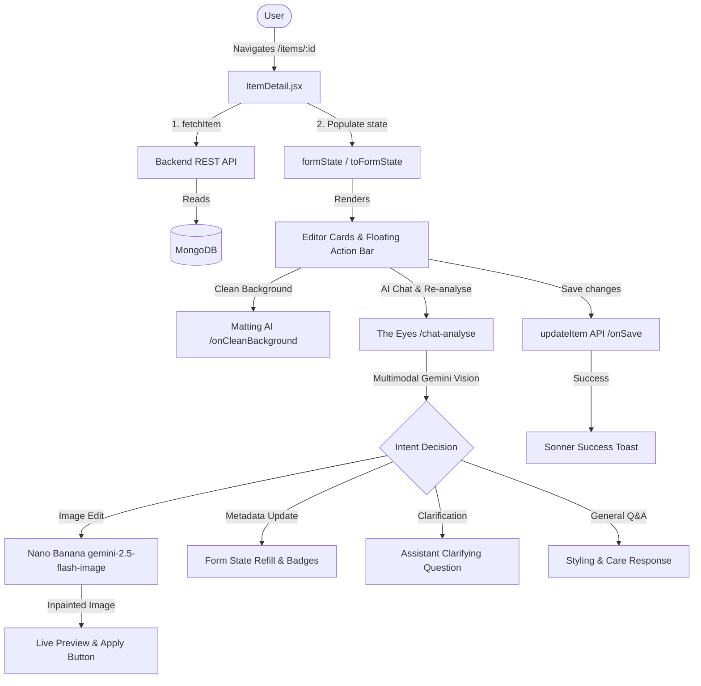

# ארכיטקטורה ומדריך למשתמש: פרטי פריט

מסמך זה מספק סקירה טכנית מקיפה ומדריך תפעולי עבור עמוד **פרטי הפריט** (`ItemDetail.jsx`) ב-DressApp. הוא מכסה את מבנה חוויית המשתמש, זרימת ה-API, שירותי עיבוד ה-AI, מנגנון עריכת התמונות של Nano Banana, סכמות אימות ופרטי בינאום.

---

## 1. תקציר מנהלים והצעת ערך

### סקירה כללית
פאנל **פרטי הפריט** הוא מרכז הבקרה הראשי לניהול פריטי לבוש במלתחה הדיגיטלית. הוא מחבר בין מדיה ויזואלית (תמונות) לבין מטא-דאטה סמנטי (קטגוריה, הרכב בדים, צבעים, מותג, רמת רשמיות והערות). הוא מאפשר למשתמשים לדייק תוצרי AI, לבצע הסרת רקע (matting), להריץ ניתוח חזותי אינטראקטיבי, לבצע השלמת תמונות והסרת עצמים בעזרת **Nano Banana** (`gemini-2.5-flash-image`), ולהגדיר אפשרויות מכירה/החלפה במרקטפלייס.

### זרימה ארכיטקטונית



### הצעת ערך למשתמש
* **עורך בגדים אינטראקטיבי ב-AI**: משתמשים יכולים לפנות ל-**The Eyes** בשפה טבעית כדי לערוך תמונות (*"הסר את הנעליים"*, *"השלם את החור איפה שהייתה היד"*, *"הסר ניטים ממתכת"*).
* **השלמת תמונות מתקדמת (Inpainting)**: **Nano Banana** מתקן אזורים חסרים או חתוכים, תוך שמירה מלאה על מרקם הבד, הגזרה וההדפס ללא עיוותים.
* **שיחות הבהרה חכמות**: The Eyes שואל שאלות ממוקדות כאשר ההנחיות עמומות, כדי למנוע שימוש מיותר בקרדיטים.
* **דיוק מלתחה קל ונוח**: כרטיסיות מובנות מקבצות מאפיינים בצורה הגיונית ומונעות עומס.
* **הסרת רקע מדויקת**: הפרדת רקע נאמנה למקור ללא עיוותים או המצאות גנרטיביות.
* **תמיכה מלאה ב-13 שפות**: התאמת כיווניות מלאה (RTL) ותרגום מדויק בכל השפות באמצעות `i18next`.

---

## 2. מדריך למשתמש

### מבנה הממשק הוויזואלי

```
+--------------------------------------------------------------------------+
|  <- (Back)                                         (Undo) (Save) (Up)    |
+------------------------------------+-------------------------------------+
| LEFT COLUMN (Visual & AI Actions)  | RIGHT COLUMN (Metadata Editor)      |
|                                    |                                     |
| [ GARMENT PHOTO & CAMERA ]         | [ IDENTITY CARD ]                   |
| [ CLEAN BACKGROUND CARD ]          | [ TAXONOMY CARD ]                   |
| [ RE-ANALYSE & AI EYES CHAT ]      | [ COMPOSITION CARD ]                |
|   - Quick Prompts & Chat Box       | [ QUALITY & WEAR CARD ]             |
|   - Live Nano Banana Preview       | [ PRICING & INTENT CARD ]           |
| [ DPP PROVENANCE PANEL ]           | [ ORGANIZATION CARD ]               |
+------------------------------------+-------------------------------------+
```

### מצבי עבודה ושלבים

#### 1. החלפת תמונה וצילום
* משתמשים יכולים להחליף את תמונת הבגד דרך `memberPhotoInputRef`.
* לחיצה על **החלף תמונה** פותחת את בוחר הקבצים. לחיצה על **צלם תמונה** מפעילה את המצלמה ישירות.

#### 2. ניקוי רקע (הסרת רקע לא-גנרטיבית)
* הסרת רקע פועלת ברקע עם סרגל התקדמות בזמן אמת.
* אם הופעל בעבר, הכפתור משתנה ל-**נקה שוב**.

#### 3. ניתוח מחדש ועוזר AI אינטראקטיבי (The Eyes)
* **הנחיות בשפה חופשית**: הקלד או דבר ישירות לתיבת ההנחיות:
  * *"הסר את הנעליים"*
  * *"השלם את החור איפה שהייתה היד"*
  * *"הסר את ניטים ממתכת מחזית הז'קט"*
  * *"עדכן את הרכב הבד ל-100% קשמיר"*
* **הצעות מהירות**: כפתורי קיצור מאפשרים שליחה בנגיעה אחת (🪄 הסר נעליים, ✂️ השלם חור, 💎 הסר ניטים, 🔍 עדכן הרכב בד).
* **עריכת תמונה עם Nano Banana**: בקשות לשינוי ויזואלי מפעילות את `gemini-2.5-flash-image`, ומציגות תצוגה מקדימה בצ'אט עם כפתור **"החל כתמונת הבגד"**.
* **סנכרון מאפיינים**: The Eyes מעדכן ישירות את שדות הטופס עם תגי אישור ויזואליים.
* **ניתוח מחדש מלא בלחיצה אחת**: כפתור ייעודי בתחתית הכרטיסייה מאפשר ניתוח אוטומטי מהיר.

#### 4. עורך טקסונומיה והרכב בד
* רשימות משוקללות מאפשרות להגדיר אחוזים לצבעים ולבדים.
* שדות ריקים מסומנים במסגרת אדומה (`border-red-400 dark:border-red-900`) כחיווי ברור.

#### 5. הכתבה קולית (Speech-To-Text)
* תיבת ההנחיות ושדות כמו **מסורת** תומכים בהכתבה קולית דרך ה-Web Speech API בהתאמה לשפת המשתמש.

---

## 3. חלונות מודאליים והתראות

### 1. דיאלוג בחירת פריטי לבוש משלימים (`addOpen`)
* **מטרה**: שיוך פריטי לבוש אחרים כסטים או שכבות.
* **מבנה**: רשימה נגללת עם תיבות סימון בעיצוב Glassmorphism.

### 2. אזהרת שער טקסונומיה (`gatekeeperOpen`)
* **מטרה**: מניעת שינוי שגוי של קטגוריית האב (כגון מעבר מחולצה למכנסיים).

### 3. דיאלוג אישור מחיקה (`AlertDialog`)
* **מטרה**: מניעת מחיקה שגויה של פריט בעדכון אופטימי מיידי.

---

## 4. ארכיטקטורה טכנולוגית ומנועי AI

* **מנוע החלטות רב-מודאלי (`POST /api/v1/closet/{item_id}/chat-analyse`)**:
  - שימוש ב-`GeminiClient` לניתוח התמונה, המטא-דאטה והיסטוריית השיחה.
  - ניתוב אוטומטי ל-`image_edit`, `clarification`, `metadata_update`, או `answered`.
* **מנוע Inpainting של Nano Banana (`GeminiImageService.edit`)**:
  - מופעל ע"י `gemini-2.5-flash-image` עם התניה ויזואלית על בסיס הפיקסלים המקוריים.
* **ניהול מצב וסנכרון**:
  - ניהול ב-React State מקומי. שינויי תמונה נשמרים בזיכרון עד לחיצה על **שמור** לשמירה ב-MongoDB.
* **סנכרון מלא ל-13 שפות**:
  - כיסוי מלא ב-JSON ויישור RTL מלא.
