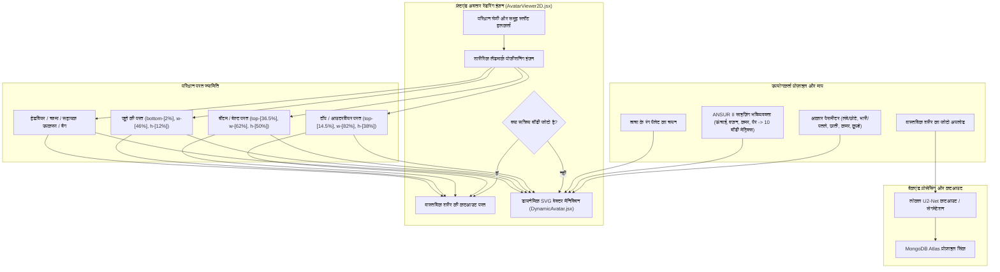

# DressApp — 2D अवतार और ट्राई-ऑन पोजीशनिंग सिस्टम आर्किटेक्चर (`Avatar.md`)

> **दस्तावेज़ संस्करण:** 2.0  
> **लक्ष्य सबसिस्टम:** फ्रंटएंड 2D मैनिक्विन, रियल बॉडी फोटो कटआउट और गारमेंट ओवरले इंजन  
> **मुख्य फाइलें:** `AvatarViewer2D.jsx`, `DynamicAvatar.jsx`, `OutfitCanvas.jsx`, `Profile.jsx`  
> **स्थिति:** प्रोडक्शन में जारी और कैलिब्रेटेड  

---

## 1. कार्यकारी सारांश और मूल्य प्रस्ताव

### 1.1 उच्च-स्तरीय अवलोकन
**DressApp 2D अवतार और ट्राई-ऑन पोजीशनिंग सिस्टम** एक अनुकूलन योग्य, वास्तविक समय दृश्य ट्राई-ऑन वातावरण प्रदान करता है। यह उपयोगकर्ताओं को या तो **कटआउट वास्तविक शरीर की तस्वीर** पर या **गतिशील रूप से विकृत 2D बेजियर वेक्टर SVG मैनिक्विन** पर अपने अलमारी के कपड़ों को सहजता से ओवरले करके देखने की अनुमति देता है।

विभिन्न परिधान शैलियों (कंप्रेशन शर्ट, पोलो कॉलर, क्रूनेक, लो-राइज जीन्स, कार्गो शॉर्ट्स और औपचारिक कपड़े) में उच्च दृश्य सटीकता देने के लिए, इंजन शारीरिक लैंडमार्क अंशांकन, आनुपातिक अनुपात स्केलिंग और बिना किसी विकृति वाले छवि ओवरले कंटेनरों का उपयोग करता है।



### 1.2 उपयोगकर्ता मूल्य प्रस्ताव
* **शारीरिक संरेखण सटीकता**: शर्ट के कॉलर को अवतार की नेकलाइन (`top-[14.5%]`) और शॉर्ट्स/पैंट के कमरबंद को प्राकृतिक कमर रेखा (`top-[36.5%]`) से पूरी तरह मिलाता है, जिससे चेहरे पर झुकाव या अवांछित अंतराल समाप्त हो जाता है।
* **दोहरे अवतार का लचीलापन**: एक व्यक्तिगत कटी हुई पूर्ण-शरीर तस्वीर और सटीक एन्थ्रोपोमेट्रिक मापों पर निर्मित एक गतिशील 2D वेक्टर SVG मैनिक्विन के बीच तुरंत स्विच करें।
* **आनुपातिक पहलू संरक्षण**: परिधान की मूल छवि पहलू अनुपात (`object-fit: contain`) को बनाए रखते हुए छाती और कूल्हे की चौड़ाई स्केलिंग ($scaleX$) लागू करता है, अवांछित खिंचाव या सिकुड़न को रोकता है।
* **इंटरएक्टिव परत पदानुक्रम**: इनर टॉप्स और ड्रेसेस के ऊपर आउटरवियर को स्टैक करें, जबकि व्यक्तिगत परिधान परतों पर क्लिक करके आइटम विवरण खोलें।

---

## 2. व्यापक उपयोगकर्ता मैनुअल और इंटरफ़ेस टोपोलॉजी

### 2.1 दृश्य इंटरफ़ेस टोपोलॉजी

```
┌──────────────────────────────────────────────────────────────────┐
│                     2D अवतार ट्राई-ऑन कैनवास                     │
├──────────────────────────────────────────────────────────────────┤
│                                                                  │
│                        [ टोपी/हेडवियर (top: 1%) ]                │
│                        [ चश्मा        (top: 11%) ]               │
│                        [ नेकलाइन      (top: 14.5%) ] ◄─ कॉलर    │
│                     ┌──────────────────────────┐                 │
│                     │   ऊपरी कपड़े / जैकेट     │                 │
│                     │       (height: 38%)      │                 │
│                     └──────────────────────────┘                 │
│                        [ कमर रेखा     (top: 36.5%) ] ◄─ कमरबंद   │
│                     ┌──────────────────────────┐                 │
│                     │   निचले कपड़े / शॉर्ट्स   │                 │
│                     │       (height: 50%)      │                 │
│                     │                          │                 │
│                     └──────────────────────────┘                 │
│                        [ पैर          (bottom: 2%) ] ◄─── जूते   │
│                        [ जूते         (height: 12%) ]            │
│                                                                  │
├──────────────────────────────────────────────────────────────────┤
│ [ अवतार मोड बदलें ]  [ त्वचा का रंग चुनें ]  [ माप संपादित करें ]  │
└──────────────────────────────────────────────────────────────────┘
```

### 2.2 मोड और वर्कफ़्लो गाइड

#### मोड 1: वास्तविक शरीर फोटो कटआउट परत
1. **प्रोफ़ाइल सेटिंग्स** (`/me`) खोलें।
2. एक पूर्ण-शरीर तस्वीर अपलोड करें। बैकएंड पृष्ठभूमि के शोर को हटाने के लिए `rembg` (U2-Net) के माध्यम से पृष्ठभूमि विभाजन निष्पादित करता है।
3. प्रसंस्कृत कटआउट URL (`body_photo_url`) MongoDB में उपयोगकर्ता प्रोफ़ाइल को अपडेट करता है और `AvatarViewer2D` कंटेनर के अंदर रेंडर होता है।
4. वेक्टर मैनिक्विन पर वापस लौटने के लिए, प्रोफ़ाइल पृष्ठ पर **फोटो हटाएं** पर क्लिक करें। यूआई बिना किसी पेज रीलोड के तुरंत अपडेट होता है।

#### मोड 2: डायनेमिक वेक्टर SVG मैनिक्विन
1. जब कोई बॉडी फोटो मौजूद नहीं होती है, तो `AvatarViewer2D` `DynamicAvatar.jsx` को रेंडर करता है।
2. मैनिक्विन एक निश्चित `0 0 200 450` SVG viewBox के अंदर निरंतर क्यूबिक बेजियर वक्र ($C$ और $S$ कमांड) उत्पन्न करता है।
3. शरीर के मापदंडों (ऊंचाई, वजन, कमर, छाती, कंधे, कूल्हे) को समायोजित करना या त्वचा टोन का चयन करना मैनिक्विन सिल्हूट को वास्तविक समय में गतिशील रूप से बदलता है।

---

## 3. प्रौद्योगिकी स्टैक और गहन विश्लेषण

### 3.1 एनाटोमिकल इलिप्से डिवाइडर और बेजियर मैनिक्विन जनरेटर

`DynamicAvatar.jsx` **एनाटोमिकल इलिप्से डिवाइडर** ($\text{DIVISOR} = 2.65$) का उपयोग करके 3D शारीरिक परिधियों से 2D समतल प्रक्षेपण चौड़ाई की गणना करता है:

$$\begin{aligned}
w_{\text{shoulders}} &= (\text{shoulders} \times 1.1) \times (1.05 \text{ if male else } 0.95) \\
w_{\text{chest}} &= \left(\frac{\text{chest}}{2.65} \times 1.05\right) \times (1.02 \text{ if male else } 1.0) \\
w_{\text{waist}} &= \left(\frac{\text{waist}}{2.65} \times 1.0\right) \times (0.98 \text{ if male else } 0.90) \\
w_{\text{hip}} &= \left(\frac{\text{hip}}{2.65} \times 1.05\right) \times (0.93 \text{ if male else } 1.05)
\end{aligned}$$

शरीर के सिल्हूट का निर्माण SVG पथ कमांड के माध्यम से क्यूबिक बेजियर नियंत्रण बिंदुओं को मैप करके किया जाता है:

```javascript
// Bezier contour snippet from DynamicAvatar.jsx
const bodyPath = [
  `M ${pNeckR}`,
  `C ${X0 + wNeck + (wShoulders - wNeck) * 0.6},${yChin + neckHeight * 0.7} ${X0 + wShoulders * 0.9},${yShoulders - 2} ${pShoulderR}`,
  `C ${X0 + wShoulders * 0.95},${yShoulders + (yChest - yShoulders) * 0.6} ${X0 + wChest + 2},${yChest - 5} ${pChestR}`,
  `C ${X0 + wChest - 1},${yChest + (yWaist - yChest) * 0.5} ${X0 + wWaist + (isMale ? 1 : -2)},${yWaist - 8} ${pWaistR}`,
  `C ${X0 + wWaist + (isMale ? 2 : 5)},${yWaist + (yHip - yWaist) * 0.4} ${X0 + wHip + 1},${yHip - 8} ${pHipR}`,
  ...
].join(' ');
```

### 3.2 कैलिब्रेटेड लैंडमार्क पोजीशनिंग और कंटेनर CSS अनुपात

यह सुनिश्चित करने के लिए कि कपड़े चेहरे के भावों को ढके बिना या शरीर में अंतराल छोड़े बिना पूरी तरह फिट बैठें, `AvatarViewer2D.jsx` में ओवरले कंटेनर सटीक CSS स्थितिगत अनुपातों से बंधे हैं:

| परिधान श्रेणी | CSS स्थिति क्लास | z-Index | संरेखण लैंडमार्क |
| --- | --- | --- | --- |
| **टोपी/हेडवियर** | `top-[1%] left-1/2 w-[34%] aspect-square` | `z-30` | सिर का शीर्ष |
| **चश्मा** | `top-[11%] left-1/2 w-[18%] h-[4.5%]` | `z-28` | आंखों का स्तर |
| **सहायक उपकरण / हार** | `top-[14.5%] left-1/2 w-[30%] aspect-square` | `z-25` | गर्दन का आधार |
| **ऊपरी कपड़ा (Top)** | `top-[14.5%] left-1/2 w-[82%] h-[38%]` | `z-20` | कॉलर से नेकलाइन |
| **जैकेट/आउटरवियर** | `top-[14.5%] left-1/2 w-[86%] h-[42%]` | `z-22` | कंधे पर कोट की परत |
| **ड्रेस** | `top-[14.5%] left-1/2 w-[82%] h-[68%]` | `z-20` | गर्दन से घुटने तक पूर्ण लंबाई |
| **बेल्ट** | `top-[36.5%] left-1/2 w-[62%] h-[5%]` | `z-21` | कमर की बेल्ट लूप |
| **निचला कपड़ा (पैंट/शॉर्ट्स)** | `top-[36.5%] left-1/2 w-[62%] h-[50%]` | `z-10` | कमरबंद से कमर रेखा |
| **जूते / फुटवियर** | `bottom-[2%] left-1/2 w-[46%] h-[12%]` | `z-15` | टखने से पैर की सतह |
| **हैंडबैग** | `top-[40%] right-[-5%] w-[40%] h-[30%]` | `z-25` | हाथ गिरने का स्तर |

### 3.3 कपड़ों का आनुपातिक चौड़ाई स्केलिंग

स्थानिक स्थिति के अलावा, परिधान उपयोगकर्ता द्वारा चुने गए शरीर के मापदंडों (भारी, पतला, चौड़ी कमर, चौड़े कूल्हे) के आधार पर क्षैतिज रूप से ($scaleX$) गतिशील रूप से स्केल होते हैं:

```javascript
// Derivation of garment container scale factors in AvatarViewer2D.jsx
const scales = useMemo(() => {
  const heightFactor = 1 + (params.tall * 0.08) - (params.short * 0.08);
  const widthFactor = 1 + (params.heavy * 0.12) - (params.thin * 0.12);
  const chestFactor = 1 + (params.busty * 0.1);
  const waistFactor = 1 + (params.waist_thick * 0.12) - (params.waist_thin * 0.08);
  const hipsFactor = 1 + (params.hips_wide * 0.12) - (params.hips_narrow * 0.08);

  return { height: heightFactor, width: widthFactor, chest: chestFactor, waist: waistFactor, hips: hipsFactor };
}, [params]);

// Passed to Framer Motion animate prop for Top and Bottom:
// Top: scaleX = scales.chest / scales.width
// Bottom: scaleX = scales.hips / scales.width
```

---

## 4. स्थिति और अनुपात सुधार का सारांश मैट्रिक्स

| पहचाछानी गई समस्या | कारण | लागू किया गया सुधार | परिणाम |
| --- | --- | --- | --- |
| **शर्ट का कॉलर चेहरे को ढक रहा था** | ऑफसेट बहुत ऊपर स्थित था (`top-[8.3%]` या `top-[12.8%]`) | ऊपरी कंटेनर ऑफसेट को `top-[14.5%]` पर सेट किया गया | शर्ट का कॉलर अवतार की नेकलाइन पर बिल्कुल सही बैठता है। |
| **पैंट/शॉर्ट्स बहुत नीचे या हेम ओवरलैप थे** | ऑफसेट बहुत नीचे स्थित था (`top-[38.5%]`) | निचले कंटेनर ऑफसेट को `top-[36.5%]` पर सेट किया गया | पैंट का कमरबंद अवतार की प्राकृतिक कमर रेखा पर सही बैठता है। |
| **कपड़ों का विकृत पहलू अनुपात** | अनियंत्रित कंटेनर खिंचाव | आनुपातिक `scaleX` समायोजन के साथ `object-fit: contain` लागू किया गया | बिना किसी क्षैतिज विकृति के परिधान छवि का मूल अनुपात बना रहता है। |
| **फोटो हटाने में देरी** | पृष्ठ स्थिति पुनः प्राप्त करने की आवश्यकता थी | `Profile.jsx` में त्वरित स्थानीय उपयोगकर्ता स्थिति सिंक लागू किया गया | फोटो हटाना बिना किसी यूआई देरी के तुरंत दिखाई देता है। |

---

*Document compiled automatically by Narrator for DressApp.*
