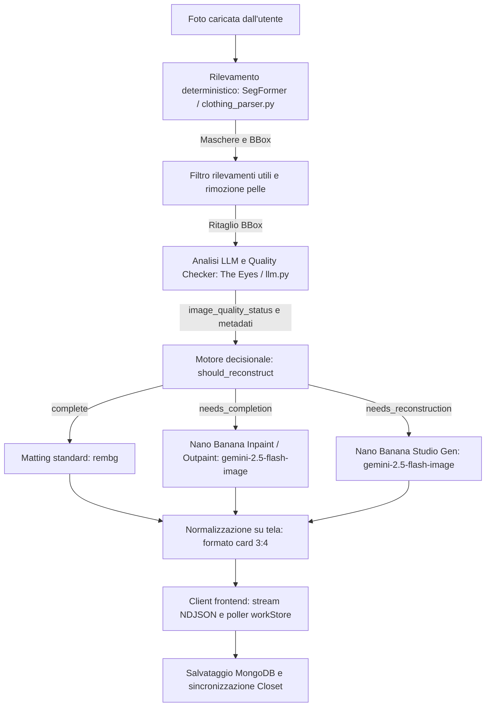

# GarmentVision — La pipeline di visione e ricostruzione di DressApp

> **Modulo:** `backend/app/services/vision/` & `backend/app/services/reconstruction.py`  
> **Stato:** Produzione (attivo su VPS + self-host `dressapp-eyes`).  
> **Ruolo del componente:** Trasforma qualsiasi foto dell'utente (selfie allo specchio, foto a figura intera o capi stesi) in capi d'abbigliamento perfettamente isolati, etichettati e ricostruiti con l'IA.

---

## 1. Sintesi esecutiva e proposta di valore

### Panoramica di alto livello
GarmentVision costituisce il sistema ottico intelligente di DressApp. Si tratta di una pipeline di visione avanzata a più fasi progettata per acquisire immagini dell'utente e generare capi d'abbigliamento puliti, isolati e fotorealistici. Basata su un'architettura ibrida di intelligenza artificiale, combina la segmentazione deterministica ad alta velocità (SegFormer `b3_clothes`) e la rimozione dello sfondo (`u2netp` / rembg) con il ragionamento multimodale profondo (Gemini) e la riparazione generativa delle immagini (Nano Banana / `gemini-2.5-flash-image`).

Quando i capi nelle foto dell'utente risultano coperti da capelli, borse, braccia o tagliati dall'inquadratura, il **Controllo Qualità IA (Quality Checker)** rileva il difetto e avvia automaticamente il **Completamento dell'immagine** (inpaint/outpaint di orli, maniche e colletti mancanti) o la **Ricostruzione Studio Completa** (rigenerazione da zero di capi gravemente mutilati in perfette foto da catalogo e-commerce).

### Flusso architetturale



### Proposta di valore per l'utente
- **Acquisizione rapida multi-capo:** Carica una singola foto a figura intera per estrarre e catalogare automaticamente giacche, maglie, gonne, pantaloni, scarpe e accessori.
- **Resa visiva da studio:** Gli elementi parzialmente occlusi o tagliati vengono completati automaticamente; i capi gravemente mutilati vengono rigenerati come scatti da catalogo.
- **Quality Checker intelligente:** Valutazione automatica dell'integrità del ritaglio per prevenire la memorizzazione di immagini incomplete.
- **Fluidità asincrona:** Le ricostruzioni generative ad alta fedeltà vengono elaborate in background, garantendo un caricamento iniziale rapido.

---

## 2. Manuale operativo

### Schema dell'interfaccia utente
```text
┌────────────────────────────────────────────────────────────────────────┐
│  [ Aggiungi capi — Fotocamera e Caricamento ]                           │
│  ┌──────────────────────────────────────────────────────────────────┐  │
│  │  [Fotocamera dal vivo / Area di caricamento file]                │  │
│  │  "Scatta o carica foto outfit, flat lay o ricevute digitali"     │  │
│  └──────────────────────────────────────────────────────────────────┘  │
│                                                                        │
│  [ Flusso di elaborazione: Rilevamento e Controllo Qualità ]           │
│  ┌─────────────────┐  ┌─────────────────┐  ┌─────────────────┐         │
│  │ Ritaglio Capo   │  │ Ritaglio Gonna  │  │ Ritaglio Scarpe │         │
│  │ [Da completare] │  │ [Da espandere]  │  │ [Ricostruzione] │         │
│  │ "Giacca Biker"  │  │ "Gonna Tulle"   │  │ "Mules Tacco"   │         │
│  └─────────────────┘  └─────────────────┘  └─────────────────┘         │
│                                                                        │
│  [ Griglia guardaroba: Aggiornamento in tempo reale via workStore ]     │
│  ┌─────────────────┐  ┌─────────────────┐  ┌─────────────────┐         │
│  │ Giacca Completa │  │ Gonna Rifinita  │  │ Scarpe Studio   │         │
│  │ (Maniche sane)  │  │ (Orlo completo) │  │ (Coppia intera) │         │
│  └─────────────────┘  └─────────────────┘  └─────────────────┘         │
└────────────────────────────────────────────────────────────────────────┘
```

### Flussi di lavoro
1. **Scatto e caricamento foto:** L'utente seleziona una o più foto. Il pre-flight in-browser (hash SHA-256 e phash medio) previene duplicati accidentali.
2. **Valutazione del Quality Checker:** Gemini valuta lo stato di ciascun capo:
   - `complete`: Capo integro e visibile al 100%.
   - `needs_completion`: Capo con occlusioni o orli/spalle tagliati. Viene inviato al completamento generativo.
   - `needs_reconstruction`: Capo tagliato gravemente (es. solo la punta della scarpa). Viene rigenerato interamente in stile studio.
3. **Completamento in background:** Dopo aver premuto Salva, i capi compaiono subito nel guardaroba e si aggiornano da soli appena terminata l'elaborazione IA.
