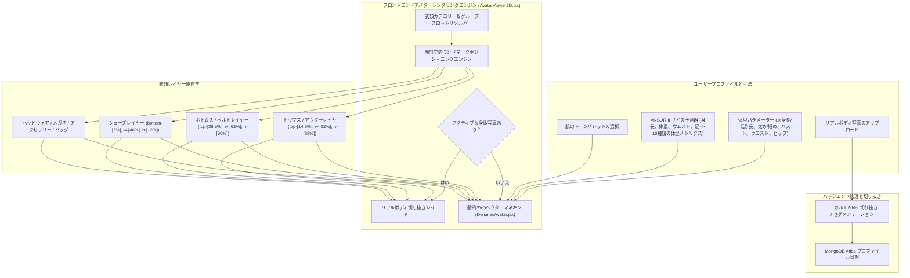

# DressApp — 2Dアバター＆試着ポジショニングシステムアーキテクチャ (`Avatar.md`)

> **ドキュメントバージョン:** 2.0  
> **対象サブシステム:** フロントエンド2Dマネキン、リアルボディ写真切り抜き＆衣類オーバーレイエンジン  
> **コアファイル:** `AvatarViewer2D.jsx`, `DynamicAvatar.jsx`, `OutfitCanvas.jsx`, `Profile.jsx`  
> **ステータス:** 本番稼働中＆調整済み  

---

## 1. エグゼクティブサマリーと価値提案

### 1.1 ハイレベルの概要
**DressApp 2Dアバター＆試着ポジショニングシステム**は、リアルタイムで適応型のビジュアル試着環境を提供します。ユーザーは、**切り抜かれたリアルな身体写真**、または**動的に変形する2DベジェベクターSVGマネキン**の上に、デジタル化されたクローゼットの衣類をスムーズに重ね合わせてプレビューできます。

多様な衣服スタイル（コンプレッションシャツ、ポロシャツの襟、クルーネック、ローライズジーンズ、カーゴショーツ、フォーマルドレスなど）にわたって高い視覚的精度を提供するために、エンジンは解剖学的ランドマーク校正、比例比率スケーリング、および歪みのない画像オーバーレイコンテナを利用しています。



### 1.2 ユーザー価値提案
* **解剖学的配置の精度**: シャツの襟をアバターのネックライン（`top-[14.5%]`）に、ショーツ/パンツのウエストバンドを自然なウエストライン（`top-[36.5%]`）にぴったり合わせ、顔の重なりや不自然な隙間を排除します。
* **デュアルアバターの柔軟性**: セグメント化された個人用の全身写真と、正確な人体測定値に基づいて構築された動的2DベクターSVGマネキンを瞬時に切り替えられます。
* **比例アスペクト比の保持**: 衣類画像の本来のアスペクト比（`object-fit: contain`）を維持しながら、胸囲とヒップ幅のスケーリング（$scaleX$）を適用し、不必要な引き伸ばしや圧縮を防ぎます。
* **インタラクティブなレイヤー階層構造**: インナートップスやドレスの上にアウターウェアを重ねつつ、個々の衣類レイヤーを直接タップ/クリックしてアイテムの詳細を開くことができます。

---

## 2. 包括的ユーザーマニュアルとインターフェース構造

### 2.1 ビジュアルインターフェース構造

```
┌──────────────────────────────────────────────────────────────────┐
│                      2D アバター試着キャンバス                   │
├──────────────────────────────────────────────────────────────────┤
│                                                                  │
│                        [ ヘッドウェア (top: 1%) ]                │
│                        [ メガネ       (top: 11%) ]               │
│                        [ ネックライン (top: 14.5%) ] ◄─ シャツ襟  │
│                     ┌──────────────────────────┐                 │
│                     │     トップス / アウター   │                 │
│                     │       (height: 38%)      │                 │
│                     └──────────────────────────┘                 │
│                        [ ウエスト     (top: 36.5%) ] ◄─ ウエスト   │
│                     ┌──────────────────────────┐                 │
│                     │    ボトムス / ショーツ   │                 │
│                     │       (height: 50%)      │                 │
│                     │                          │                 │
│                     └──────────────────────────┘                 │
│                        [ 足           (bottom: 2%) ] ◄── 履物    │
│                        [ シューズ     (height: 12%) ]            │
│                                                                  │
├──────────────────────────────────────────────────────────────────┤
│ [ モード切り替え ]   [ 肌トーン選択 ]   [ 体型メトリクス編集 ]    │
└──────────────────────────────────────────────────────────────────┘
```

### 2.2 モードとワークフローのチュートリアル

#### モード 1: リアルボディ写真切り抜きレイヤー
1. **プロファイル設定**（`/me`）を開きます。
2. 全身写真をアップロードします。バックエンドは `rembg`（U2-Net）を介して背景セグメンテーションを実行し、背景のノイズを除去します。
3. 処理された切り抜き画像URL（`body_photo_url`）がMongoDB内のユーザープロファイルを更新し、`AvatarViewer2D`コンテナ内にレンダリングされます。
4. ベクターマネキンに戻すには、プロファイルページで**写真を削除**をクリックします。UIはページをリロードすることなく瞬時に更新されます。

#### モード 2: 動的ベクターSVGマネキン
1. 身体写真が存在しない場合、`AvatarViewer2D`は `DynamicAvatar.jsx` をレンダリングします。
2. マネキンは、固定された `0 0 200 450` SVG viewBox 内で連続する3次ベジェ曲線（$C$ および $S$ コマンド）を生成します。
3. 身体パラメーター（身長、体重、ウエスト、胸囲、肩幅、ヒップ）を調整するか、肌のトーンを選択すると、マネキンのシルエットがリアルタイムで動的に変化します。

---

## 3. テクノロジースタックと機能の深掘り

### 3.1 解剖学的楕円ディバイダーとベジェマネキンジェネレーター

`DynamicAvatar.jsx` は、**解剖学的楕円ディバイダー**（$\text{DIVISOR} = 2.65$）を使用して、3D解剖学的外周から2D平面投影幅を計算します。

$$\begin{aligned}
w_{\text{shoulders}} &= (\text{shoulders} \times 1.1) \times (1.05 \text{ if male else } 0.95) \\
w_{\text{chest}} &= \left(\frac{\text{chest}}{2.65} \times 1.05\right) \times (1.02 \text{ if male else } 1.0) \\
w_{\text{waist}} &= \left(\frac{\text{waist}}{2.65} \times 1.0\right) \times (0.98 \text{ if male else } 0.90) \\
w_{\text{hip}} &= \left(\frac{\text{hip}}{2.65} \times 1.05\right) \times (0.93 \text{ if male else } 1.05)
\end{aligned}$$

身体のシルエットは、3次ベジェ制御点をマッピングするSVGパスコマンドを介して構築されます。

```javascript
// Bezier contour snippet from DynamicAvatar.jsx
const bodyPath = [
  `M ${pNeckR}`,
  `C ${X0 + wNeck + (wShoulders - wNeck) * 0.6},${yChin + neckHeight * 0.7} ${X0 + wShoulders * 0.9},${yShoulders - 2} ${pShoulderR}`,
  `C ${X0 + wShoulders * 0.95},${yShoulders + (yChest - yShoulders) * 0.6} ${X0 + wChest + 2},${yChest - 5} ${pChestR}`,
  `C ${X0 + wChest - 1},${yChest + (yWaist - yChest) * 0.5} ${X0 + wWaist + (isMale ? 1 : -2)},${yWaist - 8} ${pWaistR}`,
  `C ${X0 + wWaist + (isMale ? 2 : 5)},${yWaist + (yHip - yWaist) * 0.4} ${X0 + wHip + 1},${yHip - 8} ${pHipR}`,
  ...
].join(' ');
```

### 3.2 校正済みランドマーク配置とコンテナCSS比率

顔のパーツを覆ったり、体に隙間を作ったりすることなく衣類をぴったりフィットさせるために、`AvatarViewer2D.jsx` のオーバーレイコンテナは正確なCSS位置比率にバインドされています。

| 衣類カテゴリー | CSS位置クラス | z-Index | 配置用解剖学的ランドマーク |
| --- | --- | --- | --- |
| **ヘッドウェア** | `top-[1%] left-1/2 w-[34%] aspect-square` | `z-30` | 頭頂部 |
| **メガネ** | `top-[11%] left-1/2 w-[18%] h-[4.5%]` | `z-28` | 目の水平線 |
| **アクセサリー / ネックレス** | `top-[14.5%] left-1/2 w-[30%] aspect-square` | `z-25` | 首の付け根 |
| **トップス (Top)** | `top-[14.5%] left-1/2 w-[82%] h-[38%]` | `z-20` | 襟からネックライン |
| **アウターウェア** | `top-[14.5%] left-1/2 w-[86%] h-[42%]` | `z-22` | 肩にかかるコートのレイヤリング |
| **ドレス** | `top-[14.5%] left-1/2 w-[82%] h-[68%]` | `z-20` | 首元から膝までのフルレングス |
| **ベルト** | `top-[36.5%] left-1/2 w-[62%] h-[5%]` | `z-21` | ウエスト位置のベルトループ |
| **ボトムス (パンツ/ショーツ)** | `top-[36.5%] left-1/2 w-[62%] h-[50%]` | `z-10` | ウエストバンドからウエストライン |
| **シューズ / 履物** | `bottom-[2%] left-1/2 w-[46%] h-[12%]` | `z-15` | 足首から足底面 |
| **ハンドバッグ** | `top-[40%] right-[-5%] w-[40%] h-[30%]` | `z-25` | 腕を下げた位置 |

### 3.3 衣類の比例幅スケーリング

空間的な配置に加えて、ユーザーが選択した身体パラメーター（胸囲が大きい、太め、細め、ウエストが太い、ヒップが広い）に基づいて、衣類は水平方向（$scaleX$）に動的にスケールされます。

```javascript
// Derivation of garment container scale factors in AvatarViewer2D.jsx
const scales = useMemo(() => {
  const heightFactor = 1 + (params.tall * 0.08) - (params.short * 0.08);
  const widthFactor = 1 + (params.heavy * 0.12) - (params.thin * 0.12);
  const chestFactor = 1 + (params.busty * 0.1);
  const waistFactor = 1 + (params.waist_thick * 0.12) - (params.waist_thin * 0.08);
  const hipsFactor = 1 + (params.hips_wide * 0.12) - (params.hips_narrow * 0.08);

  return { height: heightFactor, width: widthFactor, chest: chestFactor, waist: waistFactor, hips: hipsFactor };
}, [params]);

// Passed to Framer Motion animate prop for Top and Bottom:
// Top: scaleX = scales.chest / scales.width
// Bottom: scaleX = scales.hips / scales.width
```

---

## 4. 位置＆比例補正の要約マトリクス

| 特定された問題 | 原因 | 適用された修正 | 結果 |
| --- | --- | --- | --- |
| **シャツの襟が顔に重なる** | オフセット位置が高すぎた（`top-[8.3%]` または `top-[12.8%]`） | 上部コンテナオフセットを `top-[14.5%]` に設定 | シャツの襟がアバターのネックラインにぴったり収まる。 |
| **パンツ/ショーツの位置が低いか裾に重なる** | オフセット位置が低すぎた（`top-[38.5%]`） | 下部コンテナオフセットを `top-[36.5%]` に設定 | パンツのウエストバンドが自然なウエストラインにぴったりフィットする。 |
| **衣類のアスペクト比の歪み** | 制約のないコンテナの引き伸ばし | 比例的な `scaleX` 調整を伴う `object-fit: contain` を適用 | 水平方向の歪みなしに、衣類画像の本来のアスペクト比を維持。 |
| **写真削除時のラグ** | ページ状態の再取得が必要だった | `Profile.jsx` 内で即時のローカルユーザー状態同期を実装 | UIの遅延や壊れた状態なしに写真削除が即座に反映される。 |

---

*Document compiled automatically by Narrator for DressApp.*
