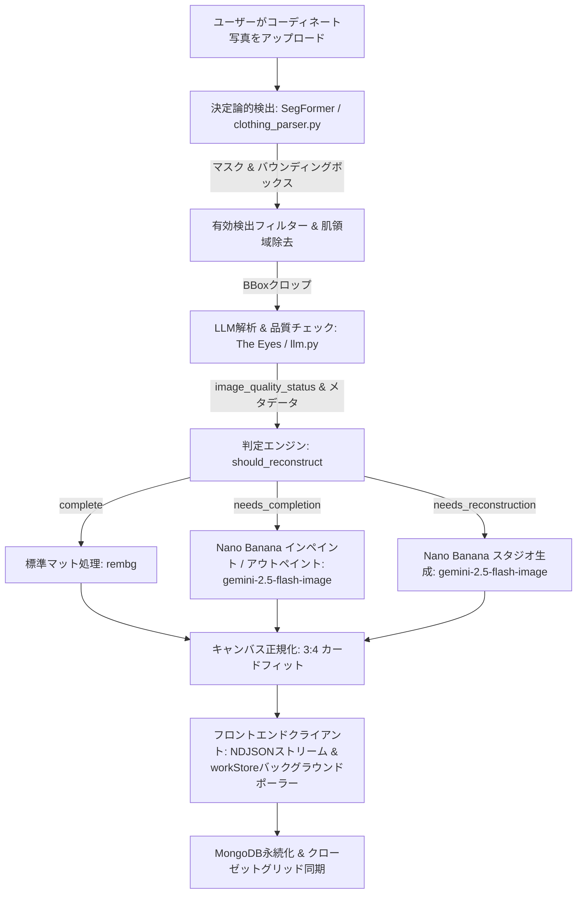

# GarmentVision — DressAppの視覚認識および再構築パイプライン

> **モジュール:** `backend/app/services/vision/` & `backend/app/services/reconstruction.py`  
> **ステータス:** 本番稼働中（VPS + `dressapp-eyes` セルフホスト上で稼働）。  
> **役割:** ユーザーの写真（鏡越しのセルフィー、コーディネートスナップ、平置き写真）を高精度にセグメンテーション、タグ付けし、AIによって美しいクローゼットアイテムへと再構築します。

---

## 1. エグゼクティブサマリーと提供価値

### 全体概要
GarmentVisionは、DressAppの光学インテリジェンスの基幹です。一般的なユーザー写真からクリーンでフォトリアルなワードローブアイテムを自動生成する、エンドツーエンドの多段階ビジョンパイプラインです。ハイブリッドAIアーキテクチャを採用し、高速な決定論的セグメンテーション（SegFormer `b3_clothes`）と背景透過処理（`u2netp` / rembg）に、マルチモーダル推論（Gemini）および生成型画像修復（Nano Banana / `gemini-2.5-flash-image`）を融合させています。

ユーザー写真内の服が髪、バッグ、腕で遮られていたり、カメラのフレームで切れている場合、GarmentVisionの **AI品質チェッカー（AI Quality Checker）** が欠損を検知し、**画像補完（Image Completion）**（裾、袖、襟などの欠落部分をインペイント／アウトペイント）または **フルスタジオ再構築（Full Studio Reconstruction）**（一部しか写っていないアイテムを完璧なECカタログ風写真へと再生成）を自動起動します。

### アーキテクチャフロー



### ユーザーへの提供価値
- **シームレスな複数アイテム同時取り込み:** 全身セルフィーを1枚アップロードするだけで、ジャケット、トップス、スカート、パンツ、靴、アクセサリーを数秒で個別に自動分離。
- **スタジオ品質の美しい仕上がり:** 腕やバッグで隠れた部分を自動補完。靴のつま先やコートの端など欠損したアイテムも完全なスタジオ平置き写真として再構築。
- **インテリジェントな画質チェッカー:** 「The Eyes」が切り抜き・遮蔽・欠損エッジを自動判定し、手動での写真編集の手間をゼロに。
- **非同期ホットパス最適化:** コストの高い生成型再構築をバックグラウンドタスクで実行することで、初期の写真取り込みを5秒未満に抑え軽快なUXを維持。

---

## 2. 包括的ユーザーマニュアル

### ビジュアルインターフェース構成
```text
┌────────────────────────────────────────────────────────────────────────┐
│  [ 服を追加 — カメラ & アップロード ]                                  │
│  ┌──────────────────────────────────────────────────────────────────┐  │
│  │  [ライブカメラ / ファイルドロップゾーン]                          │  │
│  │  「全身写真、平置き写真、またはレシートを撮影・アップロード」     │  │
│  └──────────────────────────────────────────────────────────────────┘  │
│                                                                        │
│  [ 処理ストリーム: 検出 & 品質チェック ]                               │
│  ┌─────────────────┐  ┌─────────────────┐  ┌─────────────────┐         │
│  │ アウター切り抜き│  │ ボトムス切り抜き│  │ フットウェア切り抜き    │
│  │ [インペイント要]│  │ [アウトペイント]│  │ [再構築が必要] │         │
│  │ 「ライダース」  │  │ 「チュールスカート」│「ヒールミュール」│       │
│  └─────────────────┘  └─────────────────┘  └─────────────────┘         │
│                                                                        │
│  [ 保存済みクローゼットグリッド: workStoreによるリアルタイム自動更新 ] │
│  ┌─────────────────┐  ┌─────────────────┐  ┌─────────────────┐         │
│  │ 完全なジャケット│  │ 復元されたスカート│スタジオ靴写真   │         │
│  │ (袖の完全復元)  │  │ (裾・サイドの復元)│(ヒール付きペア) │         │
│  └─────────────────┘  └─────────────────┘  └─────────────────┘         │
└────────────────────────────────────────────────────────────────────────┘
```

### モードとワークフローの手順
1. **インタラクティブな撮影と一括取り込み:**
   - **アイテムを追加（Add Item）** をタップ &rarr; 1つ以上の衣類が写った写真を撮影またはアップロード。
   - 重複アップロードを即座に検出するため、リアルタイムの事前重複チェック（`crypto.subtle` SHA-256 および平均知覚ハッシュ）を実行。
2. **AI品質評価:**
   - SegFormerが切り抜きをセグメント化するのと並行して、Geminiの品質チェッカーが各衣類を検査：
     - `complete`: アイテム全体が遮蔽なく中央に写っている。そのまま保持。
     - `needs_completion`: 一部が隠れている、端が切れている、襟や裾が欠損している。AIインペイント／アウトペイントキューへ投入。
     - `needs_reconstruction`: アイテムの大部分が切れている（例：靴のつま先のみ）。フルスタジオ生成キューへ投入。
3. **シームレスなバックグラウンド補完:**
   - **保存（Save）** をタップすると、衣類は即座にクローゼットグリッドに表示されます。
   - UIをブロックすることなく、バックグラウンドタスクが生成型画像補完を実行。完了次第、`workStore` がカードをリアルタイムに更新します。

---

## 3. テクノロジースタックと機能詳細

### コアオーケストレーション & AI/ロジック
- **セグメンテーションエンジン (`clothing_parser.py`):** ATR / LIPファッションデータセットでファインチューニングされたSegFormerを用いて最大18クラスを認識。スキンマスク減算およびモルフォロジー演算によるストラップ結合を適用。
- **品質チェッカープロンプティング (`llm.py`):** `image_quality_status`、`image_quality_reason`、`reconstruction_prompt` を必須とする構造化JSON出力スキーマ。
- **判定エンジン (`reconstruction.py`):** 画像端判定ガード（`_EDGE_TOUCH_MARGIN = 40`）を組み合わせ、写真の境界で切れている衣類が誤って完全（complete）と判定されるのを防止。
- **生成型修復エンジン (`gemini_image_service.py`):**
  - **インペイント / アウトペイント (`edit`):** クロップデータと構造化プロンプトを `gemini-2.5-flash-image` に渡し、生地の質感・柄・色を維持しながら欠損部分を自然に拡張。
  - **スタジオ生成 (`generate`):** 詳細なメタデータ（衣類タイプ、素材、色、金具、ネックライン）をプロンプトとして `gemini-2.5-flash-image` に渡し、オフホワイト背景の高品質なカタログ写真を生成。

### フロントエンド同期 (`workStore.js` & `itemImage.js`)
- **一元的な画像解決 (`itemImage.js`):** `bestImageUrl()` が `reconstructed_image_url` を最優先とし、AI修復後の画像が一時的な切り抜きサムネイルを即座に上書き。
- **ページ間ポーリング (`workStore.js`):** ページ遷移をまたいでバックグラウンドの再構築タスクをグローバルに追跡し、更新ドキュメントを `closetStore` へ自動反映。
