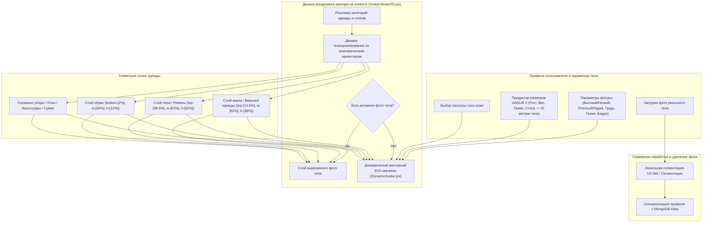

# DressApp — Архитектура системы 2D-аватара и позиционирования примерки (`Avatar.md`)

> **Версия документа:** 2.0  
> **Целевая подсистема:** Frontend 2D-манекен, вырезка фотографий реального тела и движок наложения одежды  
> **Основные файлы:** `AvatarViewer2D.jsx`, `DynamicAvatar.jsx`, `OutfitCanvas.jsx`, `Profile.jsx`  
> **Статус:** Внедрено в продакшн и откалибровано  

---

## 1. Краткое описание и ценность для пользователя

### 1.1 Высокоуровневый обзор
**Система 2D-аватара и позиционирования примерки DressApp** предоставляет адаптивную визуальную среду примерки в реальном времени. Она позволяет пользователям просматривать оцифрованные предметы гардероба, идеально наложенные либо поверх **сегментированной фотографии реального тела**, либо поверх **динамически изменяющегося 2D-векторного SVG-манекена с кривыми Безье**.

Чтобы обеспечить высокую визуальную точность для самых разных стилей одежды (компрессионные футболки, рубашки поло, футболки с круглым вырезом, джинсы с низкой посадкой, шорты-карго и вечерние платья), движок использует калибровку анатомических ориентиров, пропорциональное масштабирование и контейнеры наложения изображений без искажений.



### 1.2 Ценность для пользователя
* **Точность анатомического выравнивания**: Совмещает воротники рубашек точно с линией шеи аватара (`top-[14.5%]`), а пояс брюк/шорт — точно с естественной линией талии (`top-[36.5%]`), исключая перекрытие лица или нежелательные зазоры.
* **Гибкость двух режимов аватара**: Мгновенное переключение между личным вырезанным фото в полный рост и динамическим 2D-векторным SVG-манекеном, построенным по точным антропометрическим измерениям.
* **Сохранение пропорционального соотношения сторон**: Применяет масштабирование ширины груди и бедер ($scaleX$), сохраняя исходное соотношение сторон изображений одежды (`object-fit: contain`), предотвращая сжатие или растяжение.
* **Интерактивная иерархия слоев**: Накладывайте верхнюю одежду поверх футболок и платьев, с возможностью клика/нажатия на отдельные слои одежды для просмотра деталей.

---

## 2. Подробное руководство пользователя и топология интерфейса

### 2.1 Визуальная топология интерфейса

```
┌──────────────────────────────────────────────────────────────────┐
│                   Холст 2D-примерки на аватаре                   │
├──────────────────────────────────────────────────────────────────┤
│                                                                  │
│                        [ Головные уборы (top: 1%) ]              │
│                        [ Очки           (top: 11%) ]             │
│                        [ Вырез шеи      (top: 14.5%) ] ◄─ Ворот  │
│                     ┌──────────────────────────┐                 │
│                     │ Верхи / Верхняя одежда   │                 │
│                     │       (height: 38%)      │                 │
│                     └──────────────────────────┘                 │
│                        [ Линия талии    (top: 36.5%) ] ◄─ Пояс   │
│                     ┌──────────────────────────┐                 │
│                     │      Низы / Шорты        │                 │
│                     │       (height: 50%)      │                 │
│                     │                          │                 │
│                     └──────────────────────────┘                 │
│                        [ Стопы        (bottom: 2%) ] ◄─── Обувь  │
│                        [ Обувь        (height: 12%) ]            │
│                                                                  │
├──────────────────────────────────────────────────────────────────┤
│ [ Сменить режим ]   [ Выбор тона кожи ]   [ Изменить параметры ] │
└──────────────────────────────────────────────────────────────────┘
```

### 2.2 Режимы работы и сценарии использования

#### Режим 1: Слой вырезанной фотографии реального тела
1. Откройте **Настройки профиля** (`/me`).
2. Загрузите фотографию в полный рост. Серверная часть выполнит удаление фона с помощью `rembg` (U2-Net).
3. URL обработанного вырезанного изображения (`body_photo_url`) обновит профиль пользователя в MongoDB и отобразится внутри контейнера `AvatarViewer2D`.
4. Чтобы вернуться к векторному манекену, нажмите **Удалить фото** на странице профиля. Интерфейс обновится мгновенно без перезагрузки страницы.

#### Режим 2: Динамический векторный SVG-манекен
1. При отсутствии фото тела `AvatarViewer2D` рендерит компонент `DynamicAvatar.jsx`.
2. Манекен генерирует непрерывные кубические кривые Безье (команды $C$ и $S$) внутри фиксированного SVG viewBox `0 0 200 450`.
3. Изменение параметров тела (рост, вес, талия, грудь, плечи, бедра) или выбор тона кожи динамически изменяет силуэт манекена в реальном времени.

---

## 3. Технологический стек и технический анализ

### 3.1 Анатомический делитель эллипса и генератор манекена Безье

`DynamicAvatar.jsx` рассчитывает 2D-ширину проекции из 3D-анатомических окружностей с использованием **Анатомического делителя эллипса** ($\text{DIVISOR} = 2.65$):

$$\begin{aligned}
w_{\text{shoulders}} &= (\text{shoulders} \times 1.1) \times (1.05 \text{ if male else } 0.95) \\
w_{\text{chest}} &= \left(\frac{\text{chest}}{2.65} \times 1.05\right) \times (1.02 \text{ if male else } 1.0) \\
w_{\text{waist}} &= \left(\frac{\text{waist}}{2.65} \times 1.0\right) \times (0.98 \text{ if male else } 0.90) \\
w_{\text{hip}} &= \left(\frac{\text{hip}}{2.65} \times 1.05\right) \times (0.93 \text{ if male else } 1.05)
\end{aligned}$$

Силуэт тела конструируется с помощью команд контура SVG, маппящих контрольные точки кубической кривой Безье:

```javascript
// Bezier contour snippet from DynamicAvatar.jsx
const bodyPath = [
  `M ${pNeckR}`,
  `C ${X0 + wNeck + (wShoulders - wNeck) * 0.6},${yChin + neckHeight * 0.7} ${X0 + wShoulders * 0.9},${yShoulders - 2} ${pShoulderR}`,
  `C ${X0 + wShoulders * 0.95},${yShoulders + (yChest - yShoulders) * 0.6} ${X0 + wChest + 2},${yChest - 5} ${pChestR}`,
  `C ${X0 + wChest - 1},${yChest + (yWaist - yChest) * 0.5} ${X0 + wWaist + (isMale ? 1 : -2)},${yWaist - 8} ${pWaistR}`,
  `C ${X0 + wWaist + (isMale ? 2 : 5)},${yWaist + (yHip - yWaist) * 0.4} ${X0 + wHip + 1},${yHip - 8} ${pHipR}`,
  ...
].join(' ');
```

### 3.2 Калиброванное позиционирование и CSS-пропорции контейнеров

Чтобы одежда прилегала идеально, не закрывая черты лица и не оставляя нежелательных зазоров, контейнеры наложения в `AvatarViewer2D.jsx` привязаны к точным позиционным пропорциям CSS:

| Категория одежды | Позиционный класс CSS | z-Index | Анатомический ориентир выравнивания |
| --- | --- | --- | --- |
| **Головные уборы** | `top-[1%] left-1/2 w-[34%] aspect-square` | `z-30` | Макушка головы |
| **Очки** | `top-[11%] left-1/2 w-[18%] h-[4.5%]` | `z-28` | Линия глаз |
| **Аксессуары / Ожерелья** | `top-[14.5%] left-1/2 w-[30%] aspect-square` | `z-25` | Основание шеи |
| **Верх (Top)** | `top-[14.5%] left-1/2 w-[82%] h-[38%]` | `z-20` | От воротника до линии шеи |
| **Верхняя одежда** | `top-[14.5%] left-1/2 w-[86%] h-[42%]` | `z-22` | Наложение пальто/куртки на плечи |
| **Платья** | `top-[14.5%] left-1/2 w-[82%] h-[68%]` | `z-20` | Полная длина от шеи до колена |
| **Ремень** | `top-[36.5%] left-1/2 w-[62%] h-[5%]` | `z-21` | Шлевка для ремня на талии |
| **Низ (Брюки/Шорты)** | `top-[36.5%] left-1/2 w-[62%] h-[50%]` | `z-10` | От пояса брюк до линии талии |
| **Обувь** | `bottom-[2%] left-1/2 w-[46%] h-[12%]` | `z-15` | От лодыжки до плоскости стопы |
| **Сумка** | `top-[40%] right-[-5%] w-[40%] h-[30%]` | `z-25` | Уровень опущенной руки |

### 3.3 Пропорциональное масштабирование ширины одежды

Помимо пространственного позиционирования, одежда динамически масштабируется по горизонтали ($scaleX$) на основе параметров тела пользователя (пышная грудь, плотное телосложение, худой, широкая талия, широкие бедра):

```javascript
// Derivation of garment container scale factors in AvatarViewer2D.jsx
const scales = useMemo(() => {
  const heightFactor = 1 + (params.tall * 0.08) - (params.short * 0.08);
  const widthFactor = 1 + (params.heavy * 0.12) - (params.thin * 0.12);
  const chestFactor = 1 + (params.busty * 0.1);
  const waistFactor = 1 + (params.waist_thick * 0.12) - (params.waist_thin * 0.08);
  const hipsFactor = 1 + (params.hips_wide * 0.12) - (params.hips_narrow * 0.08);

  return { height: heightFactor, width: widthFactor, chest: chestFactor, waist: waistFactor, hips: hipsFactor };
}, [params]);

// Passed to Framer Motion animate prop for Top and Bottom:
// Top: scaleX = scales.chest / scales.width
// Bottom: scaleX = scales.hips / scales.width
```

---

## 4. Сводная матрица исправлений позиционирования и пропорций

| Выявленная проблема | Причина | Примененное исправление | Результат |
| --- | --- | --- | --- |
| **Воротник рубашки перекрывал лицо** | Смещение контейнера слишком высоко (`top-[8.3%]` или `top-[12.8%]`) | Смещение верхнего контейнера установлено в `top-[14.5%]` | Воротник рубашки прилегает ровно к линии шеи аватара. |
| **Брюки/шорты слишком низко или перекрывают подол** | Смещение контейнера слишком низко (`top-[38.5%]`) | Смещение нижнего контейнера установлено в `top-[36.5%]` | Пояс брюк находится ровно на естественной линии талии. |
| **Искажение пропорций одежды** | Неограниченное растяжение контейнера | Применен `object-fit: contain` с пропорциональной регулировкой `scaleX` | Сохраняет исходное соотношение сторон изображений одежды без искажений. |
| **Задержка при удалении фото** | Требовался повторный запрос состояния страницы | Реализована мгновенная локальная синхронизация состояния в `Profile.jsx` | Удаление фото отображается мгновенно без задержек интерфейса. |

---

*Document compiled automatically by Narrator for DressApp.*
