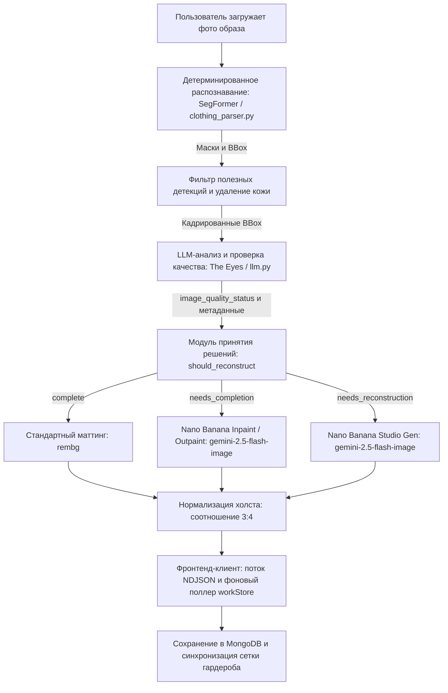

# GarmentVision — Конвейер компьютерного зрения DressApp Eyes и генеративной реконструкции

> **Модуль:** `backend/app/services/vision/` и `backend/app/services/reconstruction.py`  
> **Статус:** В эксплуатации (активно на VPS + собственный хостинг `dressapp-eyes`).  
> **Основная задача:** Преобразует любые фотографии пользователя (селфи в зеркале, снимки образов или раскладки flat-lay) в безупречные, индивидуально сегментированные, размеченные и реконструированные нейросетью элементы гардероба.

---

## 1. Краткий обзор и ценность продукта

### Общая концепция
GarmentVision — это ядро оптического интеллекта DressApp. Это сквозной многоэтапный конвейер компьютерного зрения, принимающий произвольные фотографии пользователя и создающий чистые, изолированные, фотореалистичные предметы гардероба. Работая на базе гибридной архитектуры ИИ, он объединяет высокоскоростную детерминированную сегментацию (SegFormer `b3_clothes`) и удаление фона (`u2netp` / rembg) с глубоким мультимодальным анализом (Gemini) и генеративной реставрацией изображений (Nano Banana / `gemini-2.5-flash-image`).

Когда одежда на фотографиях перекрыта волосами, сумками, руками или обрезана рамкой кадра, **AI Quality Checker** (контроллер качества ИИ) диагностирует дефект и автоматически запускает **Image Completion** (дорисовку/инпейтинг недостающих подолов, рукавов и воротников) или **Full Studio Reconstruction** (полную студийную реконструкцию сильно обрезанных вещей в эталонные каталожные фотографии).

### Архитектурная схема



### Ценность для пользователя
- **Легкий ввод нескольких вещей одновременно:** Загрузите одно селфи в полный рост — система автоматически за считанные секунды выделит каждую куртку, топ, юбку, брюки, обувь и аксессуар.
- **Безупречная студийная подача:** Одежда, перекрытая конечностями или сумками, автоматически дорисовывается; обрезанные элементы (например, неполная обувь или край пальто) полностью воссоздаются в виде аккуратных студийных снимков.
- **Интеллектуальный контроль качества:** Система The Eyes автоматически проверяет каждый фрагмент на срезы, перекрытия и недостающие края, избавляя от необходимости ручного редактирования.
- **Асинхронная оптимизация горячего пути:** Ресурсоемкая генеративная реконструкция выполняется в фоновом режиме, сохраняя первоначальное время импорта фото в пределах 5 секунд.

---

## 2. Руководство пользователя

### Схема визуального интерфейса
```text
┌────────────────────────────────────────────────────────────────────────┐
│  [ Добавить одежду — Камера и загрузка ]                               │
│  ┌──────────────────────────────────────────────────────────────────┐  │
│  │  [Прямая трансляция с камеры / Область загрузки файлов]          │  │
│  │  "Сделайте фото в полный рост, раскладку flat-lay или чек"       │  │
│  └──────────────────────────────────────────────────────────────────┘  │
│                                                                        │
│  [ Поток обработки: Детекция и проверка качества ]                     │
│  ┌─────────────────┐  ┌─────────────────┐  ┌─────────────────┐         │
│  │ Верхняя одежда  │  │ Низ             │  │ Обувь           │         │
│  │ [Нужен инпейнт] │  │ [Нужен аутпейнт]│  │ [Реконструкция] │         │
│  │ "Косуха"        │  │ "Юбка из фатина"│  │ "Мюли на каблуке│         │
│  └─────────────────┘  └─────────────────┘  └─────────────────┘         │
│                                                                        │
│  [ Сохраненный гардероб: Автообновление в реальном времени workStore ] │
│  ┌─────────────────┐  ┌─────────────────┐  ┌─────────────────┐         │
│  │ Готовая куртка  │  │ Восстановл. юбка│  │ Студийная обувь │         │
│  │ (Полные рукава) │  │ (Полный подол)  │  │ (Пара туфель)   │         │
│  └─────────────────┘  └─────────────────┘  └─────────────────┘         │
└────────────────────────────────────────────────────────────────────────┘
```

### Режимы и пошаговый процесс
1. **Интерактивная съемка и пакетный импорт:**
   - Нажмите **Add Item** (Добавить вещь) &rarr; сфотографируйте или загрузите фото с одним или несколькими предметами одежды.
   - Система выполняет предварительную проверку на дубликаты в реальном времени (`crypto.subtle` SHA-256 и перцептивное хеширование), чтобы сразу исключить повторы.
2. **Оценка качества ИИ:**
   - Пока SegFormer сегментирует вырезанные элементы, Quality Checker от Gemini оценивает каждый предмет:
     - `complete`: Вещь видна полностью, не перекрыта и отцентрирована. Сохраняется как есть.
     - `needs_completion`: У предмета перекрыты отдельные участки, срезаны края, воротник или подол. Отправляется в очередь на инпейтинг/аутпейтинг.
     - `needs_reconstruction`: Предмет сильно обрезан (например, виден только носок обуви). Отправляется на полную генерацию студийного фото.
3. **Бесшовная фоновая доработка:**
   - При нажатии на кнопку **Save** (Сохранить) вещи моментально отображаются в сетке гардероба.
   - Фоновые процессы завершают генеративную реставрацию без зависания интерфейса. По завершении `workStore` обновляет карточку в реальном времени.

---

## 3. Стек технологий и технические возможности

### Основная оркестрация и логика ИИ
- **Движок сегментации (`clothing_parser.py`):** Использует модель SegFormer, дообученную на датасетах моды ATR / LIP, для распознавания до 18 классов с вычитанием маски кожи и морфологическим сглаживанием бретелей.
- **Формирование промптов контроля качества (`llm.py`):** Структурированная схема вывода JSON с полями `image_quality_status`, `image_quality_reason` и `reconstruction_prompt`.
- **Модуль принятия решений (`reconstruction.py`):** Анализирует вердикт LLM с проверкой геометрического касания краев (`_EDGE_TOUCH_MARGIN = 40`), гарантируя, что обрезанные краем кадра предметы не будут ошибочно помечены как полные.
- **Движок генеративной реставрации (`gemini_image_service.py`):**
  - **Инпейтинг / Аутпейтинг (`edit`):** Передает фрагмент изображения и структурированный промпт в `gemini-2.5-flash-image`, сохраняя текстуру ткани, узор и цвет при достраивании недостающей геометрии.
  - **Студийная генерация (`generate`):** Формирует запрос к `gemini-2.5-flash-image` с подробными метаданными (тип вещи, материал, цвет, фурнитура, вырез) для создания идеального каталожного снимка на нейтральном светлом фоне.

### Синхронизация интерфейса (`workStore.js` и `itemImage.js`)
- **Централизованное разрешение изображений (`itemImage.js`):** Функция `bestImageUrl()` отдает наивысший приоритет `reconstructed_image_url`, обеспечивая мгновенную замену временных миниатюр отреставрированными ИИ изображениями.
- **Межстраничный поллинг (`workStore.js`):** Отслеживает активные фоновые задачи реконструкции при переходах пользователя между страницами, автоматически передавая обновленные данные в `closetStore`.
