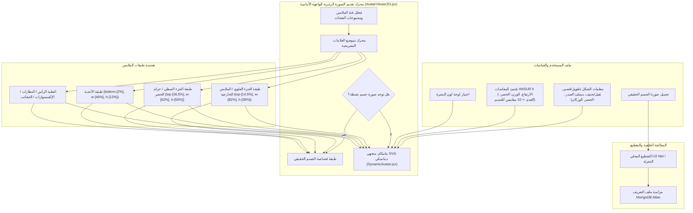

# DressApp — بنية نظام الصورة الرمزية ثنائية الأبعاد (2D Avatar) وموضع القياس التفاعلي (`Avatar.md`)

> **إصدار المستند:** 2.0  
> **النظام الفرعي المستهدف:** المانيكان ثنائي الأبعاد للواجهة الأمامية، قصاصات الصور الحقيقية للجسم ومحرك تراكب الملابس  
> **الملفات الأساسية:** `AvatarViewer2D.jsx`، `DynamicAvatar.jsx`، `OutfitCanvas.jsx`، `Profile.jsx`  
> **الحالة:** تم الشحن للإنتاج وتعايره بنجاح  

---

## 1. الملخص التنفيذي والقيمة المضافة

### 1.1 نظرة عامة رفيعة المستوى
يوفر **نظام DressApp للصورة الرمزية ثنائية الأبعاد وموضع القياس التفاعلي** بيئة قياس مرئية وتكيفية في الوقت الفعلي. يتيح للمستخدمين استعراض قطع الملابس الرقمية الخاصة بخزائنهم وتراكبها بسلاسة فوق **صورة مقتصة للجسم الحقيقي** أو **مانيكان متجهي SVG بوليجون ثنائي الأبعاد يتشكّل ديناميكيًا**.

لتحقيق دقة مرئية عالية عبر مختلف أنماط الملابس (القمصان الضاغطة، قمصان البولو، القمصان ذات الياقة المستديرة، جينز الخصر المنخفض، شورتات الكارغو، والفساتين الرسمية)، يستخدم المحرك معايرة العلامات التشريحية، والقياس التناسبي للنسب، وحاويات تراكب الصور غير المشوهة.



### 1.2 القيمة المضافة للمستخدم
* **دقة محاذاة العلامات التشريحية**: تُحاذى ياقات القمصان تمامًا مع خط عنق الصورة الرمزية (`top-[14.5%]`) وأحزمة السراويل/الشورتات تمامًا مع خط الخصر الطبيعي (`top-[36.5%]`)، مما يقضي على تداخل الوجه أو الفجوات غير المتناسقة.
* **مرونة النظام الثنائي للصورة الرمزية**: التبديل الفوري بين صورة شخصية مقتصة للجسم بالكامل ومانيكان متجهي SVG ثنائي الأبعاد ديناميكي مبني وفقًا لقياسات أنثروبومترية دقيقة.
* **الحفاظ على النسبة الباعية التناسبية**: تطبيق تغيير مقياس عرض الصدر والورك ($scaleX$) مع الحفاظ على النسبة الباعية الأصلية لجميع صور الملابس (`object-fit: contain`)، مما يمنع التمدد أو الضغط غير المرغوب فيه.
* **تسلسل هرمي تفاعلي للطبقات**: تراكب الملابس الخارجية فوق القمصان الداخلية والفساتين مع السماح بالنقر المباشر على طبقات الملابس الفردية لفتح تفاصيل القطعة.

---

## 2. دليل المستخدم الشامل وتخطيط الواجهة

### 2.1 تخطيط الواجهة المرئية

```
┌──────────────────────────────────────────────────────────────────┐
│                   لوحة قياس الملابس ثنائية الأبعاد                  │
├──────────────────────────────────────────────────────────────────┤
│                                                                  │
│                        [ أغطية الرأس (top: 1%) ]                 │
│                        [ النظارات   (top: 11%) ]                 │
│                        [ خط العنق   (top: 14.5%) ] ◄─ ياقة القميص │
│                     ┌──────────────────────────┐                 │
│                     │ Upper / الملابس الخارجية  │                 │
│                     │       (height: 38%)      │                 │
│                     └──────────────────────────┘                 │
│                        [ خط الخصر   (top: 36.5%) ] ◄─ حزام الخصر │
│                     ┌──────────────────────────┐                 │
│                     │ Bottoms / الشورتات       │                 │
│                     │       (height: 50%)      │                 │
│                     │                          │                 │
│                     └──────────────────────────┘                 │
│                        [ القدمان    (bottom: 2%) ] ◄─── الأحذية  │
│                        [ الأحذية    (height: 12%) ]              │
│                                                                  │
├──────────────────────────────────────────────────────────────────┤
│  [ تبديل وضع الرمز ]  [ منتقي لون البشرة ]  [ تعديل مقاييس الجسم ] │
└──────────────────────────────────────────────────────────────────┘
```

### 2.2 خطوات استخدام الأوضاع وسير العمل

#### الوضع 1: طبقة قصاصة صورة الجسم الحقيقي
1. فتح **إعدادات الملف الشخصي** (`/me`).
2. تحميل صورة للجسم بالكامل. ينفذ الجزء الخلفي تقطيع الخلفية عبر `rembg` (U2-Net) لإزالة الضوضاء.
3. يقوم رابط القصاصة المعالجة (`body_photo_url`) بتحديث ملف المستخدم في MongoDB وعرضها داخل حاوية `AvatarViewer2D`.
4. للعودة إلى المانيكان المتجهي، ينقر المستخدم على **إزالة الصورة** في صفحة الملف الشخصي. تتحدث الواجهة فورًا دون الحاجة لإعادة تحميل الصفحة.

#### الوضع 2: المانيكان المتجهي SVG الديناميكي
1. عند عدم وجود صورة للجسم، يعرض `AvatarViewer2D` المكون `DynamicAvatar.jsx`.
2. يولد المانيكان منحنيات بيزيه التكعيبية المستمرة (أوامر $C$ و $S$) داخل صندوق عرض SVG ثابت بحجم `0 0 200 450`.
3. يؤدي تعديل معلمات الجسم (الارتفاع، الوزن، الخصر، الصدر، الكتفين، الوركين) أو اختيار لون البشرة إلى تشكيل صورة المانيكان الظلية ديناميكيًا في الوقت الفعلي.

---

## 3. التعمق في التقنيات والقدرات

### 3.1 مقسم القطع الناقص التشريحي ومولد مانيكان بيزيه

يحسب `DynamicAvatar.jsx` عروض الإسقاط المستوي ثنائي الأبعاد من المحيطات التشريحية ثلاثية الأبعاد باستخدام **مقسم القطع الناقص التشريحي** ($\text{DIVISOR} = 2.65$):

$$\begin{aligned}
w_{\text{shoulders}} &= (\text{shoulders} \times 1.1) \times (1.05 \text{ if male else } 0.95) \\
w_{\text{chest}} &= \left(\frac{\text{chest}}{2.65} \times 1.05\right) \times (1.02 \text{ if male else } 1.0) \\
w_{\text{waist}} &= \left(\frac{\text{waist}}{2.65} \times 1.0\right) \times (0.98 \text{ if male else } 0.90) \\
w_{\text{hip}} &= \left(\frac{\text{hip}}{2.65} \times 1.05\right) \times (0.93 \text{ if male else } 1.05)
\end{aligned}$$

يتم بناء صورة الجسم الظلية عبر أوامر مسار SVG التي تحدد نقاط التحكم في منحنى بيزيه التكعيبي:

```javascript
// Bezier contour snippet from DynamicAvatar.jsx
const bodyPath = [
  `M ${pNeckR}`,
  `C ${X0 + wNeck + (wShoulders - wNeck) * 0.6},${yChin + neckHeight * 0.7} ${X0 + wShoulders * 0.9},${yShoulders - 2} ${pShoulderR}`,
  `C ${X0 + wShoulders * 0.95},${yShoulders + (yChest - yShoulders) * 0.6} ${X0 + wChest + 2},${yChest - 5} ${pChestR}`,
  `C ${X0 + wChest - 1},${yChest + (yWaist - yChest) * 0.5} ${X0 + wWaist + (isMale ? 1 : -2)},${yWaist - 8} ${pWaistR}`,
  `C ${X0 + wWaist + (isMale ? 2 : 5)},${yWaist + (yHip - yWaist) * 0.4} ${X0 + wHip + 1},${yHip - 8} ${pHipR}`,
  ...
].join(' ');
```

### 3.2 تموضع العلامات المعايرة ونسب CSS للحاوية

لضمان استقرار الملابس دون التداخل مع ملامح الوجه أو ترك فجوات في الجسم، ترتبط حاويات التراكب في `AvatarViewer2D.jsx` بنسب موقعية دقيقة في CSS:

| فئة قطعة الملابس | فئة موقع CSS | z-Index | علامة المحاذاة التشريحية |
| --- | --- | --- | --- |
| **أغطية الرأس** | `top-[1%] left-1/2 w-[34%] aspect-square` | `z-30` | قمة الرأس |
| **النظارات** | `top-[11%] left-1/2 w-[18%] h-[4.5%]` | `z-28` | مستوى العينين |
| **الإكسسوارات / القلادات** | `top-[14.5%] left-1/2 w-[30%] aspect-square` | `z-25` | قاعدة العنق |
| **الجزء العلوي (Top)** | `top-[14.5%] left-1/2 w-[82%] h-[38%]` | `z-20` | الياقة إلى خط العنق |
| **الملابس الخارجية** | `top-[14.5%] left-1/2 w-[86%] h-[42%]` | `z-22` | معطف فوق الكتف |
| **الفساتين** | `top-[14.5%] left-1/2 w-[82%] h-[68%]` | `z-20` | الطول الكامل من الأعلى إلى الركبة |
| **الحزام** | `top-[36.5%] left-1/2 w-[62%] h-[5%]` | `z-21` | عروة حزام الخصر |
| **الجزء السفلي (سراويل/شورتات)** | `top-[36.5%] left-1/2 w-[62%] h-[50%]` | `z-10` | حزام السروال إلى خط الخصر |
| **الأحذية** | `bottom-[2%] left-1/2 w-[46%] h-[12%]` | `z-15` | الكاحل إلى مستوى القدم |
| **حقيبة اليد** | `top-[40%] right-[-5%] w-[40%] h-[30%]` | `z-25` | مستوى انخفاض الذراع |

### 3.3 مقياس العرض التناسبي للملابس

بالإضافة إلى الموضع، تتغير أبعاد الملابس أفقيًا ($scaleX$) ديناميكيًا بناءً على معلمات الجسم المحددة (امتلاء الصدر، ثقيل، نحيف، خصر عريض، وركان عريضان):

```javascript
// Derivation of garment container scale factors in AvatarViewer2D.jsx
const scales = useMemo(() => {
  const heightFactor = 1 + (params.tall * 0.08) - (params.short * 0.08);
  const widthFactor = 1 + (params.heavy * 0.12) - (params.thin * 0.12);
  const chestFactor = 1 + (params.busty * 0.1);
  const waistFactor = 1 + (params.waist_thick * 0.12) - (params.waist_thin * 0.08);
  const hipsFactor = 1 + (params.hips_wide * 0.12) - (params.hips_narrow * 0.08);

  return { height: heightFactor, width: widthFactor, chest: chestFactor, waist: waistFactor, hips: hipsFactor };
}, [params]);

// Passed to Framer Motion animate prop for Top and Bottom:
// Top: scaleX = scales.chest / scales.width
// Bottom: scaleX = scales.hips / scales.width
```

---

## 4. مصفوفة ملخص إصلاحات الموقع والنسبة

| المشكلة المحددة | السبب | الإصلاح المطبق | النتيجة |
| --- | --- | --- | --- |
| **تداخل ياقة القميص مع الوجه** | إزاحة الحاوية مرتفعة جدًا (`top-[8.3%]` أو `top-[12.8%]`) | تعيين إزاحة الحاوية العلوية إلى `top-[14.5%]` | تستقر ياقة القميص بشكل متناسق عند خط عنق الصورة الرمزية. |
| **انخفاض السروال/الشورت أو تداخل الحاشية** | إزاحة الحاوية منخفضة جدًا (`top-[38.5%]`) | تعيين إزاحة الحاوية السفلية إلى `top-[36.5%]` | يستقر حزام السروال عند خط خصر الصورة الرمزية الطبيعي. |
| **تشوه النسبة الباعية للملابس** | تمدد الحاوية غير المقيد | تطبيق `object-fit: contain` مع ضبط تناسبي لـ `scaleX` | الحفاظ على النسبة الباعية الأصلية لجميع صور الملابس دون تشوه أفقي. |
| **تأخر إزالة الصورة** | إعادة جلب حالة الصفحة مطلوبة | تنفيذ مزامنة فورية لحالة المستخدم المحلية في `Profile.jsx` | تظهر معاينة إزالة الصورة فورًا بدون تأخير أو حالة مكسورة. |

---

*Document compiled automatically by Narrator for DressApp.*
