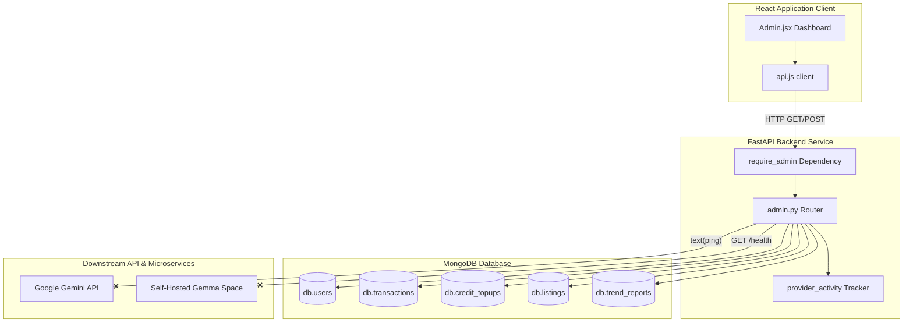

# DressApp Admin Panel — Architectural Narrative & User Manual

This document provides a masterclass-level breakdown of the DressApp Admin Panel, tracing the frontend dashboard interface ([Admin.jsx](file:///C:/DressApp_AG/frontend/src/pages/Admin.jsx)) and its corresponding backend API layer ([admin.py](file:///C:/DressApp_AG/backend/app/api/v1/admin.py)).

---

## 1. Executive Summary & Value Proposition

### High-Level Overview
The DressApp Admin Panel is the centralized hub for application management, monetization auditing, AI model configuration, and pipeline diagnostics. It gives system administrators a real-time, high-fidelity lens into the system's operational health, marketplace transaction volumes, user AI credits consumption, and third-party API dependencies without requiring direct SSH/database shell access.

### Architectural Flow
The following diagram illustrates how the frontend dashboard requests overview data, user configurations, and live diagnostics from the backend FastAPI services, querying MongoDB collections and performing downstream liveness checks.



### User Value Proposition
- **Total Visibility**: Real-time KPI summary cards covering total users, active listings, paid transactions, stylist message volumes, and global application revenue.
- **Billing Transparency**: Clear, per-user breakdown of selected models, available credits quota, current cycle usage, and total captured billing history.
- **Proactive Health Monitoring**: Direct diagnostics of Gemini API key validity and remote self-hosted Gemma vision model status in a single interface click.
- **Marketplace Safety Toggles**: Instant ability to pause/reactivate listings, hide fraudulent professionals, or demote/promote administrators.

---

## 2. Comprehensive User Manual

### Visual Interface Topology
The Admin panel is divided into a clean, multi-tab layout optimized for desktop and mobile styling:

```
+-------------------------------------------------------------------------------+
|  DressApp (Admin)                      [Back to Home]                         |
|  ---------------------------------------------------------------------------  |
|  [ Overview ]  [ Providers ]  [ Trend Scout ]  [ Users ]  [ Listings ]  ...   |
+-------------------------------------------------------------------------------+
|  OVERVIEW TAB                                                                 |
|  +------------------+  +------------------+  +------------------+  +-------+  |
|  | Users            |  | Closet Items     |  | Active Listings  |  | ...   |  |
|  | 15 (+0 new in24h)|  | 262 across users |  | 5 (11 total)     |  |       |  |
|  +------------------+  +------------------+  +------------------+  +-------+  |
|                                                                               |
|  +-------------------------------------------------------------------------+  |
|  | Provider Activity (last 200 calls)                                      |  |
|  | gemini-stylist: 1 calls, 100% error rate | openweather: 1 calls, 0% err |  |
|  +-------------------------------------------------------------------------+  |
+-------------------------------------------------------------------------------+
```

### Mode & Workflow Walkthroughs

#### 1. Overview Tab
- **Stats Grid**: Displays 8 essential metrics (Users, Closet Items, Active Listings, Transactions, Gross Volume, Platform Fees, Stylist 24h, Trend Cards Live).
  - *Note*: **Gross Volume** and **Platform Fees** dynamically include both marketplace transactions and captured credit top-ups.
- **Provider Activity Table**: Displays liveness statistics for downstream third-party services (e.g., `gemini-stylist`, `openweather`) showing call count, error rates, average latency, and p95 benchmarks.

#### 2. Providers Tab
- **Gemini API Card**: Displays direct status validation of the Gemini API Key. Clicking **Verify Key** triggers a backend ping test.
- **Eyes Vision Override**: Allows switching the default image segmentation/analysis routing between `gemini` and a self-hosted `gemma` container model.

#### 3. Users Tab
- **Interactive List**: Shows a table with search capabilities, listing user emails, roles, active model, available credits quota, credit usage, DressApp fee, and lifetime payments.
- **Admin Toggles**: Direct buttons to **Promote** standard users to administrators or **Demote** existing ones.

#### 4. Listings & Transactions Tabs
- **Listing Filters**: Filter active wardrobe listings by `all`, `active`, `paused`, `sold`, or `removed`. Administrators can force pause/activate listings.
- **Transaction Totals**: Summarizes aggregate gross volume, platform fees, Stripe fees, and seller net.

---

## 3. Technology Stack & Capability Deep-Dive

### Core Orchestration & AI/Logic
- **API Engine**: FastAPI python framework implementing role-based dependencies (`require_admin` extraction).
- **Gemini Direct Integration**: Performs a text generation check using `GeminiClient` to ping the API directly, bypassing third-party middlewares:
  ```python
  client = await get_default_client()
  await client.text(user_text="ping", max_tokens=5)
  ```
- **Gemma Space Probe**: Resolves dynamic model routing and sends liveness HTTP checks:
  ```python
  async with httpx.AsyncClient(timeout=probe_timeout) as cli:
      r = await cli.get(f"{gemma_url}/health")
  ```

### Data & Context Pipelines
- **MongoDB Aggregations**:
  - Marketplace transaction financials:
    ```python
    pipeline = [{"$match": {"status": "paid"}}, {"$group": {"_id": None, "gross": {"$sum": "$financial.gross_cents"}}}]
    ```
  - Prepaid credits purchase sum:
    ```python
    topup_pipeline = [{"$match": {"status": "captured"}}, {"$group": {"_id": None, "total": {"$sum": "$amount_cents"}}}]
    ```
- **Lightweight DB Queries**: Per-user items and active listing counts are populated in parallel asynchronously.

### Frontend Client Architecture
- **State Management**: React `useState` hooks coupled with local API calls defined in `src/lib/api.js`.
- **Localization Integration**: Rigorous i18next options-based keys mapped under `pages.admin.*` in 12 languages. Right-to-Left (RTL) mirroring is enabled via Tailwind's start/end properties (e.g. `ps-`, `pe-`, `text-end`).
- **Visual Responsiveness**: Tailored dark-mode support and custom layout grids built using shadcn/ui components (`Table`, `Card`, `Badge`, `Skeleton`).
