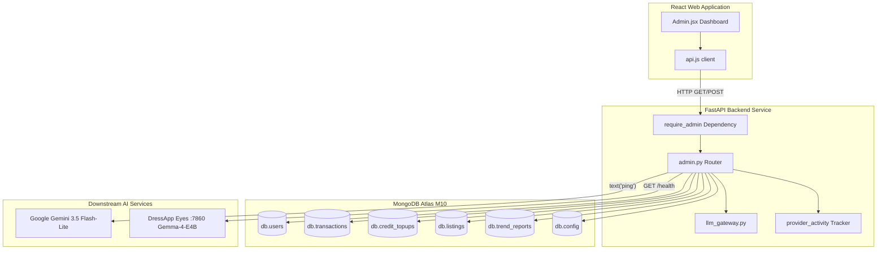

# لوحة تحكم إدارة DressApp — الوصف المعماري ودليل المستخدم

توفر هذه الوثيقة تفصيلاً شاملاً وموثوقاً للوحة تحكم إدارة DressApp (Admin Panel)، متتبعة واجهة لوحة تحكم الواجهة الأمامية ([Admin.jsx](file:///C:/DressApp_AG/apps/web/src/pages/Admin.jsx)) وطبقة واجهة برمجة التطبيقات الخلفية المقابلة لها ([admin.py](file:///C:/DressApp_AG/backend/app/api/v1/admin.py)).

---

## 1. الملخص التنفيذي وعرض القيمة

### نظرة عامة رفيعة المستوى
تُعد لوحة تحكم إدارة DressApp المركز الرئيسي للإشراف على المنصة، وتدقيق monetization، وتكوين نماذج الذكاء الاصطناعي، وتشخيص النظام. تمنح اللوحة المسؤولين رؤية دقيقة في الوقت الفعلي لحالة المنصة التشغيلية، وأحجام معاملات السوق، واستهلاك أرصدة الذكاء الاصطناعي للمستخدمين، ومجموعات المختبرين، وأداء خدمات الذكاء الاصطناعي المصغرة اللاحقة (downstream) دون الحاجة إلى الوصول المباشر للطرفية (terminal) أو غلاف قاعدة البيانات.

### التدفق المعماري
يوضح المخطط التالي كيفية تفاعل لوحة تحكم الواجهة الأمامية مع الخدمات الخلفية، واستعلام مجموعات MongoDB Atlas، وإجراء فحوصات الجاهزية (health probes) للخدمات اللاحقة:



### القدرات الإدارية الرئيسية
- **رؤية مؤشرات الأداء الرئيسية (KPIs) في الوقت الفعلي**: مقاييس موجزة تغطي المستخدمين النشطين، وإجمالي قطع الخزانة، وحجم التداول في السوق، ورسوم المنصة، ومكالمات منسق الأزياء، وتقارير Trend Scout المنشورة.
- **برنامج مجموعة المختبرين (Tester Group Program)**: تعيين تلقائي للأدوار وترقية مجانية إلى باقة Professional لحسابات المختبرين المعتمدة (`maystarboard@gmail.com`، `lokoprod@gmail.com`، `dressapdeveloper@gmail.com`).
- **المصادقة الآمنة**: الوصول إلى بيئة الإنتاج محمي بصرامة خلف مصادقة Google OAuth‏ (`ADMIN_EMAILS`)؛ مع إزالة جميع أزرار التجاوز القديمة غير المصادق عليها تمامًا.
- **إدارة توجيه الذكاء الاصطناعي متعدد المستويات**: التحقق المباشر واختبارات الاتصال (ping) الحي لبوابة **Google Gemini 3.5 Flash-Lite** الأساسية وحاوية Eyes المحلية لخادم VPS المشغلة لـ **Gemma-4-E4B** على المنفذ 7860.
- **سلامة السوق والإشراف عليه**: إمكانية فورية لفحص القوائم أو إيقافها مؤقتًا أو استعادتها وإدارة صلاحيات المستخدمين.

---

## 2. دليل المستخدم الشامل

### هيكل الواجهة المرئية
تم تنظيم لوحة الإدارة في تخطيط نظيف متعدد علامات التبويب ومحسّن للعمليات الإدارية عالية الكثافة:

```
+-------------------------------------------------------------------------------+
|  DressApp (Admin Console)                              [Return to App]        |
|  ---------------------------------------------------------------------------  |
|  [ Overview ]  [ Providers ]  [ Trend Scout ]  [ Users ]  [ Listings ]  ...   |
+-------------------------------------------------------------------------------+
|  OVERVIEW TAB                                                                 |
|  +------------------+  +------------------+  +------------------+  +-------+  |
|  | Active Users     |  | Closet Inventory |  | Active Listings  |  | Gross |  |
|  | 18 (+2 today)    |  | 340 garments     |  | 8 items listed   |  | $140  |  |
|  +------------------+  +------------------+  +------------------+  +-------+  |
|                                                                               |
|  +-------------------------------------------------------------------------+  |
|  | Downstream Provider Activity (Rolling 200 calls)                        |  |
|  | gemini-flash: 142 calls (0% err, 280ms) | eyes-gemma: 12 calls (0% err) |  |
|  +-------------------------------------------------------------------------+  |
+-------------------------------------------------------------------------------+
```

### مسارات العمليات التشغيلية

#### 1. علامة تبويب النظرة العامة (Overview Tab)
- **بطاقات المقاييس (Metric Cards)**: عدادات في الوقت الفعلي للمستخدمين المسجلين، وإجمالي الملابس، وقوائم السوق، والمعاملات، والحجم الإجمالي (Gross Volume)، ورسوم المنصة، ونشاط منسق الأزياء.
- **مراقب نشاط المزودين (Provider Activity Monitor)**: قياس عن بعد متجدد لنقاط نهاية الذكاء الاصطناعي والطقس المتصلة، مع تتبع أعداد الاستدعاءات، ونسب الأخطاء، ومقاييس زمن الاستجابة (الوسيط و p95).

#### 2. علامة تبويب المزودين (Providers Tab)
- **بوابة Google Gemini**: تعرض حالة التكوين وصحة الاتصال لحزمة SDK الأصلية `google-genai`. يؤدي الضغط على **Verify Key** إلى تنفيذ اختبار اتصال خفيف لتوليد النص لتأكيد توفر الحصة.
- **محرك الرؤية Eyes**: يفحص حاوية خادم CPX32 VPS المحلية (`http://eyes:7860`). يتيح تبديل التجاوز في وقت التشغيل بين الرؤية السحابية واستدلال Gemma المستضاف ذاتيًا دون إعادة تشغيل خدمات الواجهة الخلفية.

#### 3. علامة تبويب المستخدمين (Users Tab)
- **دليل المستخدمين (User Directory)**: قائمة قابلة للبحث تفصل البريد الإلكتروني للمستخدم، والدور المعين (`user`، `tester`، `admin`)، والباقة النشطة (`free`، `manager`، `pro`)، ورصيد النقاط، وسجل المعاملات.
- **إدارة الأدوار**: إجراءات بنقرة واحدة لترقية المستخدمين إلى مسؤولين أو تعديل امتيازات المختبرين.
- **تحديد مجموعة المختبرين**: شارة مرئية تبرز الحسابات المسجلة في برنامج المختبرين المجاني.

#### 4. علامتا تبويب القوائم والمعاملات (Listings & Transactions Tabs)
- **الإشراف على القوائم**: التصفية حسب حالة القائمة (`active`، `paused`، `sold`، `removed`). يمكن للمسؤولين الإشراف على القوائم غير المتوافقة وإيقافها مؤقتًا على الفور.
- **التدقيق المالي**: يجمع الحجم الإجمالي، ورسوم المنصة المحصلة، وعمولات بوابة الدفع، وصافي مستحقات البائعين.

---

## 3. بنية التكنولوجيا والتعمق في القدرات

### المصادقة والترخيص (Authentication & Authorization)
- **حارس التبعية (Dependency Guard)**: تفرض نقاط نهاية API تبعية `require_admin` في `backend/app/api/v1/admin.py`، مع التحقق من تضمين البريد الإلكتروني في رمز JWT للمتصل في متغير بيئة الإنتاج `ADMIN_EMAILS`.
- **التكامل مع Google OAuth**: تتدفق عمليات تسجيل الدخول للإنتاج عبر Google OAuth‏ (`dressapdeveloper@gmail.com`)، مما يلغي الاختصارات المحلية المضمنة في الكود لتعزيز الأمان.

### بنية توجيه الذكاء الاصطناعي متعدد المستويات
- **المحرك الأساسي**: يتولى Google Gemini 3.5 Flash-Lite استفسارات منسق الأزياء الإنتاجية وتحليل الرؤية عبر `backend/app/services/llm_gateway.py`.
- **شبكة أمان الحصص (Quota Safety Net)**: إذا واجه Gemini حدود المعدل (`429` / `RESOURCE_EXHAUSTED`)، ينتقل الطلب بسلاسة إلى حاوية Gemma-4-E4B المحلية على المنفذ 7860، مع إرجاع `provider_fallback="gemma"` دون مقاطعة مسارات عمل المستخدمين.

### عمليات قاعدة البيانات
- **تجميعات MongoDB Atlas (Aggregations)**:
  - تلخيص الإجماليات المالية عبر المعاملات المدفوعة:
    ```python
    pipeline = [{"$match": {"status": "paid"}}, {"$group": {"_id": None, "gross": {"$sum": "$financial.gross_cents"}}}]
    ```
  - تجميع عمليات شراء الرصيد مسبق الدفع:
    ```python
    topup_pipeline = [{"$match": {"status": "captured"}}, {"$group": {"_id": None, "total": {"$sum": "$amount_cents"}}}]
    ```
