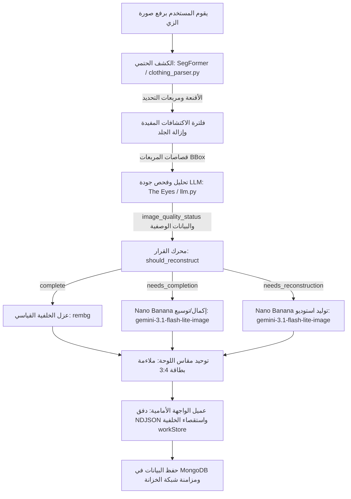

# GarmentVision — محرك الرؤية البصرية وخط معالجة إعادة البناء في DressApp

> **الوحدة:** `backend/app/services/vision/` و `backend/app/services/reconstruction.py`  
> **الحالة:** بيئة الإنتاج (مباشر على VPS + استضافة ذاتية `dressapp-eyes`).  
> **الدور الوظيفي:** تحويل أي صورة مستخدم (سيلفي في المرآة، صورة مظهر كامل، أو صورة مسطحة Flat-Lay) إلى عناصر خزانة ملابس نقية، مقسمة بشكل فردي، ومصنفة ومُعاد بناؤها بالذكاء الاصطناعي بجودة الاستوديو.

---

## 1. الملخص التنفيذي وعرض القيمة

### نظرة عامة شاملة
يُعد GarmentVision النواة البصرية الذكية لتطبيق DressApp. إنه خط معالجة رؤية حاسوبية متعدد المراحل من البداية إلى النهاية، يستقبل صور المستخدمين دون أي قيود وينتج عناصر خزانة ملابس معزولة ونقية وفوتوغرافية فائقة الواقعية. استنادًا إلى بنية ذكاء اصطناعي هجينة، يجمع النظام بين التقسيم الحتمي عالي السرعة (SegFormer `b3_clothes`) وعزل الخلفيات المتقدم (`u2netp` / rembg) مع التحليل متعدد الوسائط العميق (Gemini) وترميم الصور التوليدي (Nano Banana / `gemini-3.1-flash-lite-image`).

عندما تحجب الملابس في صور المستخدمين بواسطة الشعر، أو الحقائب، أو الأيدي، أو يتم اقتصاصها بواسطة إطار الكاميرا، يقوم **فاحص الجودة بالذكاء الاصطناعي** في GarmentVision بتشخيص العيب وبدء عملية **إكمال الصورة** تلقائيًا (الرسم الداخلي/الخارجي Inpainting/Outpainting للحواف والأكمام والياقات المفقودة) أو **إعادة البناء الكاملة في الاستوديو** (إعادة توليد العناصر المبتورة لتصبح صور كتالوج تجارة إلكترونية مستقلة ونقية تمامًا).

### مخطط البنية المعمارية



### عرض القيمة للمستخدم
- **إدراج سلس لعدة قطع ملابس معًا:** يمكن رفع صورة سيلفي واحدة لكامل الجسم وعزل كل سترة، وقميص، وتنورة، وبنطال، وحذاء، وإكسسوار تلقائيًا في ثوانٍ معدودة.
- **عرض نقي بجودة الاستوديو:** يتم إكمال الملابس المحجوبة بالأطراف أو الحقائب تلقائيًا؛ كما يُعاد بناء العناصر المبتورة (مثل الأحذية المقتصة أو المعاطف الجزئية) لتصبح صور استوديو مسطحة ومكتملة.
- **فاحص جودة بصري ذكي:** يقوم نظام Eyes تلقائيًا بتقييم كل قصاصة بحثًا عن الحواف المقتصة، والحجب، والتفاصيل المفقودة، مما يلغي الحاجة للتحرير اليدوي.
- **تحسين مسار المعالجة غير المتزامن:** تعمل عمليات إعادة البناء التوليدية في مهام خلفية بسلاسة، مما يحافظ على سرعة استجابة الإدراج الأولي في أقل من 5 ثوانٍ.

---

## 2. دليل المستخدم الشامل

### هيكلية الواجهة البصرية
```text
┌────────────────────────────────────────────────────────────────────────┐
│  [ إضافة ملابس — الكاميرا والتحميل ]                                   │
│  ┌──────────────────────────────────────────────────────────────────┐  │
│  │  [الكاميرا المباشرة / منطقة إفلات الملفات]                         │  │
│  │  "التقاط أو رفع صور كامل الجسم، أو التنسيق المسطح، أو الإيصالات"  │  │
│  └──────────────────────────────────────────────────────────────────┘  │
│                                                                        │
│  [ دفق المعالجة: الكشف وفحص الجودة ]                                  │
│  ┌─────────────────┐  ┌─────────────────┐  ┌─────────────────┐         │
│  │ قصاصة الملابس   │  │ قصاصة الجزء     │  │ قصاصة الأحذية   │         │
│  │ الخارجية        │  │ السفلي          │  │                 │         │
│  │ [Needs Inpaint] │  │ [Needs Outpaint]│  │ [Reconstruct]   │         │
│  │ "سترة جلدية"    │  │ "تنورة تول"     │  │ "حذاء مفتوح بكعب"│        │
│  └─────────────────┘  └─────────────────┘  └─────────────────┘         │
│                                                                        │
│  [ شبكة الخزانة المحفوظة: تحديث فوري عبر workStore ]                  │
│  ┌─────────────────┐  ┌─────────────────┐  ┌─────────────────┐         │
│  │ سترة مكتملة     │  │ تنورة مُرممة    │  │ أحذية الاستوديو │         │
│  │ (أكمام كاملة)   │  │ (حافة كاملة)    │  │ (زوج مع كعب كامل│         │
│  └─────────────────┘  └─────────────────┘  └─────────────────┘         │
└────────────────────────────────────────────────────────────────────────┘
```

### أوضاع العمل وخطوات الاستخدام
1. **الالتقاط التفاعلي والإدراج المجمّع:**
   - النقر على **إضافة عنصر** &rarr; التقاط صورة أو رفع صورة تحتوي على قطعة ملابس واحدة أو أكثر.
   - يُجري النظام فحصًا مسبقًا لمنع التكرار في الوقت الفعلي (SHA-256 عبر `crypto.subtle` والتجزئة الإدراكية Perceptual Hashing) لاكتشاف الصور المكررة فورًا.
2. **تقييم الجودة بالذكاء الاصطناعي:**
   - أثناء قيام SegFormer بتقسيم القطع، يفحص مدقق الجودة في Gemini كل قطعة ملابس:
     - `complete`: القطعة ظاهرة بالكامل، غير محجوبة، ومحاذاة للمركز. يتم الاحتفاظ بها كما هي.
     - `needs_completion`: تحتوي القطعة على أجزاء محجوبة، أو حواف مفقودة، أو ياقات مقتصة، أو أطراف مقطوعة. توضع في قائمة انتظار التوسيع والترميم (Inpaint/Outpaint).
     - `needs_reconstruction`: العنصر مبتور بشدة (مثل ظهور مقدمة الحذاء فقط). يوضع في قائمة انتظار التوليد الكامل في الاستوديو.
3. **الإكمال السلس في الخلفية:**
   - عند النقر على **حفظ**، تظهر الملابس فورًا في شبكة الخزانة.
   - تنفذ المهام الخلفية إكمال الصورة التوليدي دون تجميد واجهة المستخدم. وبمجرد الانتهاء، يحدّث `workStore` البطاقة في الوقت الفعلي.

---

## 3. البنية التقنية والتعمق في القدرات

### التنسيق الأساسي ومنطق الذكاء الاصطناعي
- **محرك التقسيم (`clothing_parser.py`):** يعتمد على نموذج SegFormer المُدرّب بدقة على مجموعات بيانات الأزياء ATR / LIP للتعرف على ما يصل إلى 18 فئة، مع تطبيق طرح أقنعة الجلد ووصل أشرطة وحمالات الملابس شكليًا.
- **مطالبات فاحص الجودة (`llm.py`):** مخطط إخراج JSON منظم يفرض `image_quality_status` و `image_quality_reason` و `reconstruction_prompt`.
- **محرك القرار (`reconstruction.py`):** يقيّم حالة نموذج LLM مع تدقيق هندسي لأطراف الصورة (`_EDGE_TOUCH_MARGIN = 40`) لضمان عدم تصنيف العناصر المقطوعة بواسطة حواف الصورة بالخطأ على أنها مكتملة.
- **محرك الترميم التوليدي (`gemini_image_service.py`):**
  - **الترميم والإكمال (`edit`):** يرسل بيانات الصورة المقتصة والمطالبة المنظمة إلى `gemini-3.1-flash-lite-image` للحفاظ على نسيج القماش، ونمطه، ولونه مع تمديد الأجزاء الهندسية المفقودة.
  - **توليد الاستوديو (`generate`):** يزود `gemini-3.1-flash-lite-image` ببيانات وصفية شاملة (نوع الملابس، الخامة، اللون، الأزرار/المعادن، فتحة الرقبة) لتقديم قطعة كتالوج نقية على خلفية بيضاء مائلة للعاجي.

### مزامنة الواجهة الأمامية (`workStore.js` و `itemImage.js`)
- **الدقة المركزية للصورة (`itemImage.js`):** تمنح دالة `bestImageUrl()` الأولوية القصوى لـ `reconstructed_image_url`، مما يضمن استبدال الصور المُرممة بالذكاء الاصطناعي بالصور المصغرة الخام على الفور.
- **الاستقصاء عبر الصفحات (`workStore.js`):** يتتبع مهام إعادة البناء الجارية في الخلفية بشكل عام أثناء التنقل في التطبيق، ويدمج المستندات المحدثة تلقائيًا في `closetStore`.
