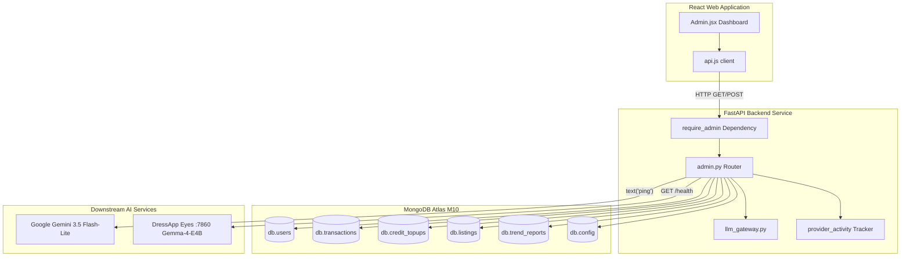

# DressApp Admin-Panel — Architektonische Übersicht & Benutzerhandbuch

Dieses Dokument bietet eine umfassende, maßgebliche Aufschlüsselung des DressApp Admin-Panels und beschreibt sowohl die Frontend-Dashboard-Oberfläche ([Admin.jsx](file:///C:/DressApp_AG/apps/web/src/pages/Admin.jsx)) als auch die zugehörige Backend-API-Schicht ([admin.py](file:///C:/DressApp_AG/backend/app/api/v1/admin.py)).

---

## 1. Management-Zusammenfassung & Wertversprechen

### Übergeordneter Überblick
Das DressApp Admin-Panel ist die zentrale Anlaufstelle für Plattformaufsicht, Monetarisierungs-Audits, KI-Modell-Konfiguration und Systemdiagnostik. Es bietet Administratoren einen hochpräzisen Echtzeit-Einblick in den Systemzustand, Marktplatz-Transaktionsvolumina, den KI-Credit-Verbrauch der Benutzer, Testergruppen und die Leistung nachgelagerter KI-Mikrodienste – ganz ohne direkten Zugriff auf das Terminal oder die Datenbankshell.

### Architektonischer Ablauf
Das folgende Diagramm veranschaulicht, wie das Frontend-Dashboard mit den Backend-Diensten interagiert, MongoDB-Atlas-Collections abfragt und nachgelagerte Health-Probes durchführt:



### Zentrale administrative Funktionen
- **Echtzeit-KPI-Transparenz**: Übersichtsmetriken zu aktiven Nutzern, Gesamtzahl der Garderobenartikel, Marktplatzvolumen, Plattformgebühren, Stylisten-Aufrufen und veröffentlichten Trend-Scout-Berichten.
- **Sichere Authentifizierung**: Der Produktionszugriff ist streng durch Google OAuth-Authentifizierung (`ADMIN_EMAILS`) geschützt; veraltete unauthentifizierte Bypass-Schaltflächen wurden vollständig entfernt.
- **Governance für mehrstufiges KI-Routing**: Direkte Verifizierung und Live-Ping-Diagnose für das primäre **Google Gemini 3.5 Flash-Lite**-Gateway und den lokalen **Gemma-4-E4B**-Eyes-Container auf Port 7860.
- **Marktplatz-Sicherheit & Moderation**: Sofortige Möglichkeit, Angebote zu prüfen, zu pausieren oder wiederherzustellen und Benutzerberechtigungen zu verwalten.

---

## 2. Umfassendes Benutzerhandbuch

### Topologie der Benutzeroberfläche
Das Admin-Panel ist in ein übersichtliches Layout mit mehreren Reitern unterteilt, das für administrative Arbeitsabläufe mit hoher Informationsdichte optimiert ist:

```
+-------------------------------------------------------------------------------+
|  DressApp (Admin Console)                              [Return to App]        |
|  ---------------------------------------------------------------------------  |
|  [ Overview ]  [ Providers ]  [ Trend Scout ]  [ Users ]  [ Listings ]  ...   |
+-------------------------------------------------------------------------------+
|  OVERVIEW TAB                                                                 |
|  +------------------+  +------------------+  +------------------+  +-------+  |
|  | Active Users     |  | Closet Inventory |  | Active Listings  |  | Gross |  |
|  | 18 (+2 today)    |  | 340 garments     |  | 8 items listed   |  | $140  |  |
|  +------------------+  +------------------+  +------------------+  +-------+  |
|                                                                               |
|  +-------------------------------------------------------------------------+  |
|  | Downstream Provider Activity (Rolling 200 calls)                        |  |
|  | gemini-flash: 142 calls (0% err, 280ms) | eyes-gemma: 12 calls (0% err) |  |
|  +-------------------------------------------------------------------------+  |
+-------------------------------------------------------------------------------+
```

### Operative Abläufe

#### 1. Reiter „Overview“ (Übersicht)
- **Metrik-Karten**: Echtzeitzähler für registrierte Benutzer, Gesamtzahl der Kleidungsstücke, Marktplatz-Angebote, Transaktionen, Bruttovolumen, Plattformgebühren und Stylisten-Aktivität.
- **Provider Activity Monitor**: Fortlaufende Telemetrie für angebundene KI- und Wetter-Endpunkte zur Überwachung von Aufrufzahlen, Fehlerraten und Latenz-Benchmarks (Median und p95).

#### 2. Reiter „Providers“ (Anbieter)
- **Google Gemini Gateway**: Zeigt den Konfigurationsstatus und die Verbindungsintegrität für das native `google-genai` SDK an. Ein Tippen auf **Verify Key** führt einen einfachen Textgenerierungs-Ping aus, um die Kontingentverfügbarkeit zu bestätigen.
- **Eyes Vision Engine**: Prüft den On-Prem-Container auf dem CPX32-VPS (`http://eyes:7860`). Ermöglicht das Umschalten des Laufzeit-Overrides zwischen Cloud-Vision und selbst gehosteter Gemma-Inferenz ohne Neustart der Backend-Pods.

#### 3. Reiter „Users“ (Benutzer)
- **Benutzerverzeichnis**: Durchsuchbare Liste mit Benutzer-E-Mail, zugewiesener Rolle (`user`, `tester`, `admin`), aktiver Stufe (`free`, `manager`, `pro`), Guthabenstand und Transaktionshistorie.
- **Rollenverwaltung**: Ein-Klick-Aktionen zur Beförderung von Benutzern zum Administrator oder zur Anpassung von Tester-Rechten.
- **Tester-Gruppen-Kennzeichnung**: Ein visuelles Badge hebt Konten hervor, die im kostenfreien Testerprogramm registriert sind.

#### 4. Reiter „Listings“ & „Transactions“ (Angebote & Transaktionen)
- **Angebotsaufsicht**: Filtern nach Angebotsstatus (`active`, `paused`, `sold`, `removed`). Administratoren können nicht richtlinienkonforme Angebote unverzüglich moderieren und pausieren.
- **Finanzprüfung**: Aggregiertes Bruttovolumen, einbehaltene Plattformgebühren, Provisionen der Zahlungsgateways und Nettoauszahlungen an Verkäufer.

---

## 3. Technologie-Stack & Detailanalyse der Systemfunktionen

### Authentifizierung & Autorisierung
- **Dependency Guard**: API-Endpunkte erzwingen die Abhängigkeit `require_admin` in `backend/app/api/v1/admin.py`, die prüft, ob die JWT-E-Mail des Aufrufers in der Produktionsumgebungsvariable `ADMIN_EMAILS` enthalten ist.
- **Google OAuth Integration**: Die Produktionsanmeldung erfolgt über Google OAuth (`dressappdeveloper@gmail.com`), wodurch lokale fest programmierte Entwickler-Shortcuts für maximale Sicherheit entfernt wurden.

### Mehrstufige KI-Routing-Infrastruktur
- **Primäre Engine**: Google Gemini 3.5 Flash-Lite verarbeitet produktive Stylisten-Anfragen und Bildanalysen über `backend/app/services/llm_gateway.py`.
- **Quoten-Sicherheitsnetz**: Sollte Gemini auf Ratenbegrenzungen stoßen (`429` / `RESOURCE_EXHAUSTED`), weicht die Anfrage nahtlos auf den lokalen Gemma-4-E4B-Container auf Port 7860 aus und gibt `provider_fallback="gemma"` zurück, ohne den Benutzer-Workflow zu unterbrechen.

### Datenbankoperationen
- **MongoDB-Atlas-Aggregationen**:
  - Fasst die Finanzsummen aller bezahlten Transaktionen zusammen:
    ```python
    pipeline = [{"$match": {"status": "paid"}}, {"$group": {"_id": None, "gross": {"$sum": "$financial.gross_cents"}}}]
    ```
  - Aggregiert Prepaid-Guthabenkäufe:
    ```python
    topup_pipeline = [{"$match": {"status": "captured"}}, {"$group": {"_id": None, "total": {"$sum": "$amount_cents"}}}]
    ```
