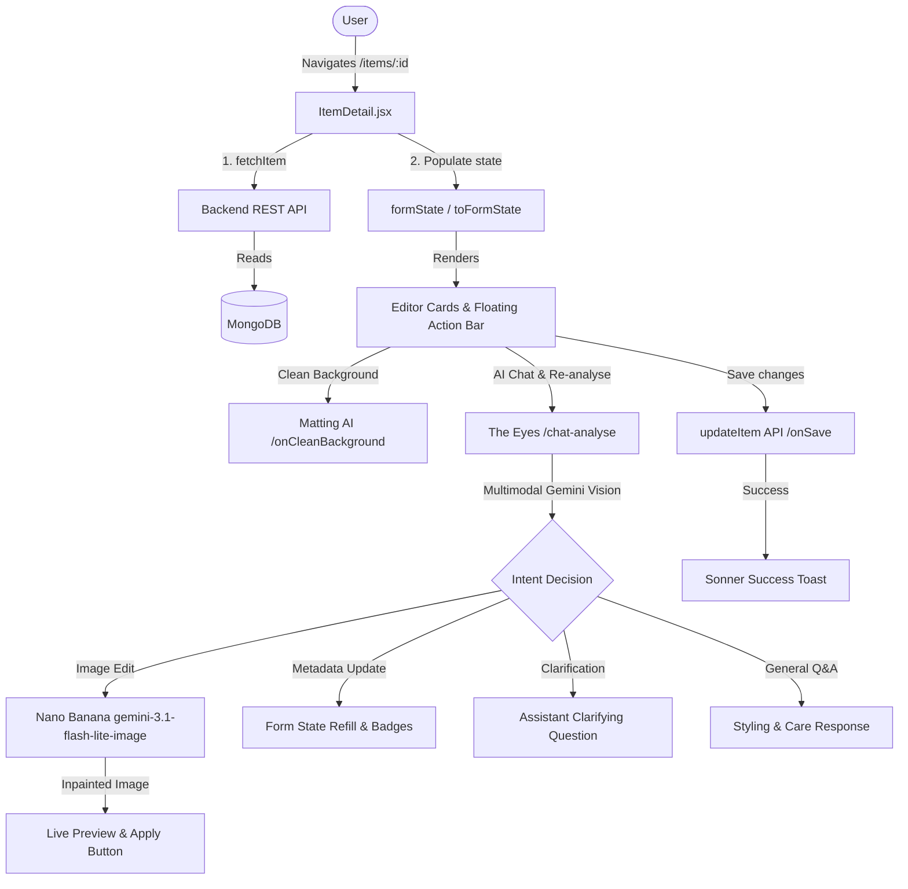

# Artikeldetails: Architektur & Benutzerhandbuch

Dieses Dokument bietet einen umfassenden technischen Überblick und eine Bedienungsanleitung für die Seite **Artikeldetails** (`ItemDetail.jsx`) in DressApp.

---

## 1. Zusammenfassung & Mehrwert

### Überblick
Das Panel **Artikeldetails** ist die Steuerzentrale zur Verwaltung einzelner Kleidungsstücke. Es verknüpft visuelle Bilddaten mit semantischen Metadaten und ermöglicht interaktive Bildbearbeitung mit **Nano Banana** (`gemini-3.1-flash-lite-image`).

### Architekturfluss



### Mehrwert für den Benutzer
* **Interaktiver KI-Kleidungseditor**: Natürliche Sprachanweisungen an **The Eyes** (*"Schuhe entfernen"*, *"Loch füllen"*, *"Nieten entfernen"*).
* **Hochwertiges Inpainting mit Nano Banana**: Repariert fehlende oder verdeckte Stoffpartien präzise.
* **Intelligente Rückfragen**: The Eyes stellt gezielte Fragen bei unklaren Wünschen.
* **Strukturierte Erfassung**: Übersichtliche Kartenstruktur für alle Kleidungsattribute.
* **Nicht-generatives Freistellen**: Saubere Hintergrundentfernung ohne künstliche Verzerrungen.
* **13 Sprachen synchronisiert**: Vollständige Lokalisierung mit i18next.

---

## 2. Benutzerhandbuch

### Benutzeroberfläche

```
+--------------------------------------------------------------------------+
|  <- (Back)                                         (Undo) (Save) (Up)    |
+------------------------------------+-------------------------------------+
| LEFT COLUMN (Visual & AI Actions)  | RIGHT COLUMN (Metadata Editor)      |
|                                    |                                     |
| [ GARMENT PHOTO & CAMERA ]         | [ IDENTITY CARD ]                   |
| [ CLEAN BACKGROUND CARD ]          | [ TAXONOMY CARD ]                   |
| [ RE-ANALYSE & AI EYES CHAT ]      | [ COMPOSITION CARD ]                |
|   - Quick Prompts & Chat Box       | [ QUALITY & WEAR CARD ]             |
|   - Live Nano Banana Preview       | [ PRICING & INTENT CARD ]           |
| [ DPP PROVENANCE PANEL ]           | [ ORGANIZATION CARD ]               |
+------------------------------------+-------------------------------------+
```

### Arbeitsabläufe

#### 1. Foto ersetzen & Kameraaufnahme
* Schneller Austausch von Fotos oder direkte Kameraaufnahme.

#### 2. Hintergrund bereinigen
* Nicht-generatives Alpha-Matting im Hintergrund mit Fortschrittsanzeige.

#### 3. Foto neu analysieren & KI-Assistent (The Eyes)
* **Prompt-Eingabebox**: Anweisungen eingeben oder diktieren (*"Schuhe entfernen"*, *"100% Kaschmir einstellen"*).
* **Schnell-Prompts**: 1-Klick-Chips für häufige Aufgaben.
* **Nano Banana Inpainting**: Generiert eine Live-Vorschau mit dem Button **"Als Kleidungsfoto anwenden"**.
* **1-Klick-Vollanalyse**: Klassische Gesamtanalyse per Knopfdruck.

#### 4. Taxonomie & Materialeditor
* Prozentuale Gewichtung von Farben und Materialien mit visueller Validierung.

#### 5. Spracheingabe (Dictation)
* Spracheingabe über Web Speech API in der Nutzersprache.

---

## 3. Dialoge & Modals

### 1. Zubehörauswahl (`addOpen`)
* Verknüpfen von Sets und Kombinationsstücken.

### 2. Taxonomie-Gatekeeper (`gatekeeperOpen`)
* Schutz vor versehentlichen Fehlklassifizierungen.

### 3. Löschbestätigung (`AlertDialog`)
* Schutz vor unbeabsichtigtem Löschen mit optimistischem UI-Update.

---

## 4. Technologie-Stack & KI-Services

* **Entscheidungspipeline (`POST /api/v1/closet/{item_id}/chat-analyse`)**: Multimodale Auswertung via Gemini.
* **Nano Banana (`gemini-3.1-flash-lite-image`)**: Bild-zu-Bild-Inpainting mit Credit-Abzug.
* **Vollständige Lokalisierung**: 13 Sprachen mit nativer RTL-Unterstützung.
