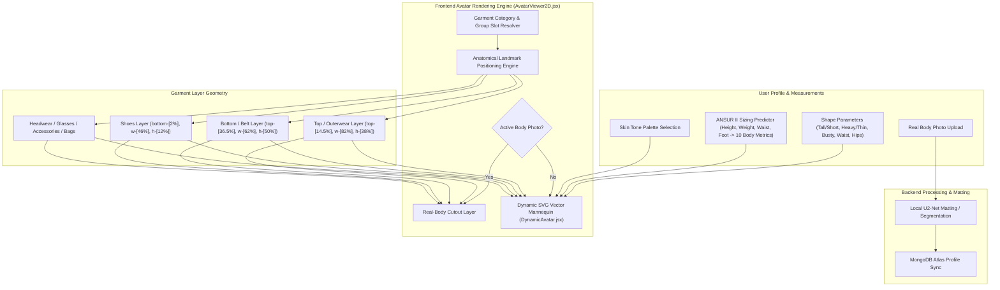

# DressApp — 2D Avatar & Try-On Positioning System Architecture (`Avatar.md`)

> **Document Version:** 2.0  
> **Target Subsystem:** Frontend 2D Mannequin, Real Body Photo Cutouts & Garment Overlay Engine  
> **Core Files:** `AvatarViewer2D.jsx`, `DynamicAvatar.jsx`, `OutfitCanvas.jsx`, `Profile.jsx`  
> **Status:** Production Shipped & Calibrated  

---

## 1. Executive Summary & Value Proposition

### 1.1 High-Level Overview
The **DressApp 2D Avatar & Try-On Positioning System** provides an adaptive, real-time visual try-on environment. It allows users to preview digitized closet garments layered seamlessly on top of either a **segmented real-body photograph** or a **dynamically morphed 2D Bezier vector SVG mannequin**. 

To deliver high visual accuracy across diverse garment styles (compression shirts, polo collars, crewnecks, low-rise jeans, cargo shorts, and formal dresses), the engine utilizes anatomical landmark calibration, proportional ratio scaling, and non-distorting image overlay containers.



### 1.2 User Value Proposition
* **Anatomical Alignment Precision**: Restores shirt collars flush to the avatar's neckline (`top-[14.5%]`) and shorts/pants waistbands flush to the avatar's natural waistline (`top-[36.5%]`), eliminating face occlusion and awkward gaps.
* **Dual-Avatar Flexibility**: Switch instantly between a personal segmented full-body photo and a dynamic 2D vector SVG mannequin built to exact anthropometric measurements.
* **Proportional Aspect Preservation**: Applies chest and hip width scaling ($scaleX$) while keeping original garment image aspect ratios (`object-fit: contain`), preventing unwanted stretching or squishing.
* **Interactive Layer Hierarchy**: Stack outerwear over inner tops and dresses while allowing direct taps/clicks on individual garment layers to open item details.

---

## 2. Comprehensive User Manual & Interface Topology

### 2.1 Visual Interface Topology

```
┌──────────────────────────────────────────────────────────────────┐
│                      2D Avatar Try-On Canvas                     │
├──────────────────────────────────────────────────────────────────┤
│                                                                  │
│                        [ Headwear (top: 1%) ]                    │
│                        [ Glasses  (top: 11%) ]                   │
│                        [ Neckline (top: 14.5%) ] ◄─ Shirt Collar  │
│                     ┌──────────────────────────┐                 │
│                     │       Tops / Outerwear   │                 │
│                     │       (height: 38%)      │                 │
│                     └──────────────────────────┘                 │
│                        [ Waistline (top: 36.5%) ] ◄─ Waistband   │
│                     ┌──────────────────────────┐                 │
│                     │     Bottoms / Shorts     │                 │
│                     │       (height: 50%)      │                 │
│                     │                          │                 │
│                     └──────────────────────────┘                 │
│                        [ Feet (bottom: 2%) ] ◄─── Footwear        │
│                        [ Shoes    (height: 12%) ]                │
│                                                                  │
├──────────────────────────────────────────────────────────────────┤
│  [ Switch Avatar Mode ]  [ Skin Tone Picker ]  [ Edit Body Metrics ]│
└──────────────────────────────────────────────────────────────────┘
```

### 2.2 Mode & Workflow Walkthroughs

#### Mode 1: Real-Body Photo Cutout Layer
1. Open **Profile Settings** (`/me`).
2. Upload a full-body photograph. The backend executes background segmentation via `rembg` (U2-Net) to remove background noise.
3. The processed cutout URL (`body_photo_url`) updates the user profile in MongoDB and renders inside the `AvatarViewer2D` container.
4. To revert back to the vector mannequin, click **Remove Photo** on the profile page. The UI updates instantly with zero page reload.

#### Mode 2: Dynamic Vector SVG Mannequin
1. When no body photo is present, `AvatarViewer2D` renders `DynamicAvatar.jsx`.
2. The mannequin generates continuous cubic Bezier curves ($C$ and $S$ commands) inside a fixed `0 0 200 450` SVG viewBox.
3. Adjusting body parameters (Height, Weight, Waist, Chest, Shoulders, Hips) or selecting a skin tone dynamically morphs the mannequin silhouette in real-time.

---

## 3. Technology Stack & Capability Deep-Dive

### 3.1 Anatomical Ellipse Divisor & Bezier Mannequin Generator

`DynamicAvatar.jsx` computes 2D planar projection widths from 3D anatomical circumferences using an **Anatomical Ellipse Divisor** ($\text{DIVISOR} = 2.65$):

$$\begin{aligned}
w_{\text{shoulders}} &= (\text{shoulders} \times 1.1) \times (1.05 \text{ if male else } 0.95) \\
w_{\text{chest}} &= \left(\frac{\text{chest}}{2.65} \times 1.05\right) \times (1.02 \text{ if male else } 1.0) \\
w_{\text{waist}} &= \left(\frac{\text{waist}}{2.65} \times 1.0\right) \times (0.98 \text{ if male else } 0.90) \\
w_{\text{hip}} &= \left(\frac{\text{hip}}{2.65} \times 1.05\right) \times (0.93 \text{ if male else } 1.05)
\end{aligned}$$

The body silhouette is constructed via SVG path commands mapping cubic Bezier control points:

```javascript
// Bezier contour snippet from DynamicAvatar.jsx
const bodyPath = [
  `M ${pNeckR}`,
  `C ${X0 + wNeck + (wShoulders - wNeck) * 0.6},${yChin + neckHeight * 0.7} ${X0 + wShoulders * 0.9},${yShoulders - 2} ${pShoulderR}`,
  `C ${X0 + wShoulders * 0.95},${yShoulders + (yChest - yShoulders) * 0.6} ${X0 + wChest + 2},${yChest - 5} ${pChestR}`,
  `C ${X0 + wChest - 1},${yChest + (yWaist - yChest) * 0.5} ${X0 + wWaist + (isMale ? 1 : -2)},${yWaist - 8} ${pWaistR}`,
  `C ${X0 + wWaist + (isMale ? 2 : 5)},${yWaist + (yHip - yWaist) * 0.4} ${X0 + wHip + 1},${yHip - 8} ${pHipR}`,
  ...
].join(' ');
```

### 3.2 Calibrated Landmark Positioning & Container CSS Ratios

To guarantee that garments sit flush without overlapping facial features or leaving body gaps, overlay containers in `AvatarViewer2D.jsx` are bound to precise CSS positional ratios:

| Garment Category | CSS Position Class | z-Index | Alignment Landmark |
| --- | --- | --- | --- |
| **Headwear** | `top-[1%] left-1/2 w-[34%] aspect-square` | `z-30` | Crown of head |
| **Glasses** | `top-[11%] left-1/2 w-[18%] h-[4.5%]` | `z-28` | Eyes plane |
| **Accessory / Necklace** | `top-[14.5%] left-1/2 w-[30%] aspect-square` | `z-25` | Neck base |
| **Top** | `top-[14.5%] left-1/2 w-[82%] h-[38%]` | `z-20` | Collar to Neckline |
| **Outerwear** | `top-[14.5%] left-1/2 w-[86%] h-[42%]` | `z-22` | Over-shoulder coat layering |
| **Dress** | `top-[14.5%] left-1/2 w-[82%] h-[68%]` | `z-20` | Full length top-to-knee |
| **Belt** | `top-[36.5%] left-1/2 w-[62%] h-[5%]` | `z-21` | Waistline belt loop |
| **Bottom (Pants/Shorts)** | `top-[36.5%] left-1/2 w-[62%] h-[50%]` | `z-10` | Waistband to Waistline |
| **Shoes / Footwear** | `bottom-[2%] left-1/2 w-[46%] h-[12%]` | `z-15` | Ankle to Foot plane |
| **Handbag** | `top-[40%] right-[-5%] w-[40%] h-[30%]` | `z-25` | Arm drop plane |

### 3.3 Garment Proportional Width Scaling

In addition to positional placement, garments dynamically scale horizontally ($scaleX$) based on user-selected body parameters (busty, heavy, thin, waist thick, hips wide):

```javascript
// Derivation of garment container scale factors in AvatarViewer2D.jsx
const scales = useMemo(() => {
  const heightFactor = 1 + (params.tall * 0.08) - (params.short * 0.08);
  const widthFactor = 1 + (params.heavy * 0.12) - (params.thin * 0.12);
  const chestFactor = 1 + (params.busty * 0.1);
  const waistFactor = 1 + (params.waist_thick * 0.12) - (params.waist_thin * 0.08);
  const hipsFactor = 1 + (params.hips_wide * 0.12) - (params.hips_narrow * 0.08);

  return { height: heightFactor, width: widthFactor, chest: chestFactor, waist: waistFactor, hips: hipsFactor };
}, [params]);

// Passed to Framer Motion animate prop for Top and Bottom:
// Top: scaleX = scales.chest / scales.width
// Bottom: scaleX = scales.hips / scales.width
```

---

## 4. Summary Matrix of Position & Proportion Fixes

| Problem Identified | Cause | Applied Fix | Result |
| --- | --- | --- | --- |
| **Shirt Collar Overlapping Face** | Offset positioned too high (`top-[8.3%]` or `top-[12.8%]`) | Set top container offset to `top-[14.5%]` | Shirt collar rests flush at the avatar's neckline (yellow line baseline). |
| **Pants/Shorts Low or Overlapping Hem** | Offset positioned too low (`top-[38.5%]`) | Set bottom container offset to `top-[36.5%]` | Pants waistband rests flush at the avatar's natural waistline. |
| **Distorted Garment Aspect Ratios** | Unconstrained container stretching | Applied `object-fit: contain` with proportional `scaleX` adjustment | Preserves original garment image aspect ratio without horizontal distortion. |
| **Photo Removal Lag** | Page state re-fetching required | Implemented instant local user state sync in `Profile.jsx` | Photo removal previews instantly with zero UI lag or broken state. |

---
*Document compiled automatically by Narrator for DressApp.*
