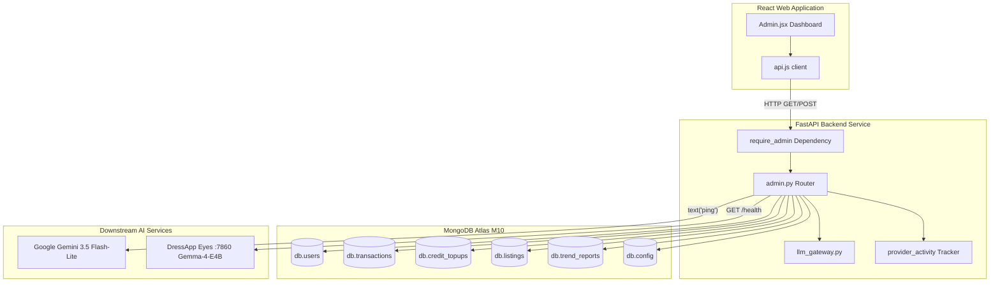

# DressApp Admin Panel — Architectural Narrative & User Manual

This document provides a comprehensive, authoritative breakdown of the DressApp Admin Panel, tracing the frontend dashboard interface ([Admin.jsx](file:///C:/DressApp_AG/apps/web/src/pages/Admin.jsx)) and its corresponding backend API layer ([admin.py](file:///C:/DressApp_AG/backend/app/api/v1/admin.py)).

---

## 1. Executive Summary & Value Proposition

### High-Level Overview
The DressApp Admin Panel is the centralized hub for platform oversight, monetization auditing, AI model configuration, and system diagnostics. It provides administrators with a real-time, high-fidelity lens into platform health, marketplace transaction volumes, user AI credit consumption, and downstream AI microservice performance without requiring direct terminal or database shell access.

### Architectural Flow
The following diagram illustrates how the frontend dashboard interfaces with the backend services, queries MongoDB Atlas collections, and conducts downstream health probes:



### Key Administrative Capabilities
- **Real-Time KPI Visibility**: Summary metrics covering active users, total closet items, marketplace volume, platform fees, stylist calls, and published Trend Scout reports.
- **Secure Authentication**: Production access is strictly gated behind Google OAuth authentication (`ADMIN_EMAILS`); legacy unauthenticated bypass buttons have been eliminated.
- **Multi-Tier AI Routing Governance**: Direct verification and live ping diagnostics for the primary **Google Gemini 3.5 Flash-Lite** gateway and the on-premises **Gemma-4-E4B** Eyes container on port 7860.
- **Marketplace Safety & Moderation**: Instant capability to inspect, pause, or restore listings and manage user privileges.

---

## 2. Comprehensive User Manual

### Visual Interface Topology
The Admin panel is organized into a clean, multi-tab layout optimized for high-density administrative operations:

```
+-------------------------------------------------------------------------------+
|  DressApp (Admin Console)                              [Return to App]        |
|  ---------------------------------------------------------------------------  |
|  [ Overview ]  [ Providers ]  [ Trend Scout ]  [ Users ]  [ Listings ]  ...   |
+-------------------------------------------------------------------------------+
|  OVERVIEW TAB                                                                 |
|  +------------------+  +------------------+  +------------------+  +-------+  |
|  | Active Users     |  | Closet Inventory |  | Active Listings  |  | Gross |  |
|  | 18 (+2 today)    |  | 340 garments     |  | 8 items listed   |  | $140  |  |
|  +------------------+  +------------------+  +------------------+  +-------+  |
|                                                                               |
|  +-------------------------------------------------------------------------+  |
|  | Downstream Provider Activity (Rolling 200 calls)                        |  |
|  | gemini-flash: 142 calls (0% err, 280ms) | eyes-gemma: 12 calls (0% err) |  |
|  +-------------------------------------------------------------------------+  |
+-------------------------------------------------------------------------------+
```

### Operational Walkthroughs

#### 1. Overview Tab
- **Metric Cards**: Real-time counters for Registered Users, Total Garments, Marketplace Listings, Transactions, Gross Volume, Platform Fees, and Stylist Activity.
- **Provider Activity Monitor**: Rolling telemetry for connected AI and weather endpoints, tracking call counts, error percentages, and latency benchmarks (median and p95).

#### 2. Providers Tab
- **Google Gemini Gateway**: Displays configuration status and connection health for the native `google-genai` SDK. Tapping **Verify Key** executes a lightweight text-generation ping to confirm quota availability.
- **Eyes Vision Engine**: Inspects the on-prem CPX32 VPS container (`http://eyes:7860`). Allows toggling the runtime override between cloud vision and self-hosted Gemma inference without restarting backend pods.

#### 3. Users Tab
- **User Directory**: Searchable list detailing user email, assigned role (`user`, `admin`), active tier (`free`, `manager`, `pro`), credit balance, and transaction history.
- **Role Administration**: One-click actions to promote users to administrator or adjust account permissions.

#### 4. Listings & Transactions Tabs
- **Listing Oversight**: Filter by listing status (`active`, `paused`, `sold`, `removed`). Administrators can moderate and pause non-compliant listings immediately.
- **Financial Audit**: Aggregates gross volume, captured platform fees, payment gateway commissions, and seller net payouts.

---

## 3. Technology Stack & Capability Deep-Dive

### Authentication & Authorization
- **Dependency Guard**: API endpoints enforce the `require_admin` dependency in `backend/app/api/v1/admin.py`, checking that the caller's JWT email is included in the production `ADMIN_EMAILS` environment variable.
- **Google OAuth Integration**: Production sign-in flows through Google OAuth (`dressappdeveloper@gmail.com`), removing local hardcoded dev shortcuts for hardened security.

### Multi-Tier AI Routing Infrastructure
- **Primary Engine**: Google Gemini 3.5 Flash-Lite handles production stylist inquiries and vision analysis via `backend/app/services/llm_gateway.py`.
- **Quota Safety Net**: If Gemini encounters rate limits (`429` / `RESOURCE_EXHAUSTED`), the request seamlessly falls back to the on-prem Gemma-4-E4B container on port 7860, returning `provider_fallback="gemma"` without interrupting user workflows.

### Database Operations
- **MongoDB Atlas Aggregations**:
  - Summarizes financial totals across paid transactions:
    ```python
    pipeline = [{"$match": {"status": "paid"}}, {"$group": {"_id": None, "gross": {"$sum": "$financial.gross_cents"}}}]
    ```
  - Aggregates prepaid credit purchases:
    ```python
    topup_pipeline = [{"$match": {"status": "captured"}}, {"$group": {"_id": None, "total": {"$sum": "$amount_cents"}}}]
    ```
