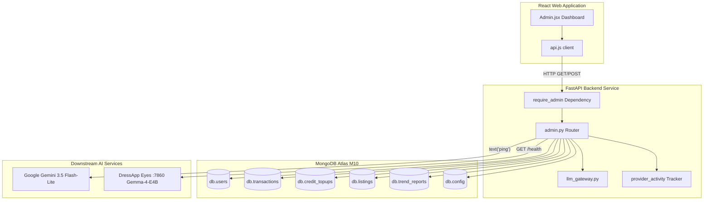

# Panel de administración de DressApp — Narrativa arquitectónica y manual de usuario

Este documento proporciona un desglose completo y fidedigno del Panel de administración de DressApp, abarcando la interfaz del panel de control frontend ([Admin.jsx](file:///C:/DressApp_AG/apps/web/src/pages/Admin.jsx)) y su correspondiente capa de API en el backend ([admin.py](file:///C:/DressApp_AG/backend/app/api/v1/admin.py)).

---

## 1. Resumen ejecutivo y propuesta de valor

### Descripción de alto nivel
El Panel de administración de DressApp es el centro neurálgico para la supervisión de la plataforma, la auditoría de monetización, la configuración de modelos de IA y el diagnóstico del sistema. Proporciona a los administradores una visión en tiempo real y de alta fidelidad del estado de la plataforma, los volúmenes de transacciones del mercado, el consumo de créditos de IA por parte de los usuarios, los grupos de evaluadores y el rendimiento de los microservicios downstream de IA sin requerir acceso directo a terminales o consolas de bases de datos.

### Flujo arquitectónico
El siguiente diagrama ilustra cómo el panel frontend interactúa con los servicios de backend, consulta colecciones de MongoDB Atlas y realiza pruebas de estado en los servicios downstream:



### Capacidades administrativas clave
- **Visibilidad de KPI en tiempo real**: Métricas resumidas sobre usuarios activos, prendas totales en el armario, volumen del mercado, comisiones de la plataforma, llamadas al estilista e informes publicados de Trend Scout.
- **Programa del grupo de evaluadores**: Asignación automática de roles y del nivel Professional de cortesía para cuentas de evaluadores verificadas (`maystarboard@gmail.com`, `lokoprod@gmail.com`, `dressapdeveloper@gmail.com`).
- **Autenticación segura**: El acceso a producción está estrictamente protegido detrás de la autenticación con Google OAuth (`ADMIN_EMAILS`); se han eliminado los botones heredados de acceso directo sin autenticación.
- **Gobernanza del enrutamiento de IA multinivel**: Verificación directa y diagnósticos de ping en vivo para la puerta de enlace principal de **Google Gemini 3.5 Flash-Lite** y el contenedor de Eyes **Gemma-4-E4B** on-premises en el puerto 7860.
- **Seguridad y moderación del mercado**: Capacidad inmediata para inspeccionar, pausar o restablecer publicaciones y gestionar privilegios de usuarios.

---

## 2. Manual de usuario completo

### Topología de la interfaz visual
El panel de administración está organizado en un diseño limpio de múltiples pestañas optimizado para operaciones administrativas de alta densidad:

```
+-------------------------------------------------------------------------------+
|  DressApp (Admin Console)                              [Return to App]        |
|  ---------------------------------------------------------------------------  |
|  [ Overview ]  [ Providers ]  [ Trend Scout ]  [ Users ]  [ Listings ]  ...   |
+-------------------------------------------------------------------------------+
|  OVERVIEW TAB                                                                 |
|  +------------------+  +------------------+  +------------------+  +-------+  |
|  | Active Users     |  | Closet Inventory |  | Active Listings  |  | Gross |  |
|  | 18 (+2 today)    |  | 340 garments     |  | 8 items listed   |  | $140  |  |
|  +------------------+  +------------------+  +------------------+  +-------+  |
|                                                                               |
|  +-------------------------------------------------------------------------+  |
|  | Downstream Provider Activity (Rolling 200 calls)                        |  |
|  | gemini-flash: 142 calls (0% err, 280ms) | eyes-gemma: 12 calls (0% err) |  |
|  +-------------------------------------------------------------------------+  |
+-------------------------------------------------------------------------------+
```

### Recorridos operativos

#### 1. Pestaña Visión general (Overview)
- **Tarjetas de métricas**: Contadores en tiempo real de Usuarios Registrados, Prendas Totales, Publicaciones del Mercado, Transacciones, Volumen Bruto, Comisiones de Plataforma y Actividad del Estilista.
- **Monitor de actividad de proveedores**: Telemetría continua para terminales conectados de IA y meteorología, registrando conteo de llamadas, porcentajes de error y puntos de referencia de latencia (mediana y p95).

#### 2. Pestaña Proveedores (Providers)
- **Puerta de enlace Google Gemini**: Muestra el estado de configuración y el estado de la conexión para el SDK nativo `google-genai`. Al tocar **Verify Key** se ejecuta un ping ligero de generación de texto para confirmar la disponibilidad de cuota.
- **Motor de visión Eyes**: Inspecciona el contenedor on-prem del VPS CPX32 (`http://eyes:7860`). Permite alternar la anulación de ejecución entre visión en la nube e inferencia autohospedada de Gemma sin reiniciar los pods del backend.

#### 3. Pestaña Usuarios (Users)
- **Directorio de usuarios**: Lista con búsqueda que detalla correo electrónico del usuario, rol asignado (`user`, `tester`, `admin`), nivel activo (`free`, `manager`, `pro`), saldo de créditos e historial de transacciones.
- **Administración de roles**: Acciones en un solo clic para ascender usuarios a administrador o ajustar privilegios de evaluador.
- **Identificación del grupo de evaluadores**: Una insignia visual destaca las cuentas inscritas en el programa gratuito para evaluadores.

#### 4. Pestañas Publicaciones y Transacciones (Listings & Transactions)
- **Supervisión de publicaciones**: Filtra por estado de publicación (`active`, `paused`, `sold`, `removed`). Los administradores pueden moderar y pausar publicaciones que infrinjan las normas de forma inmediata.
- **Auditoría financiera**: Consolida volumen bruto, comisiones capturadas de la plataforma, comisiones de pasarelas de pago y pagos netos a vendedores.

---

## 3. Pila tecnológica y análisis detallado de capacidades

### Autenticación y autorización
- **Protección por dependencias**: Los endpoints de la API aplican la dependencia `require_admin` en `backend/app/api/v1/admin.py`, verificando que el correo electrónico del JWT del solicitante esté incluido en la variable de entorno `ADMIN_EMAILS` de producción.
- **Integración con Google OAuth**: El inicio de sesión en producción fluye a través de Google OAuth (`dressapdeveloper@gmail.com`), eliminando atajos locales codificados para reforzar la seguridad.

### Infraestructura de enrutamiento de IA multinivel
- **Motor principal**: Google Gemini 3.5 Flash-Lite gestiona las consultas de estilismo en producción y el análisis de visión mediante `backend/app/services/llm_gateway.py`.
- **Red de seguridad de cuotas**: Si Gemini encuentra límites de velocidad (`429` / `RESOURCE_EXHAUSTED`), la solicitud pasa de manera transparente al contenedor Gemma-4-E4B on-premises en el puerto 7860, devolviendo `provider_fallback="gemma"` sin interrumpir los flujos de trabajo del usuario.

### Operaciones de base de datos
- **Agregaciones en MongoDB Atlas**:
  - Resume los totales financieros en transacciones pagadas:
    ```python
    pipeline = [{"$match": {"status": "paid"}}, {"$group": {"_id": None, "gross": {"$sum": "$financial.gross_cents"}}}]
    ```
  - Agrega compras de créditos prepagados:
    ```python
    topup_pipeline = [{"$match": {"status": "captured"}}, {"$group": {"_id": None, "total": {"$sum": "$amount_cents"}}}]
    ```
