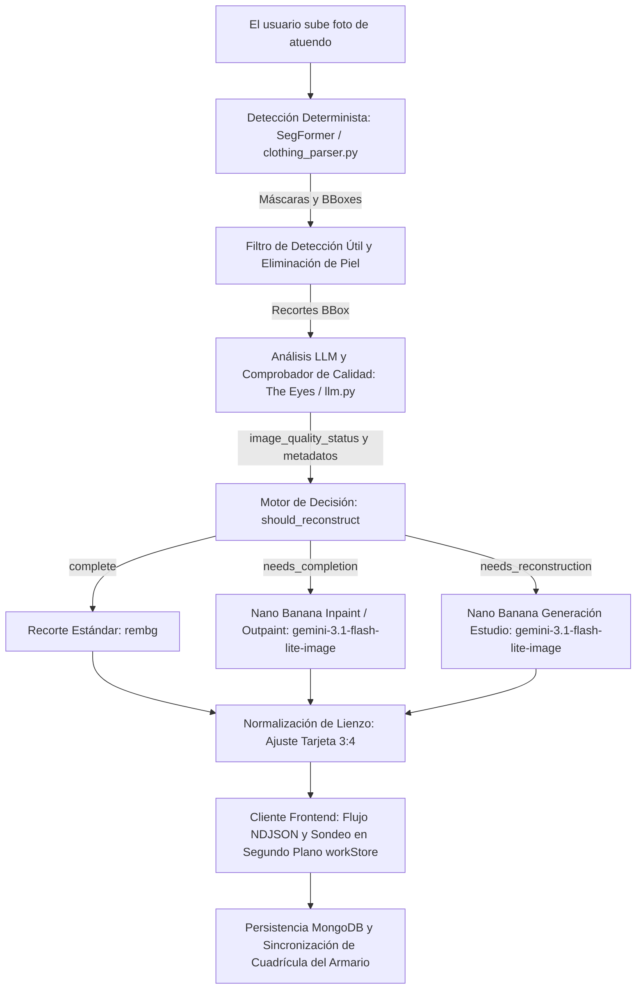

# GarmentVision — El Pipeline de Visión y Reconstrucción de DressApp

> **Módulo:** `backend/app/services/vision/` y `backend/app/services/reconstruction.py`  
> **Estado:** Producción (activo en VPS + autoalojamiento `dressapp-eyes`).  
> **Rol funcional:** Transforma cualquier fotografía del usuario (selfie en el espejo, foto de conjunto o flat-lay) en prendas de armario impecables, segmentadas individualmente, etiquetadas y reconstruidas mediante IA.

---

## 1. Resumen Ejecutivo y Propuesta de Valor

### Descripción General
GarmentVision constituye el núcleo de inteligencia óptica de DressApp. Es un pipeline de visión integral y multietapa que procesa fotos de usuarios sin restricciones y produce prendas de armario limpias, aisladas y fotorrealistas. Fundamentado en una arquitectura de IA híbrida, combina una segmentación determinista de alta velocidad (SegFormer `b3_clothes`) y recorte de fondo (`u2netp` / rembg) con razonamiento multimodal profundo (Gemini) y reparación generativa de imágenes (Nano Banana / `gemini-3.1-flash-lite-image`).

Cuando la ropa en las fotos de los usuarios queda tapada por el cabello, bolsos o brazos, o recortada por el marco de la cámara, el **Comprobador de Calidad por IA** de GarmentVision diagnostica el defecto y activa automáticamente la **Compleción de Imagen** (inpainting/outpainting de dobladillos, mangas y cuellos faltantes) o la **Reconstrucción Completa de Estudio** (regenerando prendas cortadas o parciales en fotos de catálogo de comercio electrónico independientes e impecables).

### Flujo Arquitectónico



### Propuesta de Valor para el Usuario
- **Ingesta de Múltiples Prendas sin Fricción:** Sube un solo selfie de cuerpo entero y aísla automáticamente cada chaqueta, prenda superior, falda, pantalón, calzado y accesorio en cuestión de segundos.
- **Presentación Impecable con Calidad de Estudio:** Las prendas cubiertas por extremidades o bolsos se completan automáticamente; los artículos cortados (como calzado parcial o abrigos incompletos) se reconstruyen totalmente en tomas planas de estudio impecables.
- **Comprobador Inteligente de Calidad Visual:** The Eyes evalúa automáticamente cada recorte para detectar cortes en los bordes, oclusiones y contornos faltantes, eliminando la edición fotográfica manual.
- **Optimización Asíncrona de Ruta Crítica:** Las reconstrucciones generativas se ejecutan en segundo plano, manteniendo la carga inicial ágil en menos de 5 segundos.

---

## 2. Manual de Usuario Completo

### Topología de la Interfaz Visual
```text
┌────────────────────────────────────────────────────────────────────────┐
│  [ Añadir ropa — Cámara y Carga ]                                      │
│  ┌──────────────────────────────────────────────────────────────────┐  │
│  │  [Cámara en Vivo / Zona para Soltar Archivos]                    │  │
│  │  "Toma o sube fotos de cuerpo entero, flat-lays o recibos"       │  │
│  └──────────────────────────────────────────────────────────────────┘  │
│                                                                        │
│  [ Flujo de Procesamiento: Detección y Comprobación de Calidad ]       │
│  ┌─────────────────┐  ┌─────────────────┐  ┌─────────────────┐         │
│  │ Recorte Chaqueta│  │ Recorte Inferior│  │ Recorte Calzado │         │
│  │ [Needs Inpaint] │  │ [Needs Outpaint]│  │ [Reconstruct]   │         │
│  │ "Cazadora Biker"│  │ "Falda de Tul"  │  │ "Mules c. Tacón"│         │
│  └─────────────────┘  └─────────────────┘  └─────────────────┘         │
│                                                                        │
│  [ Armario Guardado: Actualización en Tiempo Real vía workStore ]      │
│  ┌─────────────────┐  ┌─────────────────┐  ┌─────────────────┐         │
│  │ Chaqueta Compl. │  │ Falda Restaurada│  │ Calzado Estudio │         │
│  │ (Mangas complet)│  │ (Dobladillo c.) │  │ (Par con tacón) │         │
│  └─────────────────┘  └─────────────────┘  └─────────────────┘         │
└────────────────────────────────────────────────────────────────────────┘
```

### Modos y Recorridos de Trabajo
1. **Captura Interactiva e Ingesta por Lotes:**
   - Pulsa en **Añadir elemento** &rarr; toma o sube una foto que contenga una o más prendas.
   - El sistema realiza comprobaciones preventivas de duplicados en tiempo real (SHA-256 mediante `crypto.subtle` y hash perceptual) para detectar subidas duplicadas al instante.
2. **Evaluación de Calidad por IA:**
   - A medida que SegFormer segmenta las prendas, el Comprobador de Calidad de Gemini inspecciona cada prenda:
     - `complete`: La prenda es completamente visible, sin oclusiones y centrada. Se mantiene tal cual.
     - `needs_completion`: La prenda tiene áreas tapadas, bordes faltantes, cuellos recortados o dobladillos cortados. Se envía a la cola para inpainting/outpainting con IA.
     - `needs_reconstruction`: El artículo está severamente cortado (p. ej., solo se ven las puntas de los zapatos). Se envía a la cola para generación completa de estudio.
3. **Compleción Transparente en Segundo Plano:**
   - Al pulsar **Guardar**, las prendas aparecen de inmediato en la cuadrícula del armario.
   - Las tareas en segundo plano ejecutan la compleción de imagen generativa sin congelar la interfaz. Al terminar, `workStore` actualiza la tarjeta en tiempo real.

---

## 3. Pila Tecnológica y Análisis Detallado de Capacidades

### Orquestación Central e IA/Lógica
- **Motor de Segmentación (`clothing_parser.py`):** Utiliza SegFormer ajustado con conjuntos de datos de moda ATR / LIP para identificar hasta 18 clases, aplicando sustracción de máscara de piel y puente morfológico de tirantes.
- **Prompting del Comprobador de Calidad (`llm.py`):** Esquema de salida JSON estructurado que exige `image_quality_status`, `image_quality_reason` y `reconstruction_prompt`.
- **Motor de Decisión (`reconstruction.py`):** Evalúa el estado del LLM junto con una protección geométrica de contacto con los bordes (`_EDGE_TOUCH_MARGIN = 40`) para garantizar que las prendas cortadas por el marco de la foto nunca se clasifiquen erróneamente como completas.
- **Motor de Reparación Generativa (`gemini_image_service.py`):**
  - **Inpaint / Outpaint (`edit`):** Envía los bytes recortados y el prompt estructurado a `gemini-3.1-flash-lite-image` para preservar la textura de la tela, el patrón y el color mientras expande la geometría faltante.
  - **Generación de Estudio (`generate`):** Solicita a `gemini-3.1-flash-lite-image` con metadatos descriptivos completos (tipo de prenda, material, color, herrajes, escote) para renderizar una pieza de catálogo impecable sobre fondo blanco roto.

### Sincronización Frontend (`workStore.js` y `itemImage.js`)
- **Resolución Centralizada de Imágenes (`itemImage.js`):** `bestImageUrl()` prioriza `reconstructed_image_url` con la máxima precedencia, garantizando que las imágenes reparadas por IA sustituyan de inmediato a las miniaturas temporales sin procesar.
- **Sondeo Entre Páginas (`workStore.js`):** Realiza un seguimiento global de las tareas de reconstrucción en segundo plano durante la navegación, integrando automáticamente los documentos actualizados en `closetStore`.
