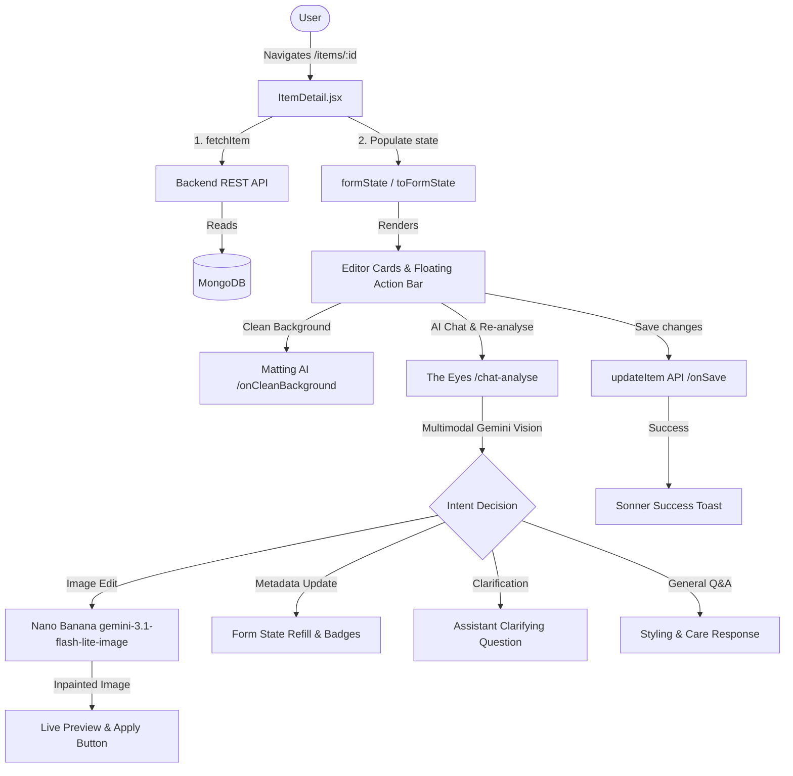

# Detalles de la Prenda: Arquitectura y Guía de Usuario

Este documento ofrece una descripción técnica completa y una guía operativa para la página de **Detalles de la Prenda** (`ItemDetail.jsx`) en DressApp.

---

## 1. Resumen Ejecutivo y Propuesta de Valor

### Visión General
El panel de **Detalles de la Prenda** es el centro de control para gestionar cada artículo del armario digital, combinando fotos y metadatos con edición generativa mediante **Nano Banana** (`gemini-3.1-flash-lite-image`).

### Flujo Arquitectónico



### Propuesta de Valor
* **Editor IA Conversacional**: Envía instrucciones a **The Eyes** (*"Quitar los zapatos"*, *"Completar el hueco"*).
* **Inpainting Nano Banana**: Repara áreas recortadas u ocluidas con alta fidelidad.
* **Diálogos de Aclaración**: Preguntas inteligentes ante solicitudes ambiguas.
* **Organización Precisa**: Estructura modular de atributos.
* **Eliminación de Fondo No Generativa**: Aislamiento fiel sin distorsiones.
* **13 Idiomas Sincronizados**: Soporte total con i18next.

---

## 2. Manual de Usuario

### Topología de la Interfaz

```
+--------------------------------------------------------------------------+
|  <- (Back)                                         (Undo) (Save) (Up)    |
+------------------------------------+-------------------------------------+
| LEFT COLUMN (Visual & AI Actions)  | RIGHT COLUMN (Metadata Editor)      |
|                                    |                                     |
| [ GARMENT PHOTO & CAMERA ]         | [ IDENTITY CARD ]                   |
| [ CLEAN BACKGROUND CARD ]          | [ TAXONOMY CARD ]                   |
| [ RE-ANALYSE & AI EYES CHAT ]      | [ COMPOSITION CARD ]                |
|   - Quick Prompts & Chat Box       | [ QUALITY & WEAR CARD ]             |
|   - Live Nano Banana Preview       | [ PRICING & INTENT CARD ]           |
| [ DPP PROVENANCE PANEL ]           | [ ORGANIZATION CARD ]               |
+------------------------------------+-------------------------------------+
```

### Flujos de Trabajo

#### 1. Reemplazo de foto y captura
* Subida de fotos desde galería o cámara.

#### 2. Limpiar Fondo
* Matting alfa no generativo en segundo plano.

#### 3. Reanalizar Foto y Asistente IA (The Eyes)
* **Caja de Prompt IA**: Escribe o dicta solicitudes en lenguaje natural.
* **Sugerencias Rápidas**: Chips de 1 toque para acciones comunes.
* **Inpainting Nano Banana**: Vista previa con botón **"Aplicar como foto de prenda"**.
* **Reanálisis en 1 Clic**: Botón de respaldo rápido.

#### 4. Editor de Taxonomía y Composición
* Listas ponderadas de colores y telas con resaltado de validación.

#### 5. Dictado por Voz
* Web Speech API adaptada al idioma del usuario.

---

## 3. Diálogos y Modales

### 1. Selector de Prendas Vinculadas (`addOpen`)
* Vinculación de conjuntos o forros.

### 2. Alerta de Taxonomía (`gatekeeperOpen`)
* Prevención de cambios de categoría accidentales.

### 3. Confirmación de Eliminación (`AlertDialog`)
* Eliminación protegida con actualización optimista.

---

## 4. Pila Tecnológica y Motores IA

* **Pipeline Multimodal (`POST /api/v1/closet/{item_id}/chat-analyse`)**.
* **Motor Nano Banana (`gemini-3.1-flash-lite-image`)**.
* **Sincronización en 13 idiomas**.
