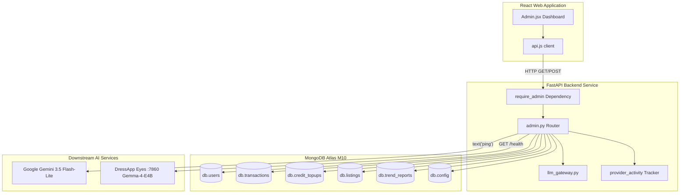

# Panneau d'administration DressApp — Présentation architecturale et manuel utilisateur

Ce document propose une description détaillée et faisant autorité du panneau d'administration de DressApp, retraçant l'interface du tableau de bord frontend ([Admin.jsx](file:///C:/DressApp_AG/apps/web/src/pages/Admin.jsx)) et sa couche d'API backend correspondante ([admin.py](file:///C:/DressApp_AG/backend/app/api/v1/admin.py)).

---

## 1. Résumé exécutif et proposition de valeur

### Présentation générale
Le panneau d'administration de DressApp est le centre névralgique de supervision de la plateforme, d'audit de monétisation, de configuration des modèles d'IA et de diagnostic système. Il fournit aux administrateurs une vision en temps réel et de haute fidélité sur l'état de la plateforme, les volumes de transactions du marketplace, la consommation de crédits d'IA des utilisateurs, les groupes de testeurs et les performances des microservices d'IA en aval, sans nécessiter d'accès direct au terminal ou à la console de base de données.

### Flux architectural
Le schéma suivant illustre la manière dont le tableau de bord frontend communique avec les services backend, interroge les collections MongoDB Atlas et réalise des tests d'état en aval :



### Fonctionnalités administratives clés
- **Visibilité des KPI en temps réel** : Métriques consolidées couvrant les utilisateurs actifs, le total des articles de garde-robe, le volume du marketplace, les commissions de plateforme, les appels au styliste et les rapports Trend Scout publiés.
- **Authentification sécurisée** : L'accès à la production est strictement réservé via l'authentification Google OAuth (`ADMIN_EMAILS`) ; les boutons de contournement non authentifiés obsolètes ont été supprimés.
- **Gouvernance du routage d'IA multiniveau** : Vérification directe et diagnostics de ping en direct pour la passerelle principale **Google Gemini 3.5 Flash-Lite** et le conteneur Eyes sur site **Gemma-4-E4B** sur le port 7860.
- **Sécurité et modération du marketplace** : Capacité immédiate d'inspecter, de suspendre ou de rétablir des annonces et de gérer les privilèges des utilisateurs.

---

## 2. Manuel utilisateur complet

### Topologie de l'interface visuelle
Le panneau d'administration est organisé selon une présentation épurée à onglets multiples, optimisée pour les opérations administratives denses :

```
+-------------------------------------------------------------------------------+
|  DressApp (Admin Console)                              [Return to App]        |
|  ---------------------------------------------------------------------------  |
|  [ Overview ]  [ Providers ]  [ Trend Scout ]  [ Users ]  [ Listings ]  ...   |
+-------------------------------------------------------------------------------+
|  OVERVIEW TAB                                                                 |
|  +------------------+  +------------------+  +------------------+  +-------+  |
|  | Active Users     |  | Closet Inventory |  | Active Listings  |  | Gross |  |
|  | 18 (+2 today)    |  | 340 garments     |  | 8 items listed   |  | $140  |  |
|  +------------------+  +------------------+  +------------------+  +-------+  |
|                                                                               |
|  +-------------------------------------------------------------------------+  |
|  | Downstream Provider Activity (Rolling 200 calls)                        |  |
|  | gemini-flash: 142 calls (0% err, 280ms) | eyes-gemma: 12 calls (0% err) |  |
|  +-------------------------------------------------------------------------+  |
+-------------------------------------------------------------------------------+
```

### Guides opérationnels

#### 1. Onglet Vue d'ensemble (Overview)
- **Cartes métriques** : Compteurs en temps réel pour les utilisateurs inscrits, le total des vêtements, les annonces sur le marketplace, les transactions, le volume brut, les commissions de plateforme et l'activité du styliste.
- **Moniteur d'activité des fournisseurs** : Télémétrie glissante pour les points de terminaison d'IA et de météo connectés, mesurant le nombre d'appels, les pourcentages d'erreur et les références de latence (médiane et p95).

#### 2. Onglet Fournisseurs (Providers)
- **Passerelle Google Gemini** : Affiche l'état de configuration et la santé de la connexion pour le SDK natif `google-genai`. Cliquer sur **Verify Key** déclenche un ping léger de génération textuelle pour confirmer la disponibilité des quotas.
- **Moteur de vision Eyes** : Inspecte le conteneur du VPS CPX32 sur site (`http://eyes:7860`). Permet de basculer la surcharge d'exécution entre la vision cloud et l'inférence hébergée sur site Gemma sans redémarrer les pods backend.

#### 3. Onglet Utilisateurs (Users)
- **Répertoire utilisateurs** : Liste filtrable détaillant l'e-mail de l'utilisateur, le rôle attribué (`user`, `tester`, `admin`), le forfait actif (`free`, `manager`, `pro`), le solde de crédits et l'historique des transactions.
- **Gestion des rôles** : Actions en un clic pour promouvoir des utilisateurs administrateurs ou ajuster les autorisations de testeur.
- **Identification du groupe de testeurs** : Un badge visuel signale les comptes inscrits au programme de test gracieux.

#### 4. Onglets Annonces et Transactions (Listings & Transactions)
- **Surveillance des annonces** : Filtrez par état d'annonce (`active`, `paused`, `sold`, `removed`). Les administrateurs peuvent modérer et suspendre immédiatement les annonces non conformes.
- **Audit financier** : Consolide le volume brut, les commissions de plateforme prélevées, les frais de passerelle de paiement et les versements nets aux vendeurs.

---

## 3. Pile technologique et analyse approfondie des fonctionnalités

### Authentification et autorisation
- **Garde de dépendance** : Les points de terminaison de l'API appliquent la dépendance `require_admin` dans `backend/app/api/v1/admin.py`, s'assurant que l'adresse e-mail issue du JWT est bien présente dans la variable d'environnement de production `ADMIN_EMAILS`.
- **Intégration Google OAuth** : La connexion en production transite par Google OAuth (`dressappdeveloper@gmail.com`), supprimant ainsi tout raccourci de développement codé en dur pour une sécurité renforcée.

### Infrastructure de routage d'IA multiniveau
- **Moteur principal** : Google Gemini 3.5 Flash-Lite traite les requêtes de stylisme en production et les analyses de vision via `backend/app/services/llm_gateway.py`.
- **Filet de sécurité pour les quotas** : Si Gemini fait face à des limites de requêtes (`429` / `RESOURCE_EXHAUSTED`), la requête bascule de manière transparente vers le conteneur Gemma-4-E4B sur site sur le port 7860, renvoyant `provider_fallback="gemma"` sans aucune gêne pour l'utilisateur.

### Opérations de base de données
- **Agrégations MongoDB Atlas** :
  - Calcule les totaux financiers des transactions payées :
    ```python
    pipeline = [{"$match": {"status": "paid"}}, {"$group": {"_id": None, "gross": {"$sum": "$financial.gross_cents"}}}]
    ```
  - Consolide les achats de packs de crédits prépayés :
    ```python
    topup_pipeline = [{"$match": {"status": "captured"}}, {"$group": {"_id": None, "total": {"$sum": "$amount_cents"}}}]
    ```
