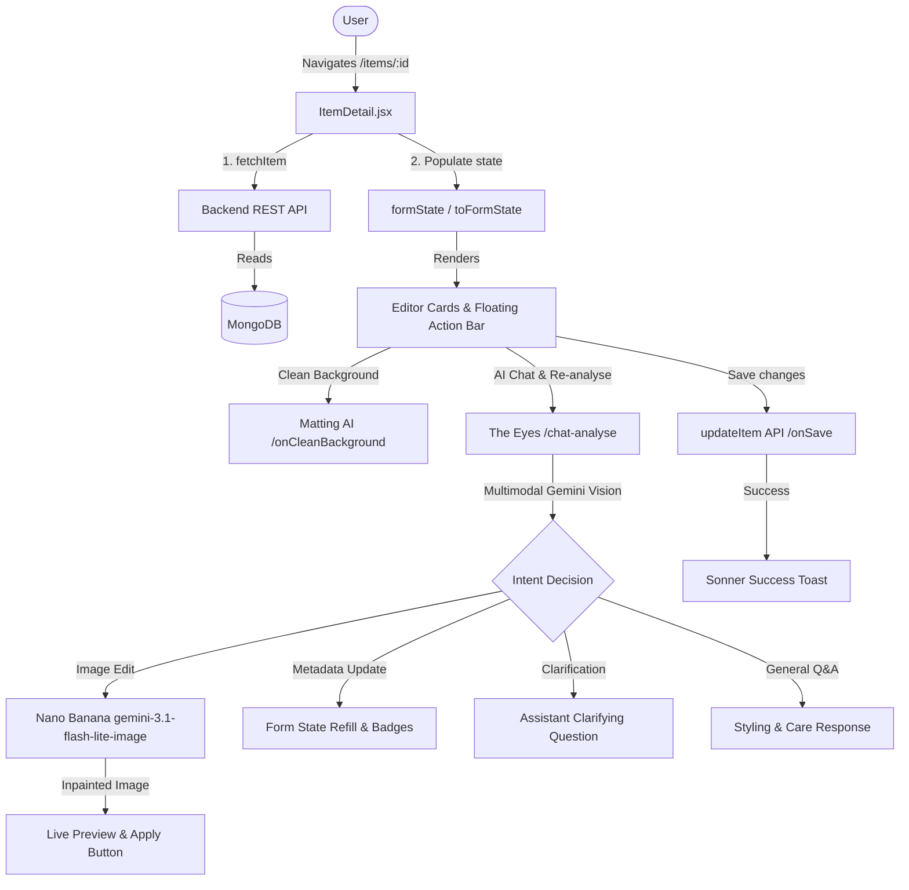

# Détails de l'article : Architecture & Guide Utilisateur

Ce document présente une vue d'ensemble technique et opérationnelle de la page **Détails de l'article** (`ItemDetail.jsx`) dans DressApp.

---

## 1. Résumé & Proposition de Valeur

### Vue d'ensemble
Le panneau **Détails de l'article** centralise la gestion des vêtements, reliant les photos et les métadonnées avec des capacités d'édition IA avancées via **Nano Banana** (`gemini-3.1-flash-lite-image`).

### Flux Architectural



### Avantages Utilisateur
* **Éditeur IA Conversationnel** : Donnez des instructions en langage naturel à **The Eyes** (*"Retirer les chaussures"*, *"Combler le trou"*).
* **Inpainting Studio Nano Banana** : Reconstruit les parties coupées ou masquées avec fidélité.
* **Clarifications Intelligentes** : Pose des questions en cas d'instructions ambiguës.
* **Cartes Structurées** : Organisation claire des attributs.
* **Détourage Non-Génératif** : Suppression d'arrière-plan sans altération.
* **Support de 13 Langues** : Internationalisation complète avec i18next.

---

## 2. Guide Utilisateur

### Topologie de l'Interface

```
+--------------------------------------------------------------------------+
|  <- (Back)                                         (Undo) (Save) (Up)    |
+------------------------------------+-------------------------------------+
| LEFT COLUMN (Visual & AI Actions)  | RIGHT COLUMN (Metadata Editor)      |
|                                    |                                     |
| [ GARMENT PHOTO & CAMERA ]         | [ IDENTITY CARD ]                   |
| [ CLEAN BACKGROUND CARD ]          | [ TAXONOMY CARD ]                   |
| [ RE-ANALYSE & AI EYES CHAT ]      | [ COMPOSITION CARD ]                |
|   - Quick Prompts & Chat Box       | [ QUALITY & WEAR CARD ]             |
|   - Live Nano Banana Preview       | [ PRICING & INTENT CARD ]           |
| [ DPP PROVENANCE PANEL ]           | [ ORGANIZATION CARD ]               |
+------------------------------------+-------------------------------------+
```

### Modes & Flux

#### 1. Remplacement de photo & Capture caméra
* Téléversement ou prise de photo directe.

#### 2. Nettoyer l'arrière-plan
* Détourage alpha non-génératif en arrière-plan.

#### 3. Réanalyser la photo & Assistant IA (The Eyes)
* **Boîte de prompt IA** : Saisissez ou dictez vos demandes.
* **Suggestions rapides** : Boutons d'action instantanés.
* **Génération Nano Banana** : Aperçu en direct avec bouton **"Appliquer comme photo du vêtement"**.
* **Réanalyse en 1 clic** : Actualisation complète instantanée.

#### 4. Éditeur de Taxonomie & Matières
* Listes pondérées des couleurs et matières.

#### 5. Dictée Vocale
* Reconnaissance vocale Web Speech API dans la langue sélectionnée.

---

## 3. Boîtes de Dialogue & Modales

### 1. Sélecteur de pièces associées (`addOpen`)
* Association d'ensembles et doublures.

### 2. Alerte Gardien de Taxonomie (`gatekeeperOpen`)
* Sécurité contre les changements de catégorie erronés.

### 3. Confirmation de Suppression (`AlertDialog`)
* Suppression sécurisée avec mise à jour optimiste.

---

## 4. Architecture Technique & Moteurs IA

* **Pipeline de décision multimodale (`POST /api/v1/closet/{item_id}/chat-analyse`)**.
* **Moteur Nano Banana (`gemini-3.1-flash-lite-image`)**.
* **Synchronisation 13 langues**.
