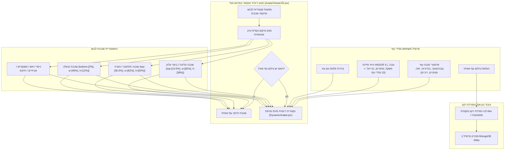

# DressApp — ארכיטקטורת מערכת מיקום והלבשת אווטאר דו-ממדי (`Avatar.md`)

> **גרסת מסמך:** 2.0  
> **תת-מערכת יעד:** מניפה דו-ממדית בפרונט-אנד, חיתוך צילום גוף אמיתי ומנוע שכבות לבוש  
> **קבצי ליבה:** `AvatarViewer2D.jsx`, `DynamicAvatar.jsx`, `OutfitCanvas.jsx`, `Profile.jsx`  
> **סטטוס:** הועלה לייצור וכויול בהצלחה  

---

## 1. תקציר מנהלים וערך למשתמש

### 1.1 סקירה כללית ברמה גבוהה
**מערכת המיקום והלבשת האווטאר הדו-ממדי של DressApp** מספקת סביבת מדידה חזותית אדפטיבית בזמן אמת. המערכת מאפשרת למשתמשים לצפות בתצוגה מקדימה של פריטי לבוש ממושבים מהארון כשהם מולבשים בצורה חלקה מעל **צילום מופרד של גוף אמיתי** או מעל **מניפת וקטור SVG דו-ממדית עם עקומות בזייה דינמיות**.

כדי להשיג דיוק חזותי גבוה במגוון סגנונות לבוש (חולצות צמודות, חולצות פולו, צווארון עגול, ג'ינס בגזרה נמוכה, מכנסי קארגו קצרים ושמלות ערב), המנוע משתמש בכיול נקודות ציון אנטומיות, באיזון פרופורציונלי ובמכולות תצוגה שאינן ממעכות או מעוותות את התמונה.



### 1.2 הצעת ערך למשתמש
* **דיוק יישור אנטומי**: מציב צווארוני חולצות בדיוק בקו הצוואר של האווטאר (`top-[14.5%]`) וחגורות מכנסיים/מכנסיים קצרים בדיוק בקו המותניים הטבעי (`top-[36.5%]`), תוך מניעת הסתרת הפנים או רווחים לא טבעיים.
* **גמישות אווטאר כפול**: מעבר מיידי בין צילום גוף מלא מופרד אישי לבין מניפת וקטור SVG דינמית שנבנתה לפי מדדים אנתרופומטריים מדויקים.
* **שמירה על יחס מכלול פרופורציונלי**: הפעלת שינוי קנה מידה לרוחב החזה והירכיים ($scaleX$) תוך שמירה על יחס הגובה-רוחב המקורי של תמונות הלבוש (`object-fit: contain`), מה שמונע מתיחה או מעיכה של התמונה.
* **היררכיית שכבות אינטראקטיבית**: הלבשת מעילים מעל חולצות ושמלות תוך אפשרות ללחוץ ישירות על שכבות לבוש בודדות כדי לפתוח את פרטי הפריט.

---

## 2. מדריך למשתמש וטופולוגיית ממשק

### 2.1 טופולוגיית ממשק חזותי

```
┌──────────────────────────────────────────────────────────────────┐
│                     משטח הלבשת אווטאר דו-ממדי                    │
├──────────────────────────────────────────────────────────────────┤
│                                                                  │
│                        [ כיסוי ראש   (top: 1%) ]                 │
│                        [ משקפיים     (top: 11%) ]                │
│                        [ קו צוואר    (top: 14.5%) ] ◄─ צווארון   │
│                     ┌──────────────────────────┐                 │
│                     │    חלק עליון / מעילים    │                 │
│                     │       (height: 38%)      │                 │
│                     └──────────────────────────┘                 │
│                        [ קו מותניים  (top: 36.5%) ] ◄─ חגורה     │
│                     ┌──────────────────────────┐                 │
│                     │  חלק תחתון / מכנסיים     │                 │
│                     │       (height: 50%)      │                 │
│                     │                          │                 │
│                     └──────────────────────────┘                 │
│                        [ כפות רגליים (bottom: 2%) ] ◄─── הנעלה   │
│                        [ נעליים      (height: 12%) ]             │
│                                                                  │
├──────────────────────────────────────────────────────────────────┤
│  [ החלפת מצב ]     [ בחירת גוון עור ]     [ עריכת מדדי גוף ]    │
└──────────────────────────────────────────────────────────────────┘
```

### 2.2 מצבי עבודה ותהליכי שימוש

#### מצב 1: שכבת חיתוך צילום גוף אמיתי
1. פתיחת **הגדרות פרופיל** (`/me`).
2. העלאת צילום גוף מלא. ה-Backend מבצע הפרדת רקע באמצעות `rembg` (U2-Net) להסרת הרקע.
3. כתובת התמונה המופרדת (`body_photo_url`) מעדכנת את פרופיל המשתמש ב-MongoDB ומוצגת בתוך מכולת `AvatarViewer2D`.
4. לחזרה למניפת הוקטור, יש ללחוץ על **הסר תמונה** בדף הפרופיל. הממשק מתעדכן מיד ללא צורך ברענון הדף.

#### מצב 2: מניפת SVG וקטורית דינמית
1. כאשר אין צילום גוף פעיל, `AvatarViewer2D` מרנדר את הרכיב `DynamicAvatar.jsx`.
2. המניפה יוצרת עקומות בזייה קוביות רציפות (פקודות $C$ ו-$S$) בתוך תחום SVG viewBox קבוע של `0 0 200 450`.
3. התאמת פרמטרי הגוף (גובה, משקל, מותניים, חזה, כתפיים, ירכיים) או בחירת גוון עור משנה את צללית המניפה דינמית בזמן אמת.

---

## 3. ארכיטקטורה טכנולוגית ומפרט טכני

### 3.1 מחלק אליפסה אנטומי ומחולל מניפת בזייה

הרכיב `DynamicAvatar.jsx` מחשב רוחבי היטל מישורי דו-ממדי מהיקפים אנטומיים תלת-ממדיים באמצעות **מחלק אליפסה אנטומי** ($\text{DIVISOR} = 2.65$):

$$\begin{aligned}
w_{\text{shoulders}} &= (\text{shoulders} \times 1.1) \times (1.05 \text{ if male else } 0.95) \\
w_{\text{chest}} &= \left(\frac{\text{chest}}{2.65} \times 1.05\right) \times (1.02 \text{ if male else } 1.0) \\
w_{\text{waist}} &= \left(\frac{\text{waist}}{2.65} \times 1.0\right) \times (0.98 \text{ if male else } 0.90) \\
w_{\text{hip}} &= \left(\frac{\text{hip}}{2.65} \times 1.05\right) \times (0.93 \text{ if male else } 1.05)
\end{aligned}$$

צללית הגוף נבנית באמצעות פקודות מסלול SVG הממפות נקודות בקרה של עקומת בזייה קובית:

```javascript
// Bezier contour snippet from DynamicAvatar.jsx
const bodyPath = [
  `M ${pNeckR}`,
  `C ${X0 + wNeck + (wShoulders - wNeck) * 0.6},${yChin + neckHeight * 0.7} ${X0 + wShoulders * 0.9},${yShoulders - 2} ${pShoulderR}`,
  `C ${X0 + wShoulders * 0.95},${yShoulders + (yChest - yShoulders) * 0.6} ${X0 + wChest + 2},${yChest - 5} ${pChestR}`,
  `C ${X0 + wChest - 1},${yChest + (yWaist - yChest) * 0.5} ${X0 + wWaist + (isMale ? 1 : -2)},${yWaist - 8} ${pWaistR}`,
  `C ${X0 + wWaist + (isMale ? 2 : 5)},${yWaist + (yHip - yWaist) * 0.4} ${X0 + wHip + 1},${yHip - 8} ${pHipR}`,
  ...
].join(' ');
```

### 3.2 מיקום נקודות ציון מכיול ויחסי CSS של המכולה

כדי להבטיח שפריטי הלבוש יושבים בדיוק במקומם ללא הסתרת פנים או יצירת מרווחים בגוף, מכולות השכבות ב-`AvatarViewer2D.jsx` קשורות ליחסי מיקום CSS מדויקים:

| קטגוריית לבוש | מחלקת מיקום CSS | z-Index | נקודת יישור אנטומית |
| --- | --- | --- | --- |
| **כיסויי ראש** | `top-[1%] left-1/2 w-[34%] aspect-square` | `z-30` | קודקוד הראש |
| **משקפיים** | `top-[11%] left-1/2 w-[18%] h-[4.5%]` | `z-28` | מישור העיניים |
| **אביזרים / שרשראות** | `top-[14.5%] left-1/2 w-[30%] aspect-square` | `z-25` | בסיס הצוואר |
| **חלק עליון (Top)** | `top-[14.5%] left-1/2 w-[82%] h-[38%]` | `z-20` | צווארון לקו הצוואר |
| **מעילים / ביגוד עליון** | `top-[14.5%] left-1/2 w-[86%] h-[42%]` | `z-22` | שכבת מעיל מעל הכתפיים |
| **שמלות** | `top-[14.5%] left-1/2 w-[82%] h-[68%]` | `z-20` | אורך מלא מפתח הצוואר עד הברך |
| **חגורה** | `top-[36.5%] left-1/2 w-[62%] h-[5%]` | `z-21` | לולאות חגורה במותניים |
| **חלק תחתון (מכנסיים/שורטס)** | `top-[36.5%] left-1/2 w-[62%] h-[50%]` | `z-10` | חגורת המכנסיים לקו המותניים |
| **נעליים / הנעלה** | `bottom-[2%] left-1/2 w-[46%] h-[12%]` | `z-15` | קרסול למישור כף הרגל |
| **תיק יד** | `top-[40%] right-[-5%] w-[40%] h-[30%]` | `z-25` | מישור נפילת הזרוע |

### 3.3 שינוי קנה מידה רוחבי פרופורציונלי ללבוש

בנוסף למיקום המרחבי, פריטי הלבוש משנים את רוחבם אופקית ($scaleX$) באופן דינמי על פי פרמטרי הגוף של המשתמש (חזה מלא, כבד, רזה, מותניים רחבות, ירכיים רחבות):

```javascript
// Derivation of garment container scale factors in AvatarViewer2D.jsx
const scales = useMemo(() => {
  const heightFactor = 1 + (params.tall * 0.08) - (params.short * 0.08);
  const widthFactor = 1 + (params.heavy * 0.12) - (params.thin * 0.12);
  const chestFactor = 1 + (params.busty * 0.1);
  const waistFactor = 1 + (params.waist_thick * 0.12) - (params.waist_thin * 0.08);
  const hipsFactor = 1 + (params.hips_wide * 0.12) - (params.hips_narrow * 0.08);

  return { height: heightFactor, width: widthFactor, chest: chestFactor, waist: waistFactor, hips: hipsFactor };
}, [params]);

// Passed to Framer Motion animate prop for Top and Bottom:
// Top: scaleX = scales.chest / scales.width
// Bottom: scaleX = scales.hips / scales.width
```

---

## 4. מטריצת סיכום תיקוני מיקום ופרופורציות

| הבעיה שזוהתה | סיבה | התיקון שהופעל | תוצאה |
| --- | --- | --- | --- |
| **צווארון החולצה הסתיר את הפנים** | היסט גבוה מדי במכולה (`top-[8.3%]` או `top-[12.8%]`) | הגדרת היסט המכולה העליונה ל-`top-[14.5%]` | צווארון החולצה יושב בדיוק בקו הצוואר של האווטאר. |
| **מכנסיים/שורטס נמוכים או חופפים מכפלת** | היסט נמוך מדי במכולה (`top-[38.5%]`) | הגדרת היסט המכולה התחתונה ל-`top-[36.5%]` | חגורת המכנסיים יושבת בדיוק בקו המותניים הטבעי. |
| **עיוורון ביחס הגובה-רוחב של הבגד** | מתיחה ללא הגבלה של המכולה | הפעלת `object-fit: contain` עם התאמת `scaleX` פרופורציונלית | שמירה על יחס הגובה-רוחב המקורי של תמונת הבגד ללא עיוות אופקי. |
| **שהות בהסרת תמונת הגוף** | צורך בטעינה מחדש של מצב הדף | יישום סנכרון מצב מקומי מיידי ב-`Profile.jsx` | תמונת הגוף מוסרת מיידית ללא השהיית UI או מצב תקוע. |

---

*Document compiled automatically by Narrator for DressApp.*
