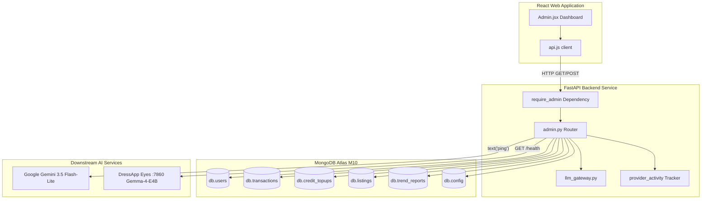

# פאנל הניהול של DressApp — סקירה ארכיטקטונית ומדריך למשתמש

מסמך זה מספק פירוט מקיף ומעמיק של פאנל הניהול (Admin Panel) ב-DressApp, תוך מעקב אחר ממשק לוח הבקרה ב-Frontend ([Admin.jsx](file:///C:/DressApp_AG/apps/web/src/pages/Admin.jsx)) ושכבת ה-API המקבילה ב-Backend ([admin.py](file:///C:/DressApp_AG/backend/app/api/v1/admin.py)).

---

## 1. תקציר מנהלים והצעת ערך

### סקירה כללית ברמה גבוהה
פאנל הניהול של DressApp הוא המרכז הראשי לפיקוח על הפלטפורמה, ביקורת מונטיזציה, הגדרת מודלי AI ואבחון מערכת. הוא מעניק למנהלי המערכת מבט מעמיק בזמן אמת על תקינות המערכת, היקפי העסקאות במרקטפלייס, צריכת קרדיטי AI על ידי משתמשים, קבוצות בודקים וביצועי מיקרו-שירותי ה-AI במורד הזרם (downstream) — כל זאת ללא צורך בגישה ישירה למסוף (Terminal) או למעטפת מסד הנתונים.

### זרימה ארכיטקטונית
התרשים הבא ממחיש כיצד לוח הבקרה ב-Frontend מתקשר עם שירותי ה-Backend, מתשאל אוספי MongoDB Atlas ומבצע בדיקות תקינות (health probes) לשירותי הקצה:



### יכולות ניהול עיקריות
- **נראות מדדי ביצוע (KPI) בזמן אמת**: מדדי סיכום המכסים משתמשים פעילים, סך כל פריטי הארון, היקף מסחר במרקטפלייס, עמלות פלטפורמה, קריאות לסטייליסט ודוחות Trend Scout שפורסמו.
- **תוכנית קבוצת הבודקים (Tester Group Program)**: הקצאת תפקיד והענקת דרגת Professional בחינם באופן אוטומטי עבור חשבונות בודקים מאומתים (`maystarboard@gmail.com`, `lokoprod@gmail.com`, `dressapdeveloper@gmail.com`).
- **אימות מאובטח**: הגישה בסביבת הייצור מגודרת באופן קפדני מאחורי אימות Google OAuth‏ (`ADMIN_EMAILS`); לחצני עקיפה ישנים ללא אימות בוטלו לחלוטין.
- **ממשל ניתוב AI רב-שכבתי**: אימות ישיר ואבחון פינג חי עבור שער **Google Gemini 3.5 Flash-Lite** הראשי ועבור מכולת Eyes המקומית המריצה **Gemma-4-E4B** בפורט 7860.
- **בטיחות וניהול תוכן במרקטפלייס**: יכולת מיידית לבדוק, להשהות או להחזיר מודעות ולנהל הרשאות משתמשים.

---

## 2. מדריך מקיף למשתמש

### טופולוגיית הממשק החזותי
פאנל הניהול מאורגן בפריסה מרובת לשוניות נקייה, המותאמת לפעולות ניהול מרוכזות:

```
+-------------------------------------------------------------------------------+
|  DressApp (Admin Console)                              [Return to App]        |
|  ---------------------------------------------------------------------------  |
|  [ Overview ]  [ Providers ]  [ Trend Scout ]  [ Users ]  [ Listings ]  ...   |
+-------------------------------------------------------------------------------+
|  OVERVIEW TAB                                                                 |
|  +------------------+  +------------------+  +------------------+  +-------+  |
|  | Active Users     |  | Closet Inventory |  | Active Listings  |  | Gross |  |
|  | 18 (+2 today)    |  | 340 garments     |  | 8 items listed   |  | $140  |  |
|  +------------------+  +------------------+  +------------------+  +-------+  |
|                                                                               |
|  +-------------------------------------------------------------------------+  |
|  | Downstream Provider Activity (Rolling 200 calls)                        |  |
|  | gemini-flash: 142 calls (0% err, 280ms) | eyes-gemma: 12 calls (0% err) |  |
|  +-------------------------------------------------------------------------+  |
+-------------------------------------------------------------------------------+
```

### תהליכי עבודה תפעוליים

#### 1. לשונית סקירה כללית (Overview Tab)
- **כרטיסי מדדים (Metric Cards)**: מונים בזמן אמת של משתמשים רשומים, סך הבגדים, מודעות במרקטפלייס, עסקאות, היקף ברוטו (Gross Volume), עמלות פלטפורמה ופעילות הסטייליסט.
- **ניטור פעילות ספקים (Provider Activity Monitor)**: טלמטריה מתגלגלת עבור נקודות קצה מחוברות של AI ומזג אוויר, במעקב אחר מספר קריאות, אחוזי שגיאות ומדדי זמני השהיה (חציון ו-p95).

#### 2. לשונית ספקים (Providers Tab)
- **שער Google Gemini**: מציג את מצב התצורה ותקינות החיבור עבור ה-SDK המקורי `google-genai`. לחיצה על **Verify Key** מריצה פינג קל משקל ליצירת טקסט כדי לאשר זמינות מכסה.
- **מנוע הראייה Eyes**: בודק את מכולת ה-CPX32 VPS המקומית בשרת (`http://eyes:7860`). מאפשר להחליף בזמן ריצה את הגדרת העקיפה בין ראיית ענן לבין הסקת Gemma מקומית בשרת ללא צורך בהפעלת מכולות השרת מחדש.

#### 3. לשונית משתמשים (Users Tab)
- **ספר משתמשים (User Directory)**: רשימה הניתנת לחיפוש המפרטת אימייל של משתמשים, תפקיד מוקצה (`user`, `tester`, `admin`), מסלול מנוי פעיל (`free`, `manager`, `pro`), יתרת קרדיטים והיסטוריית עסקאות.
- **ניהול תפקידים**: פעולות בלחיצה אחת לקידום משתמשים למנהלי מערכת או להתאמת הרשאות בודק.
- **זיהוי קבוצת בודקים**: תג חזותי המדגיש חשבונות הרשומים בתוכנית הבודקים החינמית.

#### 4. לשוניות מודעות ועסקאות (Listings & Transactions Tabs)
- **פיקוח על מודעות**: סינון לפי מצב מודעה (`active`, `paused`, `sold`, `removed`). מנהלי מערכת יכולים לנהל ולהשהות מודעות שאינן עומדות בכללים באופן מיידי.
- **ביקורת פיננסית**: סיכום היקף ברוטו, עמלות פלטפורמה שנגבו, עמלות שער תשלומים ותשלומים נטו למוכרים.

---

## 3. סקירה מעמיקה של מערך הטכנולוגיות והיכולות

### אימות והרשאות (Authentication & Authorization)
- **שומר תלות (Dependency Guard)**: נקודות קצה של ה-API אוכפות את התלות `require_admin` בקובץ `backend/app/api/v1/admin.py`, תוך אימות שכתובת האימייל ב-JWT של הפונה כלולה במשתנה הסביבה `ADMIN_EMAILS` של סביבת הייצור.
- **אינטגרציית Google OAuth**: תהליך ההתחברות בסביבת הייצור מתבצע דרך Google OAuth‏ (`dressapdeveloper@gmail.com`), תוך ביטול קיצורי דרך מקומיים קבועים בקוד לטובת אבטחה מוקשחת.

### תשתית ניתוב AI רב-שכבתית
- **מנוע ראשי**: Google Gemini 3.5 Flash-Lite מטפל בפניות סטייליסט ובניתוח ראייה ממוחשבת בסביבת הייצור דרך `backend/app/services/llm_gateway.py`.
- **רשת ביטחון למיצוי מכסה (Quota Safety Net)**: אם Gemini נתקל במגבלות קצב בקשות (`429` / `RESOURCE_EXHAUSTED`), הבקשה עוברת בצורה שקופה למכולת Gemma-4-E4B המקומית בשרת בפורט 7860, תוך החזרת `provider_fallback="gemma"` מבלי לקטוע את זרימת העבודה של המשתמש.

### פעולות מסד נתונים
- **אגרגציות MongoDB Atlas**:
  - סיכום סכומים כספיים בכל העסקאות ששולמו:
    ```python
    pipeline = [{"$match": {"status": "paid"}}, {"$group": {"_id": None, "gross": {"$sum": "$financial.gross_cents"}}}]
    ```
  - סיכום רכישות קרדיטים מראש:
    ```python
    topup_pipeline = [{"$match": {"status": "captured"}}, {"$group": {"_id": None, "total": {"$sum": "$amount_cents"}}}]
    ```
