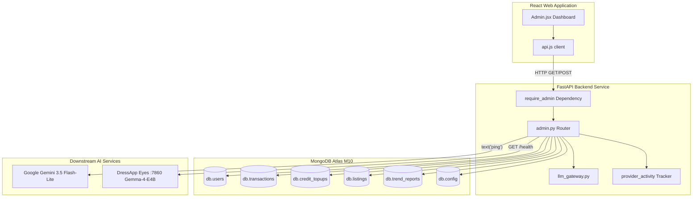

# DressApp एडमिन पैनल — आर्किटेक्चरल विवरण और उपयोगकर्ता मैनुअल

यह दस्तावेज़ DressApp एडमिन पैनल का एक व्यापक, प्रामाणिक विवरण प्रदान करता है, जो फ्रंटएंड डैशबोर्ड इंटरफ़ेस ([Admin.jsx](file:///C:/DressApp_AG/apps/web/src/pages/Admin.jsx)) और इसकी संबंधित बैकएंड API परत ([admin.py](file:///C:/DressApp_AG/backend/app/api/v1/admin.py)) को रेखांकित करता है।

---

## 1. कार्यकारी सारांश और मूल्य प्रस्ताव

### उच्च-स्तरीय अवलोकन
DressApp एडमिन पैनल प्लेटफ़ॉर्म निगरानी, मुद्रीकरण ऑडिटिंग, AI मॉडल कॉन्फ़िगरेशन और सिस्टम डायग्नोस्टिक्स के लिए केंद्रीकृत केंद्र है। यह प्रशासकों को सीधे टर्मिनल या डेटाबेस शेल एक्सेस की आवश्यकता के बिना प्लेटफ़ॉर्म स्वास्थ्य, बाज़ार लेनदेन की मात्रा, उपयोगकर्ता AI क्रेडिट खपत, परीक्षक समूहों और डाउनस्ट्रीम AI माइक्रोसर्विस प्रदर्शन में वास्तविक समय, उच्च-सटीकता लेंस प्रदान करता है।

### आर्किटेक्चरल प्रवाह
निम्नलिखित आरेख दिखाता है कि फ्रंटएंड डैशबोर्ड बैकएंड सेवाओं के साथ कैसे इंटरफ़ेस करता है, MongoDB Atlas संग्रहों को क्वेरी करता है, और डाउनस्ट्रीम स्वास्थ्य जांच करता है:



### प्रमुख प्रशासनिक क्षमताएं
- **वास्तविक समय KPI दृश्यता**: सक्रिय उपयोगकर्ताओं, कुल कपड़ों की वस्तुओं, बाज़ार की मात्रा, प्लेटफ़ॉर्म शुल्क, स्टाइलिस्ट कॉल और प्रकाशित Trend Scout रिपोर्टों को कवर करने वाले सारांश मेट्रिक्स।
- **सुरक्षित प्रमाणीकरण**: प्रोडक्शन एक्सेस Google OAuth प्रमाणीकरण (`ADMIN_EMAILS`) के पीछे सख्ती से सुरक्षित है; पुराने अप्रमाणित बाईपास बटन पूरी तरह हटा दिए गए हैं।
- **मल्टी-टियर AI रूटिंग शासन**: प्राथमिक **Google Gemini 3.5 Flash-Lite** गेटवे और पोर्ट 7860 पर ऑन-प्रिमाइसेस **Gemma-4-E4B** Eyes कंटेनर के लिए प्रत्यक्ष सत्यापन और लाइव पिंग डायग्नोस्टिक्स।
- **मार्केटप्लेस सुरक्षा और मॉडरेशन**: लिस्टिंग का तुरंत निरीक्षण करने, रोकने या पुनर्स्थापित करने और उपयोगकर्ता विशेषाधिकारों को प्रबंधित करने की क्षमता।

---

## 2. व्यापक उपयोगकर्ता मैनुअल

### दृश्य इंटरफ़ेस टोपोलॉजी
एडमिन पैनल को उच्च-घनत्व प्रशासनिक कार्यों के लिए अनुकूलित एक साफ, बहु-टैब लेआउट में व्यवस्थित किया गया है:

```
+-------------------------------------------------------------------------------+
|  DressApp (Admin Console)                              [Return to App]        |
|  ---------------------------------------------------------------------------  |
|  [ Overview ]  [ Providers ]  [ Trend Scout ]  [ Users ]  [ Listings ]  ...   |
+-------------------------------------------------------------------------------+
|  OVERVIEW TAB                                                                 |
|  +------------------+  +------------------+  +------------------+  +-------+  |
|  | Active Users     |  | Closet Inventory |  | Active Listings  |  | Gross |  |
|  | 18 (+2 today)    |  | 340 garments     |  | 8 items listed   |  | $140  |  |
|  +------------------+  +------------------+  +------------------+  +-------+  |
|                                                                               |
|  +-------------------------------------------------------------------------+  |
|  | Downstream Provider Activity (Rolling 200 calls)                        |  |
|  | gemini-flash: 142 calls (0% err, 280ms) | eyes-gemma: 12 calls (0% err) |  |
|  +-------------------------------------------------------------------------+  |
+-------------------------------------------------------------------------------+
```

### परिचालन वॉकथ्रू

#### 1. अवलोकन टैब (Overview Tab)
- **मेट्रिक कार्ड**: पंजीकृत उपयोगकर्ताओं, कुल कपड़ों, मार्केटप्लेस लिस्टिंग, लेनदेन, सकल मात्रा (Gross Volume), प्लेटफ़ॉर्म शुल्क और स्टाइलिस्ट गतिविधि के लिए वास्तविक समय काउंटर।
- **प्रदाता गतिविधि मॉनिटर**: कनेक्टेड AI और मौसम एंडपॉइंट के लिए रोलिंग टेलीमेट्री, कॉल काउंट, त्रुटि प्रतिशत और विलंबता बेंचमार्क (मध्यिका और p95) को ट्रैक करना।

#### 2. प्रदाता टैब (Providers Tab)
- **Google Gemini गेटवे**: मूल `google-genai` SDK के लिए कॉन्फ़िगरेशन स्थिति और कनेक्शन स्वास्थ्य प्रदर्शित करता है। **Verify Key** पर टैप करने से कोटा उपलब्धता की पुष्टि के लिए एक हल्का टेक्स्ट-जेनरेशन पिंग निष्पादित होता है।
- **Eyes विज़न इंजन**: CPX32 VPS पर ऑन-प्रिमाइसेस कंटेनर (`http://eyes:7860`) का निरीक्षण करता है। बैकएंड पॉड्स को पुनरारंभ किए बिना क्लाउड विज़न और स्व-होस्ट किए गए Gemma अनुमान के बीच रनटाइम ओवरराइड को टॉगल करने की अनुमति देता है।

#### 3. उपयोगकर्ता टैब (Users Tab)
- **उपयोगकर्ता निर्देशिका**: उपयोगकर्ता ईमेल, असाइन की गई भूमिका (`user`, `tester`, `admin`), सक्रिय टियर (`free`, `manager`, `pro`), क्रेडिट बैलेंस और लेनदेन इतिहास का विवरण देने वाली खोजने योग्य सूची।
- **भूमिका प्रशासन**: उपयोगकर्ताओं को व्यवस्थापक के रूप में बढ़ावा देने या परीक्षक विशेषाधिकारों को समायोजित करने के लिए एक-क्लिक क्रियाएं।
- **परीक्षक समूह पहचान**: दृश्य बैज मानार्थ परीक्षक कार्यक्रम में नामांकित खातों को हाइलाइट करता है।

#### 4. लिस्टिंग और लेनदेन टैब (Listings & Transactions Tabs)
- **लिस्टिंग निरीक्षण**: लिस्टिंग स्थिति (`active`, `paused`, `sold`, `removed`) द्वारा फ़िल्टर करें। व्यवस्थापक गैर-अनुपालन लिस्टिंग को तुरंत मॉडरेट और रोक सकते हैं।
- **वित्तीय ऑडिट**: सकल मात्रा, कैप्चर किए गए प्लेटफ़ॉर्म शुल्क, भुगतान गेटवे कमीशन और विक्रेता के शुद्ध भुगतान को एकत्रित करता है।

---

## 3. प्रौद्योगिकी स्टैक और क्षमता गहन-विश्लेषण

### प्रमाणीकरण और प्राधिकरण
- **निर्भरता गार्ड**: API एंडपॉइंट `backend/app/api/v1/admin.py` में `require_admin` निर्भरता को लागू करते हैं, यह जाँचते हुए कि कॉलर का JWT ईमेल प्रोडक्शन `ADMIN_EMAILS` पर्यावरण चर में शामिल है।
- **Google OAuth एकीकरण**: बढ़ी हुई सुरक्षा के लिए स्थानीय हार्डकोडेड देव शॉर्टकट को हटाते हुए, प्रोडक्शन साइन-इन Google OAuth (`dressappdeveloper@gmail.com`) के माध्यम से होता है।

### मल्टी-टियर AI रूटिंग इंफ्रास्ट्रक्चर
- **प्राथमिक इंजन**: Google Gemini 3.5 Flash-Lite `backend/app/services/llm_gateway.py` के माध्यम से प्रोडक्शन स्टाइलिस्ट पूछताछ और विज़न विश्लेषण को संभालता है।
- **कोटा सेफ्टी नेट (Quota Safety Net)**: यदि Gemini को दर सीमाओं (`429` / `RESOURCE_EXHAUSTED`) का सामना करना पड़ता है, तो अनुरोध पोर्ट 7860 पर ऑन-प्रिमाइसेस Gemma-4-E4B कंटेनर पर सुचारू रूप से फ़ॉलबैक हो जाता है, उपयोगकर्ता वर्कफ़्लो को बाधित किए बिना `provider_fallback="gemma"` लौटाता है।

### डेटाबेस संचालन
- **MongoDB Atlas एकत्रीकरण**:
  - भुगतान किए गए लेनदेन में वित्तीय योग का सारांश:
    ```python
    pipeline = [{"$match": {"status": "paid"}}, {"$group": {"_id": None, "gross": {"$sum": "$financial.gross_cents"}}}]
```
  - प्रीपेड क्रेडिट खरीदारी का एकत्रीकरण:
    ```python
    topup_pipeline = [{"$match": {"status": "captured"}}, {"$group": {"_id": None, "total": {"$sum": "$amount_cents"}}}]
```
