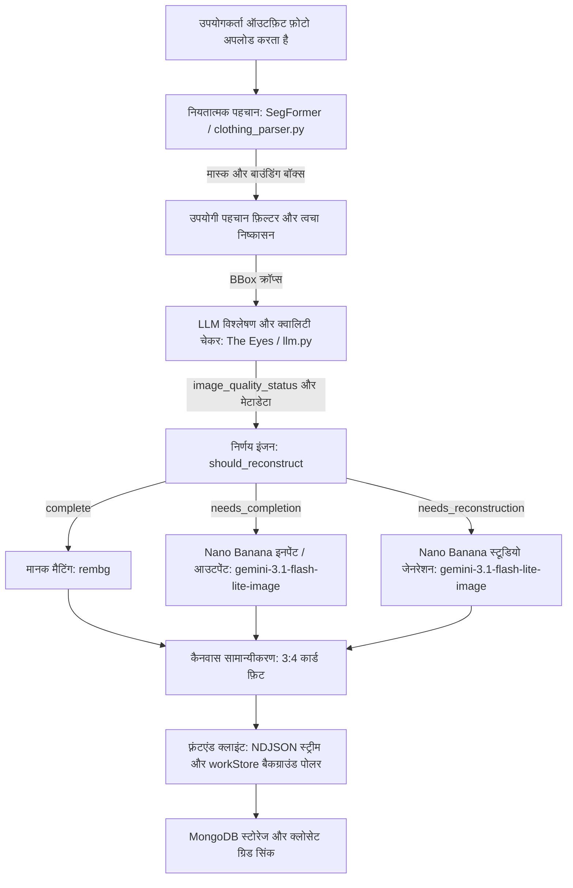

# GarmentVision — The DressApp Eyes एवं पुनर्निर्माण पाइपलाइन

> **मॉड्यूल:** `backend/app/services/vision/` और `backend/app/services/reconstruction.py`  
> **स्थिति:** प्रोडक्शन (VPS + `dressapp-eyes` सेल्फ-होस्ट पर लाइव)।  
> **मुख्य भूमिका:** किसी भी उपयोगकर्ता फ़ोटो (मिरर सेल्फ़ी, ऑउटफ़िट स्नैप या फ़्लैट-ले) को साफ़, व्यक्तिगत रूप से विभाजित (segmented), टैग किए गए और AI-पुनर्निर्मित क्लोसेट आइटम में परिवर्तित करता है।

---

## 1. कार्यकारी सारांश और मूल्य प्रस्ताव

### उच्च-स्तरीय अवलोकन
GarmentVision, DressApp का ऑप्टिकल इंटेलिजेंस कोर है। यह एक एंड-टू-एंड, बहु-स्तरीय विज़न पाइपलाइन है जो अप्रतिबंधित उपयोगकर्ता फ़ोटो को ग्रहण करती है और स्वच्छ, अलग-अलग, फ़ोटो-यथार्थवादी वॉर्डरोब आइटम तैयार करती है। एक हाइब्रिड AI आर्किटेक्चर में स्थापित, यह उच्च-गति नियतात्मक विभाजन (SegFormer `b3_clothes`) और बैकग्राउंड मैटिंग (`u2netp` / rembg) को डीप मल्टी-मॉडल रीजनिंग (Gemini) और जेनरेटिव इमेज रिपेयर (Nano Banana / `gemini-3.1-flash-lite-image`) के साथ जोड़ता है।

जब उपयोगकर्ता की फ़ोटो में कपड़े बालों, बैग, बाहों से छिपे होते हैं, या कैमरा फ़्रेम से कट जाते हैं, तो GarmentVision का **AI क्वालिटी चेकर** इस खामी का निदान करता है और स्वचालित रूप से **इमेज पूर्णता** (गायब हेम्स, आस्तीन और कॉलर की इनपेंटिंग/आउटपेंटिंग) या **पूर्ण स्टूडियो पुनर्निर्माण** (कटे हुए या आंशिक वस्त्रों को मूल स्टैंडअलोन ई-कॉमर्स कैटलॉग फ़ोटो में पुनर्जीवित करना) को ट्रिगर करता है।

### आर्किटेक्चरल प्रवाह



### उपयोगकर्ता मूल्य प्रस्ताव
- **सहज मल्टी-आइटम अंतर्ग्रहण:** एक ही फुल-बॉडी सेल्फ़ी अपलोड करें और सेकंडों में प्रत्येक जैकेट, टॉप, स्कर्ट, पैंट, जूते और एक्सेसरी को स्वचालित रूप से अलग करें।
- **त्रुटिरहित स्टूडियो-गुणवत्ता प्रस्तुति:** अंगों या बैगों से ढके कपड़े स्वचालित रूप से पूरे किए जाते हैं; कटे हुए आइटम (जैसे आंशिक जूते या कटे हुए कोट) पूरी तरह से स्टूडियो फ़्लैट-ले में पुनर्निर्मित होते हैं।
- **बुद्धिमान दृश्य गुणवत्ता परीक्षक:** The Eyes कट-ऑफ, बाधाओं और गायब किनारों के लिए प्रत्येक क्रॉप का स्वचालित रूप से मूल्यांकन करते हैं, जिससे मैन्युअल फ़ोटो संपादन समाप्त हो जाता है।
- **एसिंक्रोनस हॉट-पाथ अनुकूलन:** उच्च-लागत वाले जेनरेटिव पुनर्निर्माण बैकग्राउंड कार्यों में सुचारू रूप से चलते हैं, जिससे प्रारंभिक फ़ोटो अंतर्ग्रहण 5 सेकंड से कम समय में त्वरित बना रहता है।

---

## 2. व्यापक उपयोगकर्ता नियमावली

### विज़ुअल इंटरफ़ेस टोपोलॉजी
```text
┌────────────────────────────────────────────────────────────────────────┐
│  [ कपड़े जोड़ें — कैमरा और अपलोड ]                                     │
│  ┌──────────────────────────────────────────────────────────────────┐  │
│  │  [लाइव कैमरा / फ़ाइल ड्रॉपज़ोन]                                  │  │
│  │  "फुल-बॉडी फ़ोटो, फ़्लैट ले या रसीदें स्नैप या अपलोड करें"       │  │
│  └──────────────────────────────────────────────────────────────────┘  │
│                                                                        │
│  [ प्रोसेसिंग स्ट्रीम: डिटेक्शन और क्वालिटी चेक ]                      │
│  ┌─────────────────┐  ┌─────────────────┐  ┌─────────────────┐         │
│  │ आउटरवियर क्रॉप │  │ बॉटम क्रॉप       │  │ फ़ुटवियर क्रॉप  │         │
│  │ [इनपेंट आवश्यक] │  │ [आउटपेंट आवश्यक] │  │ [पुनर्निर्माण]   │         │
│  │ "बाइकर जैकेट"   │  │ "ट्यूल स्कर्ट"   │  │ "हील्ड म्यूल्स"  │         │
│  └─────────────────┘  └─────────────────┘  └─────────────────┘         │
│                                                                        │
│  [ सहेजा गया क्लोसेट ग्रिड: workStore के माध्यम से रीयल-टाइम ऑटो-रिफ़्रेश]│
│  ┌─────────────────┐  ┌─────────────────┐  ┌─────────────────┐         │
│  │ पूर्ण जैकेट     │  │ पुनर्स्थापित स्कर्ट│  │ स्टूडियो फ़ुटवियर│         │
│  │ (पूरी आस्तीन)   │  │ (पूर्ण हेम/किनारे)│ │ (हील्स के साथ)  │         │
│  └─────────────────┘  └─────────────────┘  └─────────────────┘         │
└────────────────────────────────────────────────────────────────────────┘
```

### मोड और वर्कफ़्लो विवरण
1. **इंटरएक्टिव स्नैपशॉट और बैच अंतर्ग्रहण:**
   - **Add Item** पर टैप करें &rarr; एक या अधिक वस्त्रों वाली फ़ोटो लें या अपलोड करें।
   - सिस्टम तुरंत डुप्लिकेट अपलोड पकड़ने के लिए रीयल-टाइम डुप्लिकेट प्री-फ़्लाइट चेक (`crypto.subtle` SHA-256 और औसत अवधारणात्मक हैशिंग) करता है।
2. **AI गुणवत्ता मूल्यांकन:**
   - जैसे ही SegFormer क्रॉप्स को विभाजित करता है, Gemini का क्वालिटी चेकर प्रत्येक वस्त्र का निरीक्षण करता है:
     - `complete`: वस्त्र पूरी तरह से दिखाई दे रहा है, अबाधित है, और केंद्रित है। जैसा है वैसा ही रखा जाता है।
     - `needs_completion`: वस्त्र में छिपे हुए पैनल, गायब किनारे, कटे हुए कॉलर या कटी हुई आस्तीन/हेम हैं। AI इनपेंटिंग/आउटपेंटिंग के लिए कतारबद्ध।
     - `needs_reconstruction`: आइटम भारी रूप से कटा हुआ है (उदा. केवल जूते की नोक दिखाई दे रही है)। पूर्ण स्टूडियो जेनरेशन के लिए कतारबद्ध।
3. **सहज बैकग्राउंड पूर्णता:**
   - **Save** पर क्लिक करने पर, वस्त्र तुरंत क्लोसेट ग्रिड में दिखाई देते हैं।
   - बैकग्राउंड कार्य UI को फ्रीज किए बिना जेनरेटिव इमेज पूर्णता चलाते हैं। पूरा होने के बाद, `workStore` रीयल-टाइम में कार्ड को अपडेट करता है।

---

## 3. टेक्नोलॉजी स्टैक और क्षमता विश्लेषण

### कोर ऑर्केस्ट्रेशन और AI/लॉजिक
- **सेगमेंटेशन इंजन (`clothing_parser.py`):** ATR / LIP फैशन डेटासेट पर फाइन-ट्यून किए गए SegFormer का उपयोग करके 18 वर्गों तक की पहचान करता है, स्किन-मास्क सबट्रैक्शन और मॉर्फोलॉजिकल स्ट्रैप ब्रिजिंग लागू करता है।
- **क्वालिटी चेकर प्रॉम्प्टिंग (`llm.py`):** `image_quality_status`, `image_quality_reason`, और `reconstruction_prompt` को लागू करने वाला संरचित JSON आउटपुट स्कीमा।
- **निर्णय इंजन (`reconstruction.py`):** ज्योमेट्रिक एज-टच सुरक्षा गार्ड (`_EDGE_TOUCH_MARGIN = 40`) के साथ LLM स्थिति का मूल्यांकन करता है ताकि फ़ोटो की सीमा से कटे हुए वस्त्रों को कभी भी गलती से पूर्ण न माना जाए।
- **जेनरेटिव रिपेयर इंजन (`gemini_image_service.py`):**
  - **इनपेंट / आउटपेंट (`edit`):** गायब ज्यामिति का विस्तार करते हुए कपड़े की बनावट, पैटर्न और रंग को संरक्षित करने के लिए क्रॉप किए गए बाइट्स और संरचित प्रॉम्प्ट को `gemini-3.1-flash-lite-image` पर पास करता है।
  - **स्टूडियो जेनरेशन (`generate`):** ऑफ़-व्हाइट बैकग्राउंड पर एक शानदार कैटलॉग पीस प्रस्तुत करने के लिए पूर्ण वर्णनात्मक मेटाडेटा (वस्त्र का प्रकार, सामग्री, रंग, हार्डवेयर, नेकलाइन) के साथ `gemini-3.1-flash-lite-image` को प्रॉम्प्ट करता है।

### फ़्रंटएंड सिंक्रोनाइज़ेशन (`workStore.js` और `itemImage.js`)
- **केंद्रीकृत रिज़ॉल्यूशन (`itemImage.js`):** `bestImageUrl()` `reconstructed_image_url` को सर्वोच्च प्राथमिकता देता है, जिससे यह सुनिश्चित होता है कि AI-मरम्मत की गई छवियां तुरंत अस्थायी कच्चे थंबनेल का स्थान ले लें।
- **क्रॉस-पेज पोलिंग (`workStore.js`):** क्लाइंट पेज नेविगेशन में विश्व स्तर पर बैकग्राउंड पुनर्निर्माण कार्यों को ट्रैक करता है, स्वचालित रूप से अपडेट किए गए दस्तावेज़ों को `closetStore` में भेजता है।
