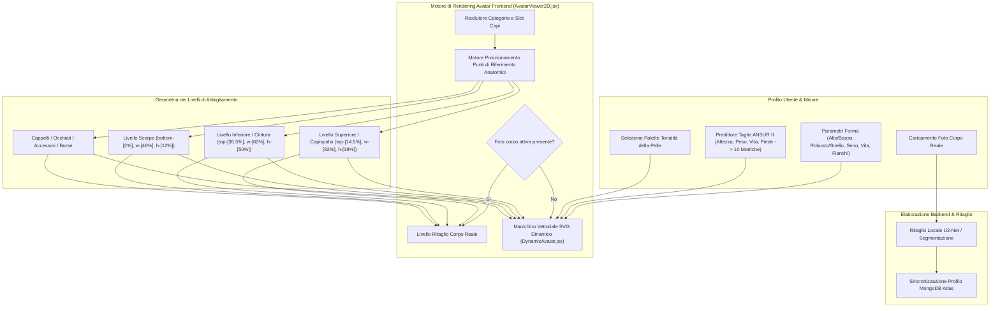

# DressApp — Architettura del Sistema di Posizionamento e Prova Avatar 2D (`Avatar.md`)

> **Versione del Documento:** 2.0  
> **Sottosistema di Destinazione:** Manichino 2D Frontend, Ritaglio Foto Corpo Reale & Motore di Sovrapposizione Capi  
> **File Principali:** `AvatarViewer2D.jsx`, `DynamicAvatar.jsx`, `OutfitCanvas.jsx`, `Profile.jsx`  
> **Stato:** Rilasciato in Produzione & Calibrato  

---

## 1. Sintesi Esecutiva & Proposta di Valore

### 1.1 Panoramica di Alto Livello
Il **Sistema di Posizionamento e Prova Avatar 2D di DressApp** offre un ambiente di prova visuale adattivo in tempo reale. Consente agli utenti di visualizzare in anteprima i capi digitalizzati del proprio armadio sovrapposti perfettamente su una **fotografia ritagliata del corpo reale** oppure su un **manichino vettoriale SVG 2D con curve Bézier dinamiche**.

Per garantire un'elevata accuratezza visiva tra diversi stili di abbigliamento (maglie a compressione, polo, girocollo, jeans a vita bassa, bermuda cargo e abiti da sera), il motore utilizza la calibrazione dei punti di riferimento anatomici, il ridimensionamento proporzionale dei rapporti e contenitori di sovrapposizione delle immagini senza distorsioni.



### 1.2 Proposta di Valore per l'Utente
* **Precisione di Allineamento Anatomico**: Allinea perfettamente i colletti delle camicie alla linea del collo dell'avatar (`top-[14.5%]`) e le cinture di pantaloni/shorts alla linea della vita naturale (`top-[36.5%]`), eliminando sovrapposizioni sul viso o spazi vuoti non naturali.
* **Flessibilità del Doppio Avatar**: Passa all'istante da una foto personale ritagliata a figura intera a un manichino vettoriale SVG 2D dinamico costruito su misurazioni antropometriche esatte.
* **Preservazione Proporzionale del Rapporto di Aspetto**: Applica lo scaling della larghezza di petto e fianchi ($scaleX$) mantenendo il rapporto di forma originale dell'immagine del capo (`object-fit: contain`), evitando allungamenti o schiacciamenti.
* **Gerarchia di Livelli Interattiva**: Sovrapponi capispalla su maglie intime e abiti consentendo di toccare o cliccare direttamente sui singoli livelli di abbigliamento per aprirne i dettagli.

---

## 2. Manuale Utente Completo & Topologia dell'Interfaccia

### 2.1 Topologia Visuale dell'Interfaccia

```
┌──────────────────────────────────────────────────────────────────┐
│                     Area di Prova Avatar 2D                      │
├──────────────────────────────────────────────────────────────────┤
│                                                                  │
│                        [ Cappelli    (top: 1%) ]                 │
│                        [ Occhiali    (top: 11%) ]                │
│                        [ Scollo      (top: 14.5%) ] ◄─ Colletto  │
│                     ┌──────────────────────────┐                 │
│                     │   Maglie / Capispalla    │                 │
│                     │       (height: 38%)      │                 │
│                     └──────────────────────────┘                 │
│                        [ Linea Vita  (top: 36.5%) ] ◄─ Cintura   │
│                     ┌──────────────────────────┐                 │
│                     │    Pantaloni / Shorts    │                 │
│                     │       (height: 50%)      │                 │
│                     │                          │                 │
│                     └──────────────────────────┘                 │
│                        [ Piedi     (bottom: 2%) ] ◄─── Calzature │
│                        [ Scarpe      (height: 12%) ]             │
│                                                                  │
├──────────────────────────────────────────────────────────────────┤
│ [ Cambia Modalità ]  [ Selettore Carnagione ]  [ Modifica Misure ]│
└──────────────────────────────────────────────────────────────────┘
```

### 2.2 Guida alle Modalità e ai Flussi di Lavoro

#### Modalità 1: Livello Ritaglio Foto Corpo Reale
1. Apri le **Impostazioni del Profilo** (`/me`).
2. Carica una fotografia a figura intera. Il backend esegue la segmentazione dello sfondo tramite `rembg` (U2-Net) per rimuovere elementi di disturbo.
3. L'URL della foto ritagliata (`body_photo_url`) aggiorna il profilo utente in MongoDB e viene renderizzato all'interno del contenitore `AvatarViewer2D`.
4. Per tornare al manichino vettoriale, fai clic su **Rimuovi foto** nella pagina del profilo. L'interfaccia si aggiorna istantaneamente senza ricaricare la pagina.

#### Modalità 2: Manichino Vettoriale SVG Dinamico
1. Quando non è presente alcuna foto del corpo, `AvatarViewer2D` renderizza il componente `DynamicAvatar.jsx`.
2. Il manichino genera curve Bézier cubiche continue (comandi $C$ e $S$) all'interno di un viewBox SVG fisso di `0 0 200 450`.
3. La modifica dei parametri corporei (altezza, peso, vita, petto, spalle, fianchi) o la selezione della tonalità della pelle trasforma dinamicamente la silhouette in tempo reale.

---

## 3. Stack Tecnologico e Analisi Approfondita

### 3.1 Divisore Ellittico Anatomico & Generatore Manichino Bézier

`DynamicAvatar.jsx` calcola le larghezze di proiezione planare 2D dalle circonferenze anatomiche 3D utilizzando un **Divisore Ellittico Anatomico** ($\text{DIVISOR} = 2.65$):

$$\begin{aligned}
w_{\text{shoulders}} &= (\text{shoulders} \times 1.1) \times (1.05 \text{ if male else } 0.95) \\
w_{\text{chest}} &= \left(\frac{\text{chest}}{2.65} \times 1.05\right) \times (1.02 \text{ if male else } 1.0) \\
w_{\text{waist}} &= \left(\frac{\text{waist}}{2.65} \times 1.0\right) \times (0.98 \text{ if male else } 0.90) \\
w_{\text{hip}} &= \left(\frac{\text{hip}}{2.65} \times 1.05\right) \times (0.93 \text{ if male else } 1.05)
\end{aligned}$$

La silhouette del corpo è costruita tramite comandi di percorso SVG che mappano i punti di controllo Bézier cubici:

```javascript
// Bezier contour snippet from DynamicAvatar.jsx
const bodyPath = [
  `M ${pNeckR}`,
  `C ${X0 + wNeck + (wShoulders - wNeck) * 0.6},${yChin + neckHeight * 0.7} ${X0 + wShoulders * 0.9},${yShoulders - 2} ${pShoulderR}`,
  `C ${X0 + wShoulders * 0.95},${yShoulders + (yChest - yShoulders) * 0.6} ${X0 + wChest + 2},${yChest - 5} ${pChestR}`,
  `C ${X0 + wChest - 1},${yChest + (yWaist - yChest) * 0.5} ${X0 + wWaist + (isMale ? 1 : -2)},${yWaist - 8} ${pWaistR}`,
  `C ${X0 + wWaist + (isMale ? 2 : 5)},${yWaist + (yHip - yWaist) * 0.4} ${X0 + wHip + 1},${yHip - 8} ${pHipR}`,
  ...
].join(' ');
```

### 3.2 Posizionamento Calibrato dei Punti di Riferimento & Rapporti CSS

Per garantire che i capi si adattino perfettamente senza coprire i tratti del viso o lasciare spazi vuoti sul corpo, i contenitori in `AvatarViewer2D.jsx` sono legati a precisi rapporti posizionali CSS:

| Categoria Capo | Classe Posizione CSS | z-Index | Punto di Riferimento di Allineamento |
| --- | --- | --- | --- |
| **Cappelli / Copricapo** | `top-[1%] left-1/2 w-[34%] aspect-square` | `z-30` | Sommità della testa |
| **Occhiali** | `top-[11%] left-1/2 w-[18%] h-[4.5%]` | `z-28` | Piano degli occhi |
| **Accessorio / Collana** | `top-[14.5%] left-1/2 w-[30%] aspect-square` | `z-25` | Base del collo |
| **Maglia / Top** | `top-[14.5%] left-1/2 w-[82%] h-[38%]` | `z-20` | Dal colletto alla linea del collo |
| **Capispalla** | `top-[14.5%] left-1/2 w-[86%] h-[42%]` | `z-22` | Sovrapposizione giacca sulle spalle |
| **Abito** | `top-[14.5%] left-1/2 w-[82%] h-[68%]` | `z-20` | Lunghezza totale dal collo al ginocchio |
| **Cintura** | `top-[36.5%] left-1/2 w-[62%] h-[5%]` | `z-21` | Passante per la cintura in vita |
| **Pantaloni / Shorts** | `top-[36.5%] left-1/2 w-[62%] h-[50%]` | `z-10` | Dalla vita della cintura alla linea naturale |
| **Scarpe / Calzature** | `bottom-[2%] left-1/2 w-[46%] h-[12%]` | `z-15` | Dalla caviglia al piano dei piedi |
| **Borsa a mano** | `top-[40%] right-[-5%] w-[40%] h-[30%]` | `z-25` | Altezza caduta braccio |

### 3.3 Ridimensionamento Proporzionale della Larghezza dei Capi

Oltre al posizionamento spaziale, i capi vengono scalati orizzontalmente ($scaleX$) in modo dinamico in base ai parametri del corpo dell'utente (seno abbondante, robusto, magro, vita larga, fianchi larghi):

```javascript
// Derivation of garment container scale factors in AvatarViewer2D.jsx
const scales = useMemo(() => {
  const heightFactor = 1 + (params.tall * 0.08) - (params.short * 0.08);
  const widthFactor = 1 + (params.heavy * 0.12) - (params.thin * 0.12);
  const chestFactor = 1 + (params.busty * 0.1);
  const waistFactor = 1 + (params.waist_thick * 0.12) - (params.waist_thin * 0.08);
  const hipsFactor = 1 + (params.hips_wide * 0.12) - (params.hips_narrow * 0.08);

  return { height: heightFactor, width: widthFactor, chest: chestFactor, waist: waistFactor, hips: hipsFactor };
}, [params]);

// Passed to Framer Motion animate prop for Top and Bottom:
// Top: scaleX = scales.chest / scales.width
// Bottom: scaleX = scales.hips / scales.width
```

---

## 4. Matrice Riassuntiva delle Correzioni di Posizione e Proporzione

| Problema Identificato | Causa | Correzione Applicata | Risultato |
| --- | --- | --- | --- |
| **Colletto della Camicia Sovrapposto al Viso** | Offset posizionato troppo in alto (`top-[8.3%]` o `top-[12.8%]`) | Offset del contenitore superiore impostato a `top-[14.5%]` | Il colletto della camicia poggia perfettamente sulla linea del collo dell'avatar. |
| **Pantaloni/Shorts Troppo Basso o Sovrapposto** | Offset posizionato troppo in basso (`top-[38.5%]`) | Offset del contenitore inferiore impostato a `top-[36.5%]` | La cintura dei pantaloni si allinea esattamente alla vita naturale. |
| **Rapporto di Forma dei Capi Distorto** | Allungamento illimitato del contenitore | Applicato `object-fit: contain` con regolazione proporzionale di `scaleX` | Conserva il rapporto di forma originale dell'immagine del capo senza distorsioni orizzontali. |
| **Ritardo nella Rimozione della Foto** | Necessità di ricaricare lo stato della pagina | Sincronizzazione istantanea dello stato utente locale in `Profile.jsx` | La foto viene rimossa all'istante senza ritardi visivi. |

---

*Document compiled automatically by Narrator for DressApp.*
