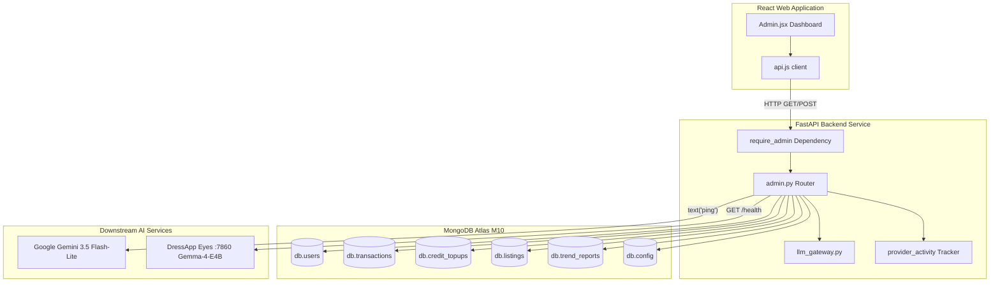

# Pannello di Amministrazione di DressApp — Panoramica Architetturale e Manuale Utente

Questo documento offre un'analisi completa e autorevole del Pannello di Amministrazione di DressApp, illustrando l'interfaccia della dashboard frontend ([Admin.jsx](file:///C:/DressApp_AG/apps/web/src/pages/Admin.jsx)) e il relativo layer di API backend ([admin.py](file:///C:/DressApp_AG/backend/app/api/v1/admin.py)).

---

## 1. Sintesi Esecutiva e Proposta di Valore

### Panoramica Generale
Il Pannello di Amministrazione di DressApp è l'hub centrale per la supervisione della piattaforma, l'audit della monetizzazione, la configurazione dei modelli di intelligenza artificiale e la diagnostica di sistema. Fornisce agli amministratori una visuale fedele e in tempo reale sullo stato di salute della piattaforma, sui volumi di transazione del marketplace, sul consumo di crediti IA da parte degli utenti, sui gruppi di tester e sulle prestazioni dei microservizi IA a valle, senza richiedere l'accesso diretto al terminale o alla shell del database.

### Flusso Architetturale
Il diagramma seguente illustra l'interazione tra la dashboard frontend e i servizi backend, l'esecuzione di query sulle collection di MongoDB Atlas e i controlli di stato sui servizi a valle:



### Funzionalità Amministrative Chiave
- **Visibilità dei KPI in Tempo Reale**: Metriche riassuntive riguardanti utenti attivi, capi totali nel guardaroba, volumi del marketplace, commissioni della piattaforma, chiamate allo stylist e report Trend Scout pubblicati.
- **Autenticazione Sicura**: L'accesso in produzione è protetto rigidamente dall'autenticazione con Google OAuth (`ADMIN_EMAILS`); i vecchi pulsanti di bypass non autenticati sono stati rimossi.
- **Governance dell'Instradamento IA Multilivello**: Verifica diretta e diagnostica ping in tempo reale per il gateway primario **Google Gemini 3.5 Flash-Lite** e per il container Eyes on-premises **Gemma-4-E4B** sulla porta 7860.
- **Sicurezza e Moderazione del Marketplace**: Capacità immediata di esaminare, sospendere o ripristinare annunci e di gestire i privilegi degli utenti.

---

## 2. Manuale Utente Completo

### Topologia dell'Interfaccia Visiva
Il pannello di amministrazione è strutturato con una visualizzazione pulita a schede, ottimizzata per operazioni amministrative ad alta densità:

```
+-------------------------------------------------------------------------------+
|  DressApp (Admin Console)                              [Return to App]        |
|  ---------------------------------------------------------------------------  |
|  [ Overview ]  [ Providers ]  [ Trend Scout ]  [ Users ]  [ Listings ]  ...   |
+-------------------------------------------------------------------------------+
|  OVERVIEW TAB                                                                 |
|  +------------------+  +------------------+  +------------------+  +-------+  |
|  | Active Users     |  | Closet Inventory |  | Active Listings  |  | Gross |  |
|  | 18 (+2 today)    |  | 340 garments     |  | 8 items listed   |  | $140  |  |
|  +------------------+  +------------------+  +------------------+  +-------+  |
|                                                                               |
|  +-------------------------------------------------------------------------+  |
|  | Downstream Provider Activity (Rolling 200 calls)                        |  |
|  | gemini-flash: 142 calls (0% err, 280ms) | eyes-gemma: 12 calls (0% err) |  |
|  +-------------------------------------------------------------------------+  |
+-------------------------------------------------------------------------------+
```

### Procedure Operative

#### 1. Scheda Panoramica (Overview)
- **Schede Metriche**: Contatori in tempo reale per Utenti Registrati, Capi Totali, Annunci nel Marketplace, Transazioni, Volume Lordo, Commissioni di Piattaforma e Attività dello Stylist.
- **Monitor Attività Provider**: Telemetria mobile per gli endpoint di intelligenza artificiale e meteo collegati, con monitoraggio del numero di chiamate, delle percentuali di errore e dei benchmark di latenza (mediana e p95).

#### 2. Scheda Provider (Providers)
- **Gateway Google Gemini**: Visualizza lo stato di configurazione e la salute della connessione per l'SDK nativo `google-genai`. Toccando **Verify Key** viene eseguito un ping leggero di generazione testo per verificare la disponibilità delle quote.
- **Motore di Visione Eyes**: Esamina il container VPS CPX32 on-premises (`http://eyes:7860`). Consente di cambiare l'override in tempo reale tra visione cloud e inferenza Gemma in locale senza riavviare i pod backend.

#### 3. Scheda Utenti (Users)
- **Directory Utenti**: Elenco ricercabile con indirizzo email, ruolo assegnato (`user`, `tester`, `admin`), piano attivo (`free`, `manager`, `pro`), saldo crediti e cronologia delle transazioni.
- **Gestione dei Ruoli**: Azioni con un solo clic per promuovere utenti ad amministratore o modificare i privilegi dei tester.
- **Identificazione Gruppo Tester**: Un badge visivo contraddistingue gli account registrati nel programma di test gratuito.

#### 4. Schede Annunci e Transazioni (Listings & Transactions)
- **Monitoraggio Annunci**: Filtraggio in base allo stato (`active`, `paused`, `sold`, `removed`). Gli amministratori possono moderare e sospendere immediatamente gli annunci non conformi.
- **Audit Finanziario**: Riepiloga volume lordo, commissioni di piattaforma incassate, commissioni dei gateway di pagamento e pagamenti netti ai venditori.

---

## 3. Stack Tecnologico e Approfondimento sulle Funzionalità

### Autenticazione e Autorizzazione
- **Protezione delle Dipendenze**: Gli endpoint API applicano la dipendenza `require_admin` in `backend/app/api/v1/admin.py`, verificando che l'email estratta dal token JWT sia inclusa nella variabile d'ambiente di produzione `ADMIN_EMAILS`.
- **Integrazione Google OAuth**: L'accesso in produzione avviene tramite Google OAuth (`dressappdeveloper@gmail.com`), rimuovendo scorciatoie locali statiche per garantire la massima sicurezza.

### Infrastruttura di Routing IA Multilivello
- **Motore Primario**: Google Gemini 3.5 Flash-Lite gestisce le richieste per lo stylist e l'analisi visiva in produzione tramite `backend/app/services/llm_gateway.py`.
- **Rete di Sicurezza per le Quote**: Qualora Gemini incontri limiti di frequenza (`429` / `RESOURCE_EXHAUSTED`), la richiesta passa trasparentemente al container Gemma-4-E4B on-premises sulla porta 7860, restituendo `provider_fallback="gemma"` senza alcuna interruzione per l'utente.

### Operazioni sul Database
- **Aggregazioni MongoDB Atlas**:
  - Calcola i totali finanziari delle transazioni andate a buon fine:
    ```python
    pipeline = [{"$match": {"status": "paid"}}, {"$group": {"_id": None, "gross": {"$sum": "$financial.gross_cents"}}}]
    ```
  - Aggrega gli acquisti dei pacchetti di crediti prepagati:
    ```python
    topup_pipeline = [{"$match": {"status": "captured"}}, {"$group": {"_id": None, "total": {"$sum": "$amount_cents"}}}]
    ```
