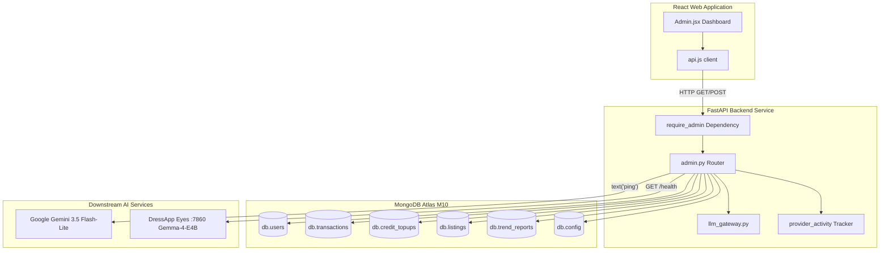

# DressApp 管理パネル — アーキテクチャ解説とユーザーマニュアル

このドキュメントは、フロントエンドのダッシュボードインターフェース（[Admin.jsx](file:///C:/DressApp_AG/apps/web/src/pages/Admin.jsx)）および対応するバックエンド API レイヤー（[admin.py](file:///C:/DressApp_AG/backend/app/api/v1/admin.py)）を含む、DressApp 管理パネル（Admin Panel）に関する包括的で信頼性の高い詳細解説を提供します。

---

## 1. エグゼクティブサマリーと提供価値

### 全体概要
DressApp 管理パネルは、プラットフォームの監視、収益化監査、AI モデル構成、およびシステム診断を行うための集中管理ハブです。管理者は、ターミナルやデータベースシェルに直接アクセスすることなく、プラットフォームの健全性、マーケットプレイスの取引量、ユーザーの AI クレジット消費量、テスターグループ、下流の AI マイクロサービスのパフォーマンスなどをリアルタイムかつ高精度に把握できます。

### アーキテクチャフロー
以下の図は、フロントエンドダッシュボードがバックエンドサービスとどのように連携し、MongoDB Atlas コレクションを照会し、下流のヘルスプローブを実行するかを示しています：



### 主な管理機能
- **リアルタイム KPI 可視化**: アクティブユーザー数、登録クローゼット衣類総数、出品中アイテム数、プラットフォーム手数料、スタイリスト呼び出し回数、発行された Trend Scout レポートなどのサマリー指標を表示。
- **セキュアな認証**: 本番環境へのアクセスは Google OAuth 認証（`ADMIN_EMAILS`）によって厳格に制御されており、従来の未認証バイパスボタンは完全に排除されています。
- **マルチティア AI ルーティング管理**: プライマリの **Google Gemini 3.5 Flash-Lite** ゲートウェイと、ポート 7860 で稼働するオンプレミス **Gemma-4-E4B** Eyes コンテナに対する直接検証とライブ Ping 診断を実施。
- **マーケットプレイスの安全性とモデレーション**: 出品内容の確認、一時停止、復元、およびユーザー権限の管理を即座に実行可能。

---

## 2. 包括的ユーザーマニュアル

### 画面インターフェース構成
管理パネルは、高密度な管理オペレーションに最適化されたすっきりとしたマルチタブレイアウトで構成されています：

```
+-------------------------------------------------------------------------------+
|  DressApp (Admin Console)                              [Return to App]        |
|  ---------------------------------------------------------------------------  |
|  [ Overview ]  [ Providers ]  [ Trend Scout ]  [ Users ]  [ Listings ]  ...   |
+-------------------------------------------------------------------------------+
|  OVERVIEW TAB                                                                 |
|  +------------------+  +------------------+  +------------------+  +-------+  |
|  | Active Users     |  | Closet Inventory |  | Active Listings  |  | Gross |  |
|  | 18 (+2 today)    |  | 340 garments     |  | 8 items listed   |  | $140  |  |
|  +------------------+  +------------------+  +------------------+  +-------+  |
|                                                                               |
|  +-------------------------------------------------------------------------+  |
|  | Downstream Provider Activity (Rolling 200 calls)                        |  |
|  | gemini-flash: 142 calls (0% err, 280ms) | eyes-gemma: 12 calls (0% err) |  |
|  +-------------------------------------------------------------------------+  |
+-------------------------------------------------------------------------------+
```

### 操作手順ガイド

#### 1. 概要タブ (Overview Tab)
- **指標カード**: 登録ユーザー数、衣服総数、マーケットプレイス出品数、取引数、総取扱高（Gross Volume）、プラットフォーム手数料、スタイリスト利用状況のリアルタイムカウンター。
- **プロバイダーアクティビティモニター**: 接続された AI および天気エンドポイントの直近 200 件のテレメトリ情報を表示し、呼び出し回数、エラー率、レイテンシベンチマーク（中央値および p95）を追跡します。

#### 2. プロバイダータブ (Providers Tab)
- **Google Gemini ゲートウェイ**: ネイティブ `google-genai` SDK の構成ステータスと接続状態を表示します。**Verify Key** をタップすると軽量なテキスト生成 Ping が実行され、利用可能枠の存在を確認できます。
- **Eyes ビジョンエンジン**: CPX32 VPS オンプレミスコンテナ（`http://eyes:7860`）の状態を検査します。バックエンドの再起動を行うことなく、クラウドビジョンとセルフホスト Gemma 推論のランタイムオーバーライドを動的に切り替えることができます。

#### 3. ユーザータブ (Users Tab)
- **ユーザーディレクトリ**: ユーザーのメールアドレス、割り当てられたロール（`user`、`tester`、`admin`）、現在のアクティブプラン（`free`、`manager`、`pro`）、クレジット残高、取引履歴を検索・一覧表示します。
- **ロール管理**: ワンクリックでユーザーを管理者に昇格させたり、テスター権限を調整したりできます。
- **テスターグループの識別**: 視覚的なバッジにより、無償テスタープログラムに参加しているアカウントを一目で識別できます。

#### 4. 出品および取引タブ (Listings & Transactions Tabs)
- **出品管理**: 出品ステータス（`active` 出品中、`paused` 一時停止、`sold` 売却済み、`removed` 削除済み）で絞り込み可能です。管理者は規約に違反する出品を即座に確認し、一時停止できます。
- **財務監査**: 総取引高、徴収されたプラットフォーム手数料、決済ゲートウェイ手数料、出品者への純支払額を集計します。

---

## 3. テクノロジースタックと機能詳細

### 認証と認可
- **依存関係ガード**: API エンドポイントは `backend/app/api/v1/admin.py` 内の `require_admin` 依存関係を強制し、呼び出し元の JWT メールアドレスが本番環境の `ADMIN_EMAILS` 環境変数に含まれているかを検証します。
- **Google OAuth 連携**: 本番環境のサインインは Google OAuth（`dressappdeveloper@gmail.com`）を経由し、安全性を高めるためローカル環境のハードコードされた開発用バイパスは排除されています。

### マルチティア AI ルーティングインフラストラクチャ
- **プライマリエンジン**: Google Gemini 3.5 Flash-Lite が `backend/app/services/llm_gateway.py` を通じて本番環境のスタイリストへの問い合わせおよび画像解析を処理します。
- **クォータセーフティネット**: Gemini がレート制限（`429` / `RESOURCE_EXHAUSTED`）に達した場合、リクエストはポート 7860 のオンプレミス Gemma-4-E4B コンテナへとシームレスにフォールバックされ、ユーザーの操作を妨げることなく `provider_fallback="gemma"` を返します。

### データベースオペレーション
- **MongoDB Atlas 集計パイプライン**:
  - 支払い済み取引の財務合計を集計：
    ```python
    pipeline = [{"$match": {"status": "paid"}}, {"$group": {"_id": None, "gross": {"$sum": "$financial.gross_cents"}}}]
```
  - 前払いクレジットの購入決済を集計：
    ```python
    topup_pipeline = [{"$match": {"status": "captured"}}, {"$group": {"_id": None, "total": {"$sum": "$amount_cents"}}}]
```
