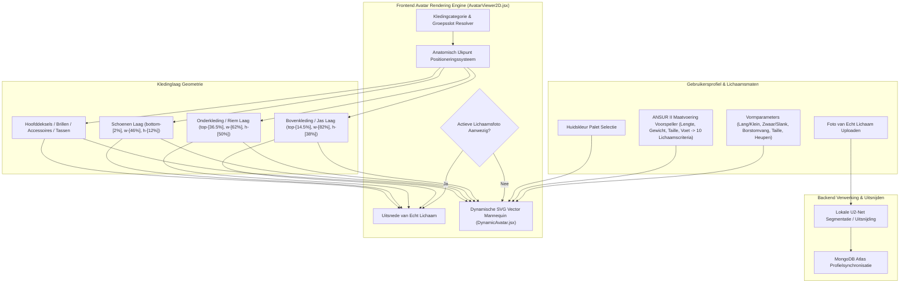

# DressApp — Architectuur van het 2D Avatar- & Pas-Positioneringssysteem (`Avatar.md`)

> **Documentversie:** 2.0  
> **Doelsubsysteem:** Frontend 2D Mannequin, Echte Lichaamsfoto-Uitsnedes & Kleding-Overlay Engine  
> **Kernbestanden:** `AvatarViewer2D.jsx`, `DynamicAvatar.jsx`, `OutfitCanvas.jsx`, `Profile.jsx`  
> **Status:** In Productie Geleverd & Gekalibreerd  

---

## 1. Managementsamenvatting & Waardepropositie

### 1.1 Overzicht op Hoofdlijnen
Het **DressApp 2D Avatar- & Pas-Positioneringssysteem** biedt een adaptieve, real-time visuele pasomgeving. Het stelt gebruikers in staat om gedigitaliseerde kledingstukken uit hun kledingkast naadloos te passen over een **gesegmenteerde foto van hun eigen lichaam** of over een **dynamisch vervormbare 2D Bezier-vector SVG-mannequin**.

Om een hoge visuele nauwkeurigheid te garanderen bij uiteenlopende kledingstijlen (compressieshirts, polokragen, ronde halslijnen, low-rise spijkerbroeken, cargoshorts en formele jurken), maakt de engine gebruik van anatomische ijkpuntkalibratie, proportionele schaling en vervormingsvrije beeldoverlay-containers.



### 1.2 Waardepropositie voor de Gebruiker
* **Anatomische Uitlijningsprecisie**: Llijnt overhemdkragen naadloos uit met de halslijn van de avatar (`top-[14.5%]`) and broek- of shortstailles naadloos met de natuurlijke tailleregio (`top-[36.5%]`), wat gezichtsbedekking en onnatuurlijke kieren voorkomt.
* **Flexibiliteit van Dubbele Avatar**: Schakel direct tussen een persoonlijke uitsnede van een volledige lichaamsfoto en een dynamische 2D vector-SVG mannequin gebouwd volgens exacte antropometrische afmetingen.
* **Behoud van Proportionele Beeldverhouding**: Past schaling van borst- en heupbreedte toe ($scaleX$) met behoud van de originele verhouding van kledingsafbeeldingen (`object-fit: contain`), wat ongewenste uitrekking of vervorming voorkomt.
* **Interactieve Hiërarchie van Lagen**: Stapel jassen en vesten over t-shirts en jurken, terwijl u direct op individuele kledinglagen kunt tikken/klikken om kledingdetails te openen.

---

## 2. Uitgebreide Gebruikershandleiding & Topologie van de Interface

### 2.1 Visuele Interfacetopologie

```
┌──────────────────────────────────────────────────────────────────┐
│                      2D Avatar Pas-Canvas                        │
├──────────────────────────────────────────────────────────────────┤
│                                                                  │
│                        [ Hoofddeksels (top: 1%) ]                │
│                        [ Brillen      (top: 11%) ]               │
│                        [ Halslijn     (top: 14.5%) ] ◄─ Kraag    │
│                     ┌──────────────────────────┐                 │
│                     │  Bovenkleding / Jassen   │                 │
│                     │       (height: 38%)      │                 │
│                     └──────────────────────────┘                 │
│                        [ Tailleregio   (top: 36.5%) ] ◄─ Riem    │
│                     ┌──────────────────────────┐                 │
│                     │   Onderkleding / Shorts  │                 │
│                     │       (height: 50%)      │                 │
│                     │                          │                 │
│                     └──────────────────────────┘                 │
│                        [ Voeten    (bottom: 2%) ] ◄─── Schoenen  │
│                        [ Schoenen     (height: 12%) ]            │
│                                                                  │
├──────────────────────────────────────────────────────────────────┤
│ [ Modus Wisselen ]   [ Huidskleur Kiezen ]   [ Maten Bewerken ]  │
└──────────────────────────────────────────────────────────────────┘
```

### 2.2 Modi & Stappenplannen

#### Modus 1: Laag met Uitsnede van Echt Lichaam
1. Open **Profielinstellingen** (`/me`).
2. Upload een foto van het gehele lichaam. De backend voert achtergrondsegmentatie uit via `rembg` (U2-Net) om ruis op de achtergrond te verwijderen.
3. De verwerkte uitsnede-URL (`body_photo_url`) bijwerkt het gebruikersprofiel in MongoDB en wordt weergegeven binnen de `AvatarViewer2D`-container.
4. Om terug te keren naar de vector mannequin, klikt u op **Foto verwijderen** op de profielpagina. De gebruikersinterface wordt direct bijgewerkt zonder de pagina te herladen.

#### Modus 2: Dynamische Vector-SVG Mannequin
1. Wanneer er geen lichaamsfoto aanwezig is, rendert `AvatarViewer2D` de component `DynamicAvatar.jsx`.
2. De mannequin genereert continue kubische Bezier-curves ($C$- en $S$-opdrachten) binnen een vaste `0 0 200 450` SVG viewBox.
3. Het aanpassen van lichaamsparameters (lengte, gewicht, taille, borst, schouders, heupen) of het selecteren van een huidskleur verandert het silhouet van de mannequin dynamisch in real-time.

---

## 3. Technologiestack & Diepgaande Functionaliteit

### 3.1 Anatomische Ellips-Divisor & Bezier-Mannequin Generator

`DynamicAvatar.jsx` berekent 2D vlakke projectiebreedtes uit 3D anatomische omtrekken met behulp van een **Anatomische Ellips-Divisor** ($\text{DIVISOR} = 2.65$):

$$\begin{aligned}
w_{\text{shoulders}} &= (\text{shoulders} \times 1.1) \times (1.05 \text{ if male else } 0.95) \\
w_{\text{chest}} &= \left(\frac{\text{chest}}{2.65} \times 1.05\right) \times (1.02 \text{ if male else } 1.0) \\
w_{\text{waist}} &= \left(\frac{\text{waist}}{2.65} \times 1.0\right) \times (0.98 \text{ if male else } 0.90) \\
w_{\text{hip}} &= \left(\frac{\text{hip}}{2.65} \times 1.05\right) \times (0.93 \text{ if male else } 1.05)
\end{aligned}$$

Het silhouet van het lichaam wordt opgebouwd via SVG-padopdrachten die kubische Bezier-controlepunten in kaart brengen:

```javascript
// Bezier contour snippet from DynamicAvatar.jsx
const bodyPath = [
  `M ${pNeckR}`,
  `C ${X0 + wNeck + (wShoulders - wNeck) * 0.6},${yChin + neckHeight * 0.7} ${X0 + wShoulders * 0.9},${yShoulders - 2} ${pShoulderR}`,
  `C ${X0 + wShoulders * 0.95},${yShoulders + (yChest - yShoulders) * 0.6} ${X0 + wChest + 2},${yChest - 5} ${pChestR}`,
  `C ${X0 + wChest - 1},${yChest + (yWaist - yChest) * 0.5} ${X0 + wWaist + (isMale ? 1 : -2)},${yWaist - 8} ${pWaistR}`,
  `C ${X0 + wWaist + (isMale ? 2 : 5)},${yWaist + (yHip - yWaist) * 0.4} ${X0 + wHip + 1},${yHip - 8} ${pHipR}`,
  ...
].join(' ');
```

### 3.2 Gekalibreerde IJkpunt-Positionering & Container CSS-Verhoudingen

Om te garanderen dat kledingstukken precies aansluiten zonder gelaatstrekken te bedekken of kieren op het lichaam achter te laten, zijn de overlay-containers in `AvatarViewer2D.jsx` gebonden aan exacte positionele CSS-verhoudingen:

| Kledingcategorie | CSS Positieklasse | z-Index | Anatomisch IJkpunt voor Uitlijning |
| --- | --- | --- | --- |
| **Hoofddeksels** | `top-[1%] left-1/2 w-[34%] aspect-square` | `z-30` | Kruin van het hoofd |
| **Brillen** | `top-[11%] left-1/2 w-[18%] h-[4.5%]` | `z-28` | Ooglijn |
| **Accessoires / Kettingen** | `top-[14.5%] left-1/2 w-[30%] aspect-square` | `z-25` | Basis van de nek |
| **Bovenkleding (Top)** | `top-[14.5%] left-1/2 w-[82%] h-[38%]` | `z-20` | Kraag naar halslijn |
| **Bovenkleding (Jas)** | `top-[14.5%] left-1/2 w-[86%] h-[42%]` | `z-22` | Jas-laag over schouders |
| **Jurken** | `top-[14.5%] left-1/2 w-[82%] h-[68%]` | `z-20` | Volledige lengte van halslijn tot knie |
| **Riemen** | `top-[36.5%] left-1/2 w-[62%] h-[5%]` | `z-21` | Riemlus bij de taille |
| **Onderkleding (Broeken/Shorts)** | `top-[36.5%] left-1/2 w-[62%] h-[50%]` | `z-10` | Tailleband naar natuurlijke tailleregio |
| **Schoenen / Schoeisel** | `bottom-[2%] left-1/2 w-[46%] h-[12%]` | `z-15` | Enkel naar voetvlak |
| **Handtassen** | `top-[40%] right-[-5%] w-[40%] h-[30%]` | `z-25` | Armhoogte |

### 3.3 Proportionele Breedteschaling van Kleding

Naast de ruimtelijke plaatsing schalen kledingstukken dynamisch horizontaal ($scaleX$) op basis van de door de gebruiker gekozen lichaamsparameters (volle borst, zwaar, slank, brede taille, brede heupen):

```javascript
// Derivation of garment container scale factors in AvatarViewer2D.jsx
const scales = useMemo(() => {
  const heightFactor = 1 + (params.tall * 0.08) - (params.short * 0.08);
  const widthFactor = 1 + (params.heavy * 0.12) - (params.thin * 0.12);
  const chestFactor = 1 + (params.busty * 0.1);
  const waistFactor = 1 + (params.waist_thick * 0.12) - (params.waist_thin * 0.08);
  const hipsFactor = 1 + (params.hips_wide * 0.12) - (params.hips_narrow * 0.08);

  return { height: heightFactor, width: widthFactor, chest: chestFactor, waist: waistFactor, hips: hipsFactor };
}, [params]);

// Passed to Framer Motion animate prop for Top and Bottom:
// Top: scaleX = scales.chest / scales.width
// Bottom: scaleX = scales.hips / scales.width
```

---

## 4. Samenvattende Matrix van Positie- & Proportiecorrecties

| Geïdentificeerd Probleem | Oorzaak | Toegepaste Correctie | Resultaat |
| --- | --- | --- | --- |
| **Overhemdkraag bedekt het gezicht** | Container-offset te hoog geplaatst (`top-[8.3%]` of `top-[12.8%]`) | Bovenste container-offset ingesteld op `top-[14.5%]` | Overhemdkraag sluit precies aan op de halslijn van de avatar. |
| **Broek/Short te laag of bedekt de zoom** | Container-offset te laag geplaatst (`top-[38.5%]`) | Onderste container-offset ingesteld op `top-[36.5%]` | Tailleband sluit precies aan op de natuurlijke tailleregio. |
| **Vervormde beeldverhoudingen van kleding** | Onbeperkte container-uitrekking | `object-fit: contain` toegepast met proportionele `scaleX`-aanpassing | Behoudt de originele beeldverhouding van kledingafbeeldingen zonder horizontale vervorming. |
| **Vertraging bij het verwijderen van foto** | Opnieuw ophalen van de paginastatus was vereist | Directe lokale gebruikersstatussynchronisatie geïmplementeerd in `Profile.jsx` | Verwijderen van de foto wordt direct getoond zonder vertraging in de interface. |

---

*Document compiled automatically by Narrator for DressApp.*
