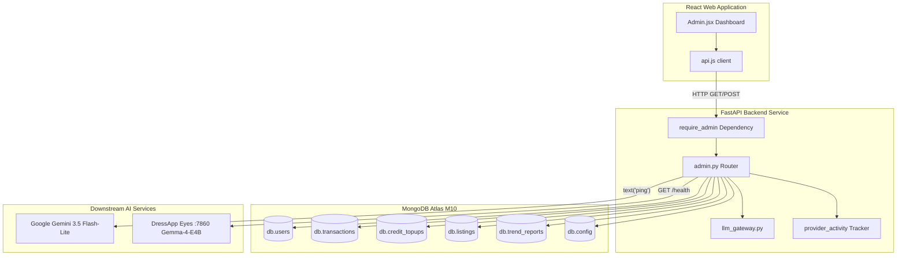

# DressApp Beheerderspaneel — Architectuuroverzicht & Handleiding

Dit document biedt een uitgebreide, gezaghebbende analyse van het DressApp Beheerderspaneel (Admin Panel), waarbij zowel de frontend dashboard-interface ([Admin.jsx](file:///C:/DressApp_AG/apps/web/src/pages/Admin.jsx)) als de bijbehorende backend API-laag ([admin.py](file:///C:/DressApp_AG/backend/app/api/v1/admin.py)) worden behandeld.

---

## 1. Managementsamenvatting & Waardepropositie

### Algemeen overzicht
Het DressApp Beheerderspaneel is het centrale knooppunt voor platformtoezicht, financiële audits, configuratie van AI-modellen en systeemdiagnostiek. Het biedt beheerders realtime, uiterst nauwkeurig inzicht in de status van het platform, transactievolumes op de marktplaats, het verbruik van AI-credits door gebruikers, testergroepen en de prestaties van onderliggende AI-microservices – zonder dat directe toegang tot de terminal of databaseshell vereist is.

### Architectuurstroom
Het volgende diagram illustreert hoe het frontend-dashboard communiceert met de backend-services, MongoDB Atlas-collecties raadpleegt en statuscontroles uitvoert op onderliggende services:



### Belangrijkste beheerdersmogelijkheden
- **Realtime KPI-inzicht**: Overzichtsstatistieken voor actieve gebruikers, totale kledingstukken, marktplaatsvolume, platformvergoedingen, stylistenverzoeken en gepubliceerde Trend Scout-rapporten.
- **Testergroepprogramma**: Automatische toewijzing van rollen en gratis privileges voor het Professional Tier voor geverifieerde testeraccounts (`maystarboard@gmail.com`, `lokoprod@gmail.com`, `dressapdeveloper@gmail.com`).
- **Beveiligde authenticatie**: Toegang in productie is strikt beveiligd via Google OAuth-authenticatie (`ADMIN_EMAILS`); oude niet-geauthenticeerde bypass-knoppen zijn volledig verwijderd.
- **Beheer van multi-tier AI-routing**: Directe verificatie en live ping-diagnostiek voor de primaire **Google Gemini 3.5 Flash-Lite**-gateway en de lokale **Gemma-4-E4B** Eyes-container op poort 7860.
- **Marktplaatsveiligheid & moderatie**: Mogelijkheid om direct advertenties te inspecteren, te pauzeren of te herstellen en gebruikersrechten te beheren.

---

## 2. Uitgebreide handleiding

### Topologie van de visuele interface
Het beheerderspaneel is georganiseerd in een overzichtelijke indeling met tabbladen, geoptimaliseerd voor administratieve taken met een hoge informatiedichtheid:

```
+-------------------------------------------------------------------------------+
|  DressApp (Admin Console)                              [Return to App]        |
|  ---------------------------------------------------------------------------  |
|  [ Overview ]  [ Providers ]  [ Trend Scout ]  [ Users ]  [ Listings ]  ...   |
+-------------------------------------------------------------------------------+
|  OVERVIEW TAB                                                                 |
|  +------------------+  +------------------+  +------------------+  +-------+  |
|  | Active Users     |  | Closet Inventory |  | Active Listings  |  | Gross |  |
|  | 18 (+2 today)    |  | 340 garments     |  | 8 items listed   |  | $140  |  |
|  +------------------+  +------------------+  +------------------+  +-------+  |
|                                                                               |
|  +-------------------------------------------------------------------------+  |
|  | Downstream Provider Activity (Rolling 200 calls)                        |  |
|  | gemini-flash: 142 calls (0% err, 280ms) | eyes-gemma: 12 calls (0% err) |  |
|  +-------------------------------------------------------------------------+  |
+-------------------------------------------------------------------------------+
```

### Operationele toelichting

#### 1. Tabblad Overview (Overzicht)
- **Statistiekkaarten**: Realtime tellers voor geregistreerde gebruikers, totaal aantal kledingstukken, marktplaatsadvertenties, transacties, brutovolume, platformkosten en stylistenactiviteit.
- **Provider Activity Monitor**: Continue telemetrie voor gekoppelde AI- en weer-endpoints, waarbij aantallen aanroepen, foutpercentages en latentiebenchmarks (mediaan en p95) worden bijgehouden.

#### 2. Tabblad Providers (Aanbieders)
- **Google Gemini Gateway**: Toont de configuratiestatus en verbindingskwaliteit voor de native `google-genai` SDK. Als u op **Verify Key** tikt, wordt een lichte tekstgeneratie-ping uitgevoerd om de beschikbaarheid van het quotum te bevestigen.
- **Eyes Vision Engine**: Inspecteert de lokale CPX32 VPS-container (`http://eyes:7860`). Maakt het mogelijk om de runtime-override tussen cloud vision en lokaal gehoste Gemma-inferentie om te schakelen zonder backend-pods opnieuw te hoeven starten.

#### 3. Tabblad Users (Gebruikers)
- **Gebruikerslijst**: Doorzoekbare lijst met e-mailadres, toegewezen rol (`user`, `tester`, `admin`), actieve tier (`free`, `manager`, `pro`), creditsaldo en transactiegeschiedenis.
- **Rollenbeheer**: Acties met één klik om gebruikers te promoveren tot beheerder of testerrechten aan te passen.
- **Identificatie van de testergroep**: Een visuele badge markeert accounts die zijn ingeschreven in het gratis testerprogramma.

#### 4. Tabbladen Listings & Transactions (Advertenties & Transacties)
- **Toezicht op advertenties**: Filter op advertentiestatus (`active`, `paused`, `sold`, `removed`). Beheerders kunnen niet-conforme advertenties direct modereren en pauzeren.
- **Financiële audit**: Totalen van het brutovolume, geïnde platformkosten, commissies van betalingsgateways en nettobetalingen aan verkopers.

---

## 3. Technologiestack & Verdieping in de mogelijkheden

### Authenticatie & Autorisatie
- **Dependency Guard**: API-endpoints dwingen de `require_admin`-dependency af in `backend/app/api/v1/admin.py` en controleren of het JWT-e-mailadres van de aanvrager voorkomt in de omgevingsvariabele `ADMIN_EMAILS` van de productieomgeving.
- **Google OAuth-integratie**: Aanmelding in productie verloopt via Google OAuth (`dressapdeveloper@gmail.com`), waardoor lokale hardcoded ontwikkelingsshortcuts zijn verwijderd voor optimale beveiliging.

### Multi-tier AI-routinginfrastructuur
- **Primaire engine**: Google Gemini 3.5 Flash-Lite verwerkt productiestylistenverzoeken en beeldanalyse via `backend/app/services/llm_gateway.py`.
- **Quotumvangnet**: Als Gemini tegen snelheidslimieten aanloopt (`429` / `RESOURCE_EXHAUSTED`), schakelt het verzoek naadloos over naar de lokale Gemma-4-E4B-container op poort 7860 en retourneert `provider_fallback="gemma"` zonder de gebruikerservaring te verstoren.

### Databasebewerkingen
- **MongoDB Atlas-aggregaties**:
  - Vat financiële totalen van betaalde transacties samen:
    ```python
    pipeline = [{"$match": {"status": "paid"}}, {"$group": {"_id": None, "gross": {"$sum": "$financial.gross_cents"}}}]
    ```
  - Aggregeert aankopen van prepaid-tegoed:
    ```python
    topup_pipeline = [{"$match": {"status": "captured"}}, {"$group": {"_id": None, "total": {"$sum": "$amount_cents"}}}]
    ```