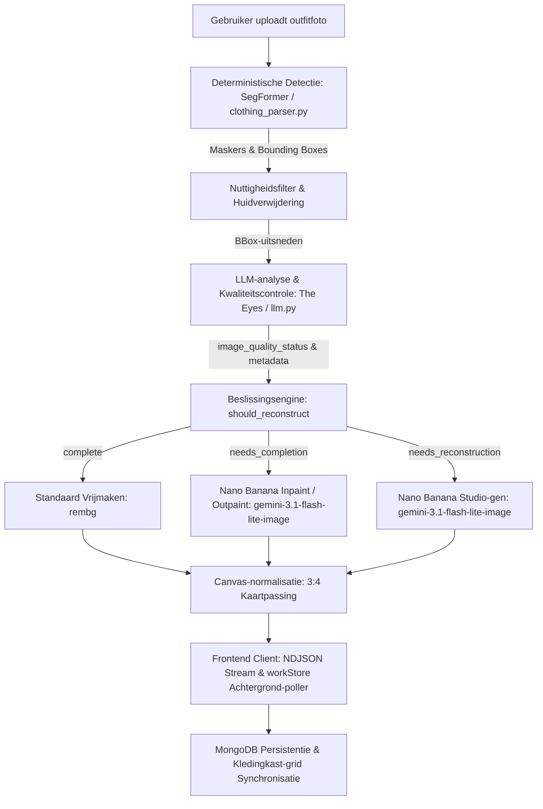

# GarmentVision — De DressApp Beeldherkennings- & Reconstructiepijplijn

> **Module:** `backend/app/services/vision/` & `backend/app/services/reconstruction.py`  
> **Status:** Productie (live op VPS + `dressapp-eyes` self-host).  
> **Functionele rol:** Transformeert elke gebruikersfoto (spiegelselfie, outfitfoto of flat-lay) naar onberispelijke, individueel gesegmenteerde, getagde en door AI gereconstrueerde kledingstukken.

---

## 1. Managementsamenvatting & Waardepropositie

### Algemeen Overzicht
GarmentVision vormt de optische intelligentiekern van DressApp. Het is een end-to-end, meertraps visiepijplijn die ongefilterde gebruikersfoto's verwerkt en schone, geïsoleerde, fotorealistische garderobe-items genereert. Verankerd in een hybride AI-architectuur combineert het snelle deterministische segmentatie (SegFormer `b3_clothes`) en achtergrondverwijdering (`u2netp` / rembg) met diepgaande multimodale analyse (Gemini) en generatief beeldherstel (Nano Banana / `gemini-3.1-flash-lite-image`).

Wanneer kleding op foto's wordt geblokkeerd door haar, tassen of armen, of wordt afgesneden door het camerakader, diagnosticeert de **AI-kwaliteitscontroleur** van GarmentVision het defect en activeert automatisch **Beeldaanvulling** (inpainting/outpainting van ontbrekende zomen, mouwen en kragen) of **Volledige Studio-reconstructie** (het opnieuw genereren van afgesneden of onvolledige items tot ongerepte, opzichzelfstaande e-commerce catalogusfoto's).

### Architectuurstroom



### Waardepropositie voor Gebruikers
- **Moeiteloze Ingestie van Meerdere Items:** Upload een enkele selfie ten voeten uit en isoleer automatisch elk jasje, topje, rok, broek, schoenen en accessoire binnen enkele seconden.
- **Vlekkeloze Presentatie van Studiokwaliteit:** Kleding die bedekt wordt door ledematen of tassen wordt automatisch aangevuld; afgesneden items (zoals gedeeltelijk schoeisel of incomplete jassen) worden volledig gereconstrueerd tot studiowaardige flat-lays.
- **Intelligente Visuele Kwaliteitscontroleur:** The Eyes evalueert elke uitsnede automatisch op afgesneden randen, overlappingen en ontbrekende contouren, waardoor handmatige fotobewerking overbodig wordt.
- **Asynchrone Hot-Path Optimalisatie:** Zware generatieve reconstructies draaien naadloos op de achtergrond, waardoor de initiële foto-inname snel blijft binnen 5 seconden.

---

## 2. Uitgebreide Gebruikershandleiding

### Visuele Interfacetopologie
```text
┌────────────────────────────────────────────────────────────────────────┐
│  [ Kleding Toevoegen — Camera & Upload ]                                │
│  ┌──────────────────────────────────────────────────────────────────┐  │
│  │  [Live Camera / Bestand Dropzone]                                │  │
│  │  "Maak of upload foto's ten voeten uit, flat-lays of bonnen"     │  │
│  └──────────────────────────────────────────────────────────────────┘  │
│                                                                        │
│  [ Verwerkingsstroom: Detectie & Kwaliteitscontrole ]                  │
│  ┌─────────────────┐  ┌─────────────────┐  ┌─────────────────┐         │
│  │ Uitsnede Jas    │  │ Uitsnede Broek  │  │ Uitsnede Schoenen│        │
│  │ [Needs Inpaint] │  │ [Needs Outpaint]│  │ [Reconstruct]   │         │
│  │ "Bikerjack"     │  │ "Tule Rok"      │  │ "Muiltjes Hak"  │         │
│  └─────────────────┘  └─────────────────┘  └─────────────────┘         │
│                                                                        │
│  [ Opgeslagen Kledingkast: Realtime Vernieuwing via workStore ]         │
│  ┌─────────────────┐  ┌─────────────────┐  ┌─────────────────┐         │
│  │ Volledig Jack   │  │ Herstelde Rok   │  │ Studio Schoeisel│         │
│  │ (Volledige mouw)│  │ (Volledige zoom)│  │ (Paar met hakken│         │
│  └─────────────────┘  └─────────────────┘  └─────────────────┘         │
└────────────────────────────────────────────────────────────────────────┘
```

### Modi & Werkstroomhandleiding
1. **Interactieve Momentopname & Batch-inname:**
   - Tik op **Item Toevoegen** &rarr; maak of upload een foto met een of meerdere kledingstukken.
   - Het systeem voert realtime duplicaatcontroles uit (`crypto.subtle` SHA-256 en perceptuele hashing) om dubbele uploads direct te signaleren.
2. **AI-kwaliteitsbeoordeling:**
   - Terwijl SegFormer de segmenten uitsnijdt, inspecteert Gemini's Kwaliteitscontroleur elk kledingstuk:
     - `complete`: Kledingstuk is volledig zichtbaar, vrij van obstructies en gecentreerd. Wordt ongewijzigd behouden.
     - `needs_completion`: Kledingstuk heeft bedekte delen, ontbrekende randen, afgesneden kragen of onvolledige zomen. Wordt klaargezet voor AI inpainting/outpainting.
     - `needs_reconstruction`: Item is zwaar afgesneden (bijv. alleen de neuzen van schoenen zijn zichtbaar). Wordt klaargezet voor volledige studio-generatie.
3. **Naadloze Achtergrondaanvulling:**
   - Bij het klikken op **Opslaan** verschijnen kledingstukken direct in het kledingkast-grid.
   - Achtergrondtaken voeren de generatieve beeldherstelling uit zonder de gebruikersinterface te blokkeren. Zodra dit voltooid is, werkt `workStore` de kaart realtime bij.

---

## 3. Technologie-stack & Diepgaande Mogelijkheden

### Kern-orkestratie & AI/Logica
- **Segmentatie-engine (`clothing_parser.py`):** Maakt gebruik van SegFormer, verfijnd op ATR / LIP mode-datasets, om tot 18 klassen te identificeren, inclusief huidmasker-subtractie en morfologische bandoverbrugging.
- **Kwaliteitscontroleur Prompting (`llm.py`):** Gestructureerd JSON-uitvoerschema dat `image_quality_status`, `image_quality_reason` en `reconstruction_prompt` afdwingt.
- **Beslissingsengine (`reconstruction.py`):** Evalueert de LLM-status samen met een geometrische randcontact-beveiliging (`_EDGE_TOUCH_MARGIN = 40`) om ervoor te zorgen dat items die door de fotorand zijn afgesneden nooit ten onrechte als compleet worden gemarkeerd.
- **Generatieve Herstel-engine (`gemini_image_service.py`):**
  - **Inpaint / Outpaint (`edit`):** Verzendt de uitgesneden bytes en gestructureerde prompt naar `gemini-3.1-flash-lite-image` om stoftextuur, patroon en kleur te behouden tijdens het uitbreiden van ontbrekende geometrie.
  - **Studio-generatie (`generate`):** Vraagt `gemini-3.1-flash-lite-image` aan met volledige beschrijvende metadata (type kledingstuk, materiaal, kleur, fournituren, halslijn) om een ongerept catalogusitem op een gebroken witte achtergrond te renderen.

### Frontend-synchronisatie (`workStore.js` & `itemImage.js`)
- **Gecentraliseerde Beeldresolutie (`itemImage.js`):** `bestImageUrl()` geeft de hoogste prioriteit aan `reconstructed_image_url`, waardoor met AI gerepareerde beelden direct tijdelijke ruwe thumbnails vervangen.
- **Pagina-overschrijdende Polling (`workStore.js`):** Volgt lopende achtergrondreconstructietaken globaal tijdens paginanavigatie en voegt bijgewerkte documenten automatisch toe aan `closetStore`.