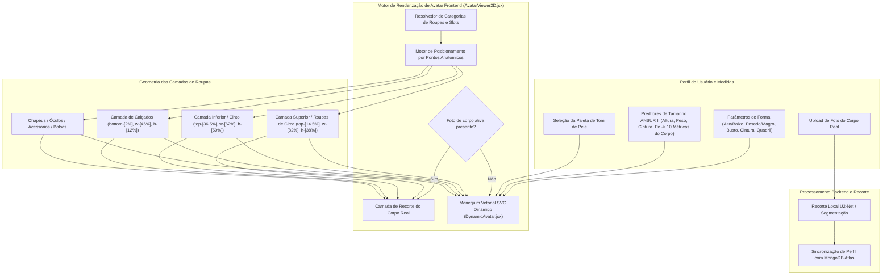

# DressApp — Arquitetura do Sistema de Posicionamento e Prova de Avatar 2D (`Avatar.md`)

> **Versão do Documento:** 2.0  
> **Subsistema Alvo:** Manequim 2D Frontend, Recortes de Fotos do Corpo Real & Motor de Sobreposição de Roupas  
> **Arquivos Principais:** `AvatarViewer2D.jsx`, `DynamicAvatar.jsx`, `OutfitCanvas.jsx`, `Profile.jsx`  
> **Status:** Entregue em Produção & Calibrado  

---

## 1. Resumo Executivo e Proposta de Valor

### 1.1 Visão Geral de Alto Nível
O **Sistema de Posicionamento e Prova de Avatar 2D do DressApp** fornece um ambiente de prova visual adaptativo em tempo real. Ele permite que os usuários visualizem peças de vestuário digitalizadas do seu guarda-roupa sobrepostas perfeitamente em cima de uma **fotografia recortada do corpo real** ou de um **manequim vetorial SVG 2D com curvas Bézier dinâmicas**.

Para garantir alta precisão visual em diversos estilos de vestuário (camisas de compressão, golas polo, golas careca, jeans de cintura baixa, bermudas cargo e vestidos de festa), o motor utiliza calibração de pontos de referência anatômicos, dimensionamento proporcional de proporções e contêineres de sobreposição de imagem sem distorção.



### 1.2 Proposta de Valor para o Usuário
* **Precisão no Alinhamento Anatômico**: Ajusta golas de camisas rente à linha do pescoço do avatar (`top-[14.5%]`) e cós de calças/shorts rente à linha natural da cintura (`top-[36.5%]`), eliminando oclusões no rosto ou lacunas desalinhadas.
* **Flexibilidade de Avatar Duplo**: Alterne instantaneamente entre uma foto pessoal recortada de corpo inteiro e um manequim vetorial SVG 2D dinâmico construído com base em medições antropométricas exatas.
* **Preservação Proporcional da Proporção de Tela**: Aplica dimensionamento de largura do peito e quadril ($scaleX$) mantendo a proporção original da imagem da peça (`object-fit: contain`), evitando esticamentos ou achatamentos indesejados.
* **Hierarquia de Camadas Interativa**: Empilhe casacos sobre camisetas e vestidos, permitindo toques/cliques diretos em camadas individuais de vestuário para abrir os detalhes do item.

---

## 2. Manual do Usuário Completo e Topologia da Interface

### 2.1 Topologia Visual da Interface

```
┌──────────────────────────────────────────────────────────────────┐
│                   Tela de Prova de Avatar 2D                     │
├──────────────────────────────────────────────────────────────────┤
│                                                                  │
│                        [ Chapéus     (top: 1%) ]                 │
│                        [ Óculos      (top: 11%) ]                │
│                        [ Decote      (top: 14.5%) ] ◄─ Gola      │
│                     ┌──────────────────────────┐                 │
│                     │  Partes de Cima / Casacos│                 │
│                     │       (height: 38%)      │                 │
│                     └──────────────────────────┘                 │
│                        [ Linha da Cintura (top: 36.5%) ] ◄─ Cós  │
│                     ┌──────────────────────────┐                 │
│                     │ Partes de Baixo / Shorts │                 │
│                     │       (height: 50%)      │                 │
│                     │                          │                 │
│                     └──────────────────────────┘                 │
│                        [ Pés       (bottom: 2%) ] ◄─── Calçados  │
│                        [ Sapatos     (height: 12%) ]             │
│                                                                  │
├──────────────────────────────────────────────────────────────────┤
│ [ Alternar Modo ]   [ Seletor de Tom de Pele ]   [ Editar Medidas ]│
└──────────────────────────────────────────────────────────────────┘
```

### 2.2 Guias de Modos e Fluxos de Trabalho

#### Modo 1: Camada de Recorte de Foto do Corpo Real
1. Abra as **Configurações do Perfil** (`/me`).
2. Faça upload de uma fotografia de corpo inteiro. O backend executa a segmentação de fundo via `rembg` (U2-Net) para remover o fundo.
3. A URL da imagem recortada (`body_photo_url`) atualiza o perfil do usuário no MongoDB e é renderizada dentro do contêiner `AvatarViewer2D`.
4. Para retornar ao manequim vetorial, clique em **Remover foto** na página do perfil. A interface atualiza instantaneamente sem necessidade de recarregar a página.

#### Modo 2: Manequim Vetorial SVG Dinâmico
1. Quando nenhuma foto de corpo estiver presente, o `AvatarViewer2D` renderiza o `DynamicAvatar.jsx`.
2. O manequim gera curvas Bézier cúbicas contínuas (comandos $C$ e $S$) dentro de uma viewBox SVG fixa de `0 0 200 450`.
3. Ajustar os parâmetros do corpo (altura, peso, cintura, peito, ombros, quadril) ou selecionar um tom de pele altera dinamicamente a silhueta em tempo real.

---

## 3. Arquitetura Tecnológica e Análise Detalhada

### 3.1 Divisor de Elipse Anatômico e Gerador de Manequim Bézier

`DynamicAvatar.jsx` calcula larguras de projeção planar 2D a partir de circunferências anatômicas 3D usando um **Divisor de Elipse Anatômico** ($\text{DIVISOR} = 2.65$):

$$\begin{aligned}
w_{\text{shoulders}} &= (\text{shoulders} \times 1.1) \times (1.05 \text{ if male else } 0.95) \\
w_{\text{chest}} &= \left(\frac{\text{chest}}{2.65} \times 1.05\right) \times (1.02 \text{ if male else } 1.0) \\
w_{\text{waist}} &= \left(\frac{\text{waist}}{2.65} \times 1.0\right) \times (0.98 \text{ if male else } 0.90) \\
w_{\text{hip}} &= \left(\frac{\text{hip}}{2.65} \times 1.05\right) \times (0.93 \text{ if male else } 1.05)
\end{aligned}$$

A silhueta do corpo é construída por meio de comandos de caminho SVG mapeando pontos de controle Bézier cúbicos:

```javascript
// Bezier contour snippet from DynamicAvatar.jsx
const bodyPath = [
  `M ${pNeckR}`,
  `C ${X0 + wNeck + (wShoulders - wNeck) * 0.6},${yChin + neckHeight * 0.7} ${X0 + wShoulders * 0.9},${yShoulders - 2} ${pShoulderR}`,
  `C ${X0 + wShoulders * 0.95},${yShoulders + (yChest - yShoulders) * 0.6} ${X0 + wChest + 2},${yChest - 5} ${pChestR}`,
  `C ${X0 + wChest - 1},${yChest + (yWaist - yChest) * 0.5} ${X0 + wWaist + (isMale ? 1 : -2)},${yWaist - 8} ${pWaistR}`,
  `C ${X0 + wWaist + (isMale ? 2 : 5)},${yWaist + (yHip - yWaist) * 0.4} ${X0 + wHip + 1},${yHip - 8} ${pHipR}`,
  ...
].join(' ');
```

### 3.2 Posicionamento Calibrado de Pontos de Referência e Proporções CSS

Para garantir que as roupas fiquem perfeitamente posicionadas sem cobrir traços do rosto ou deixar lacunas no corpo, os contêineres em `AvatarViewer2D.jsx` são vinculados a proporções posicionais CSS precisas:

| Categoria da Peça | Classe de Posição CSS | z-Index | Ponto Anatômico de Alinhamento |
| --- | --- | --- | --- |
| **Chapéus / Acessórios de Cabeça** | `top-[1%] left-1/2 w-[34%] aspect-square` | `z-30` | Topo da cabeça |
| **Óculos** | `top-[11%] left-1/2 w-[18%] h-[4.5%]` | `z-28` | Linha dos olhos |
| **Acessórios / Colares** | `top-[14.5%] left-1/2 w-[30%] aspect-square` | `z-25` | Base do pescoço |
| **Parte de Cima (Top)** | `top-[14.5%] left-1/2 w-[82%] h-[38%]` | `z-20` | Da gola ao decote |
| **Casacos / Roupas de Cima** | `top-[14.5%] left-1/2 w-[86%] h-[42%]` | `z-22` | Sobreposição de casaco nos ombros |
| **Vestidos** | `top-[14.5%] left-1/2 w-[82%] h-[68%]` | `z-20` | Comprimento total do decote ao joelho |
| **Cintos** | `top-[36.5%] left-1/2 w-[62%] h-[5%]` | `z-21` | Passador de cinto na cintura |
| **Parte de Baixo (Calças/Shorts)** | `top-[36.5%] left-1/2 w-[62%] h-[50%]` | `z-10` | Do cós à linha natural da cintura |
| **Sapatos / Calçados** | `bottom-[2%] left-1/2 w-[46%] h-[12%]` | `z-15` | Do tornozelo ao plano do pé |
| **Bolsa de Mão** | `top-[40%] right-[-5%] w-[40%] h-[30%]` | `z-25` | Altura da queda do braço |

### 3.3 Dimensionamento Proporcional de Largura das Peças

Além do posicionamento, as roupas são dimensionadas horizontalmente ($scaleX$) de forma dinâmica com base nos parâmetros corporais selecionados pelo usuário (busto grande, pesado, magro, cintura larga, quadril largo):

```javascript
// Derivation of garment container scale factors in AvatarViewer2D.jsx
const scales = useMemo(() => {
  const heightFactor = 1 + (params.tall * 0.08) - (params.short * 0.08);
  const widthFactor = 1 + (params.heavy * 0.12) - (params.thin * 0.12);
  const chestFactor = 1 + (params.busty * 0.1);
  const waistFactor = 1 + (params.waist_thick * 0.12) - (params.waist_thin * 0.08);
  const hipsFactor = 1 + (params.hips_wide * 0.12) - (params.hips_narrow * 0.08);

  return { height: heightFactor, width: widthFactor, chest: chestFactor, waist: waistFactor, hips: hipsFactor };
}, [params]);

// Passed to Framer Motion animate prop for Top and Bottom:
// Top: scaleX = scales.chest / scales.width
// Bottom: scaleX = scales.hips / scales.width
```

---

## 4. Matriz Resumida de Correções de Posição e Proporção

| Problema Identificado | Causa | Correção Aplicada | Resultado |
| --- | --- | --- | --- |
| **Gola da Camisa Sobrepondo o Rosto** | Deslocamento posicionado muito alto (`top-[8.3%]` ou `top-[12.8%]`) | Deslocamento do contêiner superior ajustado para `top-[14.5%]` | A gola da camisa descansa perfeitamente na linha do pescoço do avatar. |
| **Calça/Shorts Baixos ou Sobrepondo a Barra** | Deslocamento posicionado muito baixo (`top-[38.5%]`) | Deslocamento do contêiner inferior ajustado para `top-[36.5%]` | O cós da calça se alinha perfeitamente com a cintura natural. |
| **Proporção da Imagem da Peça Distorcida** | Esticamento sem restrições do contêiner | Aplicado `object-fit: contain` com ajuste proporcional de `scaleX` | Mantém a proporção original da imagem da peça sem distorções horizontais. |
| **Lentidão ao Remover Foto** | Necessidade de reobter o estado da página | Sincronização instantânea de estado local no `Profile.jsx` | A remoção da foto é exibida instantaneamente sem atrasos na interface. |

---

*Document compiled automatically by Narrator for DressApp.*
