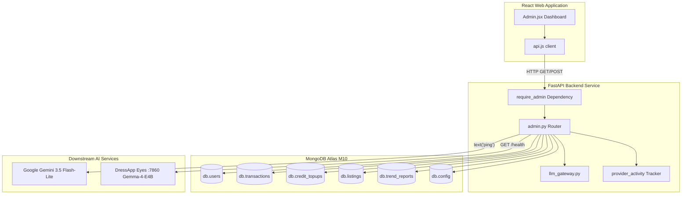

# Painel de Administração do DressApp — Narrativa Arquitetônica e Manual do Usuário

Este documento oferece um detalhamento completo e oficial do Painel de Administração do DressApp, mapeando a interface do painel frontend ([Admin.jsx](file:///C:/DressApp_AG/apps/web/src/pages/Admin.jsx)) e sua respectiva camada de API backend ([admin.py](file:///C:/DressApp_AG/backend/app/api/v1/admin.py)).

---

## 1. Resumo Executivo e Proposta de Valor

### Visão Geral de Alto Nível
O Painel de Administração do DressApp é o centro unificado para supervisão da plataforma, auditoria de monetização, configuração de modelos de IA e diagnóstico de sistemas. Ele proporciona aos administradores uma visão em tempo real e de alta fidelidade sobre a saúde da plataforma, volume de transações no marketplace, consumo de créditos de IA pelos usuários, grupos de testadores e desempenho de microserviços de IA integrados, sem exigir acesso direto a terminais ou consoles de banco de dados.

### Fluxo Arquitetônico
O diagrama a seguir ilustra a integração do dashboard frontend com os serviços backend, as consultas a coleções do MongoDB Atlas e as sondagens de saúde nos serviços dependentes:



### Principais Capacidades Administrativas
- **Visibilidade de KPIs em Tempo Real**: Métricas consolidadas sobre usuários ativos, total de itens de vestuário, volume do marketplace, taxas da plataforma, chamadas ao estilista e relatórios publicados no Trend Scout.
- **Autenticação Segura**: O acesso em produção é protegido exclusivamente via autenticação Google OAuth (`ADMIN_EMAILS`); atalhos não autenticados herdados foram descontinuados.
- **Governança de Roteamento de IA Multinível**: Verificação direta e testes de ping em tempo real para o gateway principal do **Google Gemini 3.5 Flash-Lite** e para o contêiner Eyes **Gemma-4-E4B** on-premises na porta 7860.
- **Segurança e Moderação do Marketplace**: Capacidade imediata para inspecionar, suspender ou reativar anúncios e gerenciar privilégios de usuários.

---

## 2. Manual Completo do Usuário

### Topologia da Interface Visual
O painel administrativo é organizado em abas com layout limpo e otimizado para operações de alta densidade informativa:

```
+-------------------------------------------------------------------------------+
|  DressApp (Admin Console)                              [Return to App]        |
|  ---------------------------------------------------------------------------  |
|  [ Overview ]  [ Providers ]  [ Trend Scout ]  [ Users ]  [ Listings ]  ...   |
+-------------------------------------------------------------------------------+
|  OVERVIEW TAB                                                                 |
|  +------------------+  +------------------+  +------------------+  +-------+  |
|  | Active Users     |  | Closet Inventory |  | Active Listings  |  | Gross |  |
|  | 18 (+2 today)    |  | 340 garments     |  | 8 items listed   |  | $140  |  |
|  +------------------+  +------------------+  +------------------+  +-------+  |
|                                                                               |
|  +-------------------------------------------------------------------------+  |
|  | Downstream Provider Activity (Rolling 200 calls)                        |  |
|  | gemini-flash: 142 calls (0% err, 280ms) | eyes-gemma: 12 calls (0% err) |  |
|  +-------------------------------------------------------------------------+  |
+-------------------------------------------------------------------------------+
```

### Roteiros Operacionais

#### 1. Aba Visão Geral (Overview)
- **Cards de Métricas**: Contadores em tempo real de Usuários Cadastrados, Peças no Armário, Anúncios Ativos, Transações, Volume Bruto, Taxas da Plataforma e Atividade do Estilista.
- **Monitor de Atividade de Provedores**: Telemetria contínua dos endpoints de IA e clima conectados, exibindo contagem de requisições, percentual de erros e métricas de latência (mediana e p95).

#### 2. Aba Provedores (Providers)
- **Gateway Google Gemini**: Exibe o status de configuração e a integridade da conexão para o SDK nativo `google-genai`. Ao tocar em **Verify Key**, um ping leve de geração de texto é disparado para checar a disponibilidade de cota.
- **Motor de Visão Eyes**: Inspeciona o contêiner on-premises do VPS CPX32 (`http://eyes:7860`). Permite alternar o mecanismo ativo entre visão na nuvem e inferência local Gemma sem reiniciar os pods backend.

#### 3. Aba Usuários (Users)
- **Diretório de Usuários**: Lista com busca detalhando e-mail, função (`user`, `tester`, `admin`), plano ativo (`free`, `manager`, `pro`), saldo de créditos e histórico de transações.
- **Administração de Funções**: Ações de um clique para promover usuários a administrador ou ajustar permissões de testador.
- **Identificação do Grupo de Testadores**: Selo visual destaca as contas vinculadas ao programa de testes gratuito.

#### 4. Abas Anúncios e Transações (Listings & Transactions)
- **Supervisão de Anúncios**: Filtre por status (`active`, `paused`, `sold`, `removed`). Os administradores podem moderar e pausar anúncios fora dos termos imediatamente.
- **Auditoria Financeira**: Consolida volume bruto, taxas arrecadadas pela plataforma, comissões de gateways de pagamento e repasses líquidos aos vendedores.

---

## 3. Pilha Tecnológica e Detalhamento de Capacidades

### Autenticação e Autorização
- **Guarda de Dependência**: Os endpoints da API exigem a dependência `require_admin` em `backend/app/api/v1/admin.py`, checando se o e-mail no JWT está configurado na variável de ambiente `ADMIN_EMAILS` de produção.
- **Integração com Google OAuth**: O login em produção utiliza o fluxo do Google OAuth (`dressappdeveloper@gmail.com`), eliminando credenciais de desenvolvimento locais para reforçar a segurança.

### Infraestrutura de Roteamento de IA Multinível
- **Motor Principal**: Google Gemini 3.5 Flash-Lite processa consultas de estilo e análises visuais em produção por meio do `backend/app/services/llm_gateway.py`.
- **Rede de Segurança de Cotas**: Caso o Gemini atinja limites de requisições (`429` / `RESOURCE_EXHAUSTED`), o fluxo é redirecionado suavemente para o contêiner on-premises Gemma-4-E4B na porta 7860, retornando `provider_fallback="gemma"` sem afetar a experiência do usuário.

### Operações com Banco de Dados
- **Agregações no MongoDB Atlas**:
  - Consolida valores financeiros de transações pagas:
    ```python
    pipeline = [{"$match": {"status": "paid"}}, {"$group": {"_id": None, "gross": {"$sum": "$financial.gross_cents"}}}]
    ```
  - Totaliza aquisições de pacotes pré-pagos de créditos:
    ```python
    topup_pipeline = [{"$match": {"status": "captured"}}, {"$group": {"_id": None, "total": {"$sum": "$amount_cents"}}}]
    ```
