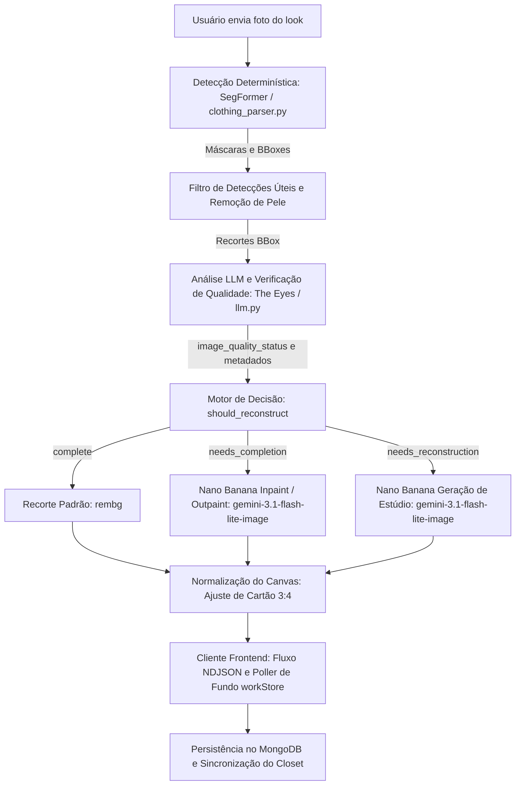

# GarmentVision — O Pipeline de Visão e Reconstrução do DressApp Eyes

> **Módulo:** `backend/app/services/vision/` e `backend/app/services/reconstruction.py`  
> **Status:** Produção (ativo no VPS + auto-hospedagem `dressapp-eyes`).  
> **Papel Principal:** Transforma qualquer foto do usuário (selfie no espelho, foto de look ou flat-lay) em peças de closet perfeitamente segmentadas, etiquetadas e reconstruídas por IA.

---

## 1. Resumo Executivo e Proposta de Valor

### Visão Geral de Alto Nível
O GarmentVision é o núcleo de inteligência óptica do DressApp. Trata-se de um pipeline de visão de ponta a ponta em múltiplos estágios que processa fotos espontâneas de usuários e produz itens de guarda-roupa limpos, isolados e fotorrealistas. Baseado em uma arquitetura de IA híbrida, ele une a segmentação determinística ultrarrápida (SegFormer `b3_clothes`) e remoção de fundo (`u2netp` / rembg) ao raciocínio multimodal profundo (Gemini) e à restauração generativa de imagens (Nano Banana / `gemini-3.1-flash-lite-image`).

Quando as roupas nas fotos do usuário estão cobertas por cabelos, bolsas, braços ou cortadas pelo enquadramento da câmera, o **AI Quality Checker** do GarmentVision diagnostica o defeito e aciona automaticamente o **Image Completion** (inpainting/outpainting de barras, mangas e golas ausentes) ou a **Full Studio Reconstruction** (regeneração completa de itens cortados ou amputados em fotos de catálogo de e-commerce impecáveis).

### Fluxo Arquitetural



### Proposta de Valor para o Usuário
- **Ingestão Fluida de Múltiplos Itens:** Envie uma única selfie de corpo inteiro e isole automaticamente cada jaqueta, blusa, saia, calça, calçado e acessório em segundos.
- **Apresentação Impecável com Qualidade de Estúdio:** Peças cobertas por braços ou bolsas são completadas automaticamente; itens cortados (como sapatos parciais ou casacos recortados) são totalmente reconstruídos em fotos de estúdio.
- **Verificador de Qualidade Visual Inteligente:** O The Eyes avalia automaticamente cada recorte quanto a cortes, oclusões e bordas ausentes, eliminando a edição manual de fotos.
- **Otimização Assíncrona de Alta Performance:** Reconstruções generativas de alto custo computacional rodam em segundo plano, mantendo o upload inicial ágil em menos de 5 segundos.

---

## 2. Manual do Usuário Completo

### Topologia da Interface Visual
```text
┌────────────────────────────────────────────────────────────────────────┐
│  [ Adicionar Roupas — Câmera e Upload ]                                │
│  ┌──────────────────────────────────────────────────────────────────┐  │
│  │  [Câmera ao Vivo / Área de Upload]                               │  │
│  │  "Tire fotos de corpo inteiro, flat-lays ou envie recibos"       │  │
│  └──────────────────────────────────────────────────────────────────┘  │
│                                                                        │
│  [ Fluxo de Processamento: Detecção e Verificação de Qualidade ]       │
│  ┌─────────────────┐  ┌─────────────────┐  ┌─────────────────┐         │
│  │ Recorte Casaco  │  │ Recorte Saia    │  │ Recorte Calçado │         │
│  │ [Requer Inpaint]│  │ [Requer Outpaint│  │ [Reconstrução]  │         │
│  │ "Jaqueta Biker" │  │ "Saia de Tule"  │  │ "Mule de Salto" │         │
│  └─────────────────┘  └─────────────────┘  └─────────────────┘         │
│                                                                        │
│  [ Grade do Closet: Atualização em Tempo Real via workStore ]          │
│  ┌─────────────────┐  ┌─────────────────┐  ┌─────────────────┐         │
│  │ Jaqueta Completa│  │ Saia Restaurada │  │ Calçado Estúdio │         │
│  │ (Mangas complet)│  │ (Barra e lados) │  │ (Par com saltos)│         │
│  └─────────────────┘  └─────────────────┘  └─────────────────┘         │
└────────────────────────────────────────────────────────────────────────┘
```

### Modos e Passo a Passo do Fluxo
1. **Captura Interativa e Ingestão em Lote:**
   - Toque em **Add Item** (Adicionar Item) &rarr; tire ou envie uma foto contendo uma ou mais peças.
   - O sistema realiza verificações de duplicidade em tempo real (`crypto.subtle` SHA-256 e hash perceptivo médio) para evitar envios duplicados imediatamente.
2. **Avaliação de Qualidade por IA:**
   - Conforme o SegFormer segmenta os recortes, o Verificador de Qualidade do Gemini inspeciona cada peça:
     - `complete`: A peça está totalmente visível, desobstruída e centralizada. Mantida como está.
     - `needs_completion`: A peça possui painéis ocluídos, bordas faltantes, golas cortadas ou barras divididas. Enfileirada para inpainting/outpainting por IA.
     - `needs_reconstruction`: O item está severamente cortado (ex.: apenas a ponta do sapato visível). Enfileirado para geração completa em estúdio.
3. **Finalização Fluida em Segundo Plano:**
   - Ao clicar em **Save** (Salvar), as roupas aparecem imediatamente na grade do closet.
   - As tarefas em segundo plano executam a restauração generativa sem travar a interface. Ao concluir, o `workStore` atualiza o cartão em tempo real.

---

## 3. Stack Tecnológico e Detalhes de Recursos

### Orquestração Central e Lógica de IA
- **Motor de Segmentação (`clothing_parser.py`):** Utiliza SegFormer ajustado em conjuntos de dados de moda ATR / LIP para identificar até 18 classes, aplicando subtração de máscara de pele e preenchimento morfológico de alças.
- **Prompts do Verificador de Qualidade (`llm.py`):** Esquema de saída JSON estruturado que valida `image_quality_status`, `image_quality_reason` e `reconstruction_prompt`.
- **Motor de Decisão (`reconstruction.py`):** Avalia o status do LLM com uma proteção geométrica de toque nas bordas (`_EDGE_TOUCH_MARGIN = 40`), garantindo que itens cortados pela borda da foto nunca sejam considerados falsamente completos.
- **Motor de Reparo Generativo (`gemini_image_service.py`):**
  - **Inpaint / Outpaint (`edit`):** Envia os bytes recortados e o prompt estruturado para o `gemini-3.1-flash-lite-image` para preservar a textura, padrão e cor do tecido enquanto expande a geometria que falta.
  - **Geração de Estúdio (`generate`):** Envia ao `gemini-3.1-flash-lite-image` metadados descritivos completos (tipo de peça, material, cor, ferragens, decote) para gerar uma foto de catálogo impecável em fundo off-white.

### Sincronização Frontend (`workStore.js` e `itemImage.js`)
- **Resolução Centralizada de Imagens (`itemImage.js`):** A função `bestImageUrl()` prioriza `reconstructed_image_url` no topo da precedência, garantindo que as imagens reparadas por IA substituam instantaneamente as miniaturas temporárias brutas.
- **Polling Entre Páginas (`workStore.js`):** Rastreia tarefas de reconstrução ativas globalmente através da navegação do usuário, inserindo automaticamente os documentos atualizados na `closetStore`.
