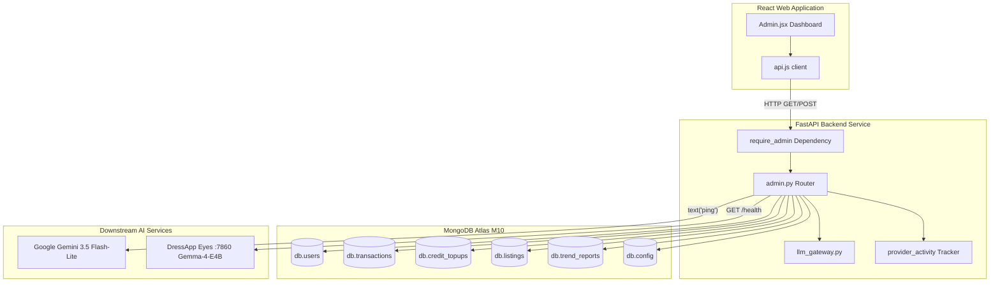

# Панель администратора DressApp — архитектурный обзор и руководство пользователя

В этом документе представлен подробный официальный разбор панели администратора DressApp, охватывающий интерфейс панели управления ([Admin.jsx](file:///C:/DressApp_AG/apps/web/src/pages/Admin.jsx)) и соответствующий уровень API бэкенда ([admin.py](file:///C:/DressApp_AG/backend/app/api/v1/admin.py)).

---

## 1. Краткое резюме и ценностное предложение

### Общий обзор
Панель администратора DressApp — это централизованный узел для надзора за платформой, аудита монетизации, настройки моделей ИИ и диагностики системы. Она предоставляет администраторам высокоточную картину состояния платформы в реальном времени: объем транзакций на маркетплейсе, потребление AI-кредитов пользователями, группы тестировщиков и производительность подчиненных микросервисов ИИ без необходимости прямого доступа к терминалу или командной строке базы данных.

### Архитектурная схема
На следующей диаграмме показано, как панель управления фронтенда взаимодействует со службами бэкенда, опрашивает коллекции MongoDB Atlas и выполняет проверку работоспособности downstream-сервисов:



### Ключевые административные возможности
- **Мониторинг KPI в реальном времени**: Сводные метрики по активным пользователям, общему количеству вещей в гардеробах, объему продаж на маркетплейсе, комиссиям платформы, вызовам стилиста и опубликованным отчетам Trend Scout.
- **Программа группы тестировщиков**: Автоматическое назначение ролей и бесплатного доступа к уровню Professional для верифицированных аккаунтов тестировщиков (`maystarboard@gmail.com`, `lokoprod@gmail.com`, `dressapdeveloper@gmail.com`).
- **Безопасная аутентификация**: Доступ в рабочей среде строго защищен авторизацией через Google OAuth (`ADMIN_EMAILS`); устаревшие кнопки неаутентифицированного обхода полностью удалены.
- **Управление многоуровневой маршрутизацией ИИ**: Прямая верификация и диагностика активного шлюза **Google Gemini 3.5 Flash-Lite** и локального контейнера Eyes **Gemma-4-E4B** на порту 7860 с помощью пинг-запросов.
- **Безопасность и модерация маркетплейса**: Возможность мгновенной проверки, приостановки или восстановления объявлений, а также управление привилегиями пользователей.

---

## 2. Полное руководство пользователя

### Топология визуального интерфейса
Панель администратора имеет структурированный многовкладочный интерфейс, оптимизированный для оперативной административной работы:

```
+-------------------------------------------------------------------------------+
|  DressApp (Admin Console)                              [Return to App]        |
|  ---------------------------------------------------------------------------  |
|  [ Overview ]  [ Providers ]  [ Trend Scout ]  [ Users ]  [ Listings ]  ...   |
+-------------------------------------------------------------------------------+
|  OVERVIEW TAB                                                                 |
|  +------------------+  +------------------+  +------------------+  +-------+  |
|  | Active Users     |  | Closet Inventory |  | Active Listings  |  | Gross |  |
|  | 18 (+2 today)    |  | 340 garments     |  | 8 items listed   |  | $140  |  |
|  +------------------+  +------------------+  +------------------+  +-------+  |
|                                                                               |
|  +-------------------------------------------------------------------------+  |
|  | Downstream Provider Activity (Rolling 200 calls)                        |  |
|  | gemini-flash: 142 calls (0% err, 280ms) | eyes-gemma: 12 calls (0% err) |  |
|  +-------------------------------------------------------------------------+  |
+-------------------------------------------------------------------------------+
```

### Операционные инструкции

#### 1. Вкладка «Обзор» (Overview)
- **Карточки метрик**: Счетчики в реальном времени для зарегистрированных пользователей, общего числа предметов одежды, объявлений на маркетплейсе, транзакций, валового объема, комиссий платформы и активности стилиста.
- **Монитор активности провайдеров**: Скользящая телеметрия подключенных эндпоинтов ИИ и погоды с отслеживанием количества вызовов, процента ошибок и показателей задержки (медиана и p95).

#### 2. Вкладка «Провайдеры» (Providers)
- **Шлюз Google Gemini**: Отображает статус конфигурации и состояние подключения для нативного SDK `google-genai`. Нажатие на **Verify Key** отправляет тестовый легковесный запрос генерации текста для проверки доступности квот.
- **Движок компьютерного зрения Eyes**: Проверяет состояние локального контейнера на CPX32 VPS (`http://eyes:7860`). Позволяет переключать приоритет между облачным зрением и локальным инференсом Gemma без перезапуска подов бэкенда.

#### 3. Вкладка «Пользователи» (Users)
- **Каталог пользователей**: Список с возможностью поиска, отображающий email пользователя, назначенную роль (`user`, `tester`, `admin`), активный тарифный план (`free`, `manager`, `pro`), баланс кредитов и историю транзакций.
- **Управление ролями**: Действия в один клик для назначения пользователя администратором или изменения привилегий тестировщика.
- **Идентификация группы тестировщиков**: Визуальный значок выделяет аккаунты, участвующие в бесплатной программе тестирования.

#### 4. Вкладки «Объявления» и «Транзакции» (Listings & Transactions)
- **Контроль объявлений**: Фильтрация по статусу объявления (`active`, `paused`, `sold`, `removed`). Администраторы могут оперативно модерировать и приостанавливать объявления, нарушающие правила.
- **Финансовый аудит**: Агрегирует валовой объем, удержанные комиссии платформы, комиссии платежного шлюза и чистые выплаты продавцам.

---

## 3. Технологический стек и детальный разбор возможностей

### Аутентификация и авторизация
- **Защита зависимостей**: Эндпоинты API применяют зависимость `require_admin` в `backend/app/api/v1/admin.py`, проверяя, что email из JWT-токена вызывающей стороны содержится в переменной окружения `ADMIN_EMAILS` рабочей среды.
- **Интеграция с Google OAuth**: Авторизация в производственной среде выполняется через Google OAuth (`dressapdeveloper@gmail.com`), что исключает небезопасные локальные методы обхода.

### Архитектура многоуровневой маршрутизации ИИ
- **Основной движок**: Google Gemini 3.5 Flash-Lite обрабатывает запросы к стилисту и анализ изображений через `backend/app/services/llm_gateway.py`.
- **Подстраховка квот (Quota Safety Net)**: Если Gemini сталкивается с лимитами частоты запросов (`429` / `RESOURCE_EXHAUSTED`), запрос прозрачно переключается на локальный контейнер Gemma-4-E4B на порту 7860, возвращая `provider_fallback="gemma"` без прерывания пользовательского процесса.

### Операции с базой данных
- **Агрегации MongoDB Atlas**:
  - Суммирование финансовых показателей по оплаченным транзакциям:
    ```python
    pipeline = [{"$match": {"status": "paid"}}, {"$group": {"_id": None, "gross": {"$sum": "$financial.gross_cents"}}}]
```
  - Агрегация покупок пакетов предоплаченных кредитов:
    ```python
    topup_pipeline = [{"$match": {"status": "captured"}}, {"$group": {"_id": None, "total": {"$sum": "$amount_cents"}}}]
```
