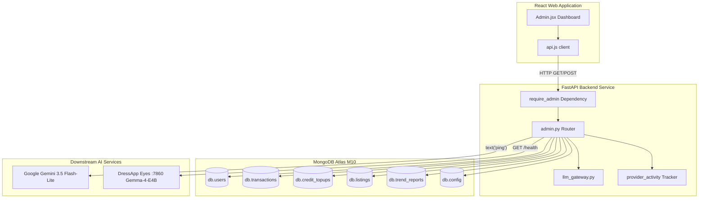

# DressApp 管理后台 — 架构解析与用户手册

本文档全面而权威地剖析了 DressApp 管理后台（Admin Panel），梳理了前端仪表盘界面（[Admin.jsx](file:///C:/DressApp_AG/apps/web/src/pages/Admin.jsx)）及其对应的后端 API 逻辑层（[admin.py](file:///C:/DressApp_AG/backend/app/api/v1/admin.py)）。

---

## 1. 概述与核心价值

### 高层概览
DressApp 管理后台是整个平台集中管控、商业化审计、AI 模型配置以及系统诊断的核心中枢。它为管理员提供了一个实时、高保真的全景窗口，用以洞察平台运行状况、二手市场交易量、用户 AI 积分消耗、测试用户组管理以及下游 AI 微服务的性能表现，而无需直接进入终端或数据库命令行。

### 架构流程图
下图清晰展示了前端仪表盘如何与后端服务交互、查询 MongoDB Atlas 数据集合并执行下游健康状态探针：



### 核心管理能力
- **实时 KPI 指标监控**：汇总统计活跃用户数、衣橱单品总数、市场在售单品、平台交易手续费、造型师调用量以及已发布的 Trend Scout 趋势报告。
- **测试用户组计划**：自动为白名单验证通过的测试账户（`maystarboard@gmail.com`、`lokoprod@gmail.com`、`dressapdeveloper@gmail.com`）分配角色与免费 Professional 专业版层级。
- **安全身份验证**：生产环境访问受到 Google OAuth 鉴权严格保护（校验 `ADMIN_EMAILS`）；遗留的未经身份验证的测试跳过按钮已彻底清除。
- **多层级 AI 路由管控**：对主力 **Google Gemini 3.5 Flash-Lite** 网关及位于 7860 端口的本地 **Gemma-4-E4B** Eyes 容器提供直接连通性验证与实时 Ping 诊断。
- **市场安全与内容审核**：具备即时查看、暂停或恢复商品刊登以及调整用户权限的完整能力。

---

## 2. 详尽用户操作手册

### 界面视觉布局
管理后台采用清晰明了的多标签页布局，专为高密度信息运维操作深度优化：

```
+-------------------------------------------------------------------------------+
|  DressApp (Admin Console)                              [Return to App]        |
|  ---------------------------------------------------------------------------  |
|  [ Overview ]  [ Providers ]  [ Trend Scout ]  [ Users ]  [ Listings ]  ...   |
+-------------------------------------------------------------------------------+
|  OVERVIEW TAB                                                                 |
|  +------------------+  +------------------+  +------------------+  +-------+  |
|  | Active Users     |  | Closet Inventory |  | Active Listings  |  | Gross |  |
|  | 18 (+2 today)    |  | 340 garments     |  | 8 items listed   |  | $140  |  |
|  +------------------+  +------------------+  +------------------+  +-------+  |
|                                                                               |
|  +-------------------------------------------------------------------------+  |
|  | Downstream Provider Activity (Rolling 200 calls)                        |  |
|  | gemini-flash: 142 calls (0% err, 280ms) | eyes-gemma: 12 calls (0% err) |  |
|  +-------------------------------------------------------------------------+  |
+-------------------------------------------------------------------------------+
```

### 核心功能操作指引

#### 1. 概览标签页 (Overview Tab)
- **指标卡片**：展示注册用户数、总衣物数、在售商品数、交易笔数、总交易额（Gross Volume）、平台抽成费用以及造型师活跃度的实时计数器。
- **服务提供方活跃度监控**：针对已连接的 AI 及天气接口的近 200 次调用提供滚动遥测分析，精确追踪调用频次、错误率及延迟基准（中位数与 P95）。

#### 2. 服务商标签页 (Providers Tab)
- **Google Gemini 网关**：展示原生 `google-genai` SDK 的配置状态与连接健康度。点击 **Verify Key** 将发起一次轻量级文本生成 Ping 探测，以确认配额可用性。
- **Eyes 视觉推理引擎**：检查 CPX32 VPS 本地容器（`http://eyes:7860`）的运行状态。支持在云端视觉与本地自托管 Gemma 推理之间动态切换运行时策略，无需重启后端容器。

#### 3. 用户标签页 (Users Tab)
- **用户档案目录**：支持全文检索，详尽展示用户邮箱、分配角色（`user`、`tester`、`admin`）、当前激活订阅层级（`free`、`manager`、`pro`）、可用积分余额及历史交易记录。
- **角色权限管理**：一键将普通用户提升为管理员，或灵活调整测试人员专属特权。
- **测试用户组识别**：通过直观的视觉徽章高亮显示已纳入免费测试计划的账户。

#### 4. 商品刊登与交易标签页 (Listings & Transactions Tabs)
- **商品状态监控**：按状态筛选刊登物品（`active` 在售、`paused` 暂停、`sold` 已售、`removed` 已下架）。管理员可即刻审核并暂停违规刊登。
- **财务账目审计**：汇总统计总交易流水、平台扣收费用、支付网关通道佣金及卖家最终净结算额。

---

## 3. 技术栈深度剖析与核心机制

### 身份验证与权限管控
- **依赖守卫机制**：API 端点在 `backend/app/api/v1/admin.py` 中强制执行 `require_admin` 依赖项，严格比对调用者 JWT 中的邮箱是否包含在生产环境环境变量 `ADMIN_EMAILS` 白名单中。
- **Google OAuth 深度集成**：生产环境登录流全部接入 Google OAuth（`dressapdeveloper@gmail.com`），坚决杜绝本地硬编码的开发环境跳过逻辑，确保极致安全性。

### 多层级 AI 路由架构
- **核心生产引擎**：Google Gemini 3.5 Flash-Lite 依托 `backend/app/services/llm_gateway.py` 处理线上所有的造型咨询与图像特征分析。
- **配额安全网 (Quota Safety Net)**：当 Gemini 遭遇频率或配额限制（`429` / `RESOURCE_EXHAUSTED`）时，系统平滑降级至位于 7860 端口的本地 Gemma-4-E4B 容器，返回 `provider_fallback="gemma"`，全程对用户无感，绝不中断业务。

### 数据库聚合操作
- **MongoDB Atlas 数据聚合**：
  - 汇总统计所有已完成支付交易的财务总额：
    ```python
    pipeline = [{"$match": {"status": "paid"}}, {"$group": {"_id": None, "gross": {"$sum": "$financial.gross_cents"}}}]
```
  - 统计已确认收款的预付费积分购买充值总额：
    ```python
    topup_pipeline = [{"$match": {"status": "captured"}}, {"$group": {"_id": None, "total": {"$sum": "$amount_cents"}}}]
```
