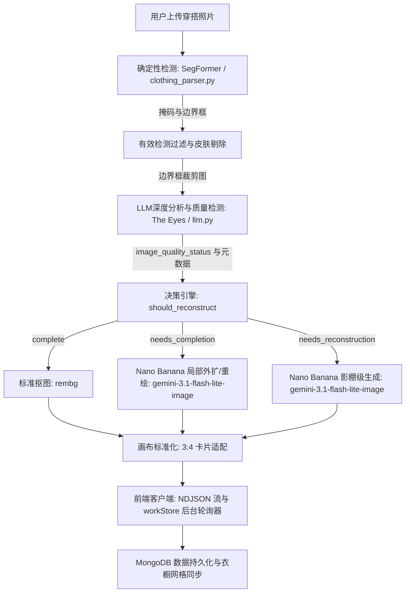

# GarmentVision — DressApp 视觉识别与图像重构管线

> **所属模块：** `backend/app/services/vision/` 与 `backend/app/services/reconstruction.py`  
> **运行状态：** 生产环境已就绪（运行于 VPS + `dressapp-eyes` 自托管服务）。  
> **核心职能：** 将用户的任何照片（全身镜自拍、穿搭随拍或平铺实拍）转化为清晰、独立分割、属性标注完善且经 AI 智能重构的衣橱单品。

---

## 1. 概述与核心价值

### 高层概览
GarmentVision 是 DressApp 的光学智能中枢。这是一个端到端的多阶段计算机视觉管线，能够接收未经处理的用户原始照片，并输出干净、独立且具照片级真实感的衣橱单品。系统基于混合 AI 架构，将高速确定性图像分割（SegFormer `b3_clothes`）和背景抠图（`u2netp` / rembg）与深度多模态推理（Gemini）及生成式图像修复（Nano Banana / `gemini-3.1-flash-lite-image`）有机融合。

当用户照片中的衣物被头发、包袋、手臂遮挡或被相机镜头边缘截断时，GarmentVision 的 **AI 质量检测器（AI Quality Checker）** 会自动诊断缺陷，并智能触发 **图像补全（Image Completion）**（对缺失的下摆、衣袖、领口进行局部重绘/外扩）或 **影棚级完全重构（Full Studio Reconstruction）**（将严重残缺或截断的单品重构为完美的独立电商目录图）。

### 架构流程图



### 用户价值主张
- **零负担多单品一键录入：** 仅需上传一张全身自拍，系统即可在数秒内自动分离并提取夹克、上衣、半身裙、长裤、鞋履和配饰。
- **完美的摄影棚级视觉呈现：** 被肢体或包袋遮挡的衣物会自动补全；被边缘截断的单品（如仅露出鞋尖的鞋子或裁切的大衣）会自动重构成完美的平铺实拍图。
- **智能化视觉质量检测：** The Eyes 自动评估每个裁剪图的截断、遮挡及边缘缺失情况，彻底免除手动修图的烦恼。
- **异步性能极致优化：** 高算力消耗的生成式重构在后台静默运行，使得前台首次照片录入时间保持在 5 秒以内的极致响应速度。

---

## 2. 详细使用手册

### 视觉界面拓扑
```text
┌────────────────────────────────────────────────────────────────────────┐
│  [ 添加衣物 — 相机拍摄与上传 ]                                         │
│  ┌──────────────────────────────────────────────────────────────────┐  │
│  │  [实时相机 / 文件拖放区域]                                       │  │
│  │  “拍摄或上传全身穿搭照、平铺图或电子小票”                        │  │
│  └──────────────────────────────────────────────────────────────────┘  │
│                                                                        │
│  [ 处理流：单品检测与质量检查 ]                                        │
│  ┌─────────────────┐  ┌─────────────────┐  ┌─────────────────┐         │
│  │ 外套裁剪图      │  │ 下装裁剪图      │  │ 鞋履裁剪图      │         │
│  │ [需局部重绘]    │  │ [需边缘外扩]    │  │ [需完全重构]    │         │
│  │ “机车夹克”      │  │ “薄纱半身裙”    │  │ “高跟穆勒鞋”    │         │
│  └─────────────────┘  └─────────────────┘  └─────────────────┘         │
│                                                                        │
│  [ 已保存衣橱网格：通过 workStore 实现实时自动刷新 ]                   │
│  ┌─────────────────┐  ┌─────────────────┐  ┌─────────────────┐         │
│  │ 完整夹克图      │  │ 修复完成半身裙  │  │ 影棚级鞋履图    │         │
│  │ (完整衣袖)      │  │ (完整下摆与侧边)│  │ (完整成对鞋款)  │         │
│  └─────────────────┘  └─────────────────┘  └─────────────────┘         │
└────────────────────────────────────────────────────────────────────────┘
```

### 操作模式与工作流说明
1. **交互式拍照与批量录入：**
   - 点击 **Add Item（添加单品）** &rarr; 拍摄或上传包含一件或多件衣物的照片。
   - 系统执行实时重复预检（利用 `crypto.subtle` SHA-256 与平均感知哈希算法），即刻拦截重复上传。
2. **AI 质量评估：**
   - 当 SegFormer 分割出裁剪区域时，Gemini 质量检测器会同步诊断每件单品：
     - `complete`（完整）：衣物完整可见、无遮挡且居中，直接保留。
     - `needs_completion`（需补全）：衣物存在被遮挡的区块、边缘缺失、截断的领口或下摆，加入 AI 重绘/外扩队列。
     - `needs_reconstruction`（需重构）：单品严重残缺（例如仅露出鞋尖），加入影棚级全图生成队列。
3. **无缝后台自动补全：**
   - 点击 **Save（保存）** 后，衣物会立即呈现在衣橱网格中。
   - 后台任务自动执行生成式图像修复，不会阻塞用户界面。完成后，`workStore` 会实时更新卡片显示。

---

## 3. 技术栈与能力深度解析

### 核心编排与 AI/业务逻辑
- **图像分割引擎 (`clothing_parser.py`)：** 采用在 ATR / LIP 时尚数据集上微调的 SegFormer 模型，可精准识别多达 18 种服装品类，并执行皮肤掩码扣除与形态学吊带连接处理。
- **质量检测提示词工程 (`llm.py`)：** 结构化 JSON 输出规范，严格约束 `image_quality_status`、`image_quality_reason` 及 `reconstruction_prompt`。
- **决策引擎 (`reconstruction.py`)：** 结合 LLM 状态与几何触边保护机制（`_EDGE_TOUCH_MARGIN = 40`），确保被照片边缘截断的单品绝不会被误判为完整单品。
- **生成式修复引擎 (`gemini_image_service.py`)：**
  - **局部重绘与外扩 (`edit`)：** 将裁剪图与结构化提示词传入 `gemini-3.1-flash-lite-image`，在精确保留面料纹理、图案与色彩的同时扩展补全缺失几何轮廓。
  - **影棚级生成 (`generate`)：** 向 `gemini-3.1-flash-lite-image` 传入详尽的结构化特征元数据（服装类型、材质、颜色、五金细节、领型），生成米白色背景下的高品质独立目录商品图。

### 前端状态同步 (`workStore.js` 与 `itemImage.js`)
- **统一图像解析 (`itemImage.js`)：** `bestImageUrl()` 赋予 `reconstructed_image_url` 最高优先级，确保 AI 修复重构后的图片能够第一时间替换临时裁剪缩略图。
- **跨页面后台轮询 (`workStore.js`)：** 在用户进行页面路由跳转时全局追踪正在进行的后台重构任务，完成后自动将更新后的数据写入 `closetStore`。
