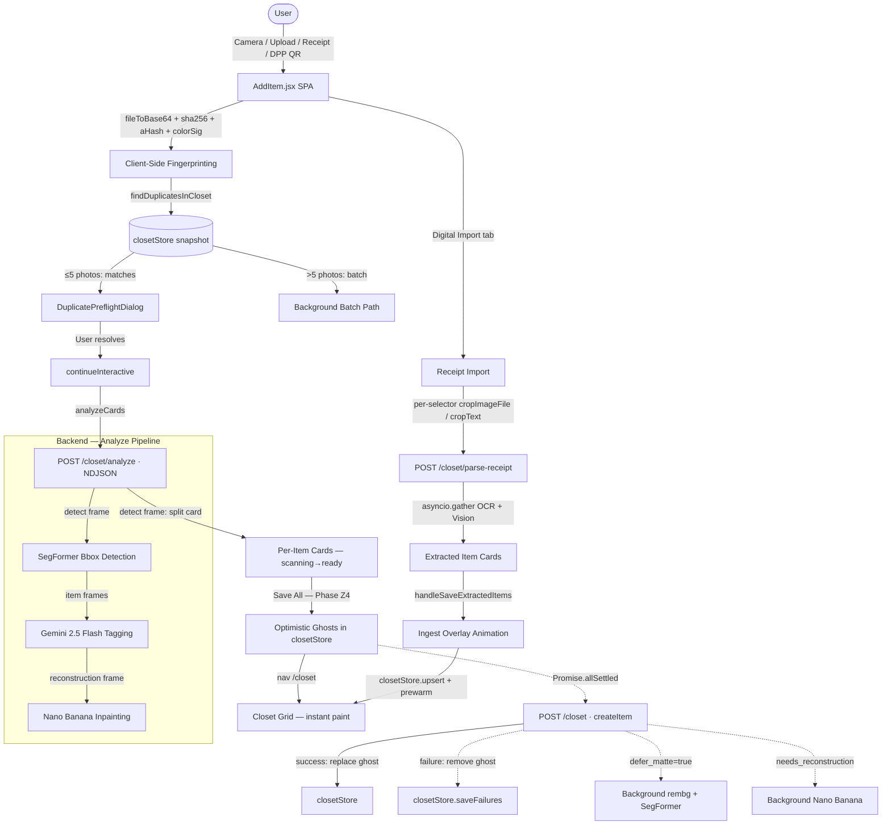

# Add Item — Wardrobe Ingestion: Architecture & User Manual

> **Module:** `frontend/src/pages/AddItem.jsx` (4,029 lines)
> **Backend:** `backend/app/api/v1/closet.py`
> **Stores:** `lib/closetStore.js` · `lib/workStore.js`
> **Lib:** `lib/duplicateDetection.js` · `lib/utils.js` (sha256File, aHashFile, colorSignatureFile)
> **Last Updated:** July 2026 (Phase R)

---

## 1. Executive Summary & Value Proposition

### Overview

The **Add Item** module is DressApp's primary wardrobe ingestion gateway. It unifies four distinct input paradigms — live camera capture, photo upload, QR-code DPP scanning, and digital receipt import — into a single, coherent three-step experience: **Capture → Refine → Integrate**. Under the hood, it coordinates client-side machine-learning fingerprinting, a progressive NDJSON streaming analysis pipeline, an optimistic UI persistence model, and a receipt-locked field protection system — all while remaining RTL-aware and fully localised into 12 languages.

### Architectural Flow



### User Value Proposition

- **Zero-overhead duplicate protection**: SHA-256, average-hash (aHash), and 24-byte color signature are computed entirely in-browser (~150–250 ms per file) before any network round-trip fires. The backend's `POST /closet/preflight` endpoint is now deprecated.
- **Progressive streaming feedback**: The NDJSON stream delivers a `detect` frame within ~5–7 s, splitting the single upload card into N placeholder cards with garment thumbnails. The user can start reviewing item #1 while items #2–N are still being tagged by Gemini.
- **Failure-resilient batch mode**: Uploading more than five photos automatically routes to a background sequential analysis path (`handleBatchBackground`) that prevents OOM on the server by never running two GPU-bound SegFormer/rembg pipelines in parallel.
- **Optimistic-first save (Phase Z4)**: Items appear in the Closet grid within ~16 ms of clicking Save. Background `Promise.allSettled` reconciliation replaces each ghost with the canonical server document; failures are surfaced via a summary dialog in `/closet`, not by blocking navigation.
- **Receipt-to-Closet import (Phase R)**: Four sub-modes (Paste Text, Upload Image, Upload PDF, Web Link) extract brand, price, size, and category from any commerce document using Gemini's multimodal vision. Extracted facts are locked against future GarmentVision re-analysis via `receipt_locked_fields`.
- **AI garment reconstruction (Nano Banana)**: Garments touching frame edges are identified by the backend and inpainted in a deferred task. The frontend exposes a `useReconstructed` toggle so the user can compare the original crop against the restored version.
- **Auto-save queue (Patch M20.2)**: Pressing Save while cards are still scanning queues the batch via `pendingAutoSave`. A descriptive banner keeps the user informed; a `useEffect` re-fires `saveAll` once all cards reach a terminal state.
- **12-language localisation with size preference fallback**: The `hydrate()` function fills the size field from the user's stored body-measurement preferences (`deriveSizeFromPreferences`) when the analyzer cannot read a garment tag.

---

## 2. Comprehensive User Manual

### 2.1 Visual Interface Topology

```text
+------------------------------------------------------------------+
|  <- Back                    [Add Photos]          [Save (N)]     |
+------------------------------------------------------------------+
|           (1)Capture ------  (2)Refine (k/N) ------  (3)Integrate  |   <- Stepper
+------------------------------------------------------------------+
|  +----------------------------------------------------------+   |
|  | [Camera & Upload]                 [Digital Import]       |   |   <- Tabs
|  +----------------------------------------------------------+   |
|                                                                   |
|  Camera & Upload tab:                                             |
|  +------------------------------------------------------------+  |
|  |    Drag & drop  .  Take Photo  .  Upload Photos            |  |
|  |          .  Camera  .  Scan QR (DPP)                       |  |
|  +------------------------------------------------------------+  |
|                                                                   |
|  +----------------------+  +--------------------------------+    |
|  |  GARMENT THUMBNAIL   |  | v Basic Info                   |    |
|  |  [scanning overlay]  |  |   Name . Brand . Size . Type   |    |
|  |  --------------------  |  |   Category . Dress Code        |    |
|  |  [Wand toggle]       |  | v Styling Details              |    |
|  |  [Original/AI]       |  |   Colors . Materials . Pattern |    |
|  |  [Progress Bar]      |  |   Season . Gender . Quality    |    |
|  +----------------------+  | v Care & Repair                |    |
|                             |   State . Condition . Tags     |    |
|  [Intent chips: Own /       |   Repair Advice                |    |
|   Sell / Donate / Swap]     +--------------------------------+    |
+------------------------------------------------------------------+
```

---

### 2.2 The Three-Step Stepper

The `Stepper` component (lines 184–260) renders a 3-node progress indicator driven entirely by the `cards` array and the `saving`/`bgBatch` states:

| Step | Label | Condition |
|---|---|---|
| 1 — Capture | `addItem.step.capture` | Default (no cards present) |
| 2 — Refine | `addItem.step.refinement` + `(k/N)` badge | `cards.length > 0` |
| 3 — Integrate | `addItem.step.save` | `saving === true` or `bgBatch.processed === bgBatch.total` |

The connecting line between steps is a `<motion.div>` that animates its `width` from `0%` → `50%` → `100%` over 300 ms. Step 3's ring pulses via `animate-pulse` with a brand-color glow when active.

---

### 2.3 Mode A — Camera & Upload

#### A.1 File Selection

Three entry points all funnel into `handleFiles(fileList)`:

| Control | Input | Notes |
|---|---|---|
| **Take Photo** (`openCamera`) | `<input ref={cameraInputRef} capture="environment">` | Triggers native rear camera on mobile; bypasses chooser on Chrome Android |
| **Upload Photos** (`pickFiles`) | `<input ref={fileInputRef} accept="image/*" multiple>` | Enables Google Drive multi-select; bypasses Photo/Files intent chooser |
| **Drag & Drop** | `onDrop` on the dropzone `<div>` | Passes `event.dataTransfer.files` to `handleFiles` |

MIME-type filter applied in `handleFiles` (line 1022–1026):
```javascript
files.filter(f =>
  f.type.startsWith('image/') ||
  /\.(jpe?g|png|webp|heic|heif)$/i.test(f.name)
)
```
This prevents Android from dropping cloud files whose MIME types haven't resolved yet.

#### A.2 Client-Side Fingerprinting (Lines 1044–1100)

For each file:
1. `fileToBase64(rawF)` — renders the image onto a capped-1024px canvas, exports as JPEG at 80% quality, returns the base64 string. Uses `createImageBitmap` if available (faster on modern browsers), falls back to `new Image()`.
2. A CSP-safe blob conversion (bypasses `data:` URL connection blocks in some WebViews).
3. `sha256File(f)` — SHA-256 of the JPEG bytes via SubtleCrypto.
4. `aHashFile(f)` — 64-bit average perceptual hash.
5. `colorSignatureFile(f)` — 24-byte spatial color signature (4 quadrants x 3 RGB channels).

All three hashes are assembled into a `fingerprint` object and passed to `findDuplicatesInCloset`.

#### A.3 Duplicate Detection (Lines 1102–1246)

`findDuplicatesInCloset(fpForLookup, closetItems)` runs entirely client-side against `closetStore.getSnapshot().items`. It is a 1:1 port of the backend's `is_duplicate_match`:

| Match Level | Condition | Used When |
|---|---|---|
| **Exact** | `sha256A === sha256B` | Always |
| **Lenient** (both color sigs present) | `hamming(phashA, phashB) <= 6 AND colorDist(A,B) <= 220` | Standard path |
| **Strict** (missing color sig) | `hamming(phashA, phashB) <= 3` | Legacy items without `source_color_sig` |

Hamming distance uses Brian Kernighan's bit-clearing algorithm: `x &= x - 1` until `x === 0`. Color distance is the Manhattan distance across all 12 bytes:

$$d = \sum_{i=1}^{12} |a_i - b_i|$$

**Two resolution paths based on batch size:**

| Path | Trigger | Behavior |
|---|---|---|
| **Interactive** | `files.length <= 5` | Opens `DuplicatePreflightDialog` with side-by-side thumbnails. Per-row: Skip or Add anyway |
| **Batch** | `files.length > 5` | Silently drops duplicate fingerprints; toast reports skipped count; survivors go to `handleBatchBackground` |

#### A.4 Streaming Analysis — Interactive Path

`continueInteractive(fingerprints, duplicateAcks)` builds draft cards (`status: 'scanning'`, `progress: 4`) and calls `analyzeCards(drafts)`.

**`analyzeCards` NDJSON streaming (lines 1451–1674):**

```
POST /closet/analyze
Accept: application/x-ndjson
Body: { images_base64: string[], language: 'en' | 'he' | ... }
```

Frame sequence received:
```
-> detect  { items_meta: [{crop_base64, crop_mime, label, defer_matte, image_index}...] }
-> item    { index, analysis, label, potential_duplicate, reconstruction?, defer_matte, ... }
-> item    ...
-> item_skip { index }
-> done
```

**On `detect` frame** (line 1512–1554): the original single card is replaced in `setCards` with N placeholder cards (one per detected garment). Each inherits the original base64 but gets `crop_base64` as its `previewUrl`. `workStore.updateAnalyze(cardId, { items: 0, total: N })` updates the global analysis floater.

**On `item` frame** (line 1557–1606): the matching slot card transitions to `status: 'ready'`, `progress: 100`. The `hydrate(frame.analysis, user)` call populates all taxonomy fields, with size fallback from user preferences. If `reconstruction.validated === true`, `useReconstructed` is set `true` and `previewUrl` points to the Nano Banana result.

**Faux-progress timer** (line 1464–1475): a `setInterval` at 250 ms ticks `progress` toward 92% using `target = min(92, 4 + elapsed_seconds * 5)`, ensuring the scanning animation always looks active during slow Gemini calls.

**Idempotency guard** (`analyzeInFlight.current`, Patch 12): a `Set` of card IDs currently being analyzed prevents duplicate calls from React StrictMode double-fires or user "Try again" races. Cleared in `finally`.

**`workStore` integration**: each card registers a job with `workStore.registerAnalyze(cardId, filename)`. The global `WorkProgressFloater` mounted at App root reads this store to show cross-page progress even if the user navigates away during analysis.

#### A.5 Background Batch Path (Lines 1292–1449)

When `files.length > 5`, `handleBatchBackground(fingerprints, skippedDuplicates)` runs. A `bgBatch` state object drives a banner UI instead of individual cards.

Key constraint: items are analyzed and saved **strictly sequentially** to prevent concurrent SegFormer/rembg calls from OOM-ing the production VPS. Each `api.createItem` is awaited before the next analyze begins.

Potential duplicates from the batch path surface as `status: 'ready'` cards with `potentialDuplicate` set, requiring per-card user confirmation before saving.

---

### 2.4 Mode B — Digital Product Passport (DPP)

1. User taps **Scan QR** → `setScanOpen(true)` → `<DppScanner>` component renders.
2. On decode: `handleScanDecoded(payload)` → `api.importDpp(payload)` → `hydrateFromDpp(res)`.
3. `hydrateFromDpp` builds a card with `source: 'dpp'` and `dppData` containing official manufacturer metadata: fiber composition, carbon footprint, supply-chain origins, care instructions.
4. If the app was launched via `?source=dpp` (from TopNav QR shortcut), a `useEffect` reads `sessionStorage.dpp_draft`, calls `hydrateFromDpp`, and clears the URL parameter to prevent replay on refresh.

---

### 2.5 Mode C — Digital Receipt & Email Import

See [`docs/Receipt-Digital-Import.md`](./Receipt-Digital-Import.md) for the complete technical manual. Summary of the four sub-modes:

| Sub-mode | Trigger | OCR Timing | API |
|---|---|---|---|
| **Paste Text** | `importMode = 'text'` | On Extract (per-selector) | `POST /closet/parse-receipt` with `text=` |
| **Upload Image** | `importFile.type.startsWith('image/')` | On Extract (per-selector canvas crop) | `POST /closet/parse-receipt` with `file=` |
| **Upload PDF** | `importFile.type === 'application/pdf'` | On file select (upfront, Gemini + pypdf) | `POST /closet/extract-pdf-text` then per-selector |
| **Web Link** | `importMode = 'url'` | On Extract | `POST /closet/parse-receipt` with `url=` |

The **selector overlay** (`selectors` state, lines 296, 547–732) provides draggable, resizable region boxes in % coordinates. `handleAddSelector` stacks new selectors below the previous one with a 2% gap. Touch support includes two-finger pinch-to-resize (`pinchX`, `pinchY`, `pinchDiag` drag modes) tracked via `dragState`.

**`handleSaveExtractedItems`** (lines 934–1018) orchestrates the ingest workflow:
- Linked items (`item.closetItem`) — `PATCH` with `{brand, size, price_cents, purchase_price_cents}` only. **Title is never overwritten.**
- New items — `POST /closet` with `from_receipt: true` and `receipt_locked_fields` array computed from which fields actually have data.
- Per-item `closetStore.upsert(result)` for instant grid update.
- `setIngestPhase('syncing')` → `closetStore.prewarm({ force: true })` → `nav('/closet')`.

---

### 2.6 Taxonomy Form — Refine Phase

Each card in the `ready` state renders a two-column layout: garment preview (left) + three accordion sections (right).

| Accordion | Fields |
|---|---|
| **Basic Info** (`addItem.section.basic`) | Name, Brand, Sub-category, Item type, Category, Size, Dress code, Tradition, Gender, Season (multi-select) |
| **Styling Details** (`addItem.section.styling`) | Colors (WeightedList), Fabric materials (WeightedList), Pattern, State, Condition, Quality, Tags |
| **Care & Repair** (`addItem.section.care`) | Repair advice, Marketplace intent (Own / Sell / Donate / Swap), Price / Currency, Asking price preview with Stripe fee deduction |

The **intent selector** (lines 68–73) renders colored chip buttons:

| Value | Color | Icon |
|---|---|---|
| `own` | slate | Shirt |
| `for_sale` | amber | HandCoins |
| `donate` | emerald | Gift |
| `swap` | sky | Repeat |

The **Wand toggle** (`useReconstructed`) switches the preview between `originalCropUrl` and `reconstructedUrl` when Nano Banana produced a validated inpainting result.

---

### 2.7 Save All — Optimistic-First Phase Z4 (Lines 1955–2260)

```
saveAll()
  |-- ready cards = cards where status in {ready, error-with-title}
  |-- scanning cards = cards where status === 'scanning'
  |
  |-- [scanning only] --> setPendingAutoSave(true) --> toast.info --> return
  |                       useEffect re-fires saveAll() when all scanning -> terminal
  |
  +-- [ready cards exist]:
       for each valid card:
         tempId = crypto.randomUUID()
         optimisticItem = { id: tempId, _pendingSync: true, ...fields, thumbnail_data_url: dataUrl }
         closetStore.upsert(optimisticItem)      <- instant Closet grid paint
         ghosts.set(tempId, { body, title, filename, dataUrl, cardId })

       nav(isSuitcase ? '/suitcase' : '/closet')  <- navigate immediately
       setSaving(true)

       results = await Promise.allSettled(         <- parallel saves
         validCards.map(async ({ card, body }) => {
           const created = await createItemWithTimeout(body, 45_000)
           closetStore.upsert(created.item)        <- replace ghost
           workStore.completeAnalyze(card.id)
         })
       )

       // Reconcile failures
       results.filter(r => r.status === 'rejected').forEach(r => {
         closetStore.remove(ghost.tempId)
         closetStore.addSaveFailure(ghost)
       })
```

`createItemWithTimeout` wraps `api.createItem` in a 45-second `Promise.race` to prevent stalled saves from blocking reconciliation.

The `_pendingSync: true` marker on ghost items causes the Closet card to render a sparkling overlay. The overlay disappears the moment the server item replaces the ghost via `closetStore.upsert`.

---

### 2.8 Auto-Save Queue (Patch M20.2)

```javascript
useEffect(() => {
  if (!pendingAutoSave) return;
  const anyScanning = cards.some(c => c.status === 'scanning');
  if (anyScanning) return;
  setPendingAutoSave(false);
  saveAll();
}, [cards, pendingAutoSave]);
```

If all cards complete and `pendingAutoSave` is true, `saveAll` fires automatically. Cards that reach `status: 'error'` are still included — the user may have filled the title manually.

---

### 2.9 Ingest Overlay Animation (Receipt Path)

During `handleSaveExtractedItems`, an `<AnimatePresence>` overlay covers the full screen (`absolute inset-0 z-50`):

| Phase | SVG Ring | Icon | Label |
|---|---|---|---|
| `saving` | Animated: `strokeDashoffset = 2*PI*34 * (1 - done/total)` | Sparkles | `addItem.import.ingestCataloguing` |
| `syncing` | Full circle (offset = 0) | Spinning RefreshCw | `addItem.import.ingestSyncing` |

Phase transitions use `AnimatePresence mode="wait"` keyed on `ingestPhase`, with `y: 6->0` enter and `y: 0->-6` exit animations (200 ms). Backdrop: `hsl(var(--background)/0.92)` with `backdrop-filter: blur(12px)`.

---

### 2.10 Error Handling Reference

| Scenario | UX Response |
|---|---|
| Analysis stream returns 0 items | Card → `status: 'error'`; `toast.error(addItem.analyzeFailed)` |
| Analysis stream throws after `detect` (Gemini 403) | All per-item slot cards → `status: 'error'` (Patch M19 bug fix) |
| `createItem` times out (>45 s) | Ghost removed; failure logged to `closetStore.saveFailures` |
| DPP `parse_error` field present | `toast.error(dpp.scanner.errors.{parse_error})` |
| PDF OCR fails (Gemini + pypdf) | `toast.error(addItem.import.textError)` |
| Receipt extract returns no matches | `toast.error(addItem.import.error)` |
| Save with nothing selected | `toast.error(addItem.import.noSelectedItems)` |
| User presses Save while all cards scanning | `toast.info(addItem.queuedForAutoSave)`, `pendingAutoSave = true` |
| All batch photos are duplicates | `toast.message(addItem.preflight.allDuplicatesSkippedBatch)` |

---

## 3. Technology Stack & Capability Deep-Dive

### 3.1 Top-Level Constants & Helpers (Lines 52–181)

| Symbol | Type | Purpose |
|---|---|---|
| `CATEGORY_OPTIONS` | `string[]` | 7 canonical garment categories |
| `DRESS_CODE_OPTIONS` | `string[]` | 6 dress code values |
| `GENDER_OPTIONS / SEASON_OPTIONS / STATE_OPTIONS` | `string[]` | Taxonomy enumerations |
| `CONDITION_OPTIONS / QUALITY_OPTIONS / PATTERN_OPTIONS` | `string[]` | Refinement taxonomy |
| `INTENT_OPTIONS` | `{value, icon, tone}[]` | Marketplace intent with styled chip data |
| `fileToBase64(file, maxSide=1024, quality=0.8)` | `async (File) -> string` | Resize + JPEG encode; white background fill; `createImageBitmap` fast path |
| `fmtCents(cents, cur='USD')` | `(number, string) -> string` | `Intl.NumberFormat` currency format |
| `blankFields()` | `() -> object` | Zero-value form state: `price_cents: 0`, `currency: 'USD'`, `marketplace_intent: 'own'` |
| `hydrate(analysis, user)` | `(object, User) -> object` | Merges analysis onto `blankFields()`; size fallback via `deriveSizeFromPreferences` |
| `Stepper` | React component | 3-step animated progress indicator |

### 3.2 State Variables (Lines 262–356)

| Variable | Initial | Role |
|---|---|---|
| `cards` | `[]` | Array of card objects: `{id, file, mime, previewUrl, base64, cropBase64, status, progress, fields, error, label, dppData?, sourceSha256, sourcePhash, sourceColorSig, isDuplicate, useReconstructed, reconstructedUrl, needsReconstruction, deferMatte, potentialDuplicate, _pendingSync?}` |
| `saving` | `false` | Global save spinner / disables Save button |
| `ingestPhase` | `null` | Receipt overlay: `null | 'saving' | 'syncing'` |
| `ingestProgress` | `{done:0, total:0}` | Ring progress counters |
| `pendingAutoSave` | `false` | Auto-save queue flag (Patch M20.2) |
| `scanOpen` | `false` | DPP scanner dialog open |
| `receiptText` | `''` | Pasted or PDF-extracted text |
| `isExtracting` | `false` | Disables Extract button; shows spinner |
| `importMode` | `'text'` | `'text' \| 'file' \| 'url'` |
| `importFile` | `null` | File object from file picker |
| `importUrl` | `''` | Web link URL |
| `selectors` | `[{id:1, x:0, y:10, w:100, h:2}]` | Region selector boxes (% coords) |
| `dragState` | `null` | Active drag/resize session for selectors |
| `extractedItems` | `[]` | Parsed receipt cards |
| `linkingItemId` | `null` | Card whose closet-link dialog is open |
| `closetModalOpen` | `false` | Closet picker dialog visibility |
| `closetSearch` | `''` | Filter query inside closet picker |
| `activeItemForImage` | `null` | Card whose photo-attach input is active |
| `imagePreviewUrl` | `null` | `URL.createObjectURL(importFile)` for preview |
| `closetItemDetailPane` | `null` | Linked closet item shown in detail dialog |
| `bgBatch` | `null` | Background batch progress object |
| `preflight` | `null` | `{matches, onResolve}` for DuplicatePreflightDialog |
| `isSuitcase` | computed | `searchParams.get('from') === 'suitcase'` |

### 3.3 Key Refs

| Ref | Purpose |
|---|---|
| `fileInputRef` | Hidden `<input type="file" multiple>` — triggered by Upload Photos |
| `cameraInputRef` | Hidden `<input capture="environment">` — triggered by Take Photo |
| `receiptFileInputRef` | Hidden `<input>` for receipt file upload |
| `itemImageInputRef` | Hidden `<input>` for per-extracted-item photo attach |
| `analyzeInFlight` | `useRef(new Set())` — idempotency guard (Patch 12) |

### 3.4 `buildCreatePayload(card, isSuitcase)`

Constructs the `POST /closet` body from a card object. Key decisions:
- Uses `cropBase64` over `base64` when available (the GarmentVision crop is more precise than the full image).
- Sets `defer_matte: true` when the backend signalled it in the `detect` or `item` frame.
- Sets `is_suitcase_item: isSuitcase` based on the `?from=suitcase` URL parameter.
- Passes `source_sha256`, `source_phash`, `source_color_sig`, `source_filename`, `source_size_bytes` for deduplication persistence.
- Sets `is_duplicate: true` if the card was explicitly acknowledged by the user in the preflight dialog.

### 3.5 `cropImageFile(file, selector)` — Canvas Crop (Lines 504–538)

```javascript
const x = (selector.x / 100) * img.width;
const y = (selector.y / 100) * img.height;
const w = (selector.w / 100) * img.width;
const h = (selector.h / 100) * img.height;
canvas.width = w; canvas.height = h;
ctx.drawImage(img, x, y, w, h, 0, 0, w, h);
canvas.toBlob(resolve, 'image/jpeg', 0.9);
```
Produces a `File` named `crop-{selectorId}-{original filename}` for multipart submission to `/closet/parse-receipt`.

### 3.6 `cropText(text, selector)` — Text Layer Crop (Lines 540–545)

```javascript
const lines = text.split('\n');
const startLine = Math.floor((selector.y / 100) * lines.length);
const endLine   = Math.ceil(((selector.y + selector.h) / 100) * lines.length);
return lines.slice(startLine, endLine).join('\n');
```
Maps selector vertical position (0–100%) to character-line offsets.

### 3.7 Backend — `/closet/analyze` Streaming Pipeline

| Frame Type | Timing | Content |
|---|---|---|
| `detect` | ~5–7 s | `{type: 'detect', items_meta: [{crop_base64, crop_mime, label, defer_matte, image_index}]}` |
| `item` | ~1–2 s per item | `{type: 'item', index, analysis, label, potential_duplicate, reconstruction?, needs_reconstruction, reconstruction_reasons, defer_matte}` |
| `item_skip` | On duplicate detection | `{type: 'item_skip', index}` |
| `done` | Final | `{type: 'done', count}` |

The `detect` frame's `defer_matte: true` signals that background matting (`rembg + SegFormer alpha intersection`) will run after `POST /closet` rather than inline. This prevents the analyze endpoint's response time from growing linearly with batch size.

**SegFormer Category Mapping:**

| User Category | SegFormer Target |
|---|---|
| Top, Shirt, Blouse, Underwear | `top` |
| Outerwear, Jacket, Coat | `top` |
| Bottom, Pants, Trousers, Jeans, Skirt, Shorts | `bottom` |
| Full Body, Dress | `dress` |
| Footwear, Shoes, Sneakers, Boots | `footwear` |
| Accessories, Bag, Belt, Scarf | `accessory` |

During background matting, the backend intersects the `rembg` alpha mask with the SegFormer binary mask:

$$\text{Alpha}_\text{final} = \text{Alpha}_\text{rembg} \cap \text{Mask}_\text{SegFormer}$$

This removes non-garment background items (plants, hangers, posters) that `rembg` might otherwise retain.

### 3.8 Backend — `/closet/parse-receipt` (Digital Import)

Concurrent dual-path analysis for image receipts:
```python
ocr_result, visual_result = await asyncio.gather(run_ocr(), run_visual())
```
- `run_ocr()` — Gemini Multimodal Vision with structured JSON extraction prompt.
- `run_visual()` — SegFormer bbox detection → largest garment crop → 18-field GarmentVision analysis.
- **Field priority**: OCR wins on transactional facts (`brand`, `size`, `price_cents`, `name`); GarmentVision wins on aesthetic attributes (`colors`, `pattern`, `dress_code`, `season`).

### 3.9 Receipt-Locked Field System

Locks are computed on the frontend before `POST /closet`:
```javascript
const receiptLockedFields = [
  item.name         ? 'title'                : null,
  item.brand        ? 'brand'                : null,
  item.size         ? 'size'                 : null,
  item.price_cents  ? 'price_cents'          : null,
  item.price_cents  ? 'purchase_price_cents' : null,
  item.category     ? 'category'             : null,
  item.colors?.length ? 'colors'             : null,
  item.colors?.length ? 'color'              : null,
].filter(Boolean);
```

The backend persists `receipt_locked_fields` on the MongoDB document. `_run_background_matte_and_analyze` enforces fill-empty-only for locked fields. The same guard applies in `PATCH /closet/{id}`.

### 3.10 Closet Store Integration

| Operation | Call | Effect |
|---|---|---|
| Optimistic insert | `closetStore.upsert(optimisticItem)` | Instantly visible in Closet grid |
| Ghost replacement | `closetStore.upsert(created.item)` | Removes `_pendingSync`, shows real thumbnail |
| Ghost removal (failure) | `closetStore.remove(tempId)` | Disappears from grid |
| Failure record | `closetStore.addSaveFailure(ghost)` | Closet renders failure summary dialog |
| Post-receipt sync | `closetStore.prewarm({ force: true })` | Full server fetch; clears TTL cache |

`useClosetItems()` subscribes via `useSyncExternalStore`. Cross-tab sync is automatic: `closetStore.js` fires the `storage` event on every `upsert`/`remove`, triggering a re-render on all open tabs simultaneously.

### 3.11 Vision Provider Hot-Swap (Gemini vs. Gemma)

The ingestion vision pipeline supports dynamic model swapping:
- **Gemini (default)**: Google Gemini 2.5 Flash — the current development and production model.
- **Gemma (edge)**: Runs locally inside a Docker container for offline/low-power edge deployments.
- **Dynamic override**: Admins toggle via the admin panel. The preference is written to MongoDB `config.{_id: "eyes_provider"}` with a 5-second TTL cache on pods, falling back to the `EYES_PROVIDER` environment variable.

### 3.12 Localisation Architecture

- **Prompt alignment**: `(i18n.language || '').split('-')[0]` is passed as `language` in analyze requests, ensuring Gemini returns `title`, `caption`, and aesthetic attributes in the user's language.
- **Taxonomy mapping**: All enum values use `labelForCategory`, `labelForDressCode`, etc. from `lib/taxonomy.js`, which map canonical keys to localised strings.
- **RTL**: Layout components automatically mirror spacing, icon placement, and text direction for `he` and `ar` locales.
- **`{ defaultValue }` rule**: Every `t()` call in the file uses the object form `t('key', { defaultValue: '...' })` — never bare positional syntax.

---

## 4. API Contract Reference

### `POST /closet/analyze`

**Content-Type:** `application/json` · **Accept:** `application/x-ndjson` · **Auth:** Bearer JWT

```json
{
  "images_base64": ["<base64-jpeg>"],
  "language": "en"
}
```

Streams NDJSON frames: `detect`, `item`, `item_skip`, `done`.

### `POST /closet` (Create Item)

**Content-Type:** `application/json` · **Auth:** Bearer JWT · **Client timeout:** 45 s

Key fields:

```json
{
  "title": "string",
  "category": "Top | Bottom | Outerwear | Full Body | Footwear | Accessories | Underwear",
  "image_base64": "string | null",
  "image_mime": "image/jpeg | image/png",
  "defer_matte": true,
  "needs_reconstruction": false,
  "from_receipt": false,
  "receipt_locked_fields": [],
  "source_sha256": "string | null",
  "source_phash": "string | null",
  "source_color_sig": "string | null",
  "is_duplicate": false,
  "is_suitcase_item": false
}
```

### `PATCH /closet/{id}` (Receipt Link Path)

Only `brand`, `size`, `price_cents`, `purchase_price_cents`, `purchase_date` are sent — title and thumbnail are always preserved.

### `POST /closet/parse-receipt` and `POST /closet/extract-pdf-text`

See [`docs/Receipt-Digital-Import.md §4`](./Receipt-Digital-Import.md) for full schemas.

### `GET /dpp/import`

Returns `{items: [{analysis, dpp_data, crop_base64, crop_mime, label}], parse_error?}`.

---

## 5. i18n Key Reference

| Key | Default (en) | Notes |
|---|---|---|
| `addItem.title` | Upload & auto-fill | Page hero |
| `addItem.step.capture` | Capture | Stepper step 1 |
| `addItem.step.refinement` | Refine | Stepper step 2 |
| `addItem.step.save` | Integrate | Stepper step 3 |
| `addItem.tabs.upload` | Camera & Upload | Tab label |
| `addItem.tabs.import` | Digital Import | Tab label |
| `addItem.scanning` | Scanning | Card scanning state label |
| `addItem.scanningSub` | Reading fabrics, colors and construction… | Card scanning subtitle |
| `addItem.analyzeFailed` | Analysis failed | Error toast + card state |
| `addItem.detected` | Detected {{count}} item(s) | Success toast after stream |
| `addItem.saveAll` | Save | Save All button |
| `addItem.savedOptimistic_one` | Added to your closet — syncing in background | Optimistic save toast |
| `addItem.savedOptimistic_other` | {{count}} items added to your closet… | Batch optimistic toast |
| `addItem.nothingToSave` | Nothing to save yet | No-op save guard |
| `addItem.queuedForAutoSave` | Waiting for {{count}} photo(s)… | Auto-save queue toast |
| `addItem.savedSomeWaitingForRest` | Saved {{saved}} — waiting for {{remaining}} more… | Partial auto-save banner |
| `addItem.preflight.*` | (8 keys) | DuplicatePreflightDialog strings |
| `addItem.bgUpload.*` | (7 keys) | Background batch progress + result toasts |
| `addItem.section.basic/styling/care` | Basic Info / Styling Details / Care & Repair | Accordion section labels |
| `addItem.import.*` | (30+ keys) | Full Digital Import tab strings |
| `addItem.selectorItemLabel` | Item {{n}} | Selector box labels |
| `addItem.titleRequired` | Title is required | Validation error |
| `addItem.failedToLoadImage` | Failed to load image. | Image attach error |

---

## 6. Ingestion Workflow Comparison

| Dimension | Camera & Upload (Interactive) | Camera & Upload (Batch >5) | DPP QR Scan | Digital Receipt |
|---|---|---|---|---|
| **Input** | JPEG/PNG/WEBP/HEIC files | Same | QR code / DPP URL | Text / Image / PDF / URL |
| **Fingerprinting** | SHA-256, aHash, color-sig in-browser | Same | DB ID query | N/A |
| **Duplicate check** | Client-side + interactive dialog | Silent drop | Backend check | Optional closet-link |
| **Analysis** | NDJSON streaming — SegFormer + Gemini | Sequential per-item | HTTP JSON API | asyncio.gather OCR + Vision |
| **Cards** | N cards split from original | Auto-save, banner UI | 1 card, pre-filled | M cards per selector |
| **Save pattern** | Phase Z4 optimistic | Auto-save per item | Phase Z4 optimistic | Sequential + ingest overlay |
| **Background tasks** | rembg matte + Nano Banana reconstruction | rembg matte | None | rembg matte + GarmentVision |
| **Navigation** | Immediate to /closet | After batch (1.2 s delay) | Stays on /add | After prewarm to /closet |
| **Locked fields** | None | None | None | `receipt_locked_fields` |
| **DPP data** | None | None | `dpp_data` struct on card | None |
