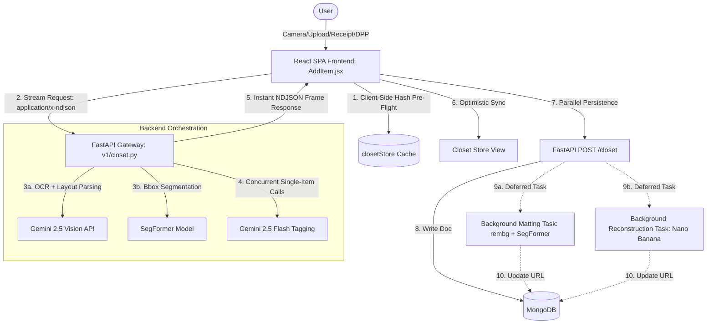

# Wardrobe Cataloging & Ingestion: Add Item Workflows

This document provides a comprehensive architectural and functional breakdown of DressApp's **Add Item** cataloging module (`AddItem.jsx`). It covers every wardrobe ingestion pathway, client-side pre-flight verification, streaming analysis pipeline, background processing task, database schema, and frontend state management pattern.

---

## 1. Executive Summary & Value Proposition

### High-Level Overview
The Add Item module (`AddItem.jsx`) serves as the entry point for cataloging a user's physical wardrobe. The feature coordinates client-side performance optimizations with RAM-heavy backend machine learning pipelines. It accepts image files, live camera streams, merchant receipt text/PDFs, and Digital Product Passports (DPP) to automatically segment, reconstruct, tag, and persist garments into the user's closet database.



### User Value Proposition
*   **Zero-Overhead Duplicate Protection**: In-browser fingerprinting identifies exact and visual duplicates against the locally cached wardrobe before incurring any network, model, or API execution cost.
*   **Progressive UI Responsiveness**: Interactive streaming via NDJSON displays garment bounding boxes and placeholder crops within 5–7 seconds, allowing the user to review items while downstream Gemini tagging runs in parallel.
*   **Failure-Resilient Bulk Ingestion**: Ingesting large batches (>5 items) automatically routes garments to a background batch queue, sequentially processing models to prevent server Out-Of-Memory (OOM) failures and letting the user navigate away immediately.
*   **Intelligent Auto-Hydration**: Machine learning and OCR models extract brand, item type, category, price, and color vectors to pre-fill the cataloging form, falling back to stored body size preferences when garment tag OCR is unreadable.
*   **AI Garment Restoration**: Occluded or poorly cropped edges are automatically identified and patched using the backend's Nano Banana generative inpainting models, returning a clean, full-bleed product card.

---

## 2. Comprehensive User Manual

### Visual Interface Topology

```text
+---------------------------------------------------------------------------------------+
|  <- Back                                 [Add Photos Button]   [Save All (Integrate)] |
+---------------------------------------------------------------------------------------+
|                       (1) CAPTURE  ===>  (2) REFINE (0/N)  ===>  (3) INTEGRATE        |
+---------------------------------------------------------------------------------------+
|  +---------------------------------------------------------------------------------+  |
|  | [ Camera & Upload Tab ]                          [ Digital Import Tab ]         |  |
|  +---------------------------------------------------------------------------------+  |
|  |                                                                                 |  |
|  |                              DRAG & DROP IMAGE ZONE                             |  |
|  |                                                                                 |  |
|  |    [ Take Photo (Camera) ]     [ Upload Photos (File) ]    [ Scan QR (DPP) ]    |  |
|  |                                                                                 |  |
|  +---------------------------------------------------------------------------------+  |
+---------------------------------------------------------------------------------------+
|  CARDS GRID (REFINEMENT PHASE)                                                        |
|  +---------------------------------------+ +---------------------------------------+  |
|  | [GARMENT PREVIEW PANEL]               | | [TAXONOMY ACCORDIONS]                 |  |
|  | +-----------------------------------+ | | v Basic Info                          |  |
|  | |                                   | | |   Name:   [ Cream Linen Blazer      ] |  |
|  | |                                   | | |   Brand:  [ Zara                    ] |  |
|  | |          GARMENT IMAGE            | | |   Size:   [ M                       ] |  |
|  | |                                   | | |   Type:   [ Blazer                  ] |  |
|  | |                                   | | |   Category: [ Outerwear             ] |  |
|  | +-----------------------------------+ | | ------------------------------------- |  |
|  | | [Wand] Showing Original / AI      | | | > Styling Details                     |  |
|  | +-----------------------------------+ | | ------------------------------------- |  |
|  | | [Progress Bar / Scanning Overlay] | | | > Care & Repair                       |  |
|  +---------------------------------------+ +---------------------------------------+  |
+---------------------------------------------------------------------------------------+
```

### Mode & Workflow Walkthroughs

#### A. Camera & Upload Flow
1.  **Selection**: The user clicks **Take Photo** or **Upload Photos**.
    *   **Take Photo** activates the camera. On mobile, `capture="environment"` prompts the native rear camera directly.
    *   **Upload Photos** opens a unified, standard native file picker. 
        *   The file input uses `accept="image/*"` and `multiple`.
        *   This enables native **Google Drive multi-selection** (allowing users to check multiple items and tap the enabled "Select" button).
        *   It also **bypasses the "Photo/Files" intent chooser** on Chrome for Android, going straight to the system file explorer (SAF).
        *   *Note*: Firefox for Android intercepts `accept="image/*"` to present its own built-in camera/files prompt. This is native browser-level behavior and cannot be web-bypassed.
2.  **MIME-Type & Extension Filtering**:
    *   When files are selected, the frontend checks if they are valid images. To prevent Android from discarding cloud files whose MIME types aren't immediately resolved, `handleFiles` filters selected items by validating that either their MIME type starts with `image/` or their filename ends with a supported extension (`.jpg`, `.jpeg`, `.png`, `.webp`, `.heic`, `.heif`).
3.  **In-Browser Duplicate Pre-Flight**:
    *   The browser reads each image into a canvas, converts it to a base64 JPEG byte string, and computes its SHA-256 hash, visual aHash, and color signature.
    *   If any uploads match items in `closetStore.getSnapshot().items`, they are handled by the collision pathways:
        *   **Interactive Path (≤5 photos)**: A scrollable `DuplicatePreflightDialog` displays side-by-side matches. The user can toggle individual items to **Skip** or **Add anyway ⭐** (marking them as duplicate entries).
        *   **Batch Path (>5 photos)**: Duplicates are silently omitted based on user preferences.
4.  **Streaming Analysis**: Surviving files are uploaded to `/closet/analyze` with the `Accept: application/x-ndjson` header.
    *   The frontend splits the single upload card into $N$ child cards during the `detect` frame.
    *   Each child card shows a scanning animation and progressive progress indicator.
    *   Individual `item` frames populate each card's fields and previews as they return from Gemini.

#### B. Digital Receipt & Email Import Flow
1.  **Input Modes**: The user switches to the **Digital Import** tab and selects:
    *   **Paste Text**: Raw text from merchant emails, invoice confirmations, or markdown-based logs.
    *   **Upload File**: Receipt PDF documents or invoice images.
    *   **Web Link**: A merchant URL (e.g., Zara order confirmation).
2.  **Extraction**: The user clicks **Extract Items**. The frontend submits the payload to `/closet/parse-receipt`.
    *   The backend triggers OCR Gemini parsing and visual item cropping concurrently.
    *   The return payload populates fields including `brand`, `item_type`, `size`, `price_cents`, `category`, and `colors`.
3.  **Form Hydration & Fallback rendering**:
    *   If a cropped image base64 exists, the card displays the image preview.
    *   If no image crop is available, the frontend generates an inline SVG placeholder displaying the brand name and the dominant color signature.

#### C. Digital Product Passport (DPP) Scan Flow
1.  **Scan**: The user scans a QR code using `DppScanner` or inputs a DPP URL.
2.  **Hydration**: The frontend calls `api.importDpp(payload)`. The response contains official manufacturing details:
    *   Fiber composition percentages (e.g., $100\%$ organic cotton).
    *   Carbon footprint metrics and supply chain location origins.
    *   Official garment thumbnails, structural taxonomy, and care instructions.

---

### Error Handling & Feedback

*   **API Outage and Quota Failures**: Gemini and backend model execution errors (e.g., `401 Unauthenticated`, `403 Permission Denied`, `429 Quota Exhausted`, `503 Service Unavailable`, `504 Timeout`) are intercepted. The card transitions to `status: 'error'`, displaying the specific server diagnostic message next to a **Try Again** action.
*   **Idempotency Guards**: To prevent user multi-clicks or React StrictMode from firing duplicate API requests, `analyzeInFlight.current` tracks active card IDs and rejects redundant analysis triggers.
*   **Auto-Save Queue**: If the user clicks **Save All** while some cards are still in a `scanning` state, the frontend saves the ready cards and toggles `pendingAutoSave: true`. The user remains on the `/add` page with a descriptive progress banner; as the scanning cards complete, they are automatically saved, and the page redirects.
*   **Optimistic Save Reconciliation**: Ready cards are saved in parallel via `Promise.allSettled`. If a save fails, the optimistic item is removed, and a summary dialog displays the failed items' names, filenames, thumbnails, and errors.

---

## 3. Technology Stack & Capability Deep-Dive

### Core Orchestration & AI/Logic

#### SegFormer Classification & Image Matting
The backend leverages a local SegFormer model (`clothing_parser.py`) to classify clothing pixels. User-facing categories mapped by the frontend collapse onto the SegFormer taxonomy:

| User Category | SegFormer Target Class |
| :--- | :--- |
| Top, Tops, Shirt, Blouse, Underwear | `top` |
| Outerwear, Jacket, Coat | `top` |
| Bottom, Bottoms, Pants, Trousers, Jeans, Skirt, Shorts | `bottom` |
| Dress, Dresses, Full Body, Full-body | `dress` |
| Footwear, Shoes, Sneakers, Boots | `footwear` |
| Accessory, Accessories, Bag, Belt, Scarf | `accessory` |
| Headwear, Hat, Hats | `headwear` |

During background matting (`_run_background_matte`), the backend intersects the `rembg` alpha mask with the SegFormer binary mask:
$$\text{Alpha}_{\text{final}} = \text{Alpha}_{\text{rembg}} \cap \text{Mask}_{\text{SegFormer}}$$
This intersection removes non-garment background items (e.g., plants, hangers, posters) that `rembg` might otherwise retain.

#### Visual Item Matching Algorithm
The client-side visual duplicate detection algorithm (`duplicateDetection.js`) replicates the backend's matching logic using three parameters:

```javascript
const HAMMING_THRESHOLD = 6;
const HAMMING_THRESHOLD_STRICT = 3;
const COLOR_THRESHOLD = 220;
```

1.  **Exact Match**: The SHA-256 byte hashes are compared:
    $$\text{shaA} = \text{shaB} \implies \text{Duplicate}$$
2.  **Lenient Hash (Both Colors Present)**: The Hamming distance of the two 64-bit perceptual hashes (average hash) and the Manhattan distance of the 24-char color signature vectors are compared:
    $$\text{HammingDist}(\text{phashA}, \text{phashB}) \le 6 \quad \land \quad \text{ColorDist}(\text{colorA}, \text{colorB}) \le 220 \implies \text{Duplicate}$$
3.  **Strict Hash (Missing Color Signature)**: Used if one or both items lack a color signature (e.g., legacy closet entries). The Hamming threshold is tightened to prevent false positives between same-silhouette garments of different colors:
    $$\text{HammingDist}(\text{phashA}, \text{phashB}) \le 3 \implies \text{Duplicate}$$

The Hamming distance is computed in JavaScript using Brian Kernighan's bit-counting algorithm:
```javascript
let dist = 0;
let x = ai ^ bi;
while (x) {
  dist += 1;
  x &= x - 1; // Clears the lowest set bit
}
```

The color signature vector distance is calculated as the Manhattan distance across 4 quadrants and 3 RGB color channels (12 bytes total):
$$d_{\text{color}}(a, b) = \sum_{i=1}^{12} |a_i - b_i|$$

#### Switchable Eyes Vision Provider (Gemini vs. Gemma)
The ingestion vision pipeline supports hot-swapping the core vision processing model dynamically:
*   **Gemini (Development/Default)**: Native integrations leverage Google's Gemini 2.5 Flash model. Gemini is the current development model driving the ingestion backend.
*   **Gemma (Edge/Production)**: To support offline scenarios and deployment to low-power edge devices, Gemma (running locally inside a Docker container) will take Gemini's place when DressApp is deployed to production/edge environments.
*   **Dynamic Override Flag**: Admins can hot-swap providers via the admin panel. The preference is written to MongoDB config document `config.{_id: "eyes_provider"}`. Pods dynamically resolve the active provider with a 5-second TTL cache (bypassing restarts), falling back to the configured `EYES_PROVIDER` environment variable if the database document is missing.

#### Nano Banana AI Reconstruction
For garments that touch the frame boundaries, the backend uses a generative inpainting model to reconstruct occluded details. The frontend displays a toggle letting the user switch `useReconstructed` on or off:

*   `true`: Sets the preview and database image to `reconstructed_image_url`.
*   `false`: Falls back to the standard segmented bbox crop.

---

### Data & Context Pipelines

#### FastAPI Gateway Endpoints
*   `POST /closet/analyze`: Accepts base64 images and streams NDJSON frames.
*   `POST /closet/parse-receipt`: Processes text, PDF/image files, or merchant URLs. OCR Gemini Vision parsing and visual crop detection run in parallel via `asyncio.gather`.
*   `POST /closet`: Persists the cataloged items in MongoDB.

#### Asynchronous Background Tasks
To maintain fast response times, heavy ML tasks are deferred after calling `POST /closet`:

1.  **Deferred Matting** (`_run_background_matte`): Triggered if `defer_matte=True`. It runs SegFormer mask extraction, calls `rembg`, intersects their alphas, base64-encodes the resulting PNG, and writes it to `clean_image_url`. It also nulls `thumbnail_data_url` to invalidate the cached thumbnail and trigger a frontend refresh.
2.  **Deferred Reconstruction** (`_run_background_reconstruction`): Triggered if `needs_reconstruction=True`. It sends the cropped garment image to the reconstruction pipeline, writes the result to `reconstructed_image_url`, and invalidates the cached thumbnail.
3.  **Stale Matte Recovery** (`_maybe_retry_stale_matte`): Monitors items stuck in a `pending` status. If an item has been updating for more than 90 seconds without completing, the task re-queues the background matte runner.

---

### Frontend & Client Architecture

#### Zustand Store Integration
*   `closetStore`: Reads the cached closet snapshot to run duplicate checks offline, updates local states dynamically on sync, and logs failures.
*   `workStore`: Manages progress markers (`analyzeJobs`), allowing progress bars to stay active across pages even if the user leaves the `/add` screen.

#### Optimistic UI Updates
To eliminate waiting for the database write during saving, the frontend uses an optimistic update pattern:

1.  A temporary Client-side UUID is generated for the new item.
2.  A data URL of the cropped garment is assigned to both the image and the thumbnail.
3.  The item is upserted into `closetStore` with a `_pendingSync: true` marker, which renders a sparkling overlay on the Closet page.
4.  The page navigates to `/closet` immediately.
5.  `api.createItem` requests are sent in parallel.
6.  Upon success, the temporary item is replaced with the database document. If an item fails to save, the temporary item is removed, and the failure is recorded in the store.

#### Internationalization & Localization
*   **Prompt Alignment**: The user's active locale is passed in the analysis headers (`payload.language`). This configures the Gemini prompt to return names and descriptions in the language the user is reading the app in.
*   **Taxonomy Mirroring**: Standardized taxonomy keys (e.g., `item_type`, `season`, `condition`) map to localized string values (`lib/taxonomy.js`) using dynamic translations.
*   **Directionality**: Layout components automatically mirror spacing and icons when switching to RTL languages (e.g., Hebrew or Arabic).

---

## 4. Ingestion Workflow Comparison

| Metric / Feature | Camera & File Upload | receipt / Email Import | DPP Integration |
| :--- | :--- | :--- | :--- |
| **Primary Input** | Image byte stream | Pasted text, PDF, URL | QR code scan, URL |
| **Processing Path** | SegFormer -> Gemini analyze | OCR Gemini + Bbox crop | HTTP JSON API fetch |
| **Matting Pipeline** | Deferred `rembg` | Sequential crop-matting | Vendor-provided asset |
| **Duplicate Check** | In-browser SHA256/aHash | Local cache check post-crop | Database ID query |
| **UI Fallback** | Original uploaded photo | Dynamic inline SVG icon | Brand logo placeholder |
| **Taxonomy Source** | Visual LLM classification | Text OCR parsing | Official manufacturer |
