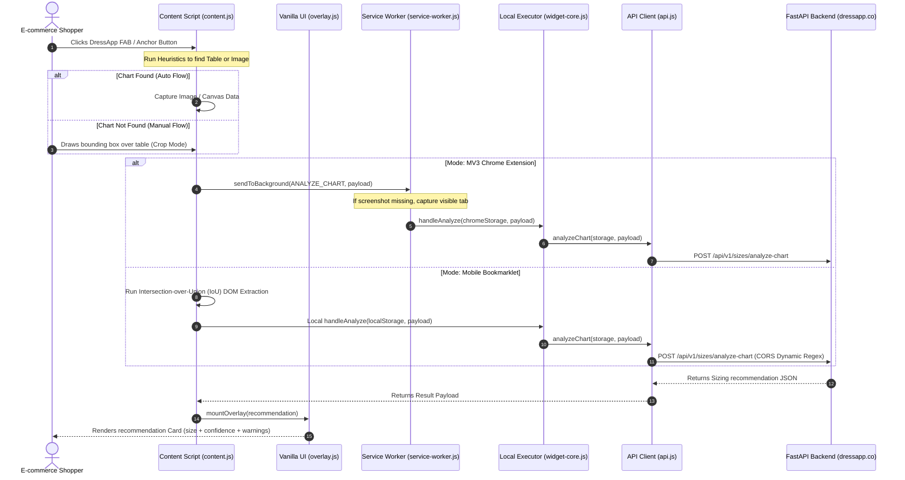

# DressApp Chrome Extension & Mobile Bookmarklet
## Architectural Blueprint & Technical Manual

---

## 1. Executive Summary & Value Proposition

### High-Level Overview
The **DressApp Extension Ecosystem** is a cross-platform client-side utility designed to resolve a primary friction point in e-commerce: sizing uncertainty. Deployable as a fully-featured **Manifest V3 Chrome Extension** or a lightweight, mobile-compatible **JS Bookmarklet**, the system overlays directly onto third-party e-commerce storefronts (e.g., SHEIN, AliExpress). It automatically scans product pages, extracts size charts via heuristics or manual crop gestures, queries the Gemini-powered AI backend, and presents a personalized size recommendation inline.

### Architectural Flow

The diagram below illustrates the dual-mode routing architecture. In **Extension Mode**, privileged tasks (like screenshots) are delegated to the Background Service Worker. In **Bookmarklet Mode**, the runtime executes entirely inside the page's sandbox, utilizing an area-based DOM extraction fallback.



### User Value Proposition
* **Instant Size Confidence**: Eliminates sizing anxiety by translating raw, cluttered seller charts into a single, personalized size recommendation matching the user's stored body measurements.
* **Intelligent Auto-Detection**: Leverages high-performance DOM scanners to discover hidden size tables and images in the background, showing a ready recommendation with zero user clicks.
* **Manual Crop Resilience**: Guarantees recovery on websites with custom structures, cross-origin iframes, or shadow DOMs by offering an interactive drawing box that isolates any table area.
* **Zero Page Pollution**: Operates without heavy runtime dependencies (e.g., React), compiling to a tiny footprint (~94 KB) to avoid memory drag or layout distortion on client storefronts.
* **Dynamic Accessibility**: Fully supports standard internationalization frameworks, including right-to-left (RTL) layout mirroring for Hebrew and Arabic audiences.

---

## 2. Comprehensive User Manual

### Visual Interface Topology

The floating widget interfaces seamlessly with parent web pages, displaying UI elements in absolute coordinates above third-party CSS rules:

```
+-------------------------------------------------------------------------------+
| E-Commerce Product Page (e.g., AliExpress, Shein)                            |
|                                                                               |
|   [Size Selector: S | M | L | XL] <--- [Anchor Button: * DressApp size]        |
|                                                                               |
|                                                                               |
|                                                                               |
|                                         +----------------------------------+  |
|                                         | DressApp recommends size 38  [x] |  |
|                                         | 90% confidence                   |  |
|                                         |                                  |  |
|                                         | Based on your measurements, 38   |  |
|                                         | fits your bust (92cm) and waist  |  |
|                                         | (82cm).                          |  |
|                                         |                                  |  |
|                                         | Matched on: bust · waist         |  |
|                                         | via engine · 1850 ms             |  |
|                                         +----------------------------------+  |
|                                                                               |
| [ * DressApp ] <--- (Floating Action Button)                                  |
+-------------------------------------------------------------------------------+
```

### Mode & Workflow Walkthroughs

#### 1. The Autodetect Flow
1. Upon page load, the mutation observer scans the page for size guides.
2. If a size-selector container is found, the **Inline Anchor Button** (`* DressApp size`) is mounted next to it.
3. A **Floating Action Button (FAB)** (`* DressApp`) is also mounted in the bottom-left corner.
4. Clicking either button triggers the automatic detection engine:
   * It scans visible dialogs, description tabs, and parent layouts for a HTML `<table>` containing size keywords, or a large `` matching chart aspect-ratios.
   * If found, the widget captures a crop of the table or encodes the image to base64, querying the backend in the background.

#### 2. The Manual Crop Flow
1. If the autodetect engine fails to isolate the chart, the interface automatically shifts into **Crop Mode**.
2. A semi-transparent dimming overlay covers the webpage, and a header banner displays: `Drag a box around the size chart`.
3. **Drawing Gesture**: Left-click and hold anywhere outside the header, then drag diagonally to outline the chart. Release to lock the crop rectangle.
4. **Refining Layout**: Hovering over the crop boundaries exposes 8 resize handles (edges and corners). Drag any handle to shrink/expand the box, or grab the center to shift the box.
5. **Applying**: Click **Apply** (or press `Enter`) to confirm the crop. The widget crops the region in a client-side `<canvas>` (or extracts DOM text if in Bookmarklet mode) and submits it.
6. **Cancel**: Click **Cancel** (or press `Escape`) to exit crop mode.

#### 3. Overlay States
* **Recommendation Card**: Displays the recommended size, confidence index, reasoning text, matched columns, response latency, and alternative size fits (e.g., `M (snug)`).
* **Warning Card**: Warns the user of suspected typos in their profile (e.g., `"Your shoulders (75 cm) look higher than expected"`).
* **Authentication Card**: Prompts the user to log in if their session is expired or disconnected, displaying a direct link to `dressapp.co/extension/connect`.
* **Missing Measurements Card**: Displays if the user profile has no circumferences or sizes registered, linking them to their profile editor.

### Error Handling & Feedback

* **No Matches found (`No clear match`)**: Surfaces when Gemini reads the chart but finds no row matching the user's measurements. A **Retry** button allows the user to re-crop the area more tightly.
* **Orphaned Scripts (`DressApp was just updated`)**: Occurs when the Chrome extension updates in the background, invalidating the content script's port. The widget detects this stale context and prompts the user to reload the tab.
* **Permission Requests**: If a screenshot fails because the extension lacks permissions, the widget triggers a browser permission dialog asking for optional `<all_urls>` permission.

---

## 3. Technology Stack & Capability Deep-Dive

### Client-Side Detection Engine (`generic.js`)

The client resolves size charts locally using a multi-step heuristic scoring algorithm:

#### 1. HTML Table Scanner
Iterates over all `<table>` elements in the DOM. Each table is graded:
* **Base Checks**: Must contain at least 1 number and be longer than 40 characters.
* **Keyword Hits**: Adds `+8` points for every matching measurement string (e.g., `bust`, `waist`, `inseam`) found in the text.
* **Row Count Boost**: Adds `+5` points per row (capped at `+50`).
* *Threshold*: Tables scoring $\ge 30$ are selected.

#### 2. Image Chart Scanner
Evaluates all visible `` elements based on layout and metadata rules:
* **Aspect Ratio**: Rejects images with ratio $< 0.4$ or $> 4.0$ (typically thin side-banners).
* **Area Limit**: Must be at least $160 \times 120$ px.
* **Semantic Boost**: Adds `+30` points for alt texts or aria labels containing strong keywords (e.g., `"size chart"`). Adds `+18` points for parent class names mentioning `size-guide`.
* **Product Photo Penalty**: Deducts `-14` points if parent classes match typical image gallery keywords (`gallery`, `carousel`, `swiper`).

#### 3. Bounding-Box DOM Fallback (IoU Matcher)
When running as a bookmarklet (which has no access to extension screenshot APIs), capturing crops fails. To overcome this, the manual crop draws a CSS-pixel box, and the system executes an **Intersection over Union (IoU)** search over the DOM:
$$\text{IoU} = \frac{\text{Area of Overlap}}{\text{Area of Union}}$$
The element yielding the highest IoU score is selected as the target container. If this container points to an `<iframe>` on the same domain, the algorithm automatically extracts the inner `contentDocument.body` contents to read raw tables loaded in nested documents.

### API & Authentication Pipelines

#### 1. Auth Handoff (`RECEIVE_HANDOFF`)
When a user clicks "Connect to DressApp" on the main portal, the portal broadcasts a custom event containing the user's JWT token and target backend URL:
```javascript
window.postMessage({ type: 'DRESSAPP_EXT_TOKEN', token: '...', backend: '...' }, '*');
```
The content script intercepts this message and forwards it via `sendToBackground` to be securely saved inside Chrome's local storage (or local storage namespaces prefixed with `dressapp_widget_` if running in bookmarklet mode).

#### 2. CORS Bypass Strategy
The FastAPI backend allows arbitrary origins using a dynamic wildcard regex (`allow_origin_regex=".*"`). This allows bookmarklets running on external store origins like Shein to communicate directly with `https://dressapp.co/api/v1` without triggering preflight blocks.

#### 3. Payload Construction
The final endpoint `/sizes/analyze-chart` consumes a unified payload:
```typescript
interface AnalyzeChartIn {
  chart_screenshot_b64?: string; // Crop image from canvas
  chart_html?: string;           // Extracted DOM html fallback
  chart_text?: string;           // Extracted raw innerText fallback
  garment_type: string;          // Extracted type hint
  store: string;                 // Domain name
  page_url: string;              // Full URL
  page_title: string;            // Page header
}
```

### Client Architecture & Responsiveness

* **React-Free Footprint**: The overlay UI (`overlay.js`) compiles into standard vanilla DOM creation calls. This isolates variables and prevents CSS and JS namespace leakage from crashing parent page scripts.
* **Visual Isolation**: All modal elements are styled using custom classes mapped inside `content.css` with high-specificity selectors to prevent host page CSS frameworks (like Bootstrap or Tailwind) from overriding the widget's typography and color schemes.
* **Dynamic Internationalization**: Operates on a custom wrapper around `i18next`. It parses document headers to detect Hebrew and Arabic locales, automatically inserting `dir="rtl"` flags to flip layouts and mirror warning elements.
